# 23：张量的压缩、解压与维度重排 🧮

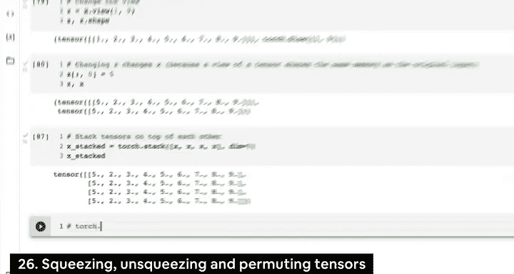

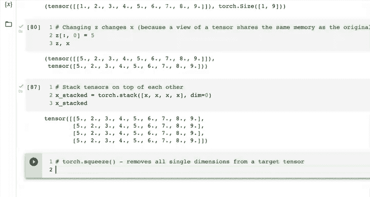

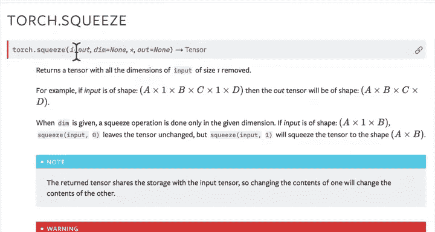

在本节课中，我们将学习PyTorch中三个重要的张量操作：`squeeze`（压缩）、`unsqueeze`（解压）和`permute`（维度重排）。这些操作对于调整张量的形状以适配不同的神经网络层或数据处理流程至关重要。

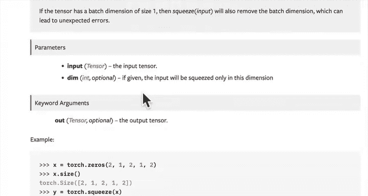

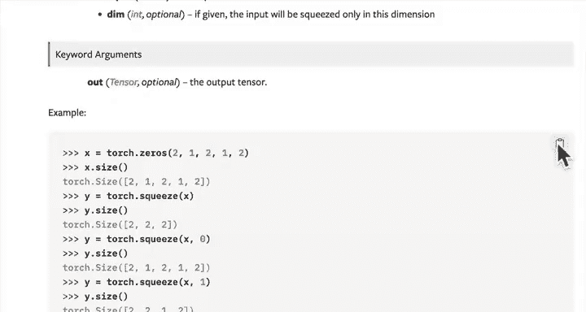

---

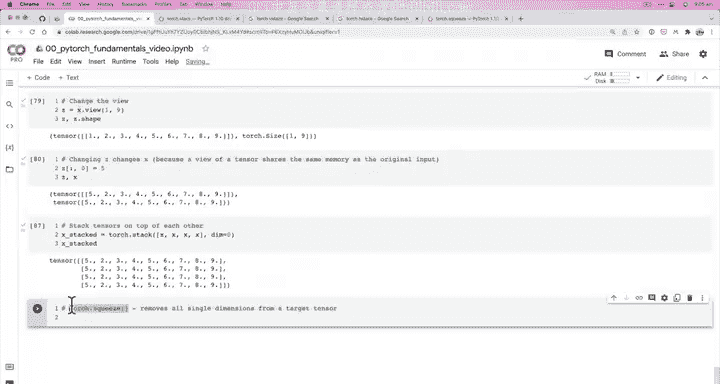

上一节我们介绍了张量的基础操作，本节中我们来看看如何调整张量的维度。

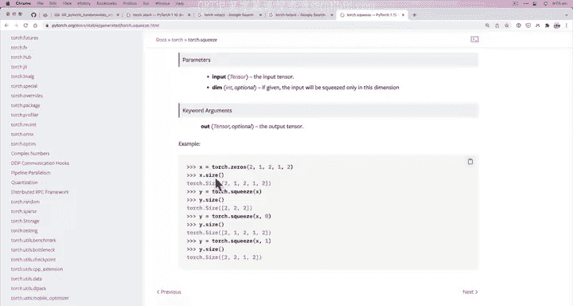

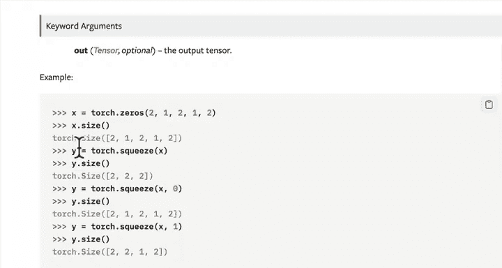

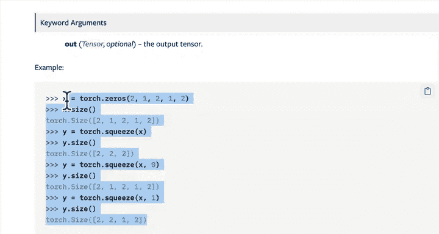

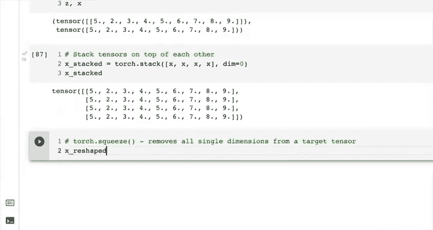

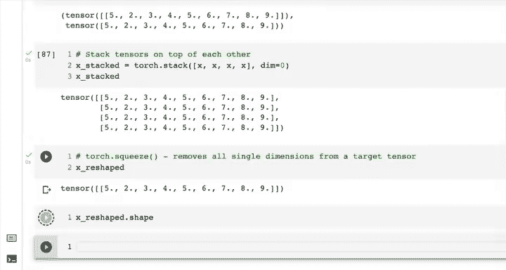

## 1. 压缩张量（Squeeze）

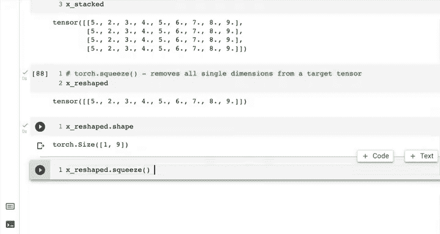

`torch.squeeze()` 方法的作用是移除目标张量中所有大小为1的维度。

以下是其基本语法和效果演示：

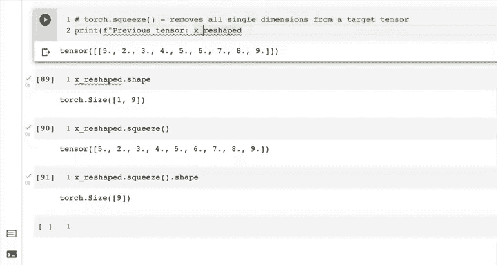

```python
# 创建一个具有单一维度的张量
x = torch.tensor([[1, 2, 3, 4, 5, 6, 7, 8, 9]])
print(f"原始张量: {x}")
print(f"原始形状: {x.shape}")  # 输出: torch.Size([1, 9])

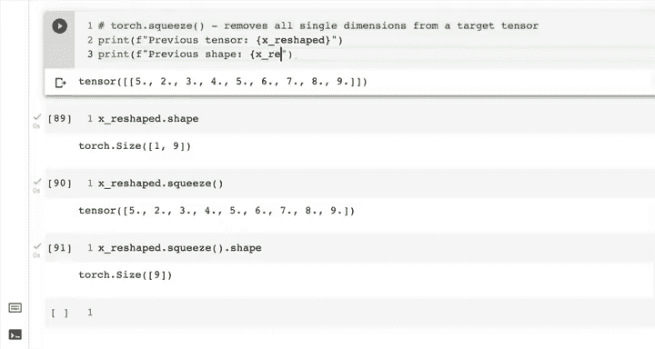

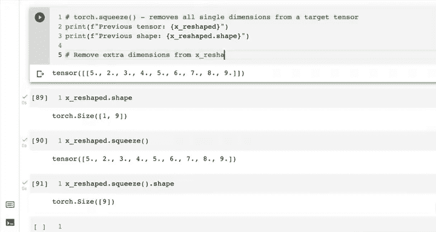

# 使用 squeeze 方法
x_squeezed = x.squeeze()
print(f"压缩后张量: {x_squeezed}")
print(f"压缩后形状: {x_squeezed.shape}")  # 输出: torch.Size([9])
```

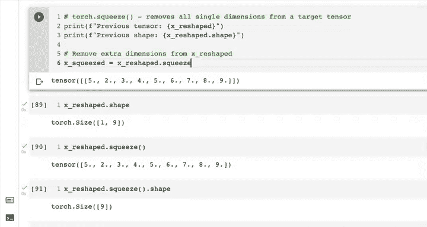

运行代码后，你会发现外层的方括号被移除，张量形状从 `[1, 9]` 变为 `[9]`。如果张量形状是 `[1, 1, 9]`，`squeeze()` 会移除所有为1的维度，最终形状同样是 `[9]`。

为了更清晰地观察变化，建议在代码中添加打印语句，这是一种有效的可视化调试方法。

---

理解了如何压缩维度后，接下来我们学习相反的操作。

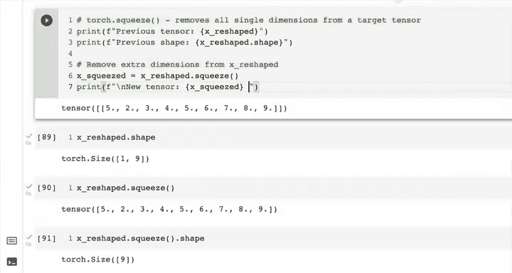

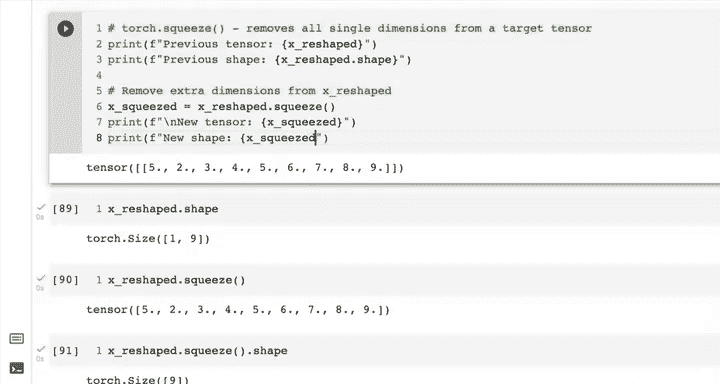

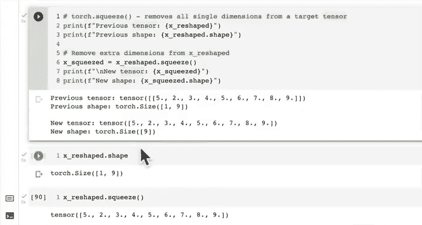

## 2. 解压张量（Unsqueeze）

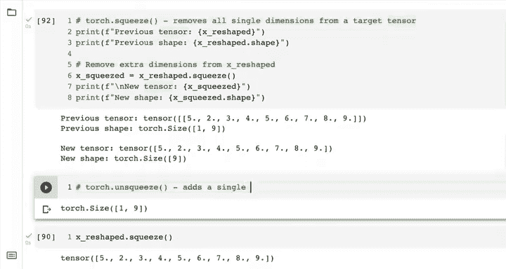

`torch.unsqueeze()` 方法的作用是在目标张量的指定维度（`dim`）上添加一个大小为1的新维度。

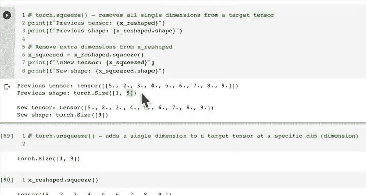

在PyTorch中，`dim` 参数代表维度索引，从0开始计数。

以下是使用示例：

```python
# 使用上一节压缩后的张量
print(f"压缩后张量形状: {x_squeezed.shape}")  # torch.Size([9])

# 在第0维（最外层）添加一个维度
x_unsqueezed = x_squeezed.unsqueeze(dim=0)
print(f"在第0维解压后形状: {x_unsqueezed.shape}")  # 输出: torch.Size([1, 9])

# 在第1维添加一个维度
x_unsqueezed_1 = x_squeezed.unsqueeze(dim=1)
print(f"在第1维解压后形状: {x_unsqueezed_1.shape}")  # 输出: torch.Size([9, 1])
```

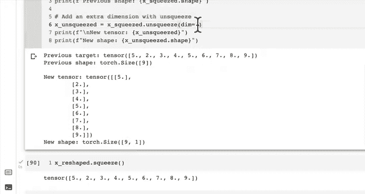

尝试改变 `dim` 参数的值，观察新维度添加的位置，这是熟悉该操作的最佳方式。

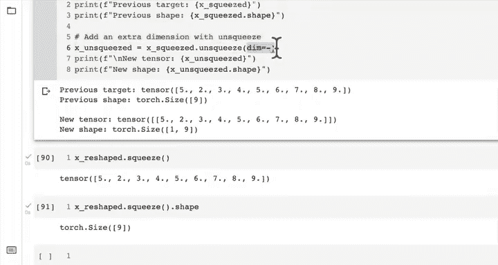

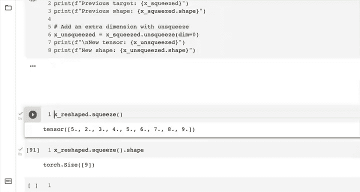

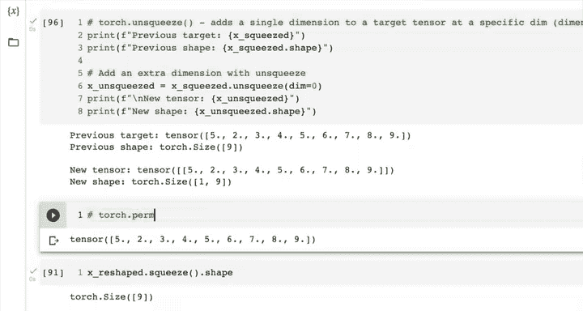

---

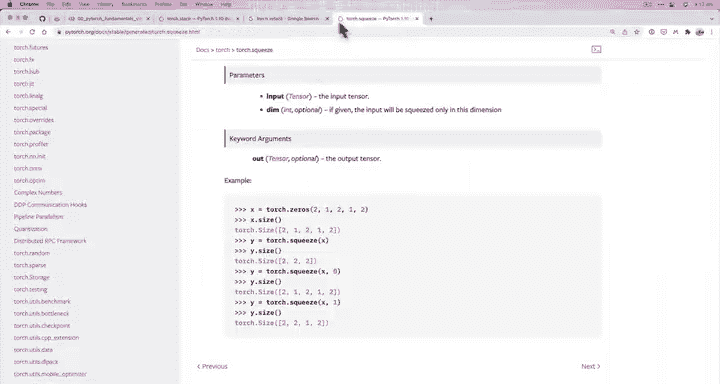

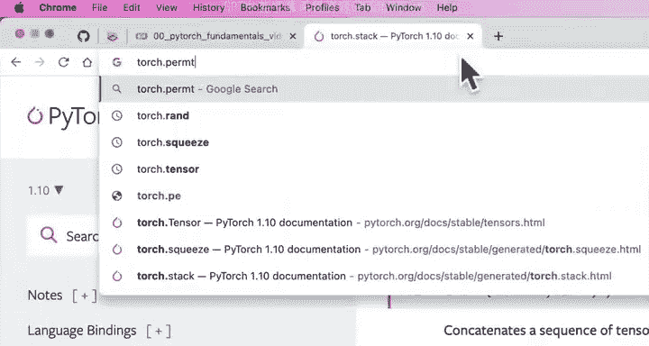

调整了张量的维度数量后，我们来看看如何重新排列现有的维度顺序。

## 3. 维度重排（Permute）

`torch.permute()` 方法的作用是按照指定的顺序重新排列目标张量的维度。它返回一个与原张量共享内存的新视图（view）。

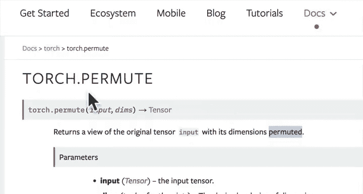

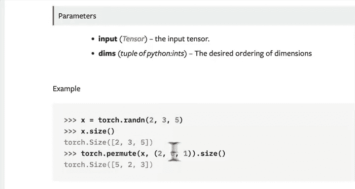

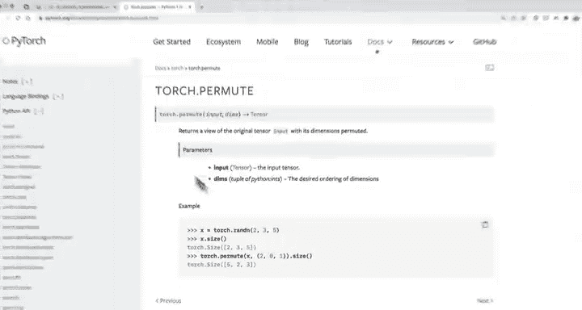

这个概念起初可能需要一些练习来掌握，因为它涉及到基于0的维度索引。

以下是一个通用示例：

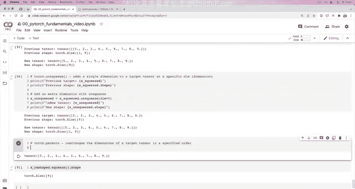

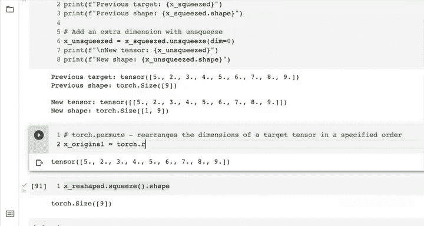

```python
# 创建一个随机张量
x_original = torch.randn(2, 3, 5)
print(f"原始形状: {x_original.shape}")  # 输出: torch.Size([2, 3, 5])

# 重新排列维度顺序：将原第2维变为第0维，原第0维变为第1维，原第1维变为第2维
x_permuted = x_original.permute(2, 0, 1)
print(f"重排后形状: {x_permuted.shape}")  # 输出: torch.Size([5, 2, 3])
```

`permute()` 的一个常见应用场景是处理图像数据。图像张量通常以 `[高度, 宽度, 颜色通道]` 的格式存储。但某些深度学习库（如PyTorch）的卷积层期望输入格式为 `[颜色通道, 高度, 宽度]`。

以下是转换图像数据格式的示例：

```python
# 模拟一个图像张量：高度=224， 宽度=224， 颜色通道=3 (RGB)
x_image = torch.randn(224, 224, 3)
print(f"原始图像形状 [高度, 宽度, 通道]: {x_image.shape}")

# 使用 permute 将通道维度移到最前面
x_image_permuted = x_image.permute(2, 0, 1)
print(f"重排后图像形状 [通道, 高度, 宽度]: {x_image_permuted.shape}")
```

**重要提示**：由于 `permute()` 返回的是视图（view），`x_image_permuted` 与 `x_image` 共享同一块内存。修改其中一个张量的值，另一个也会相应改变。你可以尝试修改 `x_image` 中的一个特定值（例如 `x_image[0,0,0]`），然后检查 `x_image_permuted` 中对应位置的值是否同步变化。

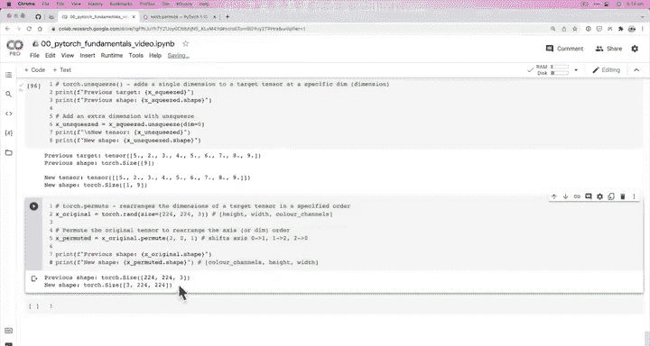

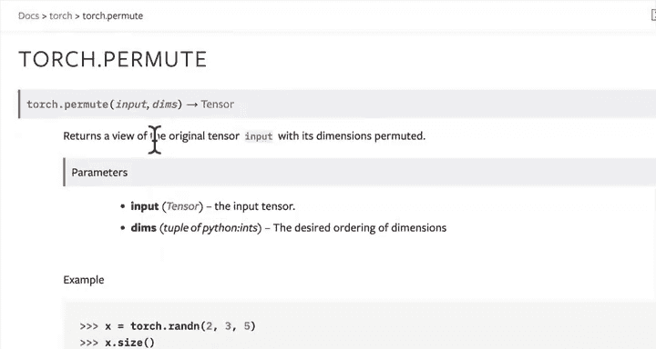

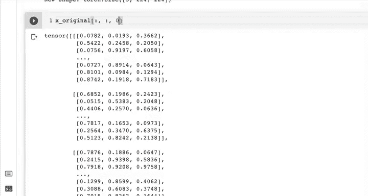

---

本节课中我们一起学习了PyTorch中三个核心的张量形状操作：使用 `squeeze()` 移除单一维度，使用 `unsqueeze()` 添加单一维度，以及使用 `permute()` 重新排列维度顺序。掌握这些操作能帮助你灵活地准备数据，使其符合不同模型层的输入要求。记住，多动手编写和测试代码是理解这些概念的最佳途径。