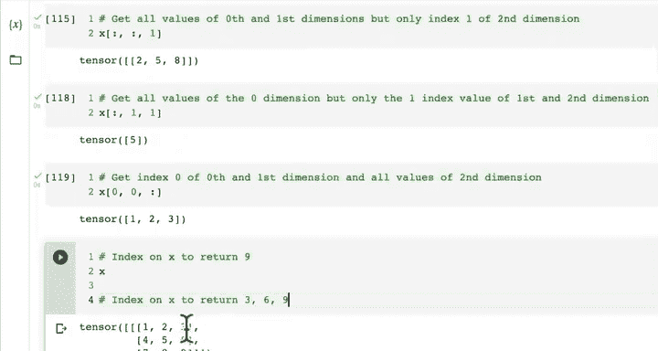

# 24：数据选择（索引）🔍

在本节课中，我们将要学习如何在PyTorch张量中选择数据，也就是索引。这是处理多维张量时的一项基础且重要的技能。

上一节我们介绍了张量的压缩、解压缩和维度重排。这些概念有助于我们解决张量形状和维度的问题，而这些问题在深度学习和神经网络中非常常见。

## 理解索引

索引是一种从数据结构中选择特定元素的方法。在PyTorch中，索引与NumPy非常相似。NumPy使用数组作为其主要数据类型，而PyTorch使用张量，两者的索引操作非常类似。

为了演示，我们首先创建一个张量。

```python
import torch

x = torch.arange(start=1, end=10).reshape(1, 3, 3)
print(x)
print(x.shape)
```

输出结果如下：
```
tensor([[[1, 2, 3],
         [4, 5, 6],
         [7, 8, 9]]])
torch.Size([1, 3, 3])
```

我们创建了一个形状为 `(1, 3, 3)` 的张量。可以将其想象为：最外层括号包含一个元素，这个元素本身是一个 `3x3` 的矩阵。

## 逐步索引

现在，让我们看看如何通过索引来选取这个张量中的特定部分。

首先，索引第一个维度（最外层）：
```python
print(x[0])
```
这将返回最外层括号内的所有内容，即那个 `3x3` 的矩阵。

接下来，我们索引第一个和第二个维度：
```python
print(x[0][0])
# 等价于
print(x[0, 0])
```
这行代码首先选取最外层的第一个元素（`3x3`矩阵），然后选取这个矩阵的第一行。

最后，我们索引所有三个维度来获取一个具体的标量值：
```python
print(x[0, 0, 0])
```
这行代码的路径是：最外层第一个元素 -> 该元素的第一个子元素（第一行）-> 该行的第一个元素。结果是 `1`。

如果我们想获取数字 `5`，可以这样做：
```python
print(x[0, 1, 1])
```
路径是：最外层第一个元素 -> 该元素的第二个子元素（第二行）-> 该行的第二个元素。

## 使用冒号进行切片

除了使用具体数字索引，我们还可以使用冒号 `:` 来选取某个维度的所有值。

以下是使用冒号进行数据选择的一些示例：

*   **获取第一个维度的所有值，但只取第二个维度的第一个索引：**
    ```python
    print(x[:, :, 1])
    ```
    这行代码选取了所有最外层元素，以及这些元素中所有行的第二列元素，结果是 `[2, 5, 8]`。

*   **获取第一个维度的所有值，但只取第二个和第三个维度的索引1：**
    ```python
    print(x[:, 1, 1])
    ```
    这等价于 `x[0, 1, 1]`，结果是 `5`。

*   **获取第一个和第二个维度的索引0，以及第三个维度的所有值：**
    ```python
    print(x[0, 0, :])
    ```
    这行代码选取了最外层第一个元素的第一个子元素（第一行）的所有值，结果是 `[1, 2, 3]`。

## 实践挑战

为了巩固理解，请尝试完成以下索引挑战：

1.  **挑战一：** 如何索引张量 `x` 以返回数字 `9`？
    *   **提示：** 数字 `9` 位于最内层矩阵的第三行第三列。

2.  **挑战二：** 如何索引张量 `x` 以同时返回数字 `3`, `6`, `9`？
    *   **提示：** 你需要选取所有行的第三列元素。

尝试自己编写代码解决这些挑战，这将帮助你更好地掌握多维张量的索引逻辑。

## 总结

本节课中我们一起学习了PyTorch张量的索引操作。我们了解到：
*   索引允许我们访问张量中的特定元素或子集。
*   可以通过在方括号 `[]` 中按维度顺序指定索引值来逐步深入张量。
*   冒号 `:` 用于选择某个维度的所有值。
*   理解张量的形状 `(dim0, dim1, dim2...)` 是进行正确索引的关键。




掌握索引是高效操作和处理张量数据的基础，对于后续构建和调试深度学习模型至关重要。