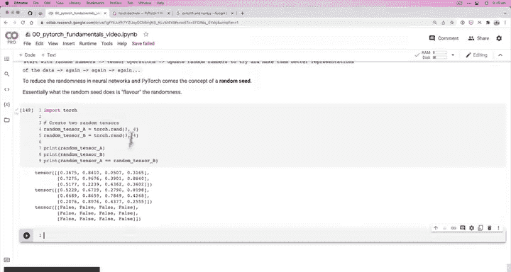
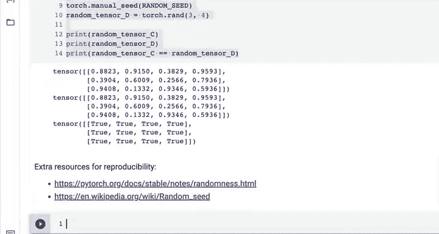

#  26：PyTorch 可复现性 🎲


在本节课中，我们将要学习一个在机器学习和深度学习实验中至关重要的概念：**可复现性**。我们将探讨如何控制PyTorch中的随机性，以确保你的实验结果是可复现的。

---

## 概述

神经网络的学习过程始于随机数。简而言之，其流程是：**从随机数开始 -> 执行张量运算 -> 更新随机数以更好地表示数据 -> 不断重复**。然而，当你需要分享实验或进行严谨的科学研究时，过多的随机性会成为问题。本节我们将学习如何使用**随机种子**来“调味”这种随机性，从而获得可复现的结果。

---

## 随机性的挑战

在之前的课程中，我们创建了充满随机值的张量。每次运行创建随机张量的代码，都会得到一组全新的数字。

```python
import torch
random_tensor = torch.rand(3, 3)
print(random_tensor)
```

每次执行上述代码，`random_tensor`中的值都会改变。如果你将包含此代码的笔记本分享给同事，他们运行后会得到与你不同的随机数，这使得精确复现你的实验结果变得困难。

---

## 解决方案：随机种子

为了减少这种随机性，PyTorch引入了**随机种子**的概念。计算机本质上是确定性的，它们重复执行相同的步骤。我们通常所说的“随机”实际上是**伪随机**，而随机种子就是用来初始化这个伪随机数生成器的。

设置随机种子可以“调味”随机性。这意味着，只要使用相同的种子，生成的随机数序列就是确定的、可预测的。

---

## 实践：使用随机种子

让我们通过代码来看看随机种子的作用。

首先，我们创建两个没有设置种子的随机张量，并比较它们：

```python
import torch

# 创建两个随机张量
random_tensor_A = torch.rand(3, 4)
random_tensor_B = torch.rand(3, 4)




print(“随机张量 A:”, random_tensor_A)
print(“随机张量 B:”, random_tensor_B)
print(“A 和 B 是否相等？:”, random_tensor_A == random_tensor_B)
```

运行上述代码，你会发现两个张量中的值完全不同，`==`比较的结果全为`False`。这是完全随机的行为。

现在，让我们使用随机种子来创建可复现的随机张量：

```python
import torch

# 设置随机种子为42（这是一个常用值，你可以选择任何整数）
torch.manual_seed(42)
# 创建第一个随机张量
random_tensor_C = torch.rand(3, 4)

# 注意：为了确保下一个随机操作也使用相同的“风味”，我们需要再次设置种子
torch.manual_seed(42)
# 创建第二个随机张量
random_tensor_D = torch.rand(3, 4)

print(“随机张量 C:”, random_tensor_C)
print(“随机张量 D:”, random_tensor_D)
print(“C 和 D 是否相等？:”, random_tensor_C == random_tensor_D)
```

运行这段代码，你会发现`random_tensor_C`和`random_tensor_D`的值**完全相同**！这是因为我们使用相同的随机种子（42）初始化了伪随机数生成器。任何使用相同种子运行这段代码的人，都会得到与你一模一样的`random_tensor_C`和`random_tensor_D`。

**关键点**：在笔记本环境中，`torch.manual_seed()`通常只影响紧随其后的一块代码。因此，如果你要连续进行多个随机操作（如创建多个张量），需要在每个操作前都设置一次种子，以确保所有随机性都来自同一个“风味”。

---

## 核心概念总结

*   **伪随机性**：计算机生成的、看似随机但实则由确定算法产生的数字序列。
*   **随机种子**：一个用于初始化伪随机数生成器的整数值。相同的种子总是产生相同的随机数序列。
*   **`torch.manual_seed(seed)`**：PyTorch中设置随机种子的函数。参数`seed`是一个整数。

**公式/代码描述核心概念**：
`输出随机序列 = 伪随机数生成器算法(随机种子)`

---

## 额外资源

为了更深入地理解可复现性，建议你查阅以下资源：
1.  **PyTorch官方关于可复现性的文档**：这份文档详细介绍了在PyTorch中实现可复现实验的各种注意事项和最佳实践。
2.  **维基百科“随机种子”词条**：这有助于你从计算机科学基础层面理解随机种子的通用概念，它不仅适用于PyTorch，也适用于NumPy等众多库。

---

## 总结

本节课我们一起学习了深度学习中的**可复现性**。我们了解到，通过使用 **`torch.manual_seed()`** 设置一个**随机种子**，可以控制PyTorch中的伪随机数生成过程。这使得我们的机器学习实验变得可复现——无论你、你的同事，还是未来的你，在相同代码和种子下，都能得到完全一致的随机结果。这是进行严谨实验和有效协作的重要基础。



你已经掌握了控制随机性的关键技巧！我们下节课再见。