#  27：访问 GPU 🚀

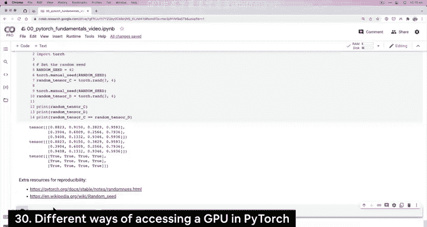

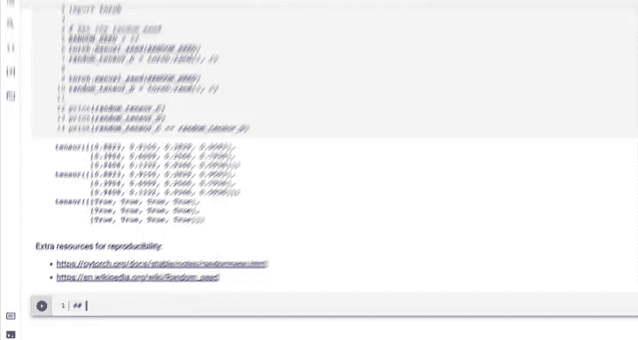

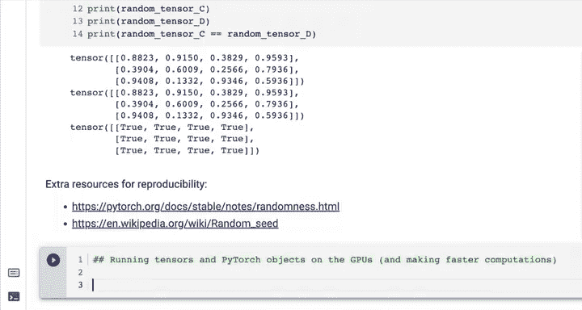

在本节课中，我们将学习如何在 PyTorch 中访问和使用 GPU 来加速张量和模型的计算。GPU 能够显著提升数值运算的速度，这对于深度学习至关重要。

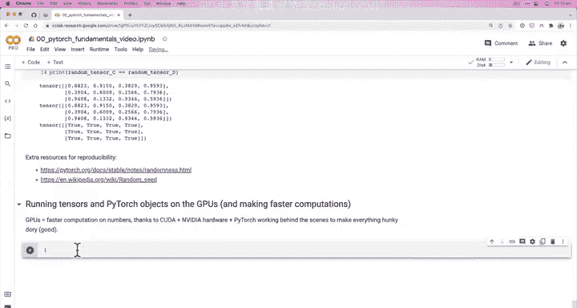

上一节我们介绍了 PyTorch 的基础操作，本节中我们来看看如何利用硬件加速。

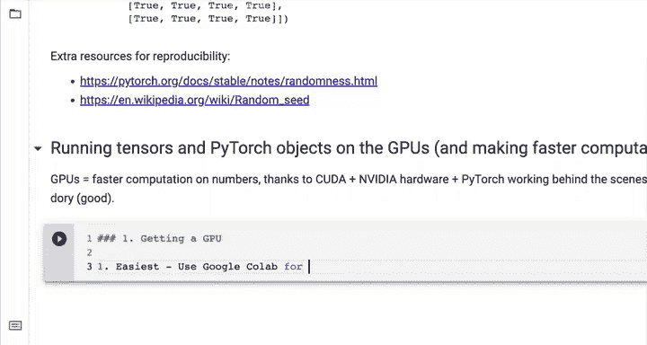

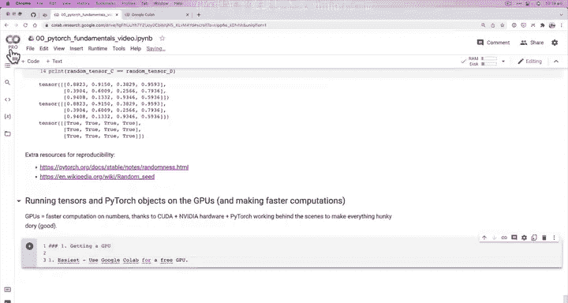

## 为何使用 GPU？

GPU 能够实现更快的数值计算。这得益于 **CUDA**（NVIDIA 的并行计算平台）与专用硬件，以及 PyTorch 在后台的协同工作。


核心公式可以理解为：
`计算速度（GPU） >> 计算速度（CPU）`

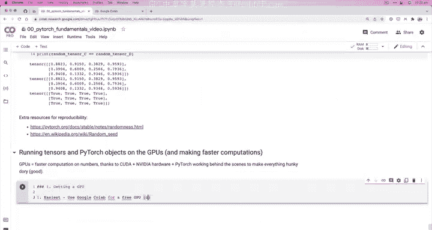

## 如何获取 GPU 资源

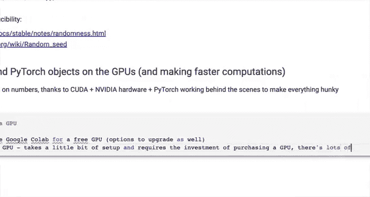


有多种方式可以获取 GPU 计算资源。以下是主要的三种途径：

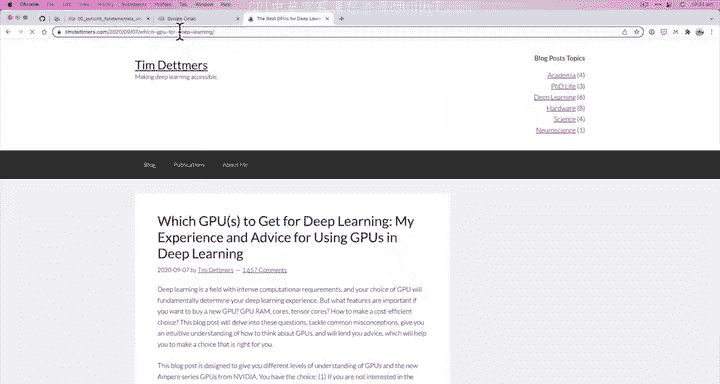

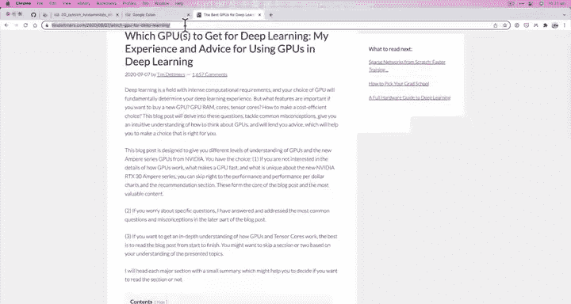

**1. 使用 Google Colab（免费 GPU）**
这是最简单的方式，也是本课程将主要使用的方式。Colab 提供免费的 GPU 运行时环境。

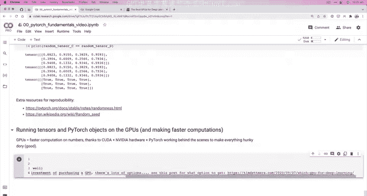

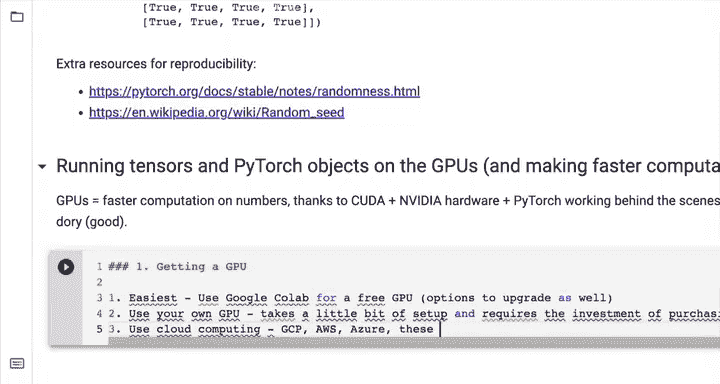

**2. 使用自有 GPU**
这需要自行购买和设置硬件，并进行驱动和软件环境的配置，需要一定的投资和技术准备。

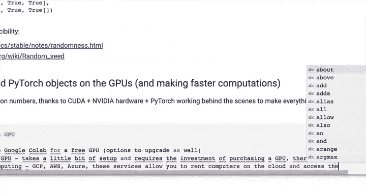

**3. 使用云计算服务**
例如 Google Cloud Platform (GCP)、Amazon Web Services (AWS) 或 Microsoft Azure。这些服务允许你在云端租用配备 GPU 的计算机。

对于初学者，强烈推荐从 **Google Colab** 开始，因为它几乎无需设置即可使用。

## 在 Google Colab 中启用 GPU


在 Colab 笔记本中，你可以通过以下步骤连接到 GPU 运行时：
1.  点击顶部菜单栏的 **“运行时”**。
2.  选择 **“更改运行时类型”**。
3.  在 **“硬件加速器”** 下拉菜单中选择 **“GPU”**。
4.  点击 **“保存”**。这将会重启运行时并连接到一个配备 GPU 的计算实例。

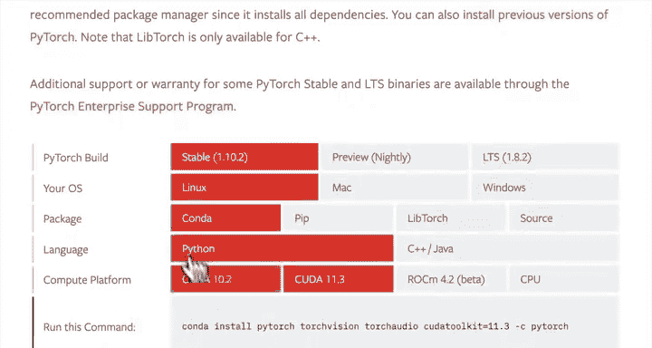

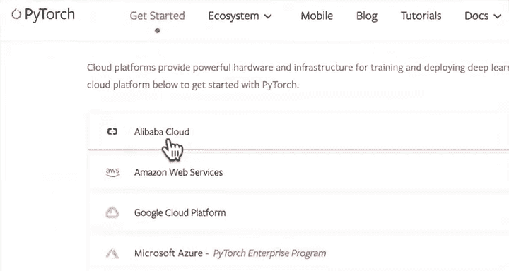

连接后，你可以运行 `!nvidia-smi` 命令来查看已分配的 GPU 信息。

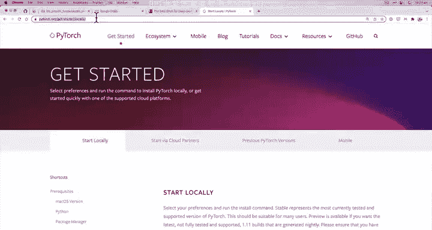

## 在 PyTorch 中检查 GPU 访问

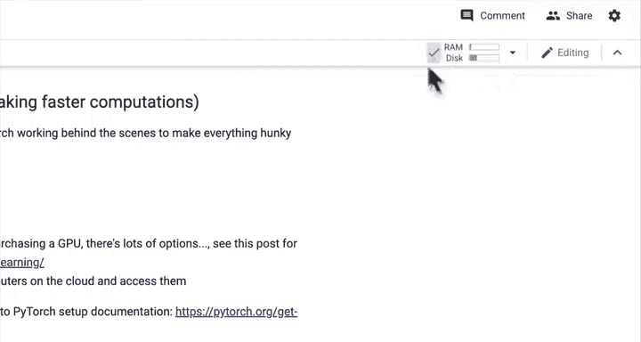

连接 GPU 后，我们需要在 PyTorch 中确认是否可以访问它。


使用以下代码检查 CUDA（即 GPU）是否可用：

```python
import torch
torch.cuda.is_available()
```

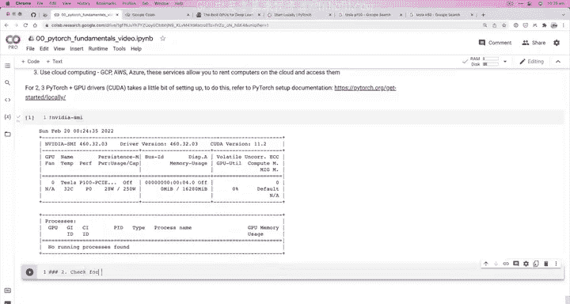

如果返回 `True`，则表示 PyTorch 可以识别并使用当前 GPU。这是使用 Google Colab 的一大优势——环境已预先配置好。

## 设置设备无关代码

这是一个重要的 PyTorch 编程实践。你的代码可能运行在有 GPU 或只有 CPU 的不同环境中。设备无关代码能确保程序自动选择最佳可用设备。

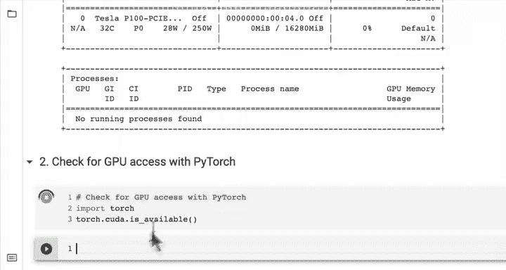

以下是设置设备变量的标准方法：

```python
# 设置设备
device = “cuda” if torch.cuda.is_available() else “cpu”
print(f“Using device: {device}”)
```

这段代码的逻辑是：如果 CUDA（GPU）可用，则使用 `“cuda”`；否则，默认使用 `“cpu”`。变量 `device` 将在后续用于将张量和模型移动到目标设备。

你还可以查看可用 GPU 的数量：

```python
torch.cuda.device_count()
```

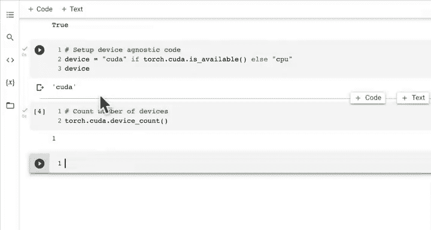

这对于未来使用多 GPU 进行大规模计算很有帮助。

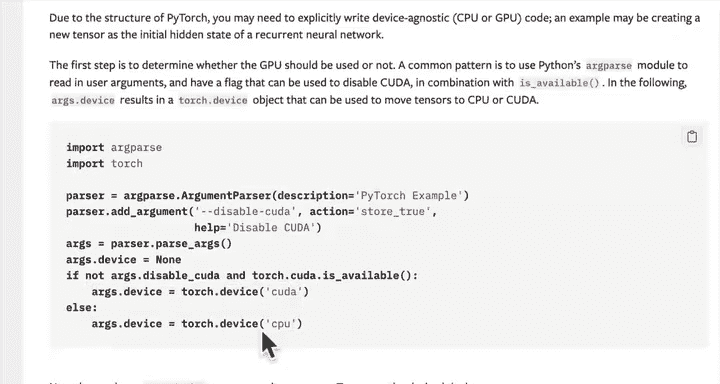

## PyTorch 官方最佳实践

PyTorch 官方文档建议，由于框架支持在 GPU 或 CPU 上运行，最佳实践是建立设备无关代码。这意味着：如果 GPU 可用，则在 GPU 上运行；否则，默认使用 CPU。

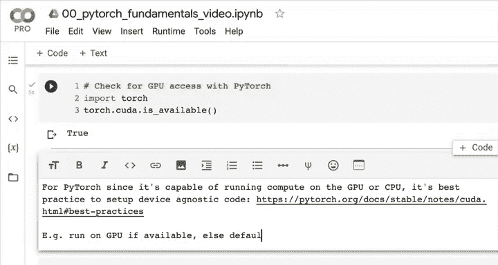

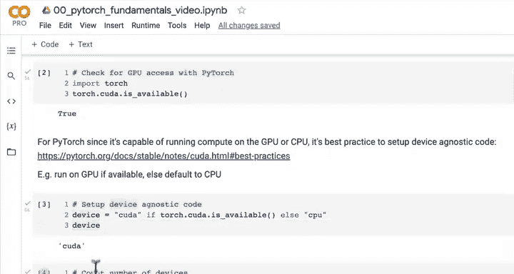

本节课中我们一起学习了访问 GPU 的几种方式、如何在 Colab 中启用 GPU、如何在 PyTorch 中检查 GPU 可用性，以及如何编写设备无关代码。在下一节中，我们将学习如何将张量和模型移动到指定的设备（GPU 或 CPU）上进行计算。