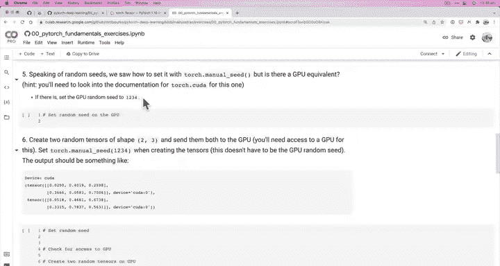
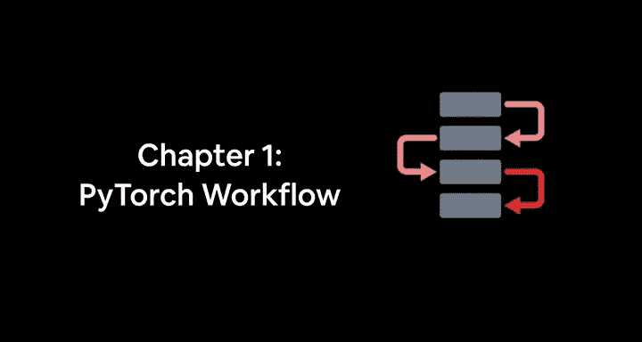

# 28：设置设备无关代码 🚀

在本节课中，我们将学习如何编写设备无关的代码，以便我们的PyTorch张量和模型能够在CPU或GPU上无缝运行。掌握这项技能对于高效利用计算资源至关重要。

## 概述

上一节我们探讨了获取GPU并使用PyTorch在其上运行的不同方案。目前，我们使用Google Colab，这是最简单的设置方式，因为它免费提供GPU访问，并且如果可用，会自动将PyTorch设置为使用GPU。

本节中，我们将看看如何实际使用GPU。具体来说，我们将学习如何将张量和模型放置在GPU上。

## 为何使用GPU？

我们希望将张量和模型放在GPU上的原因在于，使用GPU可以带来更快的计算速度。对于让机器学习模型在数字中寻找模式的任务，GPU非常擅长进行数值计算。我们将要进行的数值计算就是之前见过的张量运算。

如果能更快地运行这些计算，我们就能更快地发现数据中的模式，进行更多实验，并努力为手头的问题找到最佳模型。

## 创建与移动张量

首先，我们像往常一样创建一个张量。默认情况下，张量位于CPU上。

```python
import torch

# 在CPU上创建一个张量
tensor_cpu = torch.tensor([1, 2, 3], device='cpu')
print(tensor_cpu)  # 输出：tensor([1, 2, 3])
```

即使我们不指定`device`参数，默认也会在CPU上创建。

PyTorch使得将数据移动到GPU（或更准确地说，目标设备）变得非常简单。如果GPU可用，我们使用CUDA；如果不可用，则使用CPU。这就是我们设置设备变量的原因。

以下是移动张量到GPU的方法：

```python
# 设置目标设备
device = torch.device('cuda' if torch.cuda.is_available() else 'cpu')

# 将张量移动到目标设备
tensor_gpu = tensor_cpu.to(device)
print(tensor_gpu)  # 输出：tensor([1, 2, 3], device='cuda:0')
```

现在，我们的张量`[1, 2, 3]`位于设备`cuda:0`上。这里的`0`是我们正在使用的GPU的索引。因为我们只有一个GPU，所以索引为0。当你开始进行更大规模的实验并使用多个GPU时，可能会有不同的张量存储在不同的GPU上。但目前，我们只使用一个GPU以保持简单。

## 设备无关代码的优势

我们设置设备无关代码的原因在于，无论我们是否有GPU，这段代码都能正常工作。无论我们访问的是CPU还是GPU，张量都会被移动到目标设备。由于我们有可用的GPU，它就会去那里。

你会经常看到`.to()`方法，它用于移动张量，也可以用于移动模型，我们稍后会看到。所以请记住`.to(device)`。

## 将张量移回CPU

有时，为了进行某些计算（例如使用NumPy），你可能需要将张量移回CPU，因为NumPy只能在CPU上工作。

以下是如何将张量移回CPU：

```python
# 尝试直接转换GPU上的张量为NumPy会出错
# numpy_array = tensor_gpu.numpy()  # 这会引发错误

# 正确做法：先将张量移回CPU
tensor_back_on_cpu = tensor_gpu.cpu()
numpy_array = tensor_back_on_cpu.numpy()
print(numpy_array)  # 输出：[1 2 3]
```

当我们重新将`tensor_back_on_cpu`赋值后，原始的`tensor_gpu`保持不变，仍然在GPU上。

## 实践练习与总结

关于在PyTorch中使用GPU，主要有以上四个要点。虽然还有更多细节，例如多GPU使用，但你现在已经掌握了基础。我们将坚持使用一个GPU。如果你在深入学习后想研究多GPU，正如你可能猜到的，PyTorch也有相应的功能。

以下是你可以进行的练习：
*   使用Colab获取GPU访问权限。
*   检查GPU是否可用。
*   设置设备无关代码。
*   创建一些虚拟张量，并将它们设置到不同的设备上。
*   尝试用GPU上的张量进行NumPy计算以引发错误，然后将这些GPU上的张量移回CPU再进行NumPy计算。

在本节课中，我们一起学习了PyTorch的基础知识，包括张量介绍、最小值最大值、重塑、索引、与NumPy的互操作性、使用GPU以及将数据移入移出GPU。这些都是我们在后续课程中将要使用的构建模块。

在进入下一部分之前，我鼓励你通过练习和扩展阅读来尝试应用所学知识。我已经根据我们所涵盖的所有内容设置了一些练习。如果你访问`learnpytorch.io`并进入我们当前所在的章节，在PyTorch基础笔记本的底部目录中，会有一些练习和扩展阅读材料。

这些练习包括阅读文档、创建特定形状的随机张量、执行矩阵乘法等，都是基于我们在这里学到的内容。我鼓励你参考我们在视频中一起编写的笔记本来完成这些练习。

一个方法是：在屏幕一侧打开练习说明，另一侧在Colab中新建一个笔记本，然后开始编码。你也可以从GitHub课程材料的`extras/exercises`文件夹中获取练习模板。每个模块都有对应的练习模板和解决方案，但我鼓励你先自己尝试，遇到困难时再参考。

请记住，在每个模块的结尾都有练习和扩展阅读。练习通常是代码基础的，而扩展阅读通常是阅读基础的。例如，花一小时浏览PyTorch基础教程，推荐快速入门和张量部分。最后，要了解更多关于张量如何表示数据的信息，可以观看我们提到的“什么是张量”视频。





恭喜你完成了PyTorch基础部分的学习！我们下一节再见。