#  29：PyTorch 工作流简介 🚀

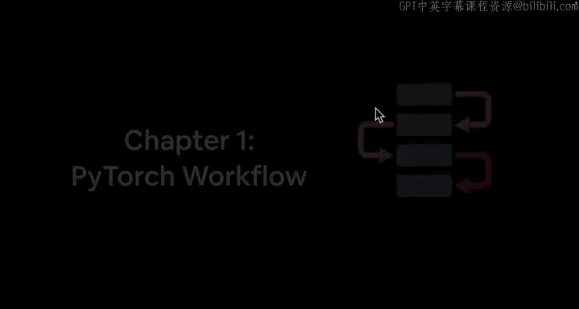

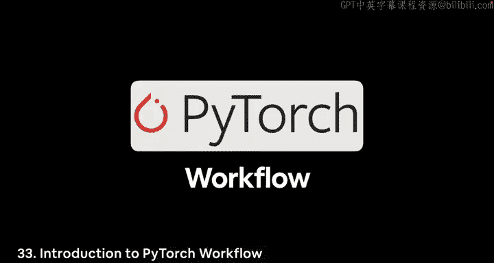

在本节课中，我们将要学习 PyTorch 深度学习的基本工作流程。这是一个通用的框架，可以帮助你构建、训练和评估模型。

---

## 概述

一个典型的 PyTorch 工作流程包含几个关键步骤。我们将从准备数据开始，一直到保存训练好的模型。这个流程是许多深度学习项目的基础。

---

## PyTorch 工作流概览

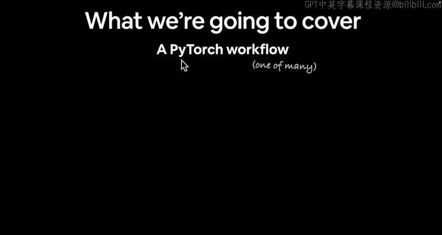

以下是 PyTorch 工作流的一个大致轮廓。当你深入机器学习和深度学习时，你会发现有多种方法可以完成这些步骤，但这是一个很好的起点。

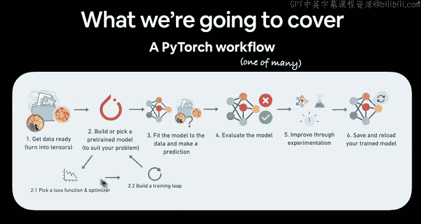

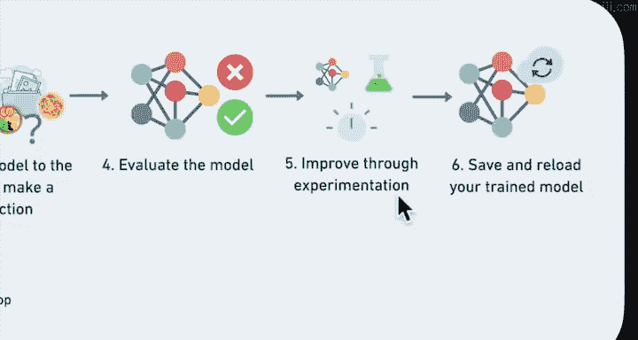

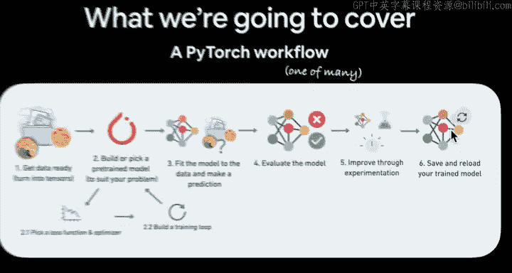

**核心工作流程**：
1.  准备数据。
2.  将数据转换为张量。
3.  选择或构建一个模型。
4.  选择损失函数和优化器。
5.  构建训练循环。
6.  将模型拟合到数据上以进行预测。
7.  评估模型。
8.  通过实验进行改进。
9.  保存并重新加载训练好的模型。

记住，张量可以表示几乎任何类型的数据。如果你不知道损失函数和优化器是什么，不用担心，我们稍后会详细介绍。

---

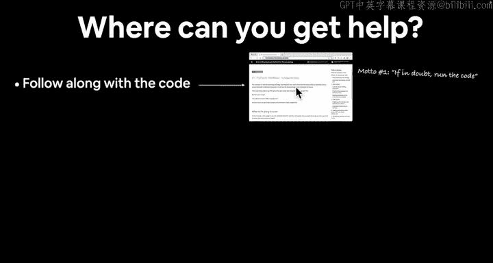

## 如何获取帮助

在学习过程中，你可能会遇到问题。以下是一些寻求帮助的有效方法。

**以下是获取帮助的途径**：
*   **动手实践**：最好的学习方法是跟随代码一起编写和运行。我们的座右铭是：如有疑问，运行代码。自己尝试，犯错，再尝试，直到成功。
*   **查阅文档字符串**：使用 `Shift + Cmd + Space`（Mac）或 `Ctrl + Space`（Windows/Colab）查看函数文档。
*   **搜索资源**：如果仍然困惑，可以搜索相关问题，你可能会找到 Stack Overflow 或 PyTorch 官方文档等资源。PyTorch 文档是本课程所有内容的基石。
*   **提问**：如果以上方法都无法解决问题，可以在课程 GitHub 仓库的 “Discussions” 标签页中提问。提问时，请注明视频和代码信息，以便他人参考并帮助你。

---

## 课程配套资源

除了视频，本课程还有配套的书籍版本可供参考。

你可以在 `learnpytorch.io` 找到完整的章节内容。这些视频正是基于此书制作的。书是很好的参考资料，你可以随时阅读。但在本课程中，我们将主要专注于一起编写代码。

---

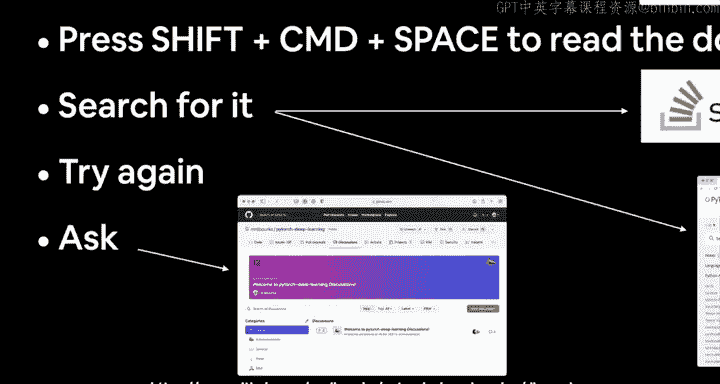

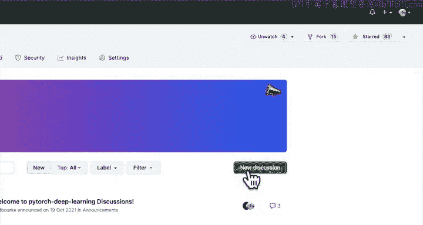

## 开始编码

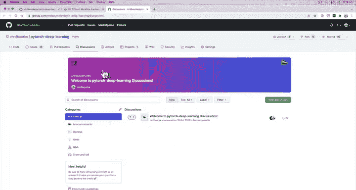

理论介绍完毕，现在让我们开始动手编码吧。我们将在 Google Colab 中见。

---

## 总结

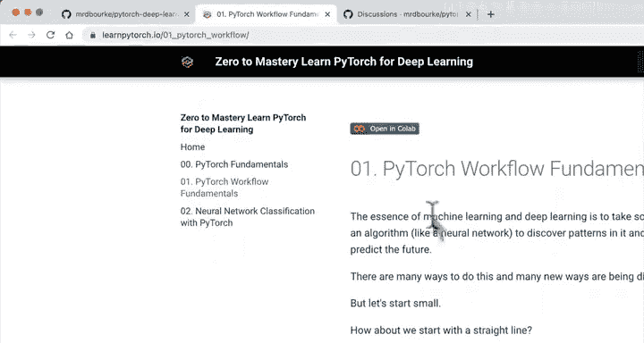

本节课我们一起学习了 PyTorch 深度学习的基本工作流程，涵盖了从数据准备到模型保存的各个步骤。我们还讨论了在学习过程中遇到困难时如何有效地寻求帮助，并介绍了课程的配套书籍资源。接下来，我们将进入实践环节，开始编写代码。