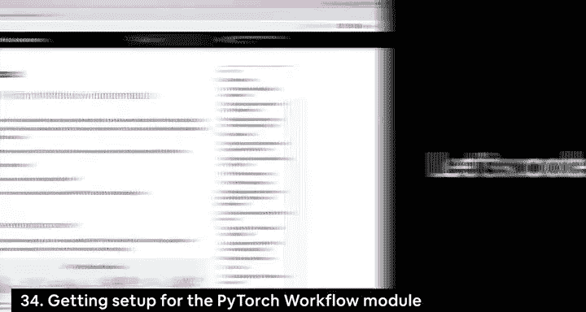
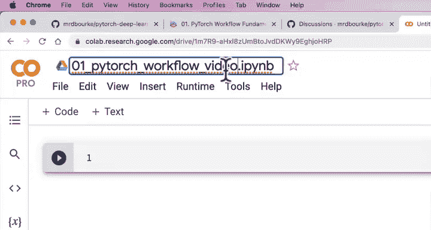
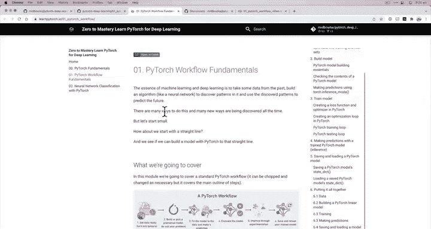
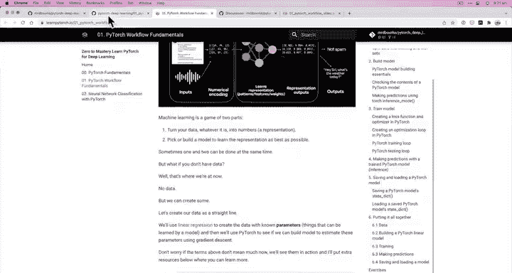
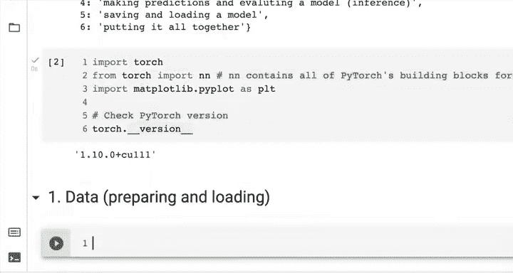

# 30：环境搭建与工作流概览 🚀




在本节课中，我们将学习如何设置PyTorch开发环境，并初步了解一个完整的PyTorch深度学习项目工作流。我们将从零开始，在Google Colab中创建一个新的笔记本，并导入必要的库。



---

## 概述

我们将创建一个名为“01. PyTorch工作流”的新笔记本。这个笔记本将基于课程提供的原始资源，但我们将专注于代码实现。课程资源包括一个带有详细注释和图表的原始笔记本，以及一个书籍格式的版本。我们将把这两个资源链接到我们的笔记本中，以便参考。



---



## 设置笔记本

首先，我们访问 `colab.research.google.com` 并创建一个新的笔记本。

我将把这个笔记本命名为 **`01. PyTorch workflow`**，并注明它来自本视频课程。这样做的原因是，在课程资源中，有一个原始笔记本作为参考。视频中的笔记本将基于这个原始笔记本构建。原始笔记本包含了许多图片和精美的文本注释，而视频中我们将专注于代码部分。

此外，还有一个书籍版本的笔记本，它是同一内容的另一种格式。我会把这两个资源都链接到笔记本的开头部分。

以下是笔记本开头的设置内容：

```markdown
# PyTorch工作流

让我们探索一个端到端的PyTorch工作流示例。

## 资源
*   **原始笔记本**: [链接]
*   **书籍版本**: [链接]
*   **提问**: 请到讨论页面。
```

让我们将其转换为Markdown格式。

---

## 课程内容介绍

我倾向于采用的教学方式是直接一起编写代码，然后在需要时解释相关概念。因为当你实际使用PyTorch时，你也会是边写代码边查阅资料。

因此，我们将参照PyTorch工作流示例，涵盖以下六个核心步骤：

1.  **数据准备与加载**
2.  **构建机器学习（深度学习）模型**
3.  **将模型拟合到数据（训练）**
4.  **进行预测并评估模型（推理与评估）**
5.  **保存和加载模型**
6.  **将所有步骤整合在一起**

请注意，“拟合”在机器学习中常被称为“训练”。“进行预测”也常被称为“推理”。虽然本课我们会完整走一遍这个流程，但后续课程我们会更深入地探讨如何通过实验来改进模型（即工作流中的“改进”环节）。

让我们把这个大纲也写入笔记本，方便后续参考。

---

## 导入依赖库

现在，我们开始编写代码。首先导入必要的Python库。

```python
import torch
from torch import nn # nn包含PyTorch中构建神经网络的所有基础模块
import matplotlib.pyplot as plt # 用于数据可视化

# 检查PyTorch版本
print(f"PyTorch版本: {torch.__version__}")
```

**代码解释**:
*   `torch`: PyTorch主库。
*   `torch.nn` (导入为 `nn`): 这是PyTorch的神经网络模块。它包含了构建神经网络图（或称计算图）所需的所有基础层（Layer），例如全连接层、卷积层等。你可以将这些模块像搭积木一样组合，构建出你想要的任何神经网络结构。
*   `matplotlib.pyplot`: 用于绘图，遵循“可视化、可视化、再可视化”的数据探索准则。
*   打印PyTorch版本是为了确保环境正确。版本至少应为1.10+以获得更好的CUDA支持。输出中的“CUDA 11.1”表示当前运行时环境支持CUDA（GPU加速），不过在这个Colab运行时中我们可能还没有主动启用GPU。

---

## 总结

本节课中，我们一起完成了PyTorch学习环境的搭建。我们创建了一个新的Colab笔记本，链接了课程资源，并概述了即将学习的端到端PyTorch工作流。最后，我们导入了核心的依赖库（`torch`, `torch.nn`, `matplotlib`）并检查了PyTorch版本。



在下一节课中，我们将正式开始工作流的第一步：**数据准备与加载**。