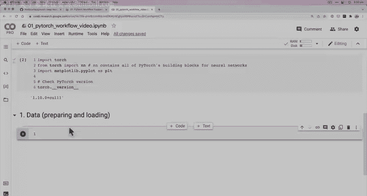
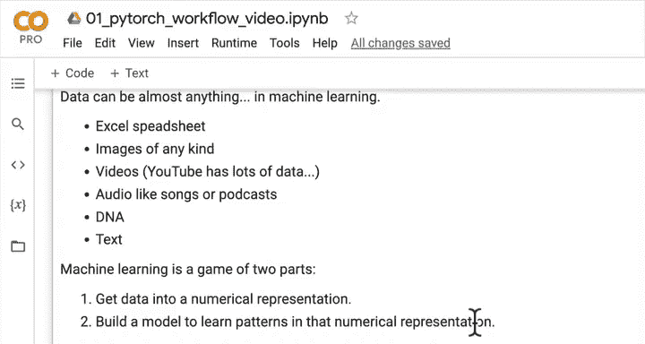
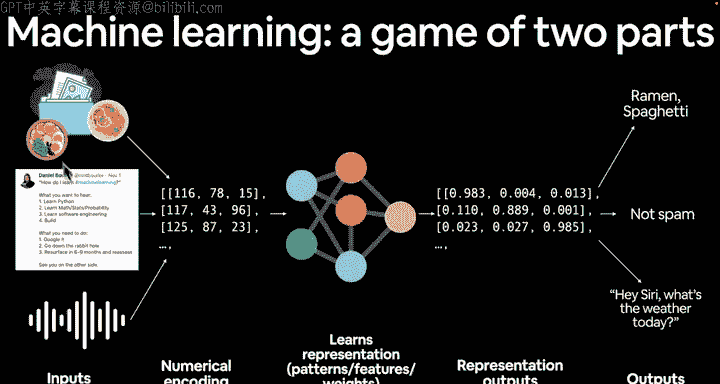
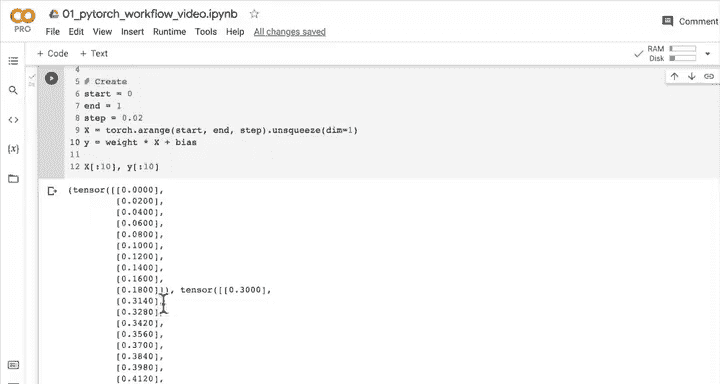
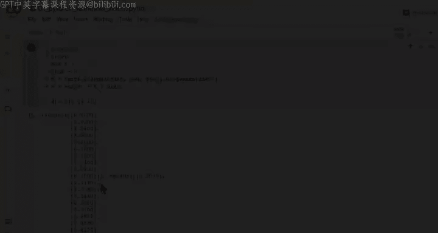

# 31：使用线性回归创建数据集 📊



在本节课中，我们将学习PyTorch深度学习工作流程的第一步：数据的准备与加载。我们将通过创建一个简单的线性回归数据集来演示这一过程。

## 概述：机器学习的两个核心部分

上一节我们介绍了PyTorch的基础概念，本节中我们来看看机器学习工作流程的起点。机器学习本质上包含两个核心部分：

1.  将数据转换为数值表示。
2.  构建模型以学习该数值表示中的模式。

数据可以是任何形式：Excel表格、图像、视频、音频、DNA序列或文本。我们的目标是将这些输入数据编码为张量（tensors）形式的数值表示。随后，我们将构建一个神经网络来学习这些数值编码中的模式（也称为特征或权重），并基于此模式进行预测或分类。



## 创建线性回归数据集



为了清晰地展示上述过程，我们将从一个已知的线性回归公式开始，手动创建数据集。这样，我们就能明确知道数据背后的真实规律，并观察模型是否能学习到它。

线性回归的标准公式通常表示为：
**y = a + bx**
其中：
*   `x` 是自变量（解释变量）。
*   `y` 是因变量。
*   `b` 是直线的斜率（也称为权重或梯度）。
*   `a` 是截距（当 `x = 0` 时 `y` 的值）。

在深度学习中，我们通常使用 `weight` 和 `bias` 来对应公式中的 `b` 和 `a`。

### 步骤一：定义已知参数

首先，我们设定数据生成的“真实”参数。我们的模型最终需要学习这些值。

```python
import torch

# 定义已知参数（模型需要学习的值）
weight = 0.7  # 对应公式中的 b (斜率)
bias = 0.3    # 对应公式中的 a (截距)
```

### 步骤二：生成输入数据 (X) 和输出标签 (y)

接下来，我们根据线性公式 `y = weight * x + bias` 来生成数据。

以下是创建数据的具体步骤：

1.  使用 `torch.arange()` 生成一个从0到1、步长为0.02的数值序列作为输入 `X`。
2.  应用线性公式计算对应的 `y` 值。
3.  使用 `.unsqueeze(dim=1)` 为数据添加一个额外的维度，这是为后续构建模型准备的标准格式。

```python
# 创建输入数据 X
start = 0
end = 1
step = 0.02
X = torch.arange(start, end, step).unsqueeze(dim=1)

# 根据线性公式创建标签数据 y
y = weight * X + bias

# 查看前10个数据点
print(f"前10个X值:\n{X[:10]}")
print(f"\n前10个y值:\n{y[:10]}")

# 查看数据总量
print(f"\nX的长度: {len(X)}")
print(f"y的长度: {len(y)}")
```

运行上述代码，你将得到50对 `(X, y)` 数据点。我们知道它们之间的关系完全由 `weight=0.7` 和 `bias=0.3` 决定。

## 本节总结

本节课中我们一起学习了机器学习流程的第一步。我们创建了一个基于线性公式 `y = weight * x + bias` 的合成数据集，其中 `weight` 和 `bias` 是我们预设的已知参数。我们得到了输入 `X` 和对应的真实输出 `y`。





目前，数据还只是张量中的数字。在下一节课中，我们将遵循数据探索者的格言——“可视化你的数据”，通过绘图来直观地观察我们刚刚创建的线性关系，并为构建模型学习这些模式做好准备。