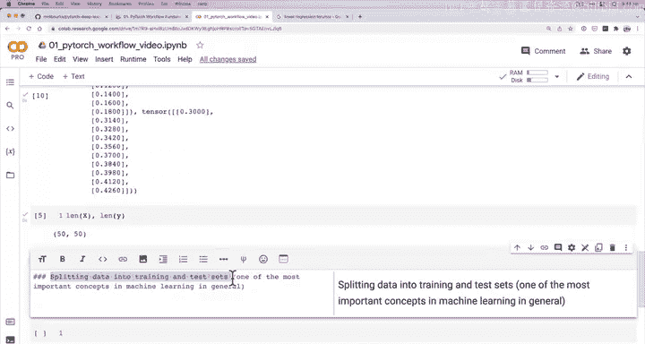
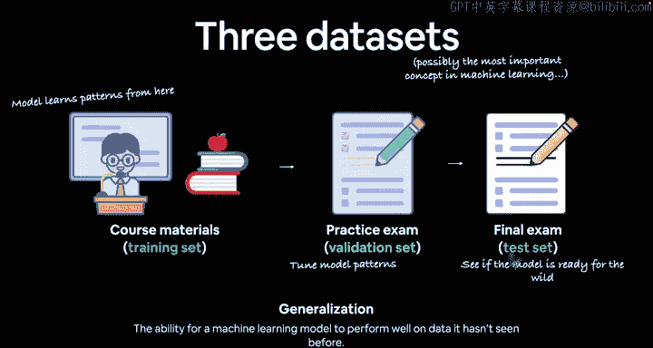
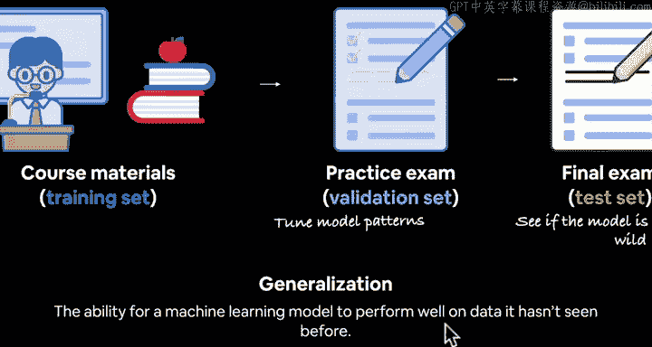
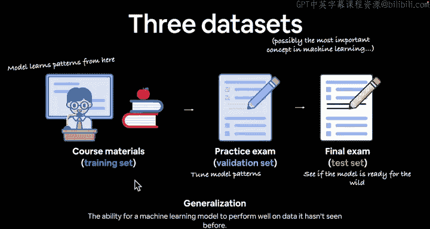
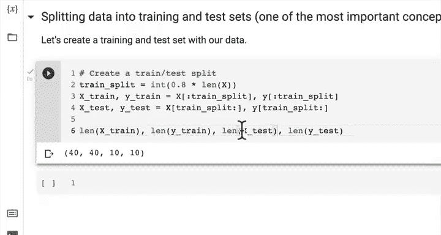
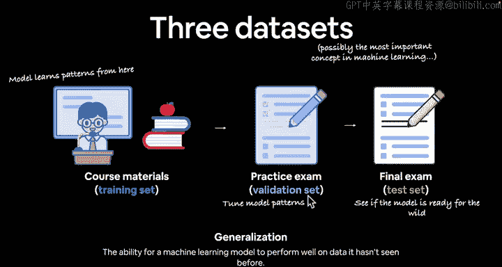
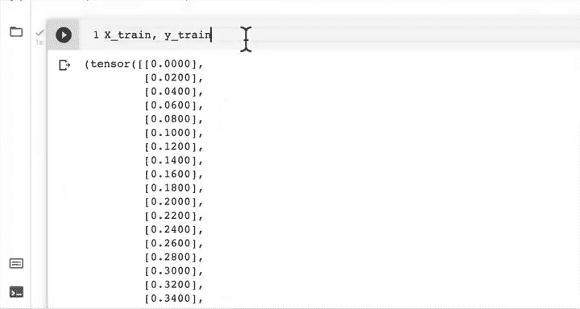
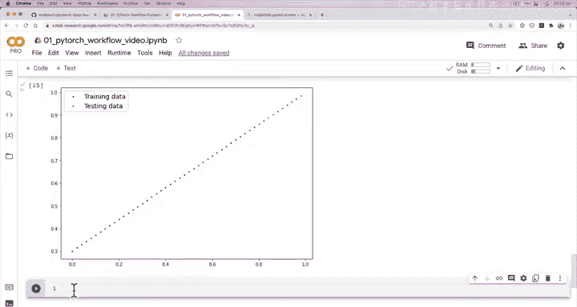
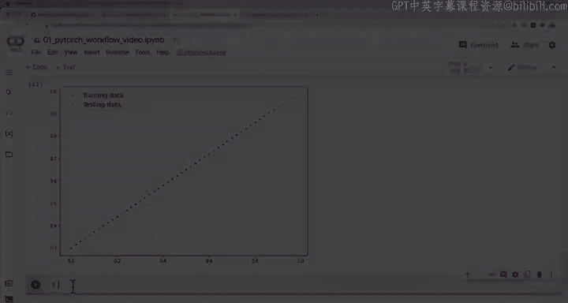

#  32：创建训练集与测试集（机器学习中最核心的概念）📊

## 概述

在本节课中，我们将学习机器学习中最核心的概念之一：将数据划分为训练集和测试集。我们将通过一个简单的线性回归数据示例，手动创建这两个数据集，并学习如何可视化它们，为后续构建模型做好准备。

---



## 从已知数据出发

上一节我们使用线性回归公式 `y = weight * x + bias` 和一些已知参数创建了一些数据点。

虽然涉及的内容不少，但这没关系。我们将继续在已学知识的基础上，通过实践来学习。

## 核心概念：数据划分

本节我们将介绍机器学习中一个普遍且极其重要的概念：将数据划分为训练集和测试集。

这确实是机器学习中最重要的概念之一。从数据的角度来看，这可能是你需要了解的头等大事。如果你有一些机器学习背景，可能已经对此非常熟悉，但我们仍将详细讲解。

让我们通过一些图示来理解。


我们关注的是这三个数据集。我在这里写下了可能是机器学习中最重要的概念，从数据视角看确实如此。

想象你在大学学习：
*   **课程材料** 就是你的 **训练集**，模型从这里学习模式。
*   **模拟考试** 就是 **验证集**，用于检验你是否学好了课程内容。对于模型，我们可能会根据验证集的表现来调整模型，然后重新训练，使其表现更好。
*   **期末考试** 就是 **测试集**，用于检验你是否掌握了整个课程材料，并且能够将所学知识应用到未见过的材料上。



这是一个关键点：当模型在课程材料（训练集）上学习时，它从未见过验证集或测试集的数据。

假设我们从一个包含100个数据点的数据集开始：
*   你可能使用其中70%的数据点作为训练材料。
*   使用15%的数据点作为模拟考试（验证集）。
*   使用15%的数据点作为期末考试（测试集）。





这个期末考试的目的，就像在大学里一样，是为了检验你是否从这些材料中学到了技能，是否准备好进入“现实世界”。因此，这个最终测试是为了检验模型的 **泛化能力**，因为它从未见过这些数据。


让我们定义 **泛化**：泛化是指机器学习模型或深度学习模型在未见过的数据上表现良好的能力。这正是我们的终极目标：我们希望在训练数据上构建一个机器学习模型，然后将其部署到应用或生产环境中。当新的、未见过的数据输入时，模型能够根据在训练集中学到的模式，对这些新数据做出决策。


请记住这三个数据集：**训练集**、**验证集**、**测试集**。

## 划分比例与常见实践

参考PyTorch书籍中关于数据划分的部分，我们将创建三个集合。但在我们的案例中，我们只创建两个：训练集和测试集。

为什么不总是需要验证集？验证集通常有使用场景，但最核心、始终使用的是训练集和测试集。

那么应该按多少比例划分呢？
*   对于训练集，通常占数据的 **60% 到 80%**。
*   如果创建验证集，通常占 **10% 到 20%**。
*   如果创建测试集，比例与验证集相似，也占 **10% 到 20%**。

总结：**训练集（始终需要）、测试集（始终需要）、验证集（经常需要，但非必须）**。

## 动手创建训练集和测试集

现在，让我们用我们的数据创建一个训练集和测试集。之前我们看到有50个数据点（X和Y），它们是一一对应的关系。

我们知道训练集通常占60%-80%，测试集占10%-20%。让我们取各自的上限：**80% 和 20%**，这是一个非常常见的划分比例（80/20）。



以下是创建划分的步骤：

1.  **计算训练集大小**：我们想要训练集占X长度的80%。

    ```python
    train_split = int(0.8 * len(X))  # 结果应为40个样本
    ```

2.  **创建训练集**：我们的模型将在这40个样本上训练，以预测另外10个样本。

    ```python
    X_train, y_train = X[:train_split], y[:train_split]
    ```



3.  **创建测试集**：

    ```python
    X_test, y_test = X[train_split:], y[train_split:]
    ```

创建训练和测试集的方法有很多，我们这里的方法很简单，因为我们的数据集本身很简单。我最喜欢的方法之一是Scikit-learn的 `train_test_split` 函数，它会在划分数据时加入一些随机性，我们将在后面的视频中看到它。




现在让我们检查一下数据形状：

```python
len(X_train), len(y_train), len(X_test), len(y_test)
```

结果应该是 `(40, 40, 10, 10)`。很好，我们有40个训练特征和标签，10个测试特征和标签。


本质上，我们在这里创建了一个训练集。我们划分了数据。训练集也可以被称为训练划分。这是机器学习中同一事物有不同名称的又一个例子。集合、划分，是同一回事。训练划分、测试划分，这就是我们创建的东西。

记住，验证集经常使用但并非总是必需。由于我们的数据集相当简单，我们只保留必需品：训练集和测试集。但请务必牢记这一点。


你在机器学习中最大、最大、最大的障碍之一将是创建合适的训练集和测试集。因此，这是一个非常重要的概念。

## 可视化数据

上节课我提出了一个挑战：将这些数字可视化。我们这节课还没做。所以接下来让我们朝这个方向努力。请思考一下，你如何能让这些数据更直观？目前它们只是页面上的数字。

也许 Matplotlib 可以帮忙。


让我们来探索一下。

欢迎回来。上一节我们将数据划分为训练集和测试集。稍后，我们将构建一个模型来学习训练数据中的模式，以关联测试数据。但正如我所说，目前我们的数据只是页面上的数字，很难理解。你可能能理解，但我更喜欢可视化。让我们把它写下来。

**我们如何更好地可视化数据？**

这就是数据探索者的座右铭：可视化，可视化，再可视化。如果你不理解一个概念，对我来说，开始理解它的最佳方法之一就是将其可视化。

所以，让我们编写一个函数来实现这个目的。我们称之为 `plot_predictions`。稍后我们会明白为什么这样命名。制作这些视频的好处是我对未来有计划，尽管看起来我像是在即兴发挥。这里有一些幕后工作在进行。

我们将定义以下函数：

```python
def plot_predictions(train_data=X_train,
                     train_labels=y_train,
                     test_data=X_test,
                     test_labels=y_test,
                     predictions=None):
    """
    绘制训练数据、测试数据并比较预测结果。
    """
    plt.figure(figsize=(10, 7)) # 设置图形大小

    # 用蓝色散点图绘制训练数据
    plt.scatter(train_data, train_labels, c="b", s=4, label="Training data")

    # 用绿色散点图绘制测试数据
    plt.scatter(test_data, test_labels, c="g", s=4, label="Testing data")

    # 如果有预测，用红色散点图绘制预测结果
    if predictions is not None:
        plt.scatter(test_data, predictions, c="r", s=4, label="Predictions")

    plt.legend(prop={"size": 14}) # 显示图例
```

现在，让我们试试这个函数。记住，我们已经在函数参数中硬编码了输入，所以我们实际上不需要向函数输入任何东西。我们的训练和测试数据已经准备好了。如果有疑问，就运行代码。让我们看看效果。

我们是否在 `plot_predictions` 函数中犯了错误？你可能已经发现了。

运行 `plot_predictions()`。



看，很漂亮。因为我们没有任何预测，所以没有红点。但这就是我们要做的。我们得到了一条简单的直线。你无法得到比这更简单的数据集了。

我们有蓝色的训练数据和绿色的测试数据。所以，我们要用机器学习模型做的事情的整体思路是：我们实际上并不需要为这个构建一个机器学习模型，我们可以做其他事情，但机器学习很有趣。因此，我们将接收蓝点（训练数据）。这里有一个明显的模式，对吧？这是X和Y之间的关系。我们将构建一个模型来尝试学习这些蓝点的模式，这样，如果我们把绿点的X值（测试数据）输入模型，它能否预测出相应的Y值？因为记住，这些是测试数据集。

所以，**蓝点是输入，绿点是理想的输出**。一个完美的模型的红点会覆盖在绿点之上。这就是我们将努力实现的目标。

我们知道X和Y之间的关系。我们怎么知道的？我们在上面设置了它。这是我们的权重和偏置。我们创建了那条直线：`y = weight * x + bias`，这是线性回归公式的简单版本，也就是你可能在高中代数中学过的 `y = mx + c`（斜率加截距）。



这就是我们所拥有的。


## 总结


本节课我们一起学习了机器学习中最核心的概念之一：**数据划分**。我们了解了**训练集**、**验证集**和**测试集**的作用与区别，并重点实践了如何将数据划分为训练集和测试集（80/20比例）。我们还编写了一个可视化函数，将训练数据（蓝色）和测试数据（绿色）清晰地展示出来，直观地理解了模型的任务：学习训练数据的模式，以预测测试数据的目标值。这为下一节我们正式构建模型奠定了坚实的基础。