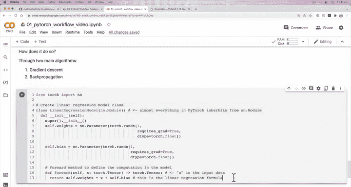
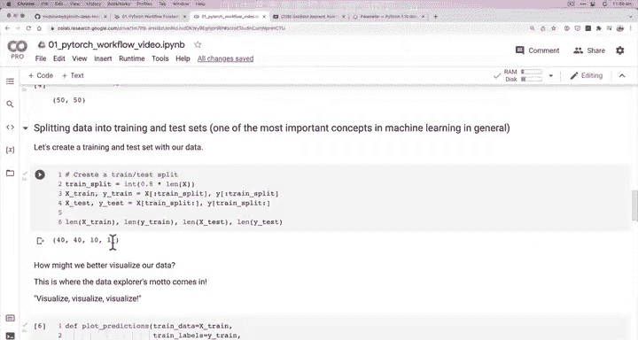
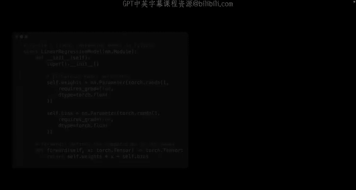
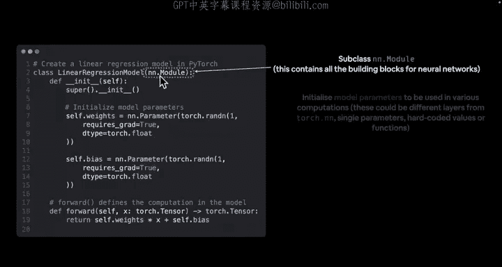
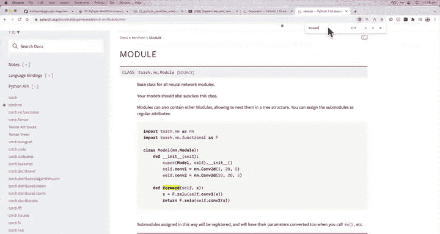
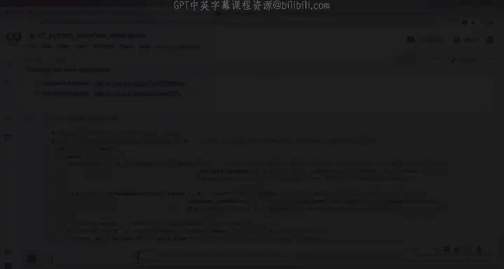

#  33：创建第一个 PyTorch 模型 🧠

在本节课中，我们将学习如何从零开始构建一个 PyTorch 模型。我们将创建一个简单的线性回归模型，并理解其背后的核心概念，如参数、前向传播以及 PyTorch 如何自动跟踪梯度。

---

## 概述

上一节我们学习了如何可视化数据。遵循数据探索者“可视化、可视化、再可视化”的格言，我们对训练数据和测试数据有了直观的了解。我们的目标是构建一个模型，学习训练数据中的模式（本质上是这里的上升趋势），以便能够预测测试数据。

现在，让我们开始构建我们的第一个 PyTorch 模型。

---

## 创建线性回归模型类

我们将直接进入代码。首先，创建一个线性回归模型类。如果你不熟悉 Python 类，不用担心，我会在编写代码时解释每一步。如果你想深入了解，我推荐阅读 Real Python 关于 Python 类和面向对象编程（OOP）的教程。

我们的模型类将继承自 `torch.nn.Module`。在 PyTorch 中，几乎所有模型组件都继承自 `nn.Module`。你可以把它想象成构建 PyTorch 模型的乐高积木，它包含了许多内置功能来帮助我们构建模型。

```python
import torch
from torch import nn

class LinearRegressionModel(nn.Module):
    def __init__(self):
        super().__init__()
        self.weights = nn.Parameter(torch.randn(1, requires_grad=True, dtype=torch.float))
        self.bias = nn.Parameter(torch.randn(1, requires_grad=True, dtype=torch.float))

    def forward(self, x: torch.Tensor) -> torch.Tensor:
        return self.weights * x + self.bias
```

### 代码解析

以下是代码中关键部分的解释：

1.  **继承 `nn.Module`**：我们的 `LinearRegressionModel` 类继承自 `nn.Module`，这是 PyTorch 中所有神经网络模块的基类。
2.  **`__init__` 方法（构造函数）**：在这里我们初始化模型的参数。
    *   `self.weights` 和 `self.bias`：我们使用 `nn.Parameter` 创建了两个参数。`nn.Parameter` 是一种特殊的张量，当它被赋值给一个模块属性时，会自动被添加到该模块的参数列表中，便于后续优化。
    *   `torch.randn(1)`：我们用随机数初始化这些参数。模型的目标就是从这些随机值开始学习。
    *   `requires_grad=True`：这告诉 PyTorch 需要跟踪这些参数的梯度，这是实现梯度下降和反向传播所必需的。
    *   `dtype=torch.float`：将数据类型设置为 PyTorch 默认的 32 位浮点数。
3.  **`forward` 方法**：这个方法定义了模型的前向计算，即输入数据如何通过模型得到输出。
    *   它接收一个输入张量 `x`。
    *   计算并返回 `self.weights * x + self.bias`。这正是线性回归的公式：**`y = weight * x + bias`**。

---

## 模型的工作原理

为了理解模型在做什么，让我们回顾一下我们是如何创建数据的。我们使用了已知的 `weight` 和 `bias` 参数，通过公式 **`y = weight * x + bias`** 生成了目标值 `y`。

我们模型的目标是：
1.  从随机的 `weight` 和 `bias` 值开始。
2.  查看训练数据。
3.  通过算法调整这些随机值，使它们尽可能接近（甚至完全等于）我们用来创建数据的那个“理想”的 `weight` 和 `bias`。

这就是机器学习的核心前提。

### 关键算法

模型通过两个主要算法来调整参数：

1.  **梯度下降**：一种优化算法，用于找到最小化损失函数的参数值。
2.  **反向传播**：一种有效计算梯度的方法，这些梯度指明了每个参数应该如何调整。




幸运的是，PyTorch 的 `torch.autograd` 模块在背后为我们自动实现了这些算法。我们编写的高级代码（如定义模型和损失函数）会触发这些底层机制。

---

## 检查模型内容并进行预测

创建模型后，下一步是检查其内容并用它进行预测。这能帮助我们更具体地理解模型。



我们可以实例化模型，并查看其参数：

```python
# 创建模型实例
model_0 = LinearRegressionModel()

# 查看模型参数
print(list(model_0.parameters()))
# 输出参数名和值
print(model_0.state_dict())
```





我们也可以尝试用模型进行预测（尽管参数还是随机的，预测不会准确）：

```python
# 用模型进行预测（前向传播）
with torch.inference_mode(): # 或 torch.no_grad()，用于不跟踪梯度的推理
    y_preds = model_0(X_test)
print(f"Number of testing samples: {len(X_test)}")
print(f"Number of predictions made: {len(y_preds)}")
print(f"Predicted values:\n{y_preds}")
```

---

## 总结



本节课我们一起学习了如何创建第一个 PyTorch 模型。我们：

1.  构建了一个继承自 `nn.Module` 的 `LinearRegressionModel` 类。
2.  在 `__init__` 方法中使用 `nn.Parameter` 定义了模型的参数（`weights` 和 `bias`），并设置 `requires_grad=True` 以启用梯度跟踪。
3.  在 `forward` 方法中定义了模型的计算逻辑，即线性回归公式。
4.  理解了模型的目标：从随机参数开始，通过查看数据并利用梯度下降和反向传播算法，使参数逼近真实值。
5.  简要介绍了如何检查模型状态并进行初步预测。



在接下来的课程中，我们将学习如何训练这个模型，即使用数据、损失函数和优化器来更新这些随机参数，使模型的预测变得越来越准确。