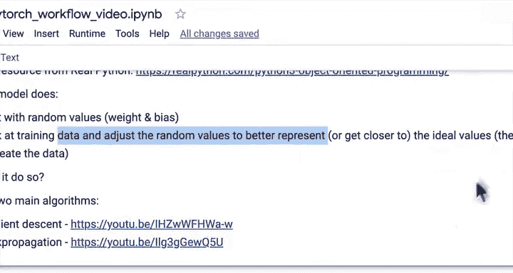
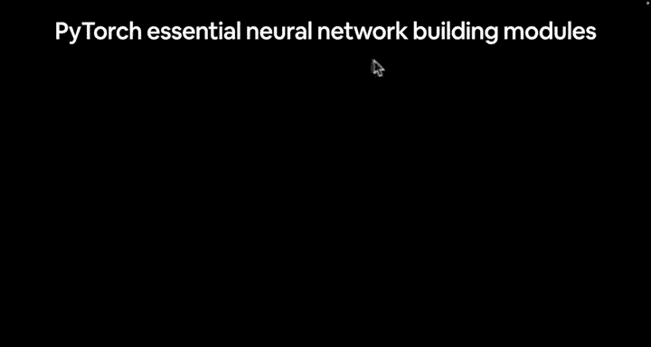
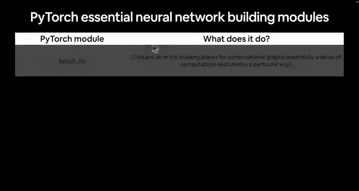

# 34：讨论重要的模型构建类 🧱

在本节课中，我们将要学习PyTorch中用于构建神经网络模型的核心类。理解这些基础组件是掌握PyTorch的关键。

上一节我们创建了第一个PyTorch模型。现在，我们来深入了解一下构成PyTorch模型的基础类。

## 核心模型构建类

以下是构建PyTorch神经网络时最常使用的一些核心类。

### `torch.nn`
`torch.nn` 包含了构建计算图（即神经网络）所需的所有基础模块。可以将神经网络视为一个计算图。

### `torch.nn.Parameter`
`torch.nn.Parameter` 定义了模型应该尝试学习的参数。通常，PyTorch的层（来自 `torch.nn`）会自动为我们设置这些参数。

### `torch.nn.Module`
`torch.nn.Module` 是所有神经网络模块的基类。如果你继承了这个类，就必须重写 `forward` 方法。这个方法定义了模型的前向计算过程。

例如，在我们的线性回归模型中，`forward` 方法接收数据并执行 `y = weight * x + bias` 的计算。随着模型变得复杂，前向计算也可以变得非常复杂。

### `torch.optim`
`torch.optim` 包含了PyTorch中的优化器，它们用于协助梯度下降。优化器的作用是：模型从随机参数值开始，通过观察训练数据，利用优化算法将随机值调整到更接近理想值，从而更好地拟合数据。

### `torch.utils.data`
我们尚未详细讨论这个模块，它包含 `Dataset` 和 `DataLoader` 等类。当处理更复杂的数据集（而非我们目前使用的50个整数的简单直线数据）时，这些工具将非常有用。

## 重要资源：PyTorch速查表

为了更全面地了解PyTorch，我推荐参考PyTorch官方速查表。本课程并非文档的替代品，而是帮助你熟悉PyTorch的路径。速查表涵盖了导入语句、`Dataset`、`DataLoader`、`torch.jit`脚本和JIT神经网络API等广泛内容。

我们在这里介绍了最基础的部分，PyTorch库非常庞大。作为本课的延伸学习，你可以花5到10分钟浏览速查表，无需立即全部理解，我们将在后续的代码实践中逐渐熟悉它们。

本节课中我们一起学习了PyTorch模型构建的核心类，包括 `torch.nn`、`torch.nn.Module`、`torch.optim` 和 `torch.utils.data`。理解这些类是构建和优化神经网络的基础。

在下一节课中，我们将实际创建一个线性回归模型的实例，并观察其运行结果。