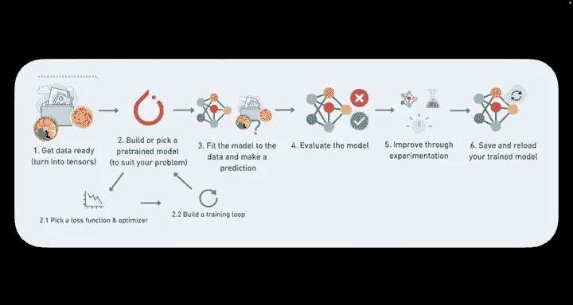
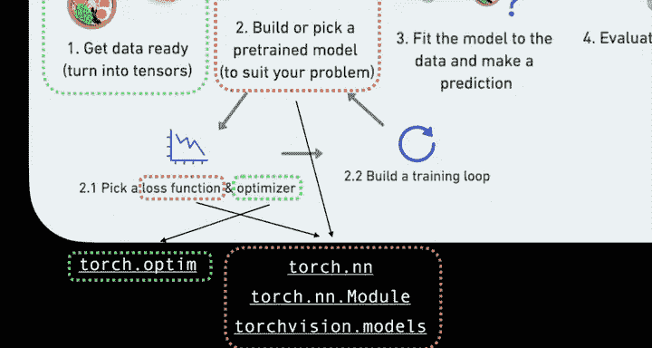
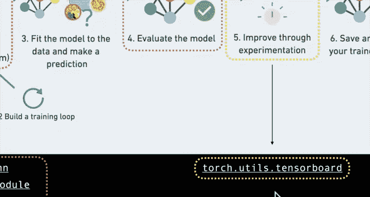
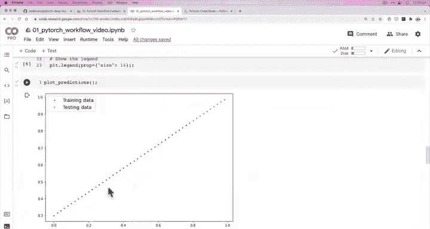
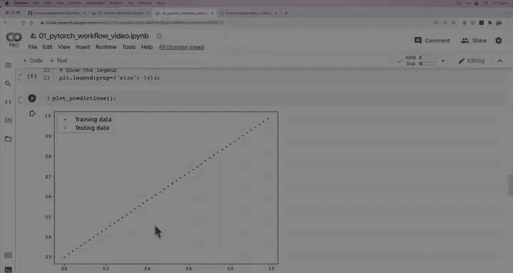

#  35：检查模型内部结构 🔍


在本节课中，我们将学习如何检查我们构建的第一个 PyTorch 模型的内部结构，理解其参数，并了解深度学习模型工作的基本原理。

上一节我们介绍了 PyTorch 模型构建的基本要素。本节中，我们来看看如何深入探究我们刚刚构建的线性回归模型内部。

## 准备工作与模型构建流程回顾

在深入检查模型之前，我们先回顾一下 PyTorch 的工作流程和核心模块。




以下是构建 PyTorch 模型时常用的一些重要模块：

*   **准备数据**：`torchvision.transforms`（用于计算机视觉）、`torch.utils.data.Dataset`、`torch.utils.data.DataLoader`。
*   **构建或选取模型**：`torch.nn`（用于构建模型）、`torchvision.models`（包含预训练的计算机视觉模型）。
*   **优化模型参数**：`torch.optim`。
*   **评估模型**：`torchmetrics`。
*   **改进实验**：`torch.utils.tensorboard`。



现在，让我们更深入地了解我们构建的第一个模型。

## 检查模型参数

我们已经创建了一个模型。现在看看它内部有什么。你可能已经根据我们在构造函数和 `forward` 函数中创建的内容猜到了。



那么，你认为我们的模型内部有什么？你又会如何查看呢？

我们可以使用 `.parameters()` 方法来检查模型的参数或内部结构。

这个方法简单直接。让我们来试试看。

首先，为了确保结果可复现，我们将设置一个随机种子。这是因为我们使用随机值初始化了模型的参数。如果不设置种子，每次运行都会得到不同的值。出于教学目的，我们在这里设置手动种子。

```python
torch.manual_seed(42)
```

接下来，创建我们模型类的一个实例。我们称它为 `model_0`，因为它是我们在这个课程中创建的第一个模型。

```python
model_0 = LinearRegressionModel()
```

现在，如果我们直接打印 `model_0`，它不会显示太多信息。我们想了解其内部情况。

检查参数：

```python
model_0.parameters()
```

这会返回一个生成器。为了更好地查看，我们将其转换为列表。

```python
list(model_0.parameters())
```

你会看到类似“Parameter containing...”的输出，后面跟着张量值，并且 `requires_grad=True`。这些就是我们的模型参数。

这些值之所以是随机的，是因为我们使用了 `torch.randn` 来初始化它们。设置随机种子后，你应该能得到与我相似的值。如果没有，可能是因为 PyTorch 版本更新导致随机数计算方式略有不同。

为了更好地理解，我们可以查看模型的状态字典，它会以字典形式给出模型的参数。

```python
model_0.state_dict()
```

你会看到包含 `weights` 和 `bias` 的字典，它们的值是随机的。`weights` 和 `bias` 这两个名称来源于我们在模型类构造函数中定义的 `self.weights` 和 `self.bias`。

## 深度学习的核心原理

我们整个目标是什么？我们的目标是编写代码，让模型能够观察数据（例如之前图表中的蓝点），并调整这个权重和偏置值，使其尽可能接近理想的权重和偏置值。

我们如何从这里的随机值调整到接近理想值呢？我们将在未来的视频中看到。这些值越接近理想值，我们就越能更好地预测和建模我们的数据。

**这个原理是深度学习的整个基础**。

我们以一些随机值开始，然后利用梯度下降和反向传播，以及我们正在处理的数据，将这些随机值移动到尽可能接近理想值的位置。在大多数情况下，你并不知道理想值是什么。但在我们这个简单的例子中，我们已经知道了理想值。

请务必记住：**深度学习的前提是从随机值开始，并使它们更具代表性，更接近理想值**。

## 下一步：使用模型进行预测

说到这里，让我们尝试用我们当前的模型（它拥有随机参数）进行一些预测。你认为预测结果会怎样？

在下一节视频中，我们将在测试数据上进行一些预测，看看它们的效果如何。





本节课中我们一起学习了如何检查 PyTorch 模型的内部参数，理解了模型参数初始化的随机性，并掌握了深度学习模型从随机参数开始并通过学习逼近理想值的基本工作流程。这是理解后续训练和优化步骤的重要基础。