#  36：使用我们的模型进行预测 📊

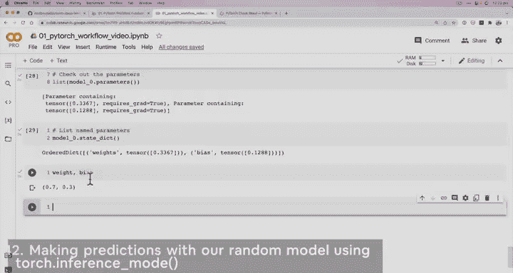

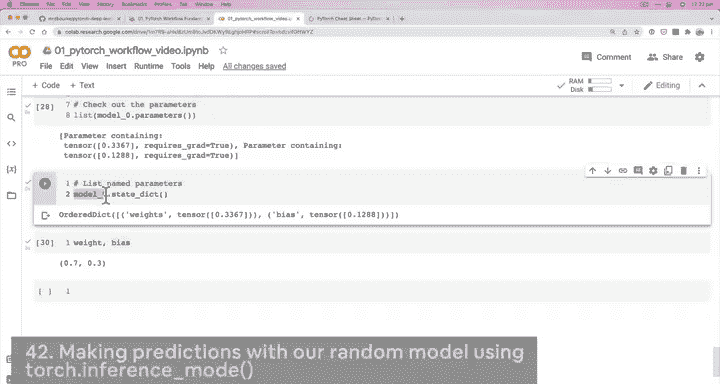

在本节课中，我们将学习如何使用我们刚刚创建的 PyTorch 模型进行预测。我们将看到，由于模型参数是随机初始化的，其初始预测能力非常差。同时，我们还将介绍一个重要的 PyTorch 工具——推理模式（`torch.inference_mode`）。

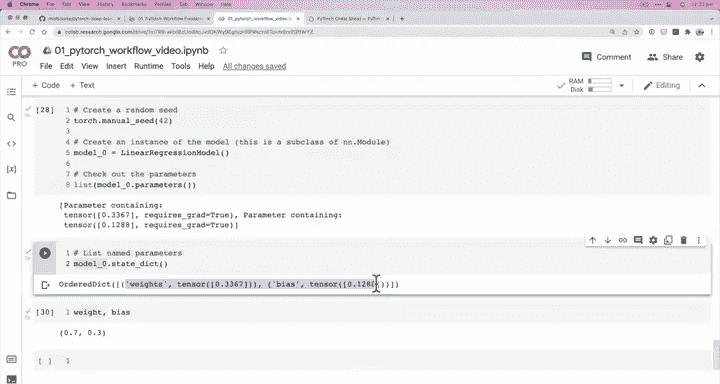

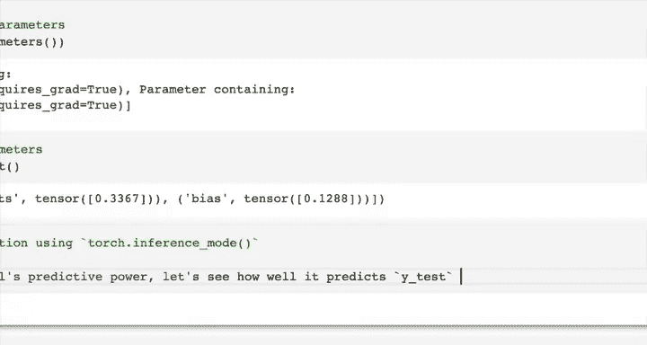

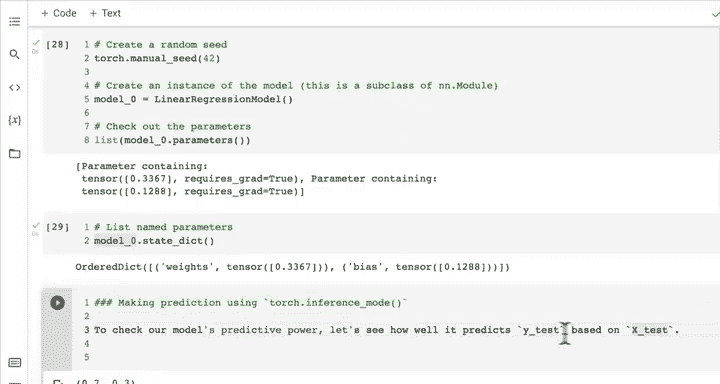

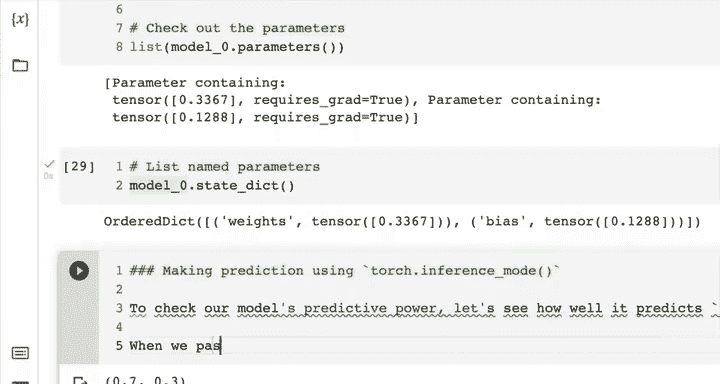

---

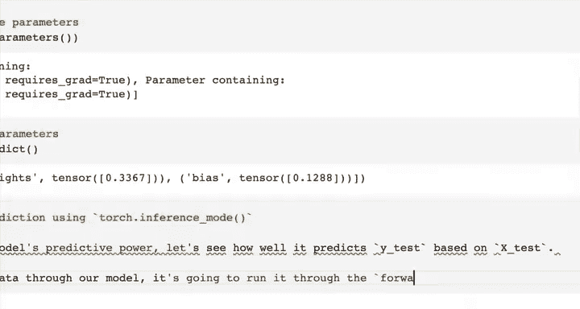

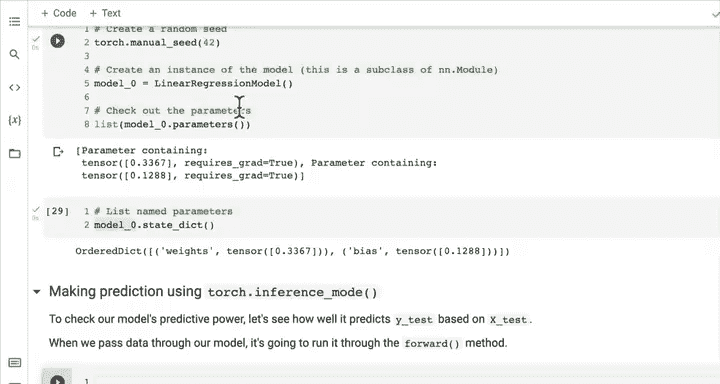

上一节我们探讨了模型内部的随机参数。本节中，我们来看看如何使用这个模型对测试数据进行预测，并评估其初始性能。

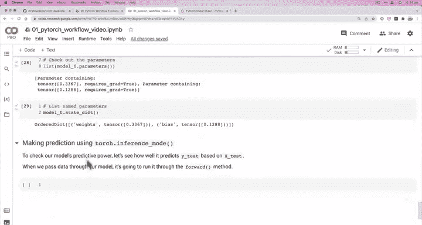

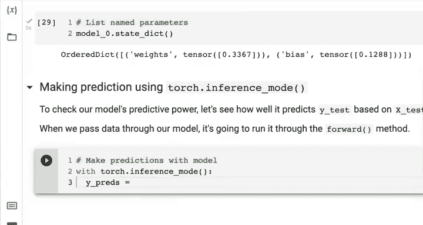

为了检查模型的预测能力，我们需要看看它在测试数据 `X_test` 上的表现如何。机器学习模型的核心前提是接收特征作为输入，并输出尽可能接近真实标签的预测值。

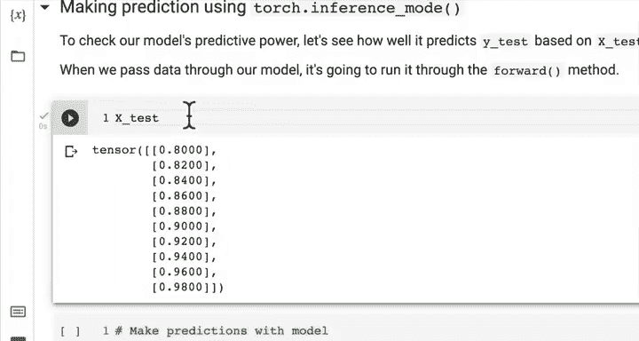

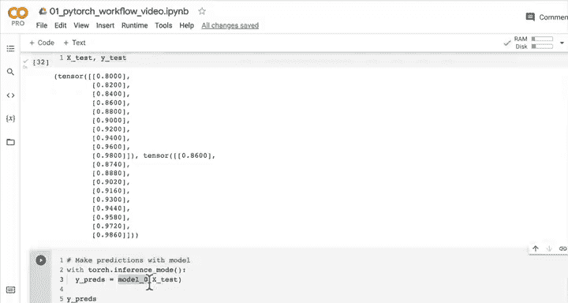

当我们把数据传入模型时，模型会调用其 `forward` 方法进行处理。以下是进行预测的代码：

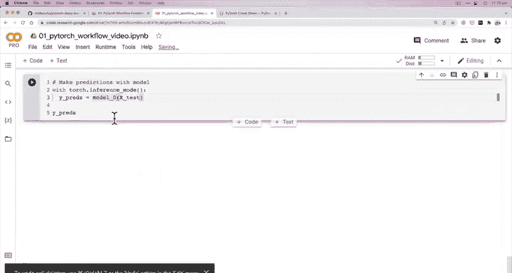

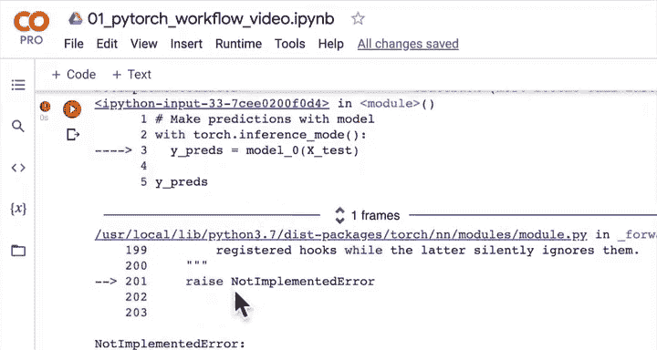

```python
with torch.inference_mode():
    y_preds = model_0(X_test)
```

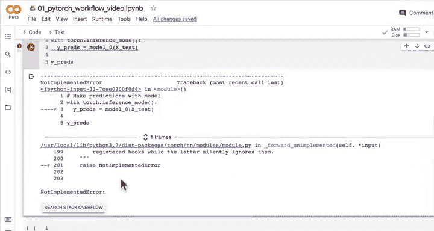

这里，`X_test` 是我们的输入特征，`y_preds` 将是模型生成的预测值。一个理想的模型应该能输出与 `Y_test` 完全相同的值。

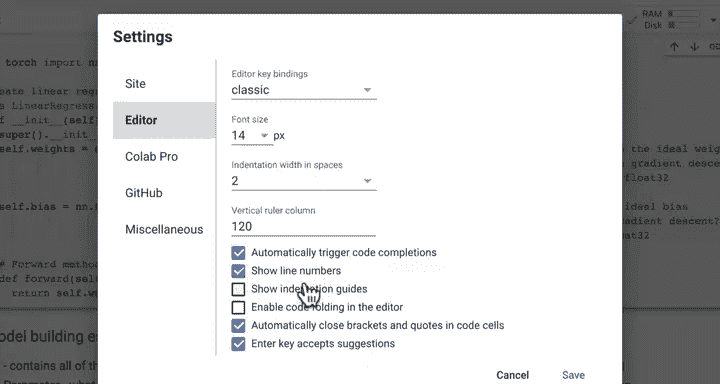

考虑到我们的模型参数是随机初始化的，你认为它的预测效果会如何？让我们来揭晓答案。

运行上述代码后，我们得到了预测值 `y_preds`。为了直观比较，我们可以将其与真实的 `Y_test` 进行可视化对比。

```python
plot_predictions(predictions=y_preds)
```

可视化结果显示，红色的预测点（`y_preds`）与绿色的真实点（`Y_test`）相距甚远。这证实了我们的猜想：一个由随机参数初始化的模型，其预测结果几乎是随机的，与理想状态相去甚远。

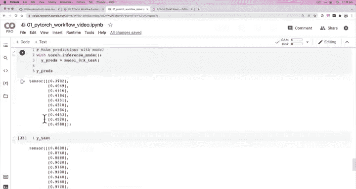

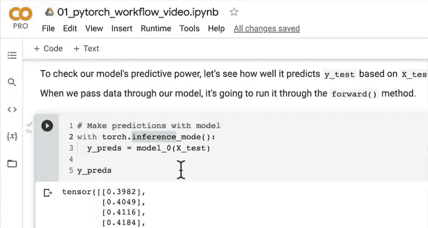

---

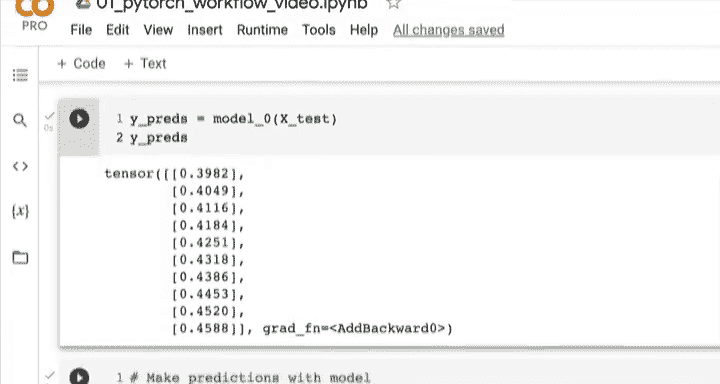

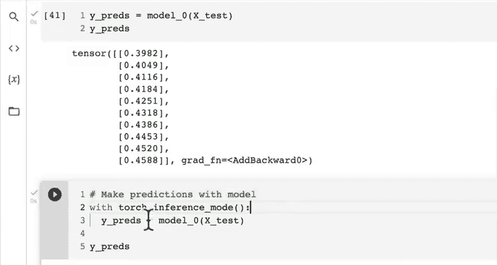

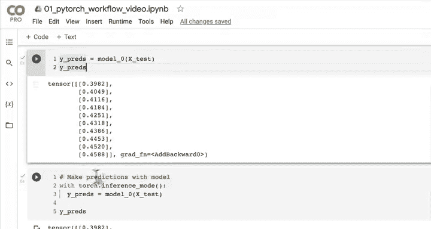

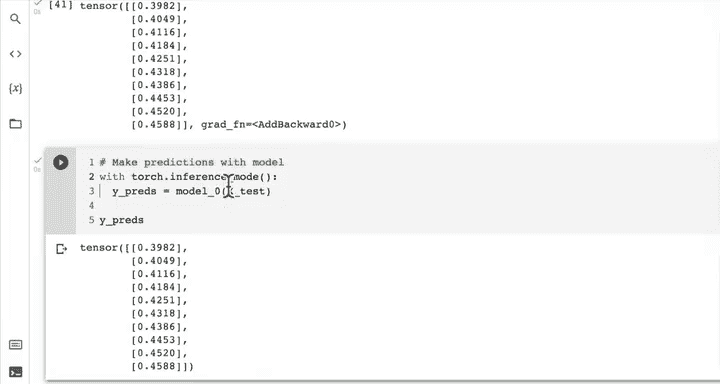

在编写预测代码时，我们使用了一个新工具：`torch.inference_mode()`。这是一个上下文管理器。我们也可以不使用它，直接调用模型：

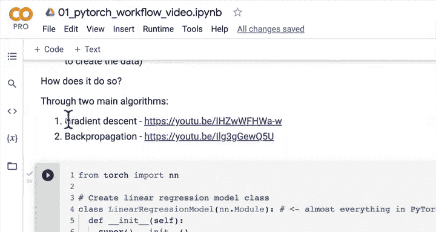

```python
y_preds = model_0(X_test)
```

但两者有一个关键区别。不使用推理模式时，输出张量会附带一个 `grad_fn` 属性，这意味着 PyTorch 仍在跟踪梯度，为反向传播做准备。然而，在进行预测（或称推理）时，我们并不需要更新模型参数，因此跟踪梯度是多余且耗费资源的。

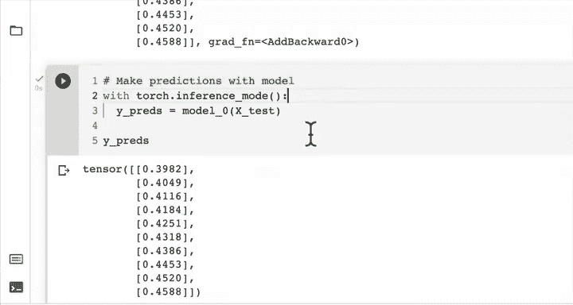

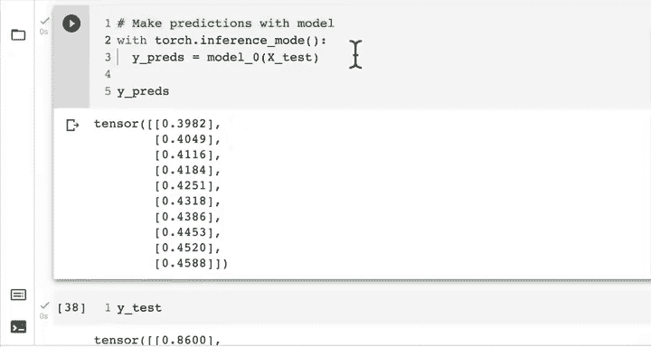

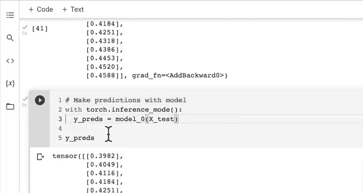

以下是 `torch.inference_mode()` 的主要优势：
*   **关闭梯度跟踪**：提升推理速度，减少内存占用。
*   **代码优化**：它是 PyTorch 中执行推理的首选方式。

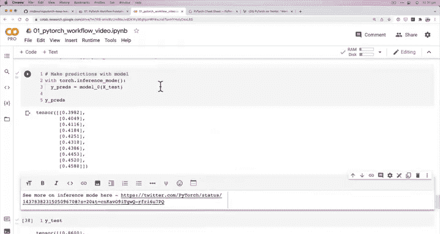

你可能会在旧代码中看到 `torch.no_grad()`，它也能达到类似关闭梯度的效果。但 `torch.inference_mode()` 是更新、更优的选择。

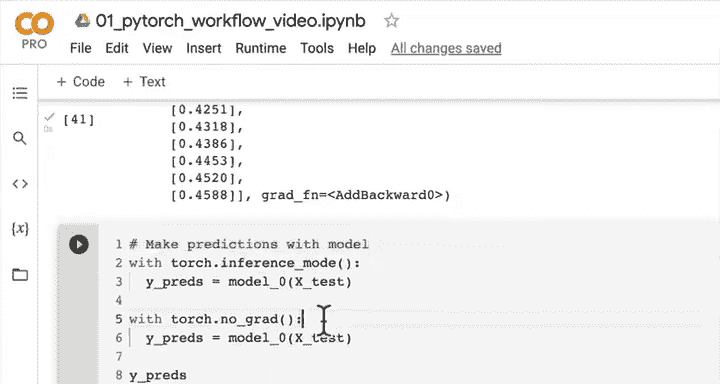


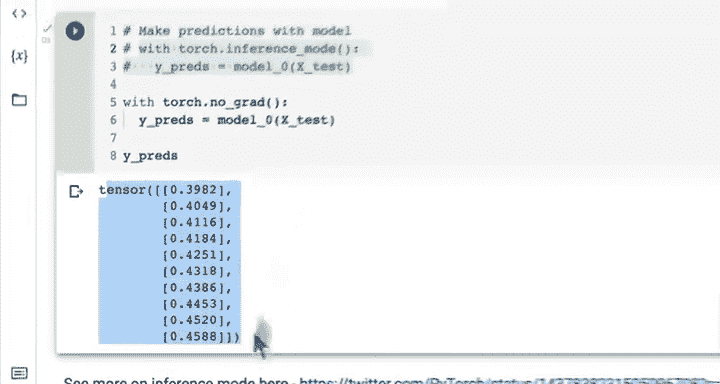

---

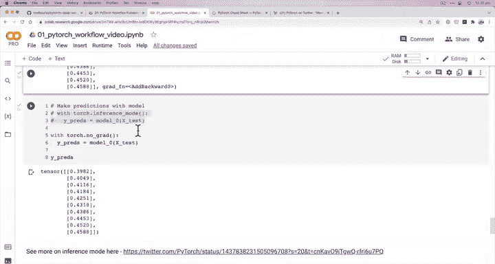

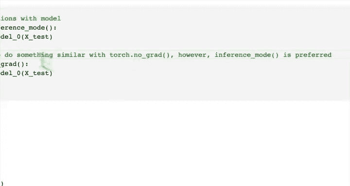

本节课中我们一起学习了如何使用 PyTorch 模型进行预测。我们发现，随机初始化参数的模型预测效果很差。同时，我们引入了 `torch.inference_mode()` 这个重要的上下文管理器，它能在推理时关闭梯度计算，从而提升代码效率。

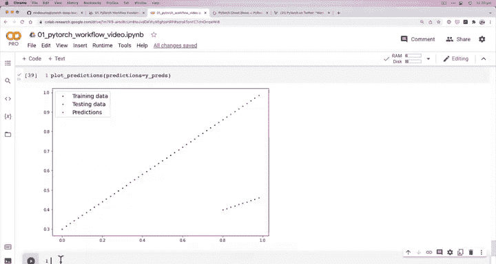

在接下来的课程中，我们将编写训练代码，通过查看训练数据来逐步调整模型的参数，让那些红色的预测点慢慢向绿色的真实点靠近。