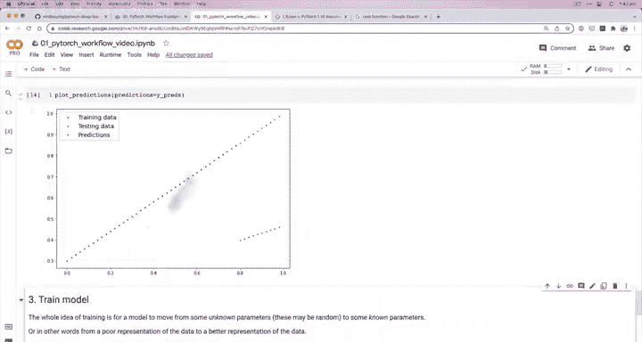
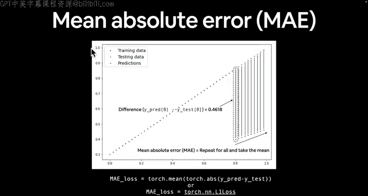
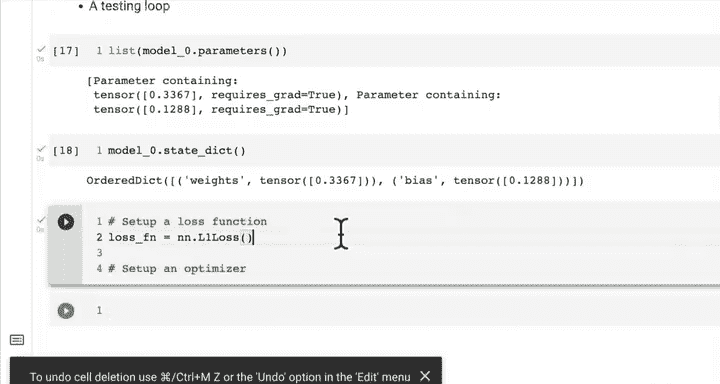
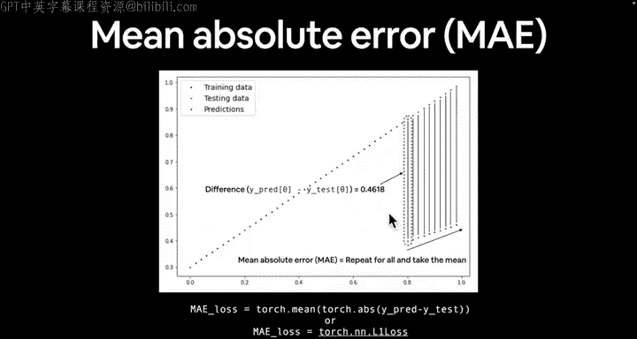
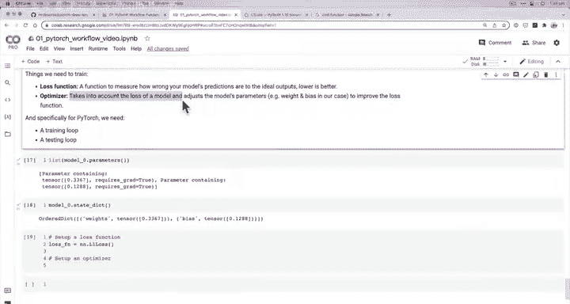
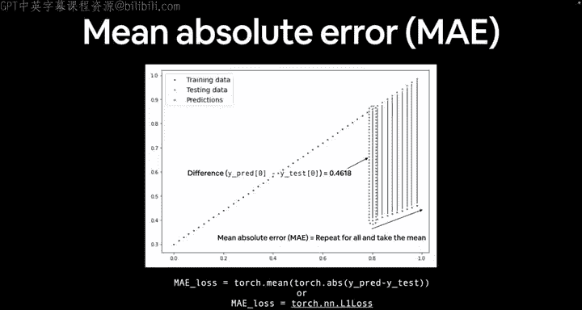
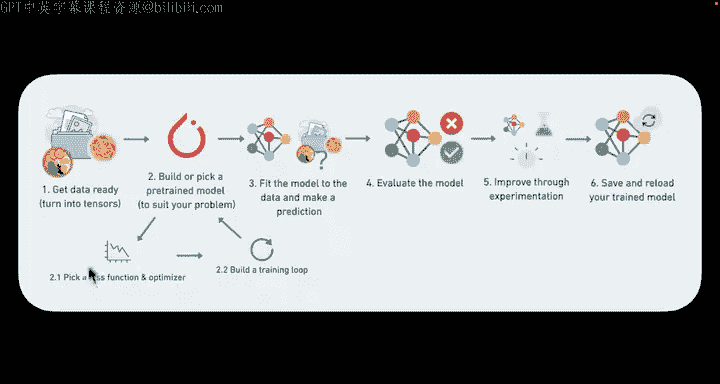
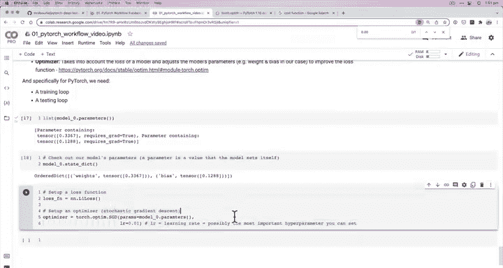

#  38：设置损失函数与优化器 🧠


在本节课中，我们将学习如何为PyTorch模型设置损失函数和优化器。这是训练循环的核心部分，它们共同作用，通过调整模型的参数来减少预测误差。

上一节我们介绍了模型参数的概念，本节中我们来看看如何衡量模型的错误并自动改进它。

## 损失函数：衡量模型的错误

损失函数的作用是量化模型预测值与真实值之间的差距。我们的训练目标就是最小化这个差距。

在PyTorch中，损失函数位于 `torch.nn` 模块下。对于我们的回归问题（预测一个数值），一个常见的选择是L1损失函数，它计算的是平均绝对误差。

**公式**：`MAE = mean(|y_pred - y_true|)`



以下是设置L1损失函数的代码：

```python
import torch.nn as nn



loss_fn = nn.L1Loss()
```

## 优化器：调整模型参数







优化器的工作是接收损失函数计算出的误差，并据此调整模型的参数（如权重和偏置），目标是找到能降低损失值的参数组合。





PyTorch的优化器位于 `torch.optim` 模块。随机梯度下降（SGD）是一种基础且常用的优化算法。

设置优化器需要两个关键参数：
1.  **`params`**: 要优化的模型参数。
2.  **`lr` (学习率)**: 一个最重要的超参数，它控制着优化器每次调整参数的步长大小。

以下是使用SGD优化器的代码：

```python
import torch.optim as optim

optimizer = optim.SGD(params=model.parameters(), lr=0.01)
```

## 核心概念总结

现在我们已经准备好了训练模型所需的关键组件：

*   **损失函数 (`loss_fn`)**：像一把尺子，测量模型预测的“错误”程度。
*   **优化器 (`optimizer`)**：像一位工程师，根据“尺子”的测量结果，小心翼翼地拧动模型内部的“螺丝”（参数），试图让模型变得更准确。

它们的关系是：优化器利用损失函数提供的反馈（误差）来指导参数更新的方向和幅度。

## 过渡到下一步

至此，我们已经成功设置了损失函数和优化器。在下一节课中，我们将把这些组件整合起来，构建一个完整的**训练循环**，亲眼见证我们的模型如何从随机猜测开始，一步步学习并改进它的预测能力。



本节课中我们一起学习了如何为PyTorch模型配置损失函数和优化器，理解了它们各自的作用以及如何协同工作，为实际的模型训练做好了准备。