# 39：PyTorch训练循环直观理解 🧠

在本节课中，我们将要学习PyTorch深度学习模型训练的核心部分——训练循环。我们将深入理解其背后的每一步骤，包括前向传播、损失计算、优化器梯度清零、反向传播以及参数更新。通过构建一个完整的训练循环，你将直观地看到模型是如何从随机参数开始，通过学习数据模式来改进其预测的。

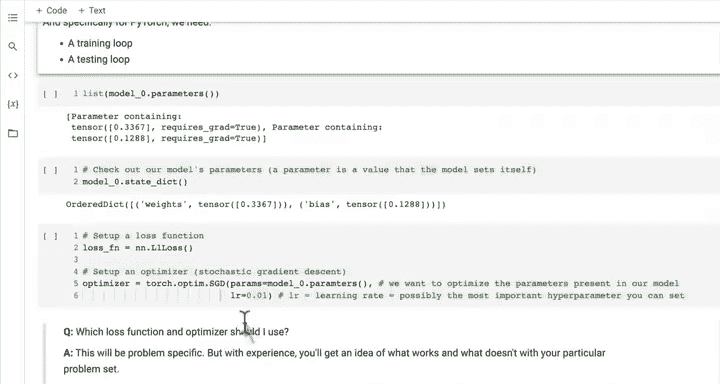

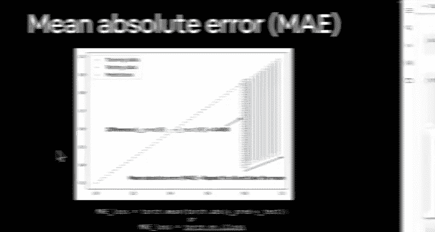

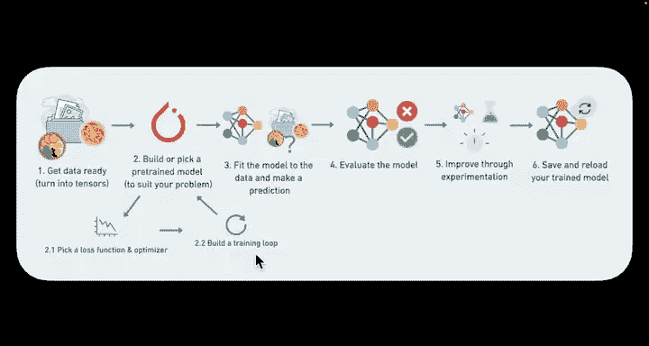

---

## 训练循环的步骤概述

上一节我们介绍了损失函数和优化器的作用。本节中，我们来看看如何将它们组合起来，构建一个完整的训练循环。

一个典型的PyTorch训练循环包含以下核心步骤：
1.  前向传播
2.  计算损失
3.  优化器梯度清零
4.  反向传播
5.  优化器参数更新

---

## 核心概念详解

### 1. 前向传播

前向传播是指数据从模型的输入层流向输出层的过程。在这个过程中，输入数据会经过模型中定义的所有计算函数（层），最终产生预测输出。

在代码中，这对应于调用模型的 `forward` 方法。例如，对于一个线性回归模型 `model0`，前向传播的代码是：
```python
y_pred = model0(X_train)
```
这行代码执行了我们在模型类中定义的 `forward` 函数，使用训练数据 `X_train` 来生成预测值 `y_pred`。

### 2. 计算损失

损失函数用于量化模型预测值与真实值之间的差距。在回归问题中，我们常使用平均绝对误差（MAE，在PyTorch中为 `L1Loss`）。

计算损失的公式为：
**loss = criterion(y_pred, y_train)**
其中 `criterion` 是我们之前定义的损失函数（如 `nn.L1Loss()`），`y_pred` 是模型预测，`y_train` 是真实标签。

### 3. 优化器梯度清零

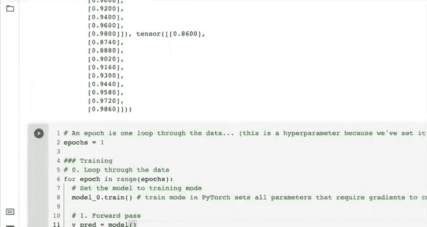

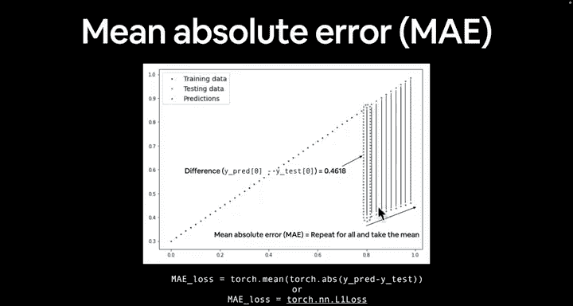

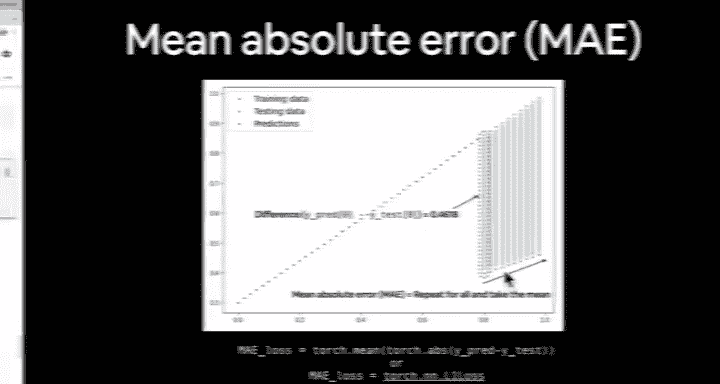

在开始新一轮的参数更新之前，必须将优化器中累积的梯度归零。这是因为默认情况下，PyTorch的梯度是累加的。如果不进行清零，下一次反向传播时计算出的梯度会与之前累积的梯度相加，导致参数更新方向错误。

代码实现为：
```python
optimizer.zero_grad()
```

### 4. 反向传播

反向传播是一个关键算法，它根据计算出的损失值，计算模型每个可训练参数相对于该损失的梯度。

梯度在数学上表示函数在某一点的斜率或变化率。在深度学习的语境下，损失函数相对于模型参数的梯度指明了为了减少损失，参数应该调整的方向和幅度。

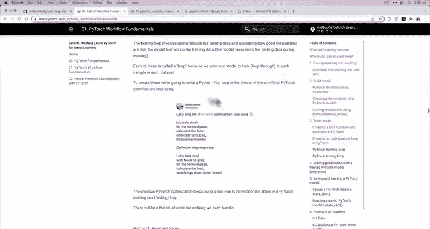

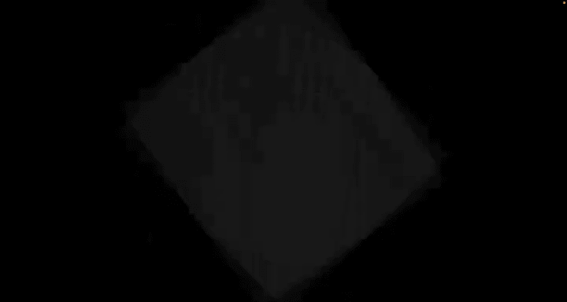

调用 `loss.backward()` 后，PyTorch的自动微分引擎（autograd）会自动为所有 `requires_grad=True` 的参数计算梯度。

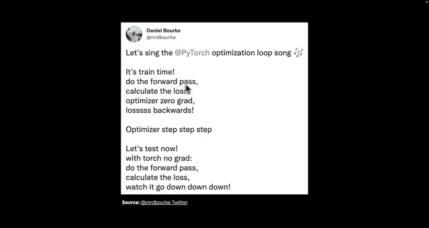

### 5. 优化器参数更新（梯度下降）

优化器利用反向传播计算出的梯度，按照指定的学习率来更新模型的参数，这个过程称为梯度下降。

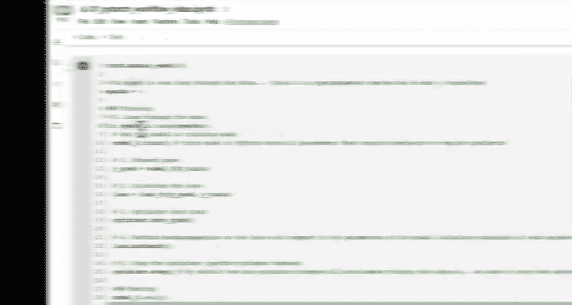

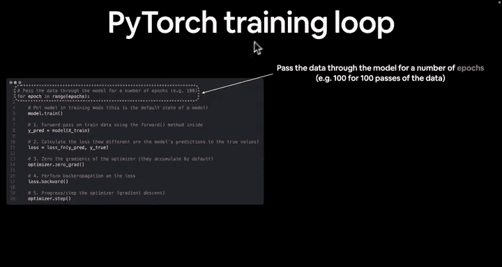

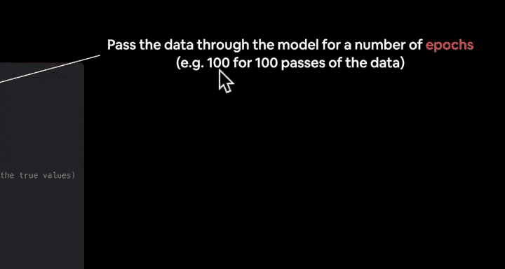

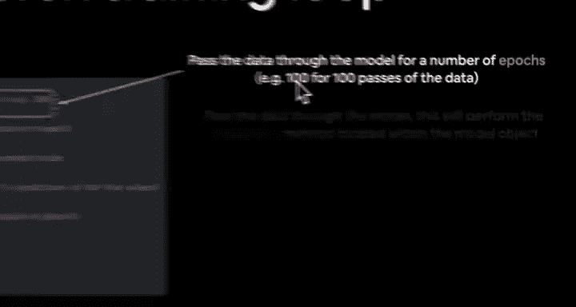

学习率是一个重要的超参数，它控制着每次参数更新的步长：
*   **小学习率**：更新步伐小，训练稳定但可能收敛慢。
*   **大学习率**：更新步伐大，可能收敛快但容易震荡或不稳定。

优化器更新参数的代码是：
```python
optimizer.step()
```

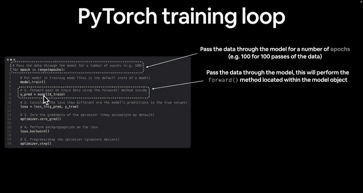

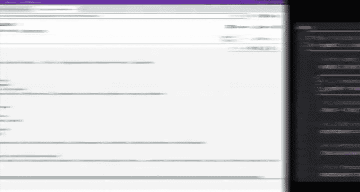

---

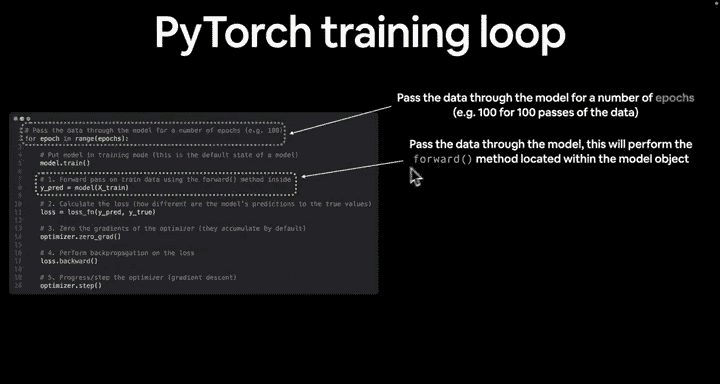

## 训练循环代码实现

以下是上述五个步骤组合成一个完整训练循环的代码框架：

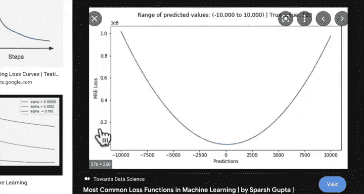

```python
# 设置训练轮数（epoch）
epochs = 100

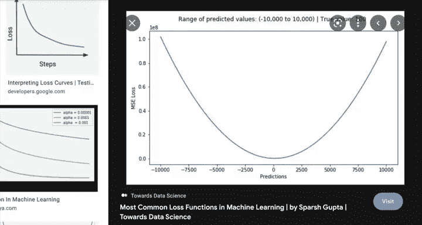

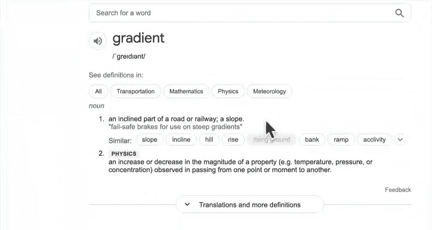

for epoch in range(epochs):
    # 1. 将模型设置为训练模式
    model0.train()

    # 2. 前向传播
    y_pred = model0(X_train)

    # 3. 计算损失
    loss = loss_fn(y_pred, y_train)

    # 4. 优化器梯度清零
    optimizer.zero_grad()

    # 5. 反向传播
    loss.backward()

    # 6. 优化器更新参数（梯度下降）
    optimizer.step()
```

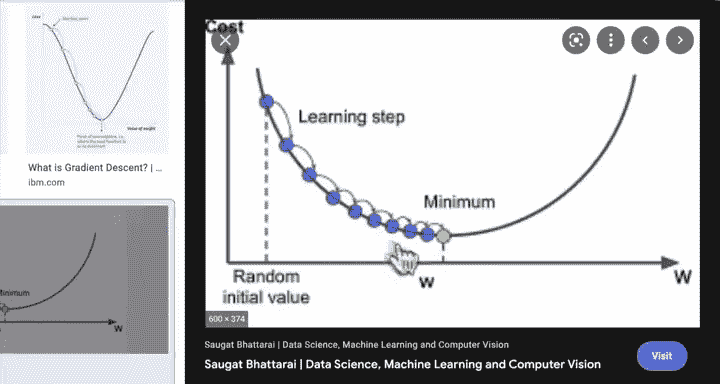

---

## 直观理解：梯度下降与学习率

为了更直观地理解训练过程，我们可以将损失函数想象成一座山。我们的目标是找到山谷的最低点（损失最小）。

*   **梯度**：相当于你所在山坡的陡峭程度和方向。
*   **反向传播**：相当于测量你周围每个方向的坡度。
*   **梯度下降**：相当于你朝着最陡的下坡方向迈出一步。
*   **学习率**：相当于你这一步迈出的距离。


如果学习率太小（小碎步），下山会很慢。如果学习率太大（大步跳跃），可能会越过谷底甚至导致发散。

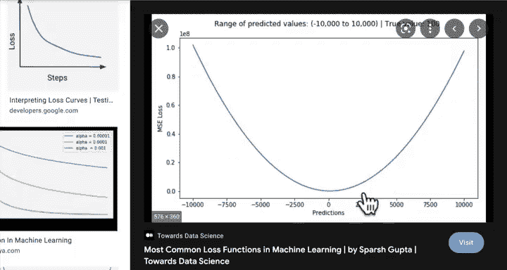

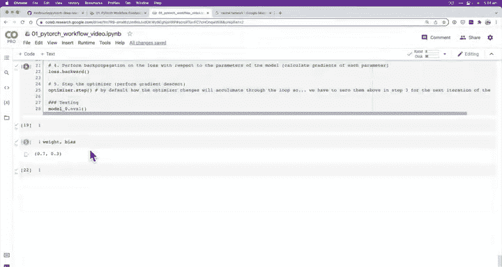

---

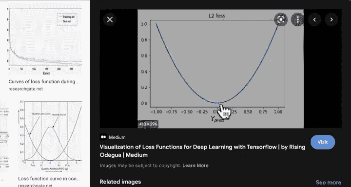

## 总结

本节课中我们一起学习了构建PyTorch训练循环的完整流程和其背后的直观原理。我们明确了训练循环的五个核心步骤：前向传播、计算损失、优化器梯度清零、反向传播和参数更新。我们还将梯度下降和学习率比喻为“下山”的过程，帮助你理解模型是如何通过迭代来最小化损失、学习数据中的模式的。掌握这个循环是理解深度学习模型如何工作的关键。在接下来的课程中，我们将在此基础上添加测试循环，并观察模型参数在训练过程中的实际变化。