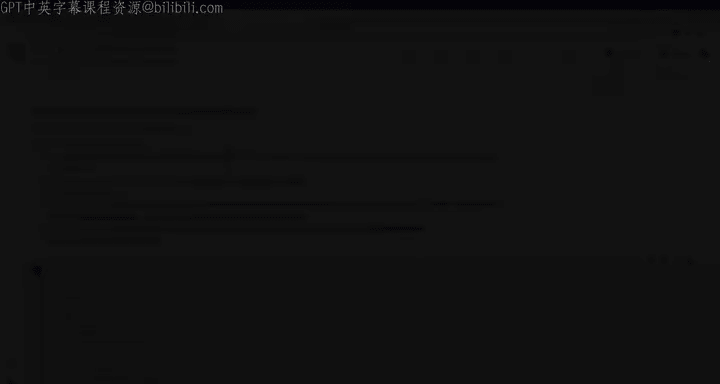
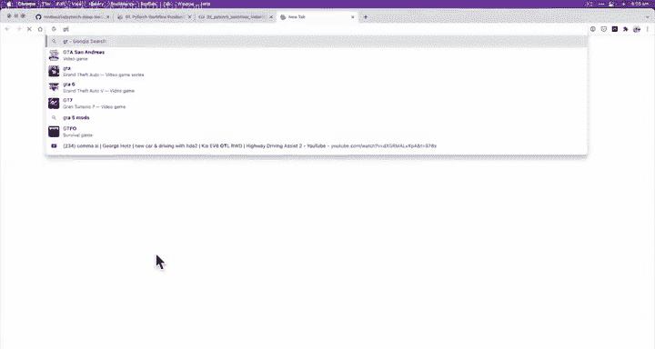
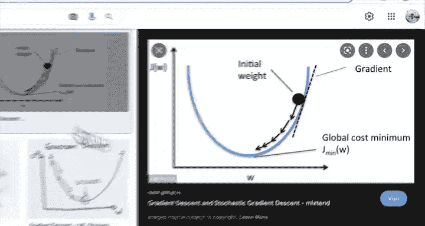
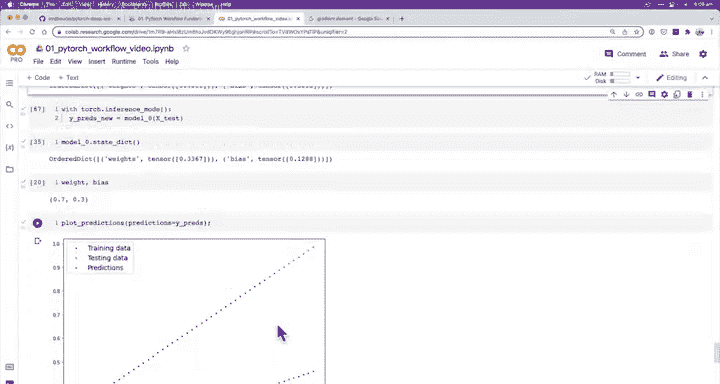

# 40：逐轮运行训练循环 🔄



在本节课中，我们将学习如何逐轮（epoch）运行训练循环，观察模型参数如何通过反向传播和梯度下降进行更新，从而使模型的预测结果逐渐接近真实值。

---

上一节我们介绍了训练循环和测试循环的基本概念。本节中，我们将实际操作，逐轮运行训练循环，直观地观察模型的学习过程。

## 准备模型与参数

首先，我们重新实例化模型，并查看其初始参数。这些参数是随机初始化的，因此模型的初始预测会很差。

```python
# 重新实例化模型
model_0 = LinearRegressionModel()

# 查看初始参数
print(model_0.state_dict())
```

初始参数可能类似于：权重 `3.3`，偏置 `0.1`。我们手动设置了这两个参数，但在后续更复杂的模型中，参数数量会多得多，且通常不会手动设置。

## 设置损失函数与优化器

接下来，我们设置损失函数和优化器。优化器将负责更新模型的参数（权重和偏置）。

```python
# 设置损失函数和优化器
loss_fn = nn.L1Loss()  # 用于回归问题的平均绝对误差损失
optimizer = torch.optim.SGD(params=model_0.parameters(), lr=0.01)
```

学习率设置为 `0.01`。学习率越大，优化器在每一步对参数的调整幅度就越大。

## 运行单个训练轮次

现在，我们运行一个完整的训练轮次（epoch），并观察参数的变化。

以下是单个训练轮次的步骤：
1.  前向传播：模型根据输入数据做出预测。
2.  计算损失：比较预测值与真实值，计算误差。
3.  优化器梯度清零：防止梯度累积。
4.  反向传播：计算损失相对于每个参数的梯度。
5.  优化器步进：根据梯度更新模型参数。

```python
# 运行一个训练轮次
model_0.train()  # 将模型设置为训练模式
y_pred = model_0(X_train)  # 1. 前向传播
loss = loss_fn(y_pred, y_train)  # 2. 计算损失
optimizer.zero_grad()  # 3. 梯度清零
loss.backward()  # 4. 反向传播
optimizer.step()  # 5. 更新参数

# 打印损失和更新后的参数
print(f"Loss: {loss}")
print(model_0.state_dict())
```

运行后，你会发现损失值下降，模型参数（权重和偏置）开始向真实值方向移动。

## 观察多轮训练效果

让我们手动运行多个轮次，观察损失持续下降和参数持续优化的过程。

每运行一次上述代码块（一个轮次），损失都应减少，参数都应更接近理想值。即使我们不知道真实问题的理想参数是什么，损失值的降低也明确指示模型正在改进。

## 梯度下降可视化



这个过程的核心是**梯度下降**。我们可以将其可视化：

*   **成本函数 J (即损失函数)**：我们想要最小化的目标。
*   **初始权重**：我们从随机值开始。
*   **梯度计算**：PyTorch 通过 `loss.backward()` 自动计算。
*   **参数更新**：优化器通过 `optimizer.step()` 沿梯度反方向更新参数，逐步走向成本函数的最小值。



公式上，参数更新遵循：`新参数 = 旧参数 - 学习率 * 梯度`

## 挑战：运行100个轮次

我给大家布置一个挑战：将上述训练循环代码放入一个 `for` 循环中，运行 **100 个训练轮次**。

```python
epochs = 100
for epoch in range(epochs):
    # 训练步骤代码（同上）
    model_0.train()
    y_pred = model_0(X_train)
    loss = loss_fn(y_pred, y_train)
    optimizer.zero_grad()
    loss.backward()
    optimizer.step()

    # 可选：每隔10轮打印一次损失
    if epoch % 10 == 0:
        print(f"Epoch: {epoch} | Loss: {loss}")
```

完成100轮训练后，使用模型对测试数据进行预测，并绘制结果图。你会发现，红色的预测点已经非常接近绿色的真实数据点。这证明了通过反向传播和梯度下降，模型成功地学习了数据中的模式。

---



本节课中我们一起学习了如何逐轮运行训练循环。我们看到了模型参数如何被更新，损失如何降低，以及预测结果如何随着训练逐渐改善。关键在于理解**前向传播、损失计算、反向传播和梯度下降**这一核心循环。下一节，我们将编写测试循环代码，来正式评估模型在未见数据上的表现。