# 41：编写测试循环代码 🧪

在本节课中，我们将学习如何为PyTorch模型编写测试循环代码。我们将看到如何评估模型在未见过的数据上的性能，并学习如何跟踪训练和测试过程中的关键指标。

---

## 概述

上一节我们介绍了训练循环，并看到了损失值如何下降。损失值衡量的是模型预测与理想值之间的差异。我们见证了模型通过反向传播和梯度下降的力量更新其参数，这一切都由PyTorch在幕后为我们处理。

本节中，我们来看看如何编写测试循环代码。测试循环用于评估模型在训练期间未见过的数据上的表现，这对于了解模型的泛化能力至关重要。

---

## 编写测试循环


以下是编写测试循环的步骤。我们将逐步构建代码，并解释每个部分的作用。


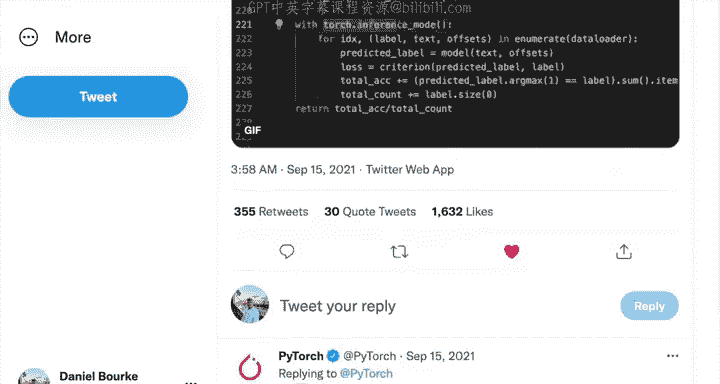

### 1. 设置模型为评估模式

首先，我们需要告诉模型我们即将进行评估或测试，而不是训练。这通过调用 `model.eval()` 方法实现。

```python
model.eval()
```

这个方法会关闭模型中那些在评估/测试时不需要的设置，例如Dropout层和BatchNorm层。在训练时，我们调用 `model.train()` 来确保模型处于训练模式。

### 2. 启用推理模式

接下来，我们使用 `torch.inference_mode()` 上下文管理器。这会关闭梯度跟踪以及其他一些在测试时不需要的后台功能，从而使代码运行得更快。

```python
with torch.inference_mode():
    # 测试代码将放在这里
```

你可能会在旧的PyTorch代码中看到 `with torch.no_grad():`，它实现类似的功能，但 `inference_mode` 是更优、更快的方式。

### 3. 执行前向传播

在推理模式下，我们将测试数据传递给模型以进行前向传播，并得到预测结果。

```python
test_preds = model_0(X_test)
```

### 4. 计算测试损失

然后，我们使用与训练时相同的损失函数来计算模型在测试数据上的损失。

```python
test_loss = loss_fn(test_preds, y_test)
```

测试损失衡量的是模型在从未见过的测试数据上的预测误差。理想情况下，我们希望这个值尽可能低。

### 5. 打印并跟踪结果

为了监控训练过程，我们可以定期（例如每10个epoch）打印出训练损失和测试损失。我们还可以将损失值记录到列表中，以便后续可视化。

```python
if epoch % 10 == 0:
    print(f"Epoch: {epoch} | Train loss: {loss:.5f} | Test loss: {test_loss:.5f}")

# 将值记录到列表中
epoch_count.append(epoch)
loss_values.append(loss.cpu().numpy())
test_loss_values.append(test_loss.cpu().numpy())
```

---

## 完整的训练与测试循环示例

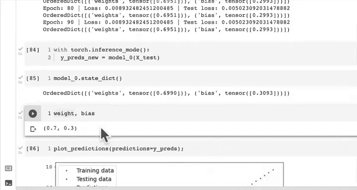

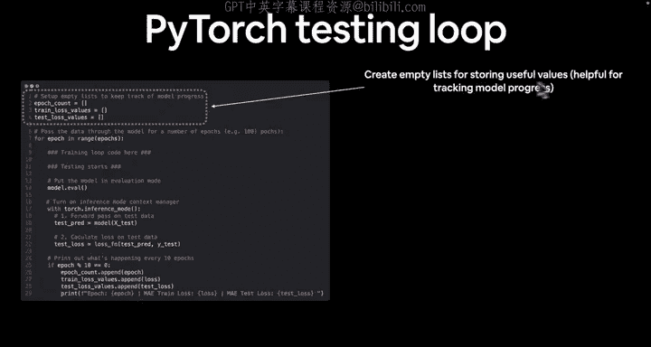

将以上步骤整合到我们的训练循环中，代码如下所示。我们训练模型200个epoch，并跟踪损失值。

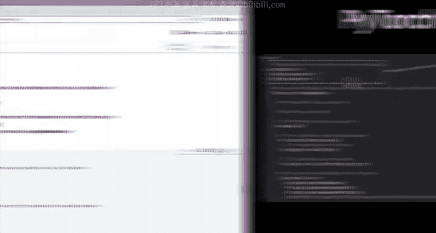

```python
import torch
import numpy as np
import matplotlib.pyplot as plt

# ... [模型和数据准备代码] ...

# 创建空列表用于跟踪值
epoch_count = []
loss_values = []
test_loss_values = []

# 训练循环
for epoch in range(200):
    # 训练模式
    model_0.train()
    
    # 1. 前向传播
    y_pred = model_0(X_train)
    
    # 2. 计算损失
    loss = loss_fn(y_pred, y_train)
    
    # 3. 优化器梯度清零
    optimizer.zero_grad()
    
    # 4. 反向传播
    loss.backward()
    
    # 5. 优化器步进
    optimizer.step()
    
    # 测试模式
    model_0.eval()
    with torch.inference_mode():
        # 1. 前向传播（测试数据）
        test_pred = model_0(X_test)
        # 2. 计算测试损失
        test_loss = loss_fn(test_pred, y_test)
    
    # 每10个epoch打印一次
    if epoch % 10 == 0:
        epoch_count.append(epoch)
        loss_values.append(loss.cpu().numpy())
        test_loss_values.append(test_loss.cpu().numpy())
        print(f"Epoch: {epoch} | Train loss: {loss:.5f} | Test loss: {test_loss:.5f}")
```

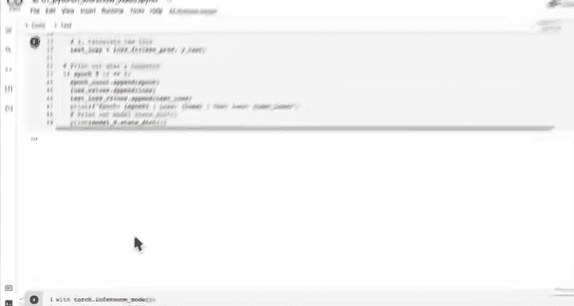

运行这段代码后，我们可以看到损失值随着训练进行而下降，模型参数也逐渐接近理想值（权重~0.7，偏置~0.3）。

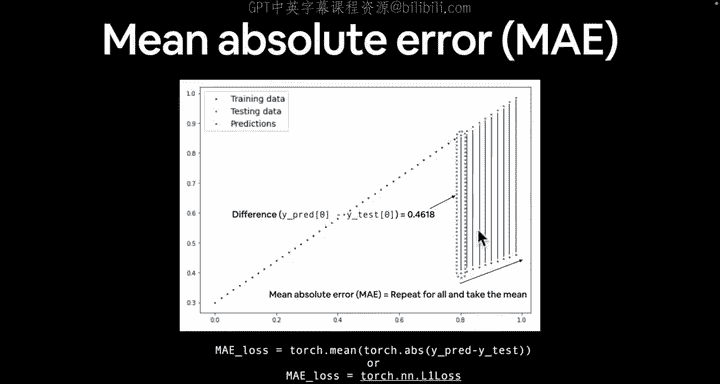

---

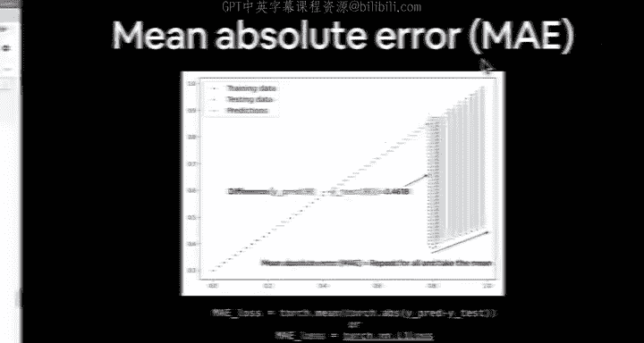

## 可视化损失曲线 📉

跟踪损失值的一个主要好处是我们可以将其可视化。损失曲线是机器学习中最美丽的景象之一——一条下降的曲线表明模型正在学习。

以下是如何绘制训练损失和测试损失曲线：

```python
# 绘制损失曲线
plt.figure(figsize=(10, 7))
plt.plot(epoch_count, np.array(loss_values), label="Train loss")
plt.plot(epoch_count, np.array(test_loss_values), label="Test loss")
plt.title("Training and Test Loss Curves")
plt.ylabel("Loss")
plt.xlabel("Epochs")
plt.legend()
plt.show()
```

理想的损失曲线显示训练损失和测试损失都随着时间推移而下降，并且彼此接近。如果它们相差太大，可能意味着模型存在过拟合或欠拟合问题。

---

## 测试循环步骤回顾

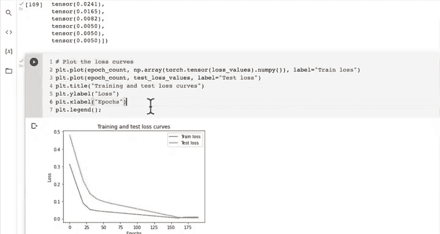

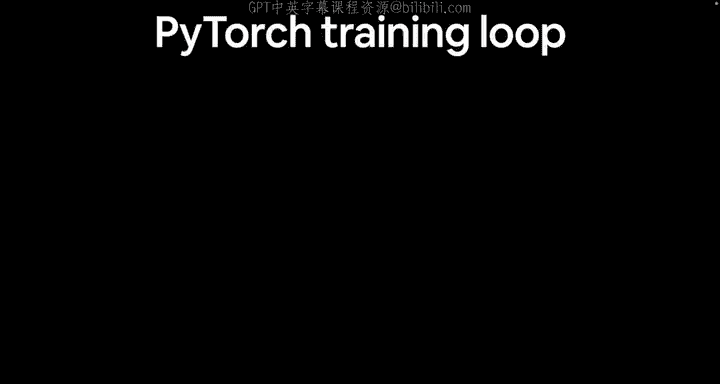

让我们用彩色幻灯片的形式回顾一下测试循环的关键步骤：

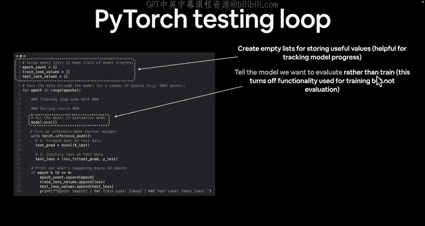

1.  **创建空列表用于存储有用的值**：例如，记录每个epoch的损失，以便跟踪模型进度和比较不同实验。
2.  **将模型设置为评估模式**：调用 `model.eval()`，这会关闭训练所需的特定功能（如Dropout），但不影响评估。
3.  **启用Torch推理模式**：使用 `with torch.inference_mode():` 上下文管理器。这会禁用梯度跟踪等功能，以提升推理性能。
4.  **将测试数据传递给模型**：执行前向传播，计算模型在测试数据上的预测。
5.  **计算测试损失值**：衡量模型在测试数据集上的预测错误程度。越低越好。
6.  **打印输出发生的情况**：监控训练过程。你可以自定义打印内容，例如添加准确率等其他指标。
7.  **跟踪数值**：记录epoch、训练损失和测试损失等值。未来可以基于这些结果改进模型。

---

## 总结

本节课中我们一起学习了如何为PyTorch模型编写测试循环代码。我们了解了将模型设置为评估模式（`model.eval()`）和使用推理模式（`torch.inference_mode()`）的重要性。我们构建了一个完整的训练与测试循环，跟踪了损失值，并通过绘制损失曲线直观地展示了模型的学习过程。

记住这个循环模式，因为在本课程后续构建所有模型时，我们都会使用类似的训练和测试功能。你已经掌握了PyTorch深度学习的基础步骤！给自己点个赞吧。

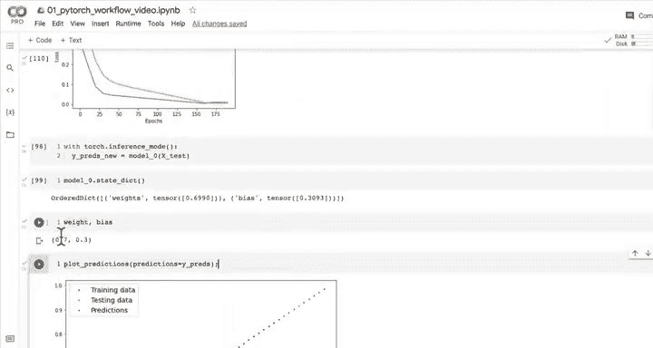

为了帮助记忆，可以想想这个简单的循环口诀：对于每个epoch，训练模式下做前向传播、算损失、清梯度、反向传播、优化器更新；然后测试模式下，做前向传播、算损失，最后打印结果并评估。

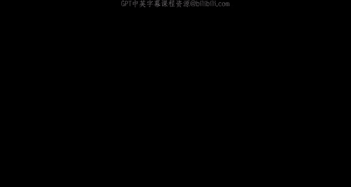

在下一节课中，我们将探索如何进一步改进模型，例如通过调整超参数或训练更长时间来让预测结果（红点）更好地匹配目标值（绿点）。