# 42：保存与加载模型 🚀

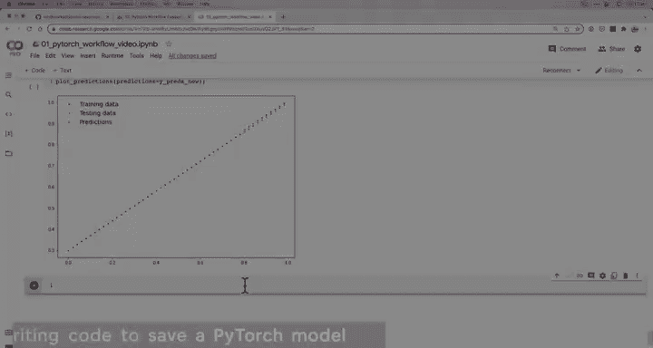

在本节课中，我们将学习如何在PyTorch中保存和加载训练好的模型。这是将模型部署到实际应用或与他人共享的关键步骤。

## 概述

上一节我们介绍了如何训练模型并评估其性能。本节我们将探讨如何保存训练成果，以便在需要时重新加载和使用模型，即使计算环境断开连接。

## 保存PyTorch模型

在PyTorch中，保存和加载模型主要有三种核心方法需要掌握。

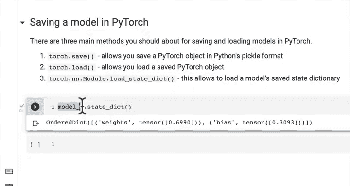

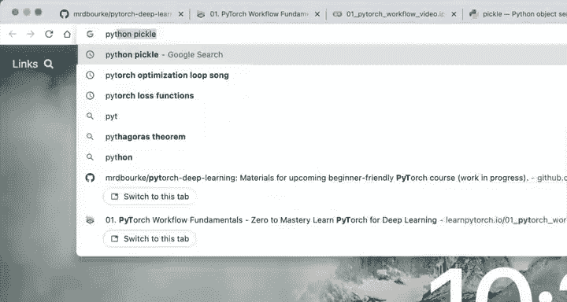

以下是三种核心方法：

1.  **`torch.save()`**：此方法允许你将PyTorch对象以Python的Pickle格式保存到磁盘。
2.  **`torch.load()`**：此方法用于加载之前通过`torch.save()`保存的PyTorch对象。
3.  **`torch.nn.Module.load_state_dict()`**：此方法用于将保存的模型参数字典加载到一个新的模型实例中。

### 什么是状态字典？

在PyTorch中，模型的可学习参数（即权重和偏置）存储在一个称为**状态字典**的Python字典对象中。你可以通过`model.state_dict()`来访问它。

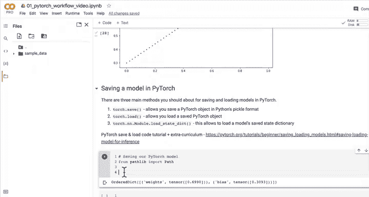

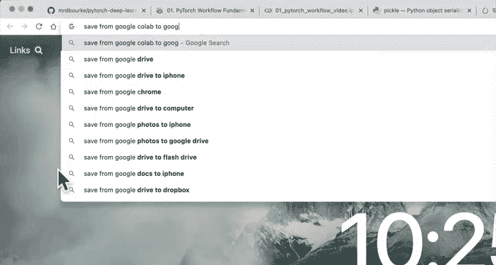

```python
# 查看模型的状态字典
print(model_0.state_dict())
```

状态字典将模型的每一层映射到其参数张量。对于简单的模型，它看起来很简单；对于拥有数百万参数的大型模型，它同样是一个结构清晰的字典。

### 保存模型状态字典

推荐的做法是保存模型的`state_dict`，而不是整个模型对象。这样做更灵活，且与未来的PyTorch版本兼容性更好。

以下是保存模型的具体步骤：

首先，我们导入必要的库并创建一个目录来存放模型文件。

```python
import torch
from pathlib import Path

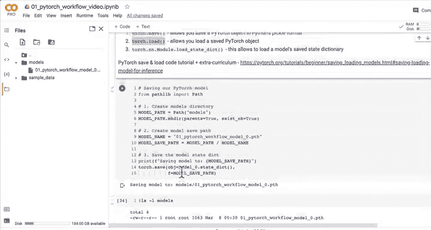

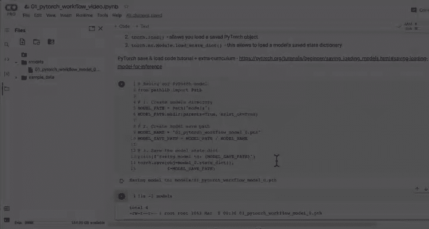

# 1. 创建模型保存目录
MODEL_PATH = Path("models")
MODEL_PATH.mkdir(parents=True, exist_ok=True)

# 2. 创建模型保存路径
MODEL_NAME = "01_pytorch_workflow_model_0.pth"
MODEL_SAVE_PATH = MODEL_PATH / MODEL_NAME

# 3. 保存模型的状态字典
print(f"正在保存模型到: {MODEL_SAVE_PATH}")
torch.save(obj=model_0.state_dict(), f=MODEL_SAVE_PATH)
```

执行上述代码后，模型文件（例如`01_pytorch_workflow_model_0.pth`）将被保存到指定的`models`文件夹中。`.pth`或`.pt`是PyTorch模型文件的常用扩展名。

## 加载PyTorch模型

现在我们已经保存了模型，接下来看看如何将其加载回来并使用。

由于我们保存的是模型的`state_dict`，因此加载时需要先实例化一个与原模型结构相同的新模型，然后将保存的状态字典加载进去。

以下是加载模型的具体步骤：

```python
# 1. 实例化一个相同结构的新模型
loaded_model_0 = LinearRegressionModel()

# 2. 加载保存的状态字典到新模型中
loaded_model_0.load_state_dict(torch.load(f=MODEL_SAVE_PATH))
```

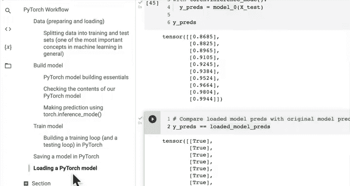

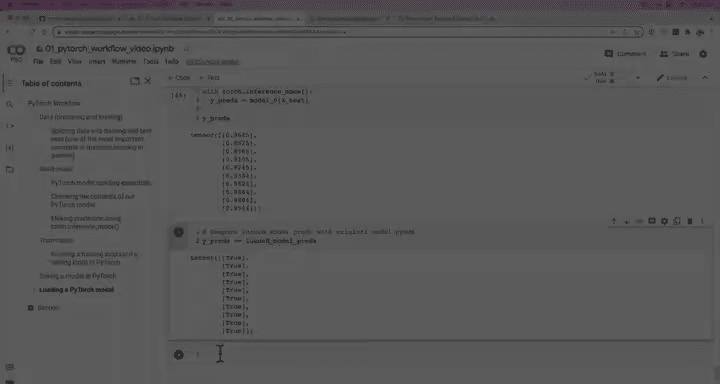

加载成功后，控制台通常会输出“All keys matched successfully”的提示。现在，`loaded_model_0`就拥有了与之前训练的`model_0`完全相同的参数。

### 验证加载的模型

为了确保加载的模型工作正常，我们可以用它进行预测，并与原始模型的预测结果进行比较。

```python
# 将模型设置为评估模式
model_0.eval()
loaded_model_0.eval()

# 使用推理模式进行预测（更高效）
with torch.inference_mode():
    y_preds = model_0(X_test)
    loaded_model_preds = loaded_model_0(X_test)

# 比较两个模型的预测结果是否相同
print(y_preds == loaded_model_preds)
```

如果输出全为`True`，则证明我们成功保存并加载了模型，且加载后的模型功能与原始模型完全一致。

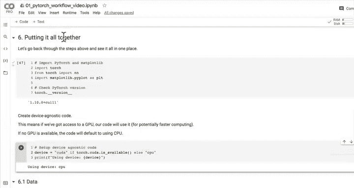

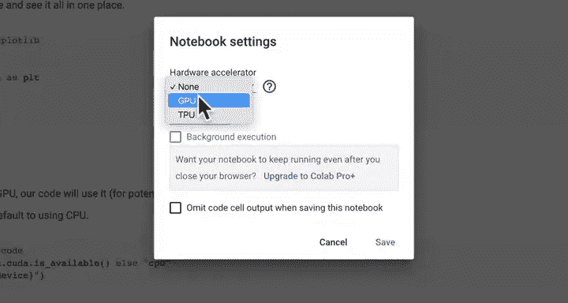

## 总结

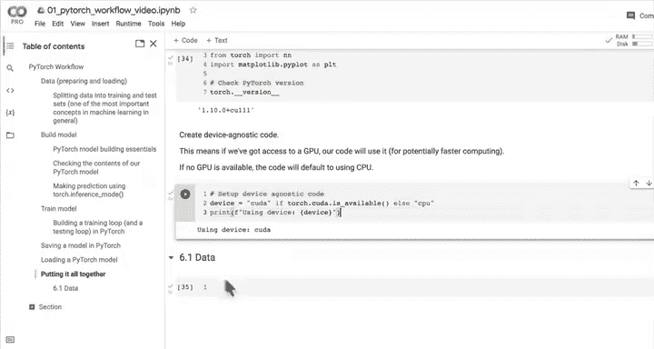

本节课我们一起学习了PyTorch模型持久化的核心技能。我们了解了保存模型的三种主要方法，并重点实践了推荐的方式：保存和加载模型的**状态字典**。我们完成了从创建保存路径、使用`torch.save()`保存模型，到使用`torch.load()`和`load_state_dict()`重新加载模型并进行验证的完整流程。掌握这些技能，可以确保你的训练成果得以保留，并能在不同的项目或环境中复用。