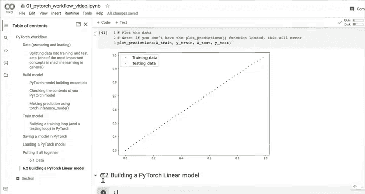
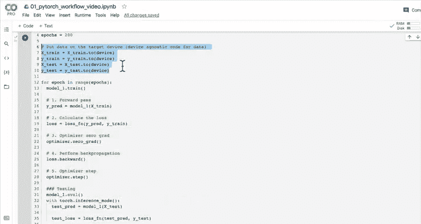
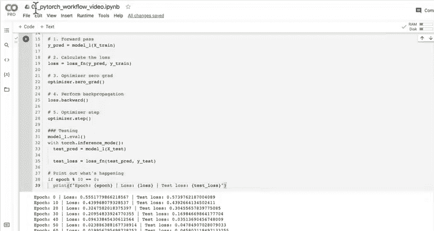
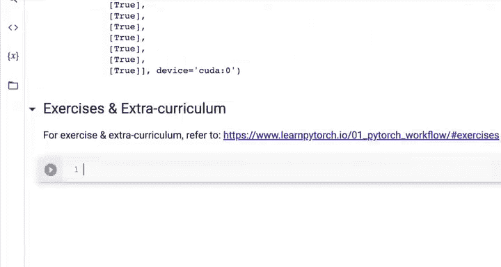
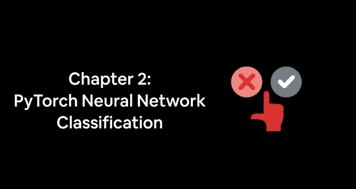

# 43：整合所有内容 🧩

在本节课中，我们将整合之前学到的所有PyTorch工作流程知识，从创建数据、构建模型、训练模型到保存和加载模型，完成一个完整的机器学习项目。

---

## 创建数据 📊

上一节我们介绍了设备无关代码。本节中，我们来看看如何创建用于训练和测试的模拟数据。

我们将使用线性回归公式 `y = weight * x + bias` 来生成数据。在代码中，我们这样实现：

```python
import torch




# 设置真实的权重和偏置
weight = 0.7
bias = 0.3

# 创建特征数据 X
start = 0
end = 1
step = 0.02
X = torch.arange(start, end, step).unsqueeze(dim=1)

# 使用公式创建标签数据 y
y = weight * X + bias
```

以下是数据拆分步骤，我们将数据分为训练集和测试集：

```python
# 设置训练集比例
train_split = int(0.8 * len(X))

# 拆分数据
X_train, y_train = X[:train_split], y[:train_split]
X_test, y_test = X[train_split:], y[train_split:]
```

我们可以绘制数据以可视化训练集（蓝色点）和测试集（绿色点）。

---

## 构建模型 🏗️

现在我们已经准备好了数据，接下来需要构建一个模型来拟合这些数据。

我们将构建一个PyTorch线性模型。与之前手动初始化参数不同，这次我们将利用 `torch.nn` 模块的强大功能，使用预构建的线性层。

以下是构建模型的代码：

```python
import torch
from torch import nn

class LinearRegressionModelV2(nn.Module):
    def __init__(self):
        super().__init__()
        # 使用一个线性层，它内部会创建权重和偏置参数
        self.linear_layer = nn.Linear(in_features=1,
                                      out_features=1)

    def forward(self, x: torch.Tensor) -> torch.Tensor:
        # 在forward方法中，数据通过线性层
        return self.linear_layer(x)

# 创建模型实例并设置随机种子以确保可复现性
torch.manual_seed(42)
model_1 = LinearRegressionModelV2()
```

这个线性层本质上实现了与我们之前手动编写的相同的线性回归公式 `y = x * A^T + b`。在深度学习中，这种层也被称为线性变换层、全连接层或密集层。

---

## 训练模型 🏋️

模型构建完成后，下一步是训练它。这涉及到设置损失函数、优化器以及编写训练循环。

以下是训练所需的组件和步骤：

```python
# 将模型和数据移动到目标设备（GPU或CPU），实现设备无关
device = "cuda" if torch.cuda.is_available() else "cpu"
model_1.to(device)
X_train = X_train.to(device)
y_train = y_train.to(device)
X_test = X_test.to(device)
y_test = y_test.to(device)

# 1. 设置损失函数（衡量模型的错误程度）
loss_fn = nn.L1Loss() # 与平均绝对误差相同

# 2. 设置优化器（调整模型参数以减少损失）
optimizer = torch.optim.SGD(params=model_1.parameters(),
                            lr=0.01) # 学习率

# 设置训练轮数
epochs = 200
```

以下是训练循环的核心步骤，它遵循一个标准的模式：

```python
torch.manual_seed(42)

for epoch in range(epochs):
    ### 训练步骤
    model_1.train() # 将模型设置为训练模式
    # 1. 前向传播（计算预测值）
    y_pred = model_1(X_train)
    # 2. 计算损失
    loss = loss_fn(y_pred, y_train)
    # 3. 优化器梯度归零
    optimizer.zero_grad()
    # 4. 反向传播（计算梯度）
    loss.backward()
    # 5. 优化器步进（更新参数）
    optimizer.step()

    ### 测试步骤
    model_1.eval() # 将模型设置为评估模式
    with torch.inference_mode(): # 关闭梯度跟踪等，用于推理
        # 1. 在测试数据上进行前向传播
        test_pred = model_1(X_test)
        # 2. 计算测试损失
        test_loss = loss_fn(test_pred, y_test)

    # 每10轮打印一次损失
    if epoch % 10 == 0:
        print(f"Epoch: {epoch} | Loss: {loss:.4f} | Test loss: {test_loss:.4f}")
```

训练完成后，我们可以检查模型学习到的参数，它们应该接近我们生成数据时使用的真实权重（0.7）和偏置（0.3）。




---

## 评估与预测 🔍

训练结束后，我们需要评估模型在未见过的测试数据上的表现，并进行预测。

以下是进行预测和可视化的步骤：

```python
# 将模型设置为评估模式
model_1.eval()

# 在推理模式下进行预测
with torch.inference_mode():
    y_preds = model_1(X_test)

# 注意：绘图库（如matplotlib）使用CPU上的NumPy数组
# 因此需要将张量移回CPU
plot_predictions(train_data=X_train.cpu(),
                 train_labels=y_train.cpu(),
                 test_data=X_test.cpu(),
                 test_labels=y_test.cpu(),
                 predictions=y_preds.cpu())
```

理想情况下，预测点（红色）应该紧密地覆盖在测试数据点（绿色）之上，这表明模型拟合得很好。

---

## 保存与加载模型 💾

为了避免每次重新训练模型，我们需要知道如何保存训练好的模型，并在以后加载它。

以下是保存和加载模型的步骤：

```python
from pathlib import Path

# 1. 创建模型保存目录
MODEL_PATH = Path("models")
MODEL_PATH.mkdir(parents=True, exist_ok=True)

# 2. 创建模型保存路径和名称
MODEL_NAME = "01_pytorch_workflow_model_1.pth"
MODEL_SAVE_PATH = MODEL_PATH / MODEL_NAME

# 3. 保存模型的状态字典（包含所有参数）
torch.save(obj=model_1.state_dict(),
           f=MODEL_SAVE_PATH)

# 4. 加载模型
# 首先创建一个相同结构的新模型实例
loaded_model_1 = LinearRegressionModelV2()
# 然后加载保存的状态字典
loaded_model_1.load_state_dict(torch.load(MODEL_SAVE_PATH))
# 将加载的模型移动到目标设备
loaded_model_1.to(device)

# 5. 评估加载的模型，确保其表现与保存前一致
loaded_model_1.eval()
with torch.inference_mode():
    loaded_model_1_preds = loaded_model_1(X_test)




# 检查预测是否相同
print(y_preds == loaded_model_1_preds)
```

---

## 总结 📝

本节课中我们一起学习了如何将PyTorch工作流程的所有步骤整合到一个完整的项目中：

1.  **创建与准备数据**：我们使用线性公式生成了模拟数据，并将其拆分为训练集和测试集。
2.  **构建模型**：我们利用 `torch.nn.Linear` 层构建了一个线性回归模型，这比手动初始化参数更高效。
3.  **训练模型**：我们设置了损失函数和优化器，编写了包含前向传播、损失计算、反向传播和参数更新的训练循环，并实现了设备无关的代码。
4.  **评估与预测**：我们评估了模型在测试集上的表现，并通过可视化确认了预测结果。
5.  **保存与加载模型**：我们学会了如何将训练好的模型参数保存到文件中，并在需要时重新加载它们，以便进行后续的推理或继续训练。





你已成功走完了完整的PyTorch机器学习工作流程！这些核心步骤——数据准备、模型构建、训练、评估、保存/加载——是构建任何PyTorch深度学习项目的基础，在后续的课程和实际项目中会反复用到。恭喜你掌握了这些关键技能！