#  44：机器学习分类简介 🧠

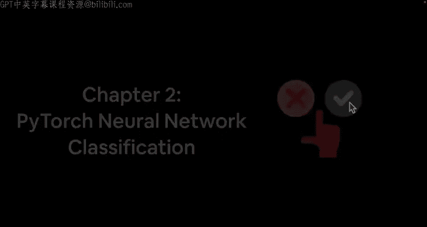

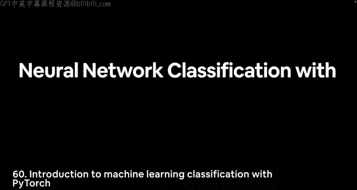

在本节课中，我们将学习机器学习中的核心问题之一：分类。我们将探讨什么是分类问题，了解其不同类型，并初步认识构建分类模型所需的核心概念。

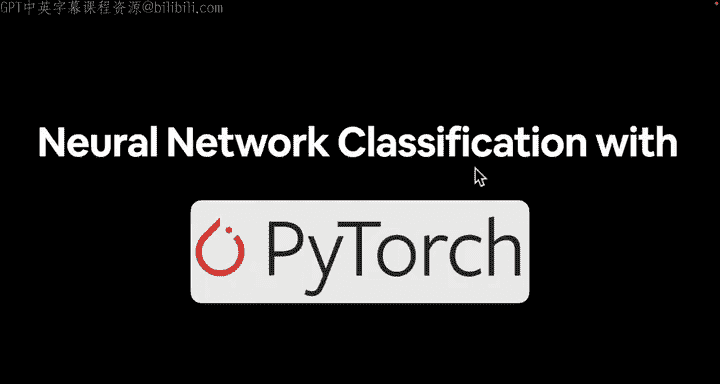

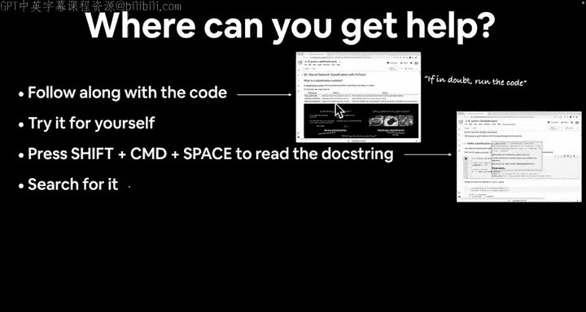

---

## 如何获取帮助 🤔

在深入学习之前，了解如何解决问题至关重要。

以下是获取帮助的步骤：

1.  **跟随代码并尝试运行**：动手实践是学习的关键。如果遇到问题，首先尝试自己运行和编写代码。
2.  **查阅文档字符串**：在代码编辑器中，对任何函数使用 `Shift + Command + Space`（Mac）或 `Ctrl + Space`（Windows）来查看其文档说明。
3.  **搜索问题**：如果出现错误，将错误信息复制并粘贴到搜索引擎中。你可能会找到 Stack Overflow 或 PyTorch 官方文档等资源。
4.  **再次尝试**：如果仍然困惑，请再次尝试运行代码。
5.  **在课程 GitHub 上提问**：如果以上步骤都无法解决问题，可以在课程 GitHub 仓库的讨论页面发起新讨论。请注明视频编号、时间戳和具体问题。

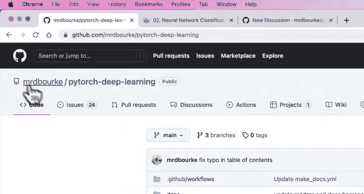

本课程的所有材料和代码都基于《Learn PyTorch for Deep Learning》一书的第二章。

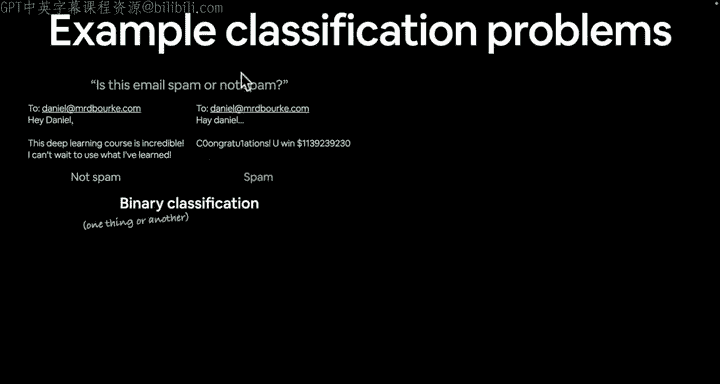

---

## 什么是分类问题 ❓

分类是机器学习的主要任务之一，其目标是预测某个事物属于哪个类别。你每天可能都在与分类模型打交道。

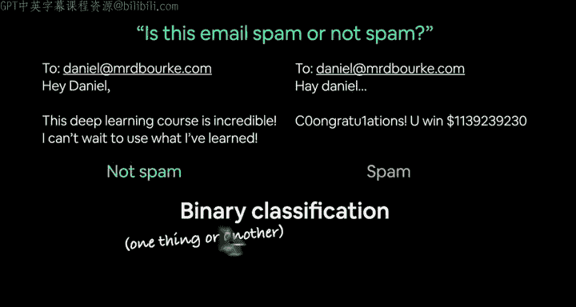

让我们看几个例子：

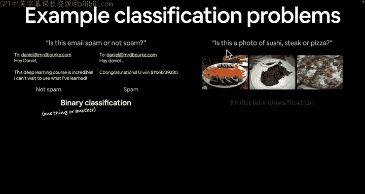

*   **垃圾邮件过滤**：判断一封电子邮件是“垃圾邮件”还是“非垃圾邮件”。这属于**二分类**问题，因为输出只有两种可能（例如，用 0 和 1 表示）。
*   **图像识别**：判断一张照片是“寿司”、“牛排”还是“比萨”。这属于**多分类**问题，因为类别数量超过两个。例如，ImageNet 数据集就包含 1000 个不同的物体类别。
*   **文章标签**：为一篇维基百科文章自动分配多个相关标签（如“深度学习”、“人工神经网络”）。这属于**多标签分类**问题，因为一个样本可以同时拥有多个标签。

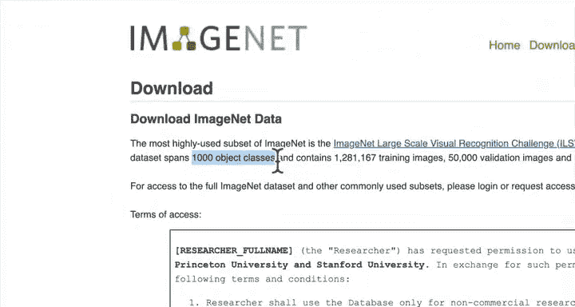

---

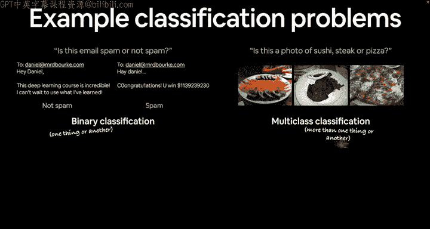

## 深入理解：二分类 vs 多分类 🐕🐈⬛🐔

为了更清晰地理解，让我们看一个具体的例子。

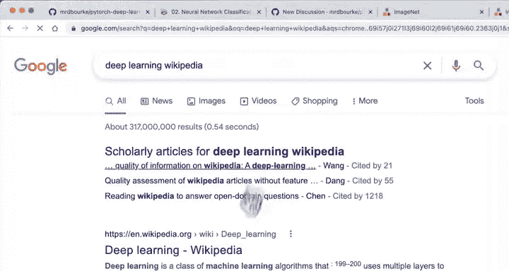

假设我们想构建一个模型来区分“狗”和“猫”的照片。我们给模型输入大量狗和猫的图片进行训练，然后它就能对新图片进行预测：“这是狗还是猫？”。这就是一个典型的**二分类**问题。

现在，假设我们的数据集扩展了，加入了“鸡”的图片。此时，模型需要从“狗”、“猫”、“鸡”三个类别中做出选择。问题就变成了**多分类**问题。

---

## 本节内容概览 📋

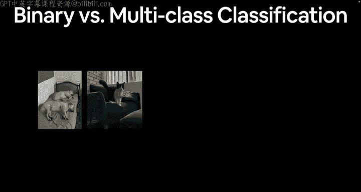

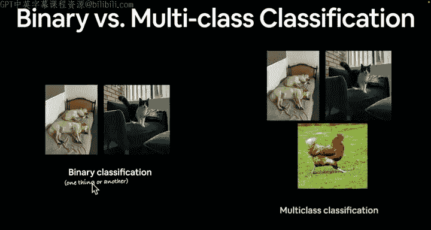

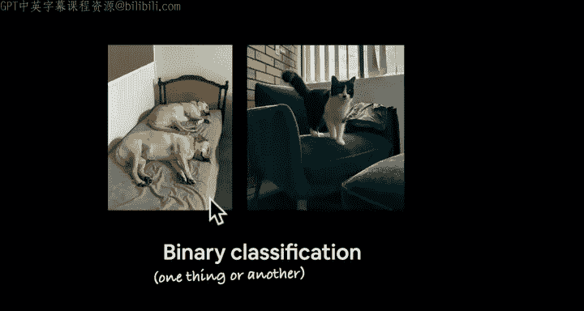

在接下来的课程中，我们将具体学习以下内容：

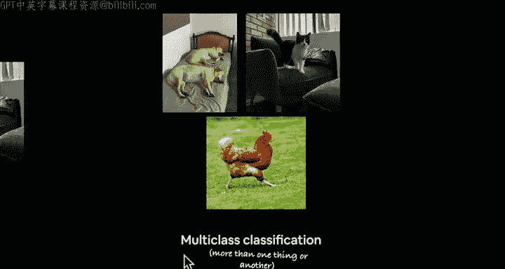

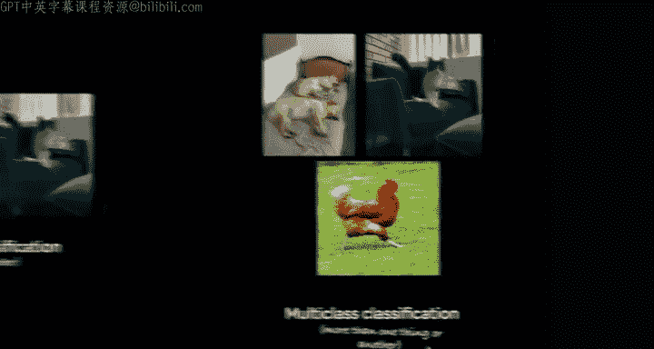

1.  **神经网络分类模型的架构**：了解分类模型的基本结构。
2.  **输入与输出形状**：明确分类模型对输入数据（特征）和输出结果（标签）的形状要求。模型处理的是数值化的张量（`tensor`）。
3.  **创建与使用自定义数据**：学习如何准备用于训练和预测的数据集。
4.  **构建分类模型**：我们将回顾建模步骤，并创建一个适用于分类任务的神经网络模型。
5.  **设置损失函数与优化器**：为分类任务选择合适的损失函数（如交叉熵损失）和优化器。
6.  **实现训练与评估循环**：编写代码来训练模型，并在测试集上评估其性能。
7.  **模型的保存与加载**：学习如何保存训练好的模型以便后续使用。
8.  **利用非线性**：理解为什么在分类模型中引入非线性激活函数（如 ReLU）至关重要。线性函数只能画直线，而非线性函数可以帮助模型学习更复杂的模式。
9.  **分类评估方法**：学习多种评估分类模型性能的指标和方法。

我们将通过编写大量代码，像厨师烹饪一样，一步步实现这些概念。

---

## 总结 ✨

本节课我们一起学习了机器学习分类的基础知识。我们明确了分类问题的定义，区分了二分类、多分类和多标签分类等不同类型，并通过实例加深了理解。最后，我们预览了构建一个完整分类模型所需掌握的核心模块和步骤。

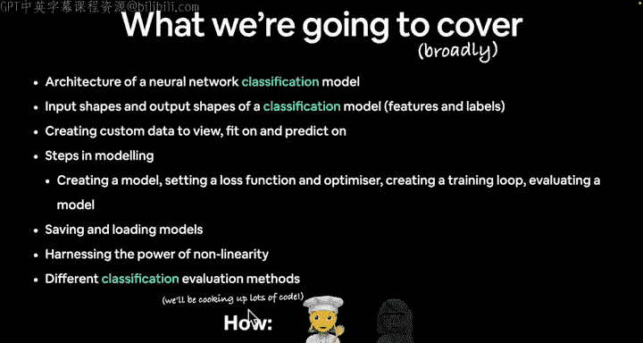

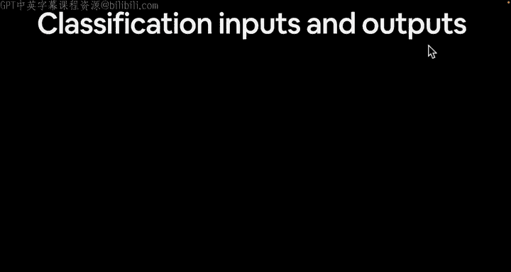

在下一节中，我们将更具体地探讨分类模型的输入和输出。