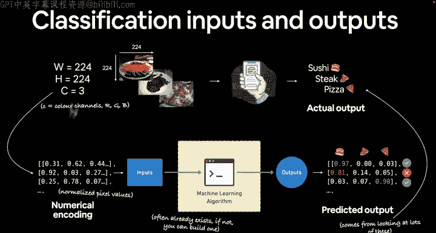
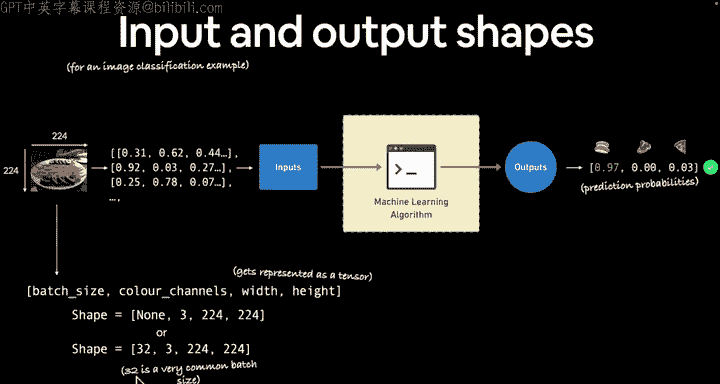
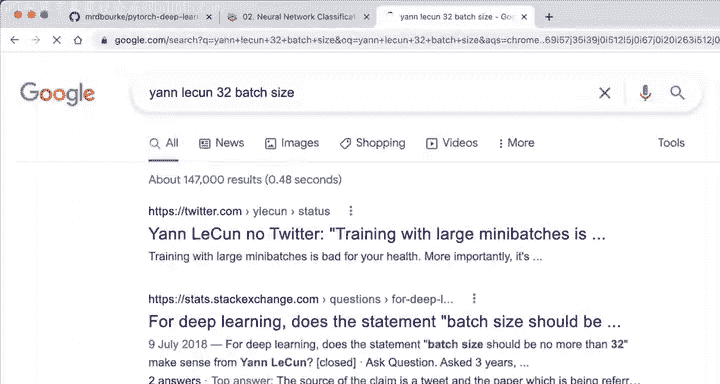
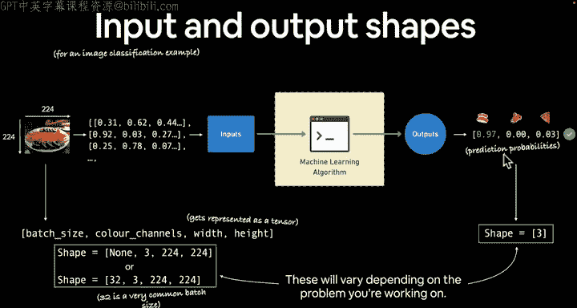
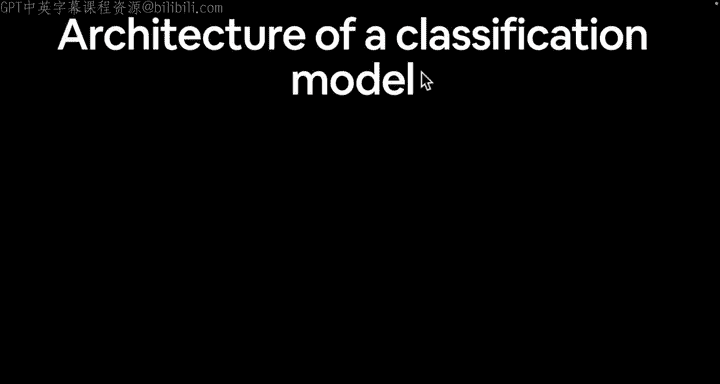

#  45：分类问题的输入与输出 🍕📸

在本节课中，我们将深入探讨分类问题的输入与输出形式。我们将了解如何将图像等数据转换为数值表示，以及机器学习模型如何输出预测概率。

---

## 概述

上一节我们简要介绍了什么是分类问题。本节中，我们将具体讨论分类问题的输入和输出形式。我们将以构建一个名为“Food Vision”的食物识别应用为例，说明如何处理图像输入并生成可理解的预测标签。

---

## 输入：图像的数值表示

为了构建“Food Vision”应用，我们需要将食物照片转换为机器学习算法可以处理的数值形式。

以下是处理图像输入的关键步骤：

1.  **图像预处理**：通常，我们会将图像调整为固定尺寸，例如 **224像素宽 × 224像素高**。这是计算机视觉问题中常见的尺寸。
2.  **数值编码**：图像在计算机中通常由三个维度表示：
    *   **宽度** (Width)
    *   **高度** (Height)
    *   **颜色通道** (Color Channels - C)，通常是红、绿、蓝（RGB）三个通道。

因此，一张图像可以被表示为一个三维张量（Tensor），其形状为 `(颜色通道, 宽度, 高度)`。在PyTorch中，默认的顺序是 `(C, W, H)`。每个像素点的RGB值共同构成了图像的数值表示。

**公式表示**：
`图像张量形状 = (颜色通道数, 宽度, 高度)`
例如：`(3, 224, 224)`

---



## 输出：预测概率

机器学习模型的输出通常不是直接的类别标签，而是**预测概率**。

以下是关于模型输出的要点：

1.  **概率值**：对于每个可能的类别（例如：寿司、牛排、披萨），模型会输出一个介于0和1之间的概率值。
2.  **置信度**：概率值越接近1，表示模型对该预测越有信心；越接近0，则表示模型认为该可能性越低。
3.  **理想输出**：在“Food Vision”的例子中，模型会为每张输入图片输出三个概率值，分别对应三个食物类别。

**代码表示**（概念性）：
```python
# 假设模型对一张图片的预测输出
prediction_probabilities = [0.01, 0.05, 0.94]  # 分别对应 [寿司， 牛排， 披萨] 的概率
```
然后，我们可以通过代码（例如 `argmax`）将这些概率转换为人类可读的标签（例如“披萨”）。

---

## 张量形状详解

从张量形状的角度来看，理解输入和输出的维度至关重要。

以下是输入和输出张量形状的详细说明：





*   **输入形状**：对于一批图像，输入张量的形状通常为 `(批量大小, 颜色通道数, 宽度, 高度)`。
    *   **批量大小**：模型一次处理的图像数量。**32** 是一个常用且高效的批量大小。
    *   因此，一个典型的输入张量形状可能是 `(32, 3, 224, 224)`。
*   **输出形状**：输出张量的形状为 `(批量大小, 类别数量)`。
    *   在我们的三分类例子中，输出形状就是 `(32, 3)`，表示模型对这批32张图片中的每一张，都给出了属于三个类别的概率。

**关键点**：输入和输出的具体形状会根据你解决的问题而变化（例如，二分类问题输出形状可能是 `(批量大小, 1)` 或 `(批量大小, 2)`），但**将数据编码为数值表示**的核心原则保持不变。

---

## 总结

本节课我们一起学习了分类问题中输入与输出的关键概念。



我们了解到，输入需要被转换为数值张量（例如形状为 `(批量大小, 3, 224, 224)` 的图像数据），而输出则是模型对这些输入属于各个类别的预测概率（例如形状为 `(批量大小, 类别数)`）。最后，我们可以将这些概率值解码为有意义的标签。



下一节，在开始编写代码之前，我们将讨论分类模型的整体架构。记住，架构就像是神经网络的蓝图。我们下一节见！