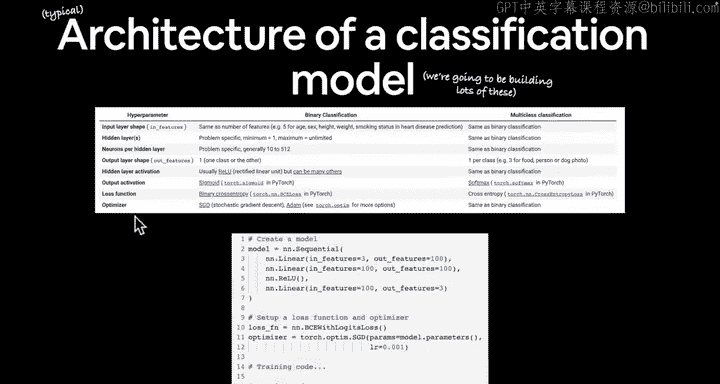
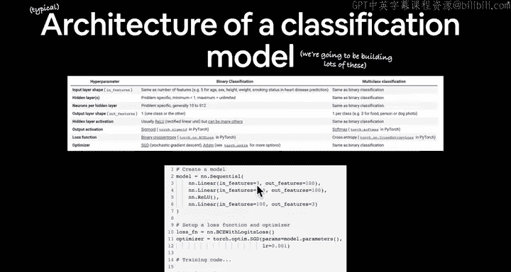
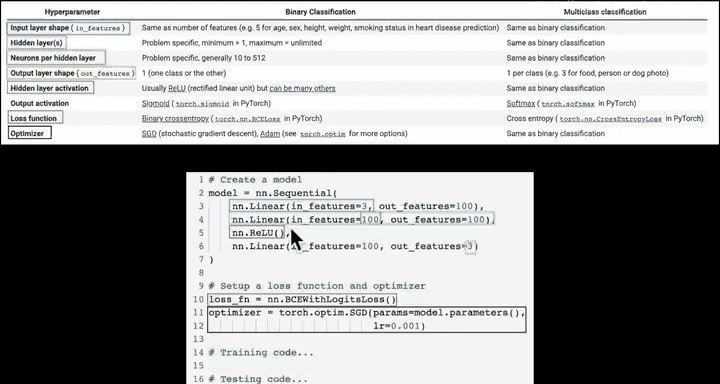
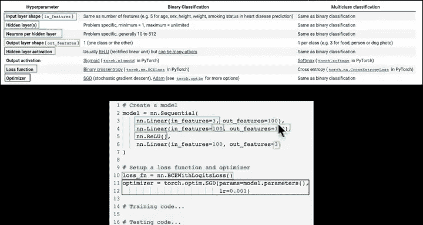
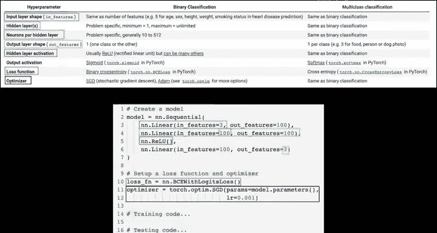
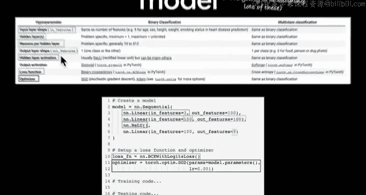
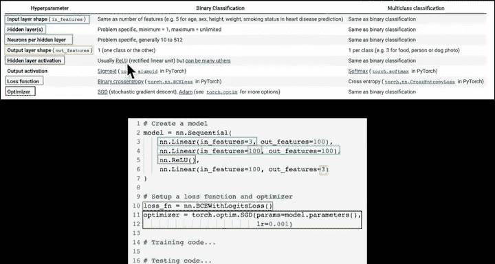
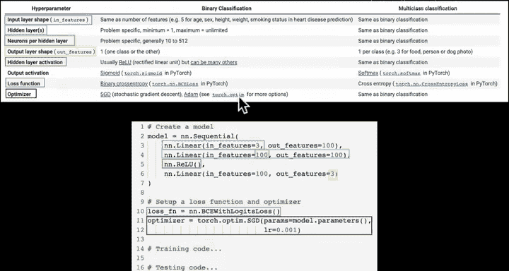
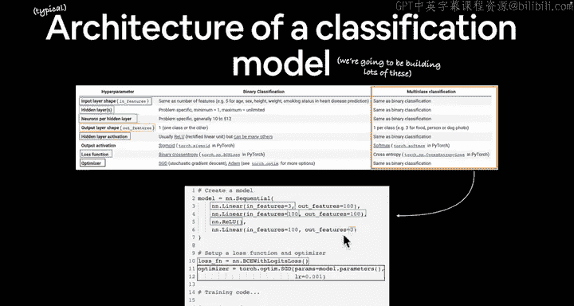
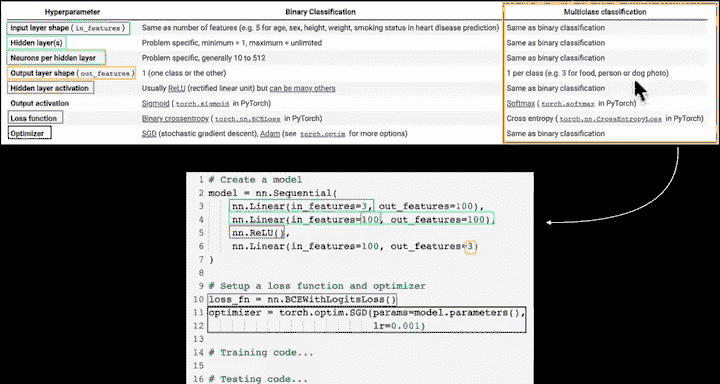

#  46：神经网络分类架构 🧠

在本节课中，我们将学习分类神经网络的典型架构。我们将探讨其核心组成部分，包括输入层、隐藏层、输出层、激活函数、损失函数和优化器，并理解它们如何协同工作以解决分类问题。




---

## 概述


上一节我们介绍了分类问题的输入和输出示例。本节中，我们来看看一个典型分类模型的架构。我们将重点关注其各个组成部分及其在神经网络中的作用。

分类模型的输入通常是某种数值表示，而输出则通常是某种预测概率。

## 分类神经网络架构



分类神经网络的架构可以根据问题类型（二元分类或多类别分类）有所不同，但核心组件相似。下图展示了一个通用架构：




以下是架构的核心组成部分：


### 1. 输入层形状




输入层的形状通常由 `in_features` 参数决定，它等于输入特征的数量。

**公式**：`in_features = 输入特征数量`





例如，在预测某人是否患有心脏病的二元分类问题中，我们可能有5个输入特征：年龄、性别、身高、体重和吸烟状况。这些特征都需要转换为数值表示（例如，性别：0代表男性，1代表女性）。

在图像分类问题中，`in_features` 可能等于颜色通道数（例如，RGB图像为3）。

### 2. 隐藏层




隐藏层是神经网络的核心，负责学习数据中的复杂模式。在PyTorch中，一个层通常表示为 `nn.Linear`、`nn.ReLU` 等。

**代码示例**：一个简单的线性层
```python
import torch.nn as nn
hidden_layer = nn.Linear(in_features=10, out_features=5)
```

你可以根据需要添加任意数量的隐藏层。例如，ResNet架构的某些版本包含多达152层。



### 3. 隐藏层神经元数量

每个隐藏层包含一定数量的神经元（或单元）。`out_features` 参数定义了该层输出的维度，也间接决定了该层的神经元数量。





**公式**：`out_features = 该层神经元数量`

在PyTorch中，每个神经元代表一个包含数学运算（如线性变换）的参数化单元。

### 4. 输出层形状


输出层的形状取决于分类问题的类型：
*   **二元分类**：通常有1个输出神经元，预测属于某个类别的概率。
*   **多类别分类**：输出神经元数量等于类别数，每个神经元输出对应类别的预测概率。

**公式**：
*   二元分类：`out_features = 1`
*   多类别分类：`out_features = 类别数量`

例如，一个食物、人物或狗的图像分类模型（3个类别）将具有3个输出特征。

### 5. 隐藏层激活函数

激活函数为神经网络引入非线性，使其能够学习复杂模式。最常用的激活函数之一是修正线性单元（ReLU）。

**公式**：`ReLU(x) = max(0, x)`

PyTorch提供了许多非线性激活函数，我们将在后续课程中详细探讨。

### 6. 输出层激活函数

输出层的激活函数将神经网络的原始输出转换为概率分布：
*   **二元分类**：通常使用 **Sigmoid** 函数，将输出压缩到0和1之间。
*   **多类别分类**：通常使用 **Softmax** 函数，将输出转换为所有类别概率之和为1的分布。

**公式**：
*   Sigmoid: `σ(x) = 1 / (1 + exp(-x))`
*   Softmax: `softmax(x_i) = exp(x_i) / Σ_j exp(x_j)`

### 7. 损失函数

损失函数衡量模型预测与真实标签之间的差异。
*   **二元分类**：常用 **二元交叉熵损失**（`nn.BCELoss` 或 `nn.BCEWithLogitsLoss`）。
*   **多类别分类**：常用 **交叉熵损失**（`nn.CrossEntropyLoss`）。

### 8. 优化器

优化器根据损失函数的梯度更新模型的参数（权重和偏置）。
*   随机梯度下降（`torch.optim.SGD`）是我们之前见过的一种。
*   另一种常见且高效的选择是Adam优化器（`torch.optim.Adam`）。

PyTorch的 `torch.optim` 模块提供了多种优化器选项。

---

## 从理论到实践：创建数据集

我们已经讨论了足够的分类问题理论、输入输出以及典型架构。接下来，让我们开始编写代码。我们将首先创建一个用于练习的自定义数据集。

我们将使用 `scikit-learn` 库中的 `make_circles` 函数生成一个简单的、可视化的二元分类数据集。

**代码示例：创建圆形数据集**
```python
from sklearn.datasets import make_circles

# 创建1000个样本
n_samples = 1000
X, y = make_circles(n_samples=n_samples,
                    noise=0.03, # 添加少量噪声以增加随机性
                    random_state=42) # 设置随机种子以确保结果可复现

print(f"First 5 samples of X:\n{X[:5]}")
print(f"\nFirst 5 samples of y:\n{y[:5]}")
print(f"\nLength of X: {len(X)}")
print(f"Length of y: {len(y)}")
```

输出显示，我们的数据已经是数值形式（这是模型学习所必需的），并且标签 `y` 只包含0和1，表明这是一个二元分类问题。

为了更好地理解数据，我们将其可视化：

**代码示例：可视化数据集**
```python
import matplotlib.pyplot as plt

plt.scatter(x=X[:, 0], # X坐标（特征1）
            y=X[:, 1], # Y坐标（特征2）
            c=y, # 根据标签着色
            cmap=plt.cm.RdYlBu) # 使用的颜色映射
plt.show()
```

可视化结果将显示两个交织的圆形数据点簇，一个类别为红色，另一个为蓝色。我们的分类任务就是：给定一个点的坐标 `(x1, x2)`，预测它属于红色圆还是蓝色圆。


这种小型、易于实验但又能实践机器学习基础的数据集，常被称为 **玩具数据集**。它非常适合我们练习神经网络分类的基本原理。


---

## 总结

本节课中，我们一起学习了分类神经网络的完整架构。我们详细探讨了输入层、隐藏层、输出层的设计，以及激活函数、损失函数和优化器的作用。随后，我们通过代码实践，使用 `scikit-learn` 创建了一个可视化的二元分类玩具数据集，为接下来的模型构建做好了数据准备。


在下一节，我们将基于这个数据集，定义我们分类问题的输入输出形状，并将其拆分为训练集和测试集，正式开启模型构建的流程。