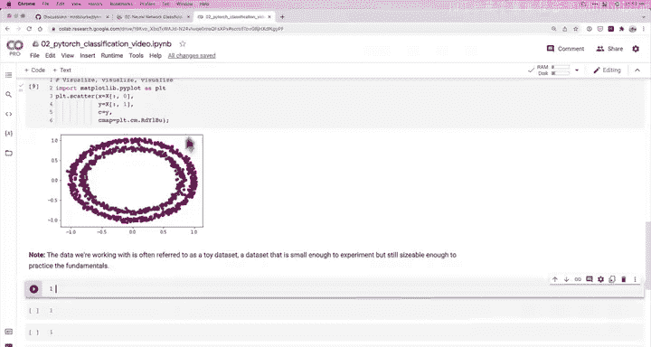
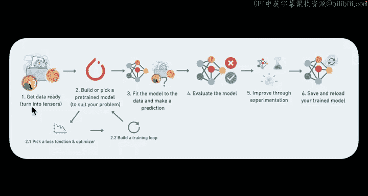
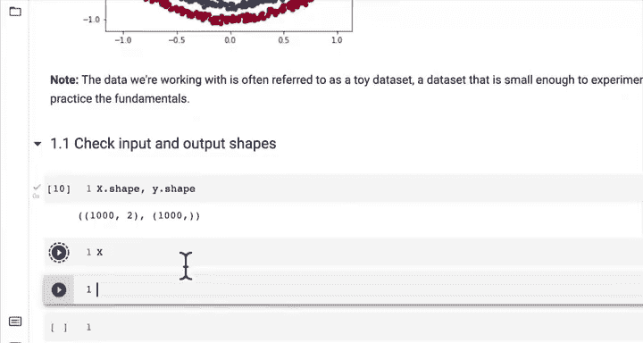
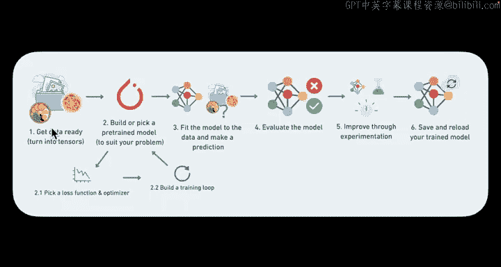
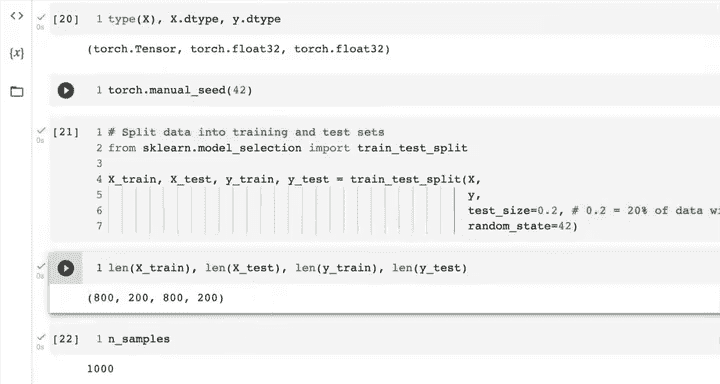
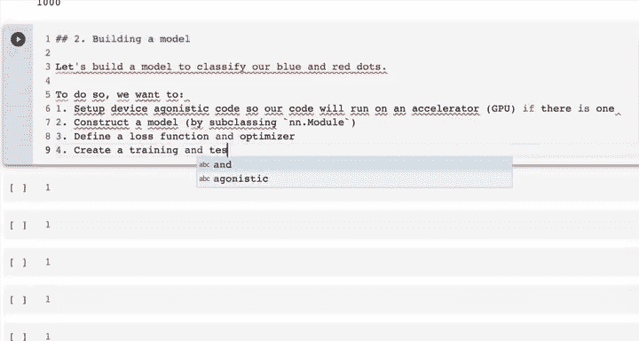
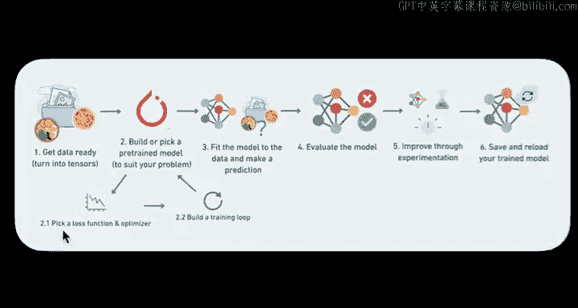
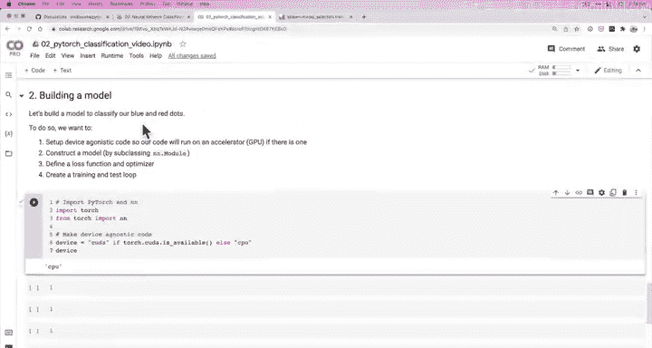
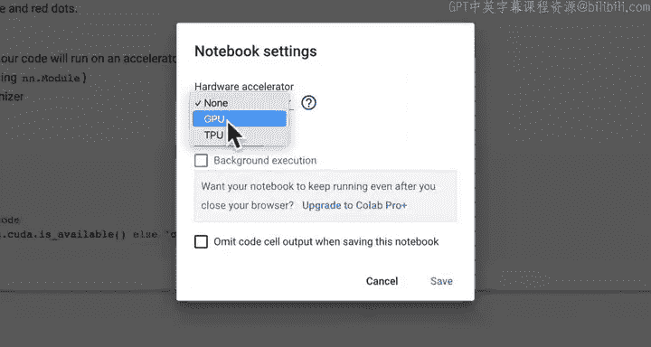
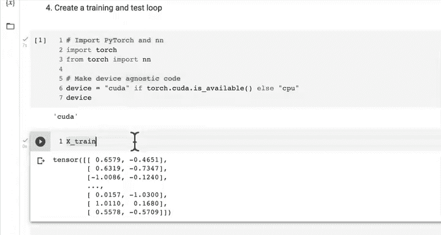

# 47：将数据转换为张量 🔢






在本节课中，我们将学习如何将数据转换为PyTorch张量，并创建训练集和测试集。这是构建神经网络模型前的关键准备步骤。

---

## 1.1 检查输入和输出形状 📐





上一节我们创建了分类数据。本节中，我们来看看数据的形状。关注输入和输出形状非常重要，因为机器学习大量处理张量形式的数值表示。输入和输出形状不匹配是常见的错误来源。

以下是检查数据形状的代码：

```python
print(f"X shape: {X.shape}")
print(f"y shape: {y.shape}")
```

运行代码后，我们看到X的形状是`(1000, 2)`，y的形状是`(1000,)`。这意味着我们有1000个样本，每个X样本有2个特征，每个y样本是一个标量标签。

为了更清楚地理解，我们查看第一个样本：

```python
X_sample = X[0]
y_sample = y[0]
print(f"Values for one sample of X: {X_sample}")
print(f"Values for one sample of y: {y_sample}")
print(f"Shape for one sample of X: {X_sample.shape}")
print(f"Shape for one sample of y: {y_sample.shape}")
```

结果显示，一个X样本有两个特征值，而对应的y样本是一个单独的数字（例如1）。这表示我们正在尝试用X的两个特征来预测y的一个数值。

---

## 1.2 将数据转换为张量 🔄

现在我们已经了解了数据的形状，接下来需要将其从NumPy数组转换为PyTorch张量。这是使用PyTorch进行深度学习的前提。

以下是转换步骤：

```python
import torch

# 将NumPy数组转换为PyTorch张量，并指定数据类型为torch.float32
X = torch.from_numpy(X).type(torch.float)
y = torch.from_numpy(y).type(torch.float)

# 检查转换后的前5个值和数据类型
print(f"First 5 values of X:\n{X[:5]}")
print(f"First 5 values of y:\n{y[:5]}")
print(f"Type of X: {type(X)}")
print(f"Type of y: {type(y)}")
```

我们使用`torch.from_numpy()`进行转换，并使用`.type(torch.float)`将数据类型设置为PyTorch默认的`float32`（NumPy默认是`float64`）。这样做可以避免后续可能出现的类型不匹配错误。

---

## 1.3 分割数据为训练集和测试集 ✂️

拥有张量格式的数据后，下一步是将其分割为训练集和测试集。训练集用于模型学习数据中的模式，测试集用于评估模型的性能。

我们将使用Scikit-learn库中的`train_test_split`函数。这是一个非常流行且方便的方法。

以下是分割数据的代码：

```python
from sklearn.model_selection import train_test_split

# 使用20%的数据作为测试集，并设置随机种子以确保结果可复现
X_train, X_test, y_train, y_test = train_test_split(X,
                                                    y,
                                                    test_size=0.2,
                                                    random_state=42)

# 检查分割后各集合的大小
print(f"Number of training samples (X): {len(X_train)}")
print(f"Number of testing samples (X): {len(X_test)}")
print(f"Number of training labels (y): {len(y_train)}")
print(f"Number of testing labels (y): {len(y_test)}")
```



我们设置了`test_size=0.2`，这意味着20%的数据（200个样本）将用作测试，剩下的80%（800个样本）用于训练。`random_state`参数确保了每次运行代码时，分割都是随机但可复现的。


---

## 1.4 构建模型前的准备 🏗️

在下一节构建模型之前，我们还需要设置设备无关的代码。这确保了我们的代码可以灵活地在CPU或GPU上运行。

以下是设置代码：

```python
# 设置设备无关代码
device = "cuda" if torch.cuda.is_available() else "cpu"
print(f"Using device: {device}")
```



这段代码检查是否有可用的CUDA（GPU），如果有则使用GPU，否则使用CPU。在Google Colab中，我们可以通过菜单栏的"运行时" -> "更改运行时类型" -> 选择"GPU"来启用GPU加速。



---

## 总结 📝





本节课中我们一起学习了数据准备的核心步骤：
1.  **检查数据形状**：理解了输入特征和输出标签的结构。
2.  **转换为张量**：将NumPy数组转换为PyTorch张量，并统一了数据类型。
3.  **分割数据集**：使用`train_test_split`创建了训练集和测试集。
4.  **准备设备**：设置了设备无关的代码，为后续在GPU上训练模型做好准备。



现在我们的数据已经准备就绪，格式正确，并且分为了训练和测试两部分。在接下来的课程中，我们将使用这些数据来构建一个能够区分红点和蓝点的神经网络模型。