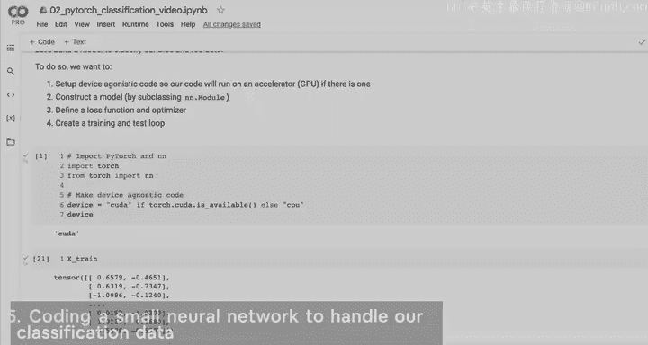
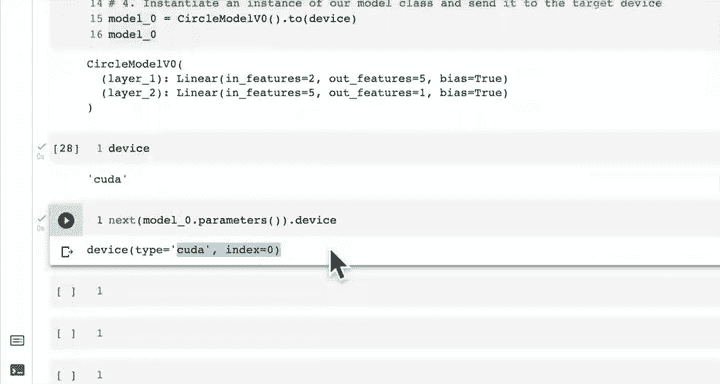
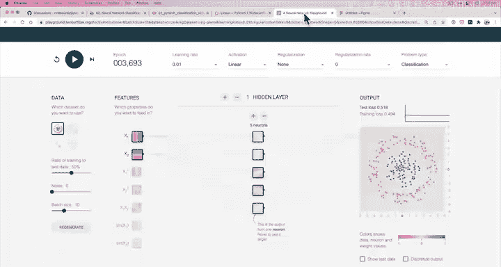

#  48：为分类数据编写神经网络 🧠



在本节课中，我们将学习如何通过子类化 `nn.Module` 来构建一个用于分类数据的神经网络。我们将从编写设备无关的代码开始，逐步创建模型层，定义前向传播方法，并将模型实例化到目标设备上。

---

## 概述

上一节我们设置了设备无关的代码，这将在后续将模型和数据发送到目标设备时发挥作用。这是一个重要的步骤，因为它确保了代码的可移植性。默认情况下，代码会在 CPU 上运行，但如果存在加速器（如 GPU），代码可能会运行得更快。

本节中，我们将通过子类化 `nn.Module` 来构建一个模型。我们将把这个过程分解为几个子步骤，并确保每一部分都能处理我们数据的形状。

---

## 构建模型的步骤

以下是构建神经网络模型的主要步骤：

1.  子类化 `nn.Module`。
2.  创建两个能够处理数据形状的 `nn.Linear` 层。
3.  定义一个 `forward` 方法来描述模型的前向计算过程。
4.  实例化我们的模型类，并将其发送到目标设备。

### 1. 子类化 `nn.Module`

几乎所有 PyTorch 模型都子类化 `nn.Module`，因为它为我们处理了许多幕后的重要工作。

```python
class CircleModelV1(nn.Module):
    def __init__(self):
        super().__init__()
```

### 2. 创建线性层

我们需要创建两个 `nn.Linear` 层，它们必须能够处理我们数据的形状。

首先，检查我们的训练数据 `X_train` 的形状。假设我们有 800 个训练样本，每个样本有 2 个特征。因此，输入特征的数量（`in_features`）是 2。

第一个线性层将输入特征从 2 维映射到 5 维。这个数字 5 是任意的，代表隐藏单元的数量。更多的隐藏单元通常意味着模型有更多机会学习数据中的模式。

第二个线性层是输出层，它将 5 维的输入映射到 1 维的输出，以匹配我们的目标 `y` 的形状。

```python
        self.layer_1 = nn.Linear(in_features=2, out_features=5)
        self.layer_2 = nn.Linear(in_features=5, out_features=1)
```

**关键点**：第二层的 `in_features` 必须与第一层的 `out_features` 匹配，否则会出现形状不匹配的错误。

### 3. 定义前向传播方法

`forward` 方法定义了模型的前向计算（前向传播）过程。它接收输入数据 `x`，并依次通过我们定义的层。



```python
    def forward(self, x):
        return self.layer_2(self.layer_1(x))
```

在这个方法中，输入 `x` 首先通过 `layer_1` 进行计算，其结果再作为输入传递给 `layer_2`，最终得到输出。

### 4. 实例化模型并发送到设备


最后，我们创建模型的一个实例，并将其移动到我们之前定义的目标设备（例如 GPU）上。

```python
model_0 = CircleModelV1().to(device)
```

我们可以检查模型的参数是否确实在目标设备上：

```python
print(next(model_0.parameters()).device)  # 应输出 'cuda:0'（如果使用GPU）
```

---

## 模型的可视化理解

我们刚刚构建的模型结构可以直观地理解为：

*   **输入层**：接收 2 个特征（`x1`, `x2`）。
*   **隐藏层**：包含 5 个神经元（或称为隐藏单元）。每个输入特征都连接到这 5 个神经元。
*   **输出层**：包含 1 个神经元，接收来自隐藏层所有 5 个神经元的输入，并产生最终的 1 维输出。

这个过程与我们编写的 `forward` 方法完全对应：`x -> layer_1 -> layer_2 -> output`。

你可以使用在线工具（如 TensorFlow Playground）来交互式地探索和可视化类似的神经网络结构，这有助于加深理解。

---

## 总结

本节课中，我们一起学习了如何为分类任务构建一个简单的多层神经网络。我们掌握了以下核心步骤：



1.  通过子类化 `nn.Module` 创建模型类。
2.  在 `__init__` 方法中定义模型的层，并确保层之间的输入输出形状匹配。
3.  在 `forward` 方法中描述数据如何通过这些层进行前向传播。
4.  实例化模型并将其移动到合适的计算设备上。


我们构建的 `CircleModelV1` 是一个基础但完整的神经网络示例。在接下来的课程中，我们将看到创建相同模型的更简洁方法，并开始训练这个模型来拟合我们的数据。