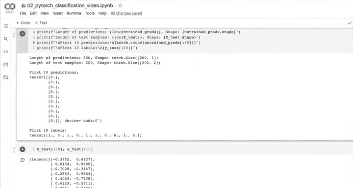
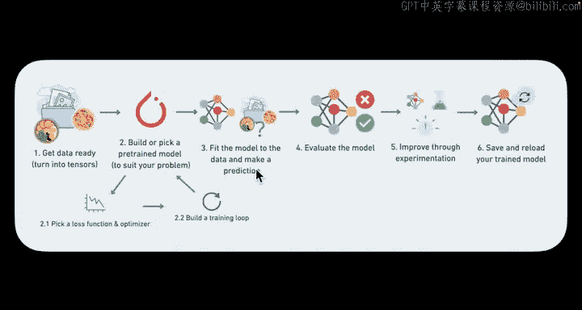

# 49：使用 torch.nn.Sequential 构建模型 🧱


在本节课中，我们将学习如何使用 PyTorch 的 `torch.nn.Sequential` 模块来构建神经网络模型。这是一种比手动子类化 `nn.Module` 更简洁、更直观的模型构建方法，尤其适用于结构简单的层叠式网络。

---

### 回顾与引入

上一节我们通过子类化 `nn.Module` 创建了一个名为 `CircleModelV0` 的神经网络。我们创建了两个线性层，第一层将 2 个输入特征映射到 5 个特征，第二层再将这 5 个特征映射到 1 个输出特征，以匹配我们的目标数据形状。我们还通过 TensorFlow Playground 和 Figma 对网络结构进行了可视化。

现在，让我们继续前进。既然我们的网络结构相当简单（只有两个层），我们可以用一种更简单的方式来复现它。

### 使用 `nn.Sequential` 复现模型

我们将使用 `torch.nn.Sequential` 来复现上面的模型。通过查看代码，你就能理解它的工作原理。

```python
model_0 = nn.Sequential(
    nn.Linear(in_features=2, out_features=5),
    nn.Linear(in_features=5, out_features=1)
).to(device)
```

这段代码创建了一个顺序模型。第一个 `nn.Linear` 层的输入特征数是 2（因为我们有两个 X 特征），输出特征数是 5。第二个 `nn.Linear` 层的输入特征数必须是 5（以匹配上一层的输出），输出特征数为 1（以匹配我们的 Y 值）。

运行后，`model_0` 与我们之前子类化创建的模型功能相同，唯一的区别是它的名称来自 `Sequential`。

### `nn.Sequential` 与子类化的对比

你可能会想，为什么一开始不介绍这种更简单的方法？`nn.Sequential` 确实是创建神经网络的更简单方式。

然而，子类化 `nn.Module` 的好处在于，当你需要构建更复杂的操作（例如在 `forward` 方法中进行自定义计算）时，了解如何构建自己的子类至关重要。`nn.Sequential` 适用于简单、按顺序逐层执行的前向传播。对于复杂的网络结构，子类化提供了更大的灵活性。

实际上，我们甚至可以将 `nn.Sequential` 用在子类化的模型内部：

```python
self.linear_layers = nn.Sequential(
    nn.Linear(in_features=2, out_features=5),
    nn.Linear(in_features=5, out_features=1)
)
```

PyTorch 提供了多种构建模型的方式，`nn.Sequential` 可能是最简单的，而子类化则能扩展到处理更复杂的神经网络。

### 探索模型参数

让我们看看模型内部发生了什么。我们可以检查模型的状态字典：

```python
print(model_0.state_dict())
```

你会看到类似以下的输出：
*   第一个线性层（`0.weight`, `0.bias`）的权重和偏置。
*   第二个线性层（`1.weight`, `1.bias`）的权重和偏置。

注意，`0.bias` 有 5 个值，因为 `out_features=5`。`0.weight` 的形状是 `(5, 2)`，即 `10` 个值（`2*5=10`）。所有这些参数目前都是随机初始化的。

PyTorch 在幕后为我们创建了所有这些参数。当我们后续编写训练循环进行反向传播和梯度下降时，优化器将微调这些值，以使模型更好地拟合数据（区分红蓝点）。

你可以想象，如果我们的网络有 50 层，每层 128 个特征，参数数量将变得极其庞大。PyTorch 帮助我们自动处理了这些复杂的计算。

### 使用未训练的模型进行预测

现在，让我们用这个未经训练的模型（参数是随机的）进行一些预测。

首先，确保将测试数据也移动到正确的设备上：

```python
with torch.inference_mode():
    untrained_preds = model_0(X_test.to(device))
```

然后，我们打印一些信息来查看预测结果：

```python
print(f"Length of predictions: {len(untrained_preds)}")
print(f"Shape of predictions: {untrained_preds.shape}")
print(f"Length of test samples: {len(X_test)}")
print(f"Shape of test samples: {X_test.shape}")
print(f"\nFirst 10 predictions:\n{untrained_preds[:10]}")
print(f"\nFirst 10 labels:\n{y_test[:10]}")
```

观察输出，你会发现预测值的长度和测试样本数都是 200，但形状不同。更重要的是，我们的预测值（是一些浮点数）与真实标签（是 0 或 1）完全不在一个范围内。例如，对预测值取整后可能全部是 0。

这是因为模型是随机初始化的，还没有经过任何学习。在评估模型时，我们希望预测值与标签格式相同（例如，通过应用 Sigmoid 函数和阈值处理转化为 0/1），我们将在后续课程中介绍这些步骤。

### 本节总结

本节课中我们一起学习了：
1.  使用 **`torch.nn.Sequential`** 快速构建顺序神经网络模型。
2.  对比了 **`nn.Sequential`** 与子类化 **`nn.Module`** 的适用场景：前者简单直接，后者灵活强大。
3.  探索了模型内部的**权重和偏置参数**，理解了 PyTorch 如何自动管理它们。
4.  使用**未经训练的模型**进行预测，观察到由于参数随机初始化，预测结果不理想，这引出了对模型训练的需求。





关键收获是：`nn.Sequential` 是构建层叠式模型的利器，而理解模型参数和预测流程是调试和优化模型的基础。在接下来的课程中，我们将通过选择损失函数、优化器并构建训练循环来“教会”模型做出更好的预测。