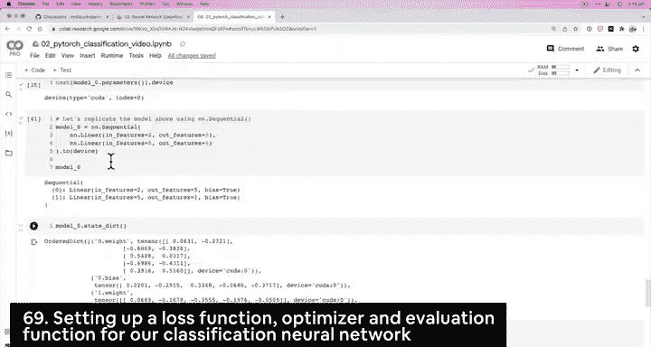
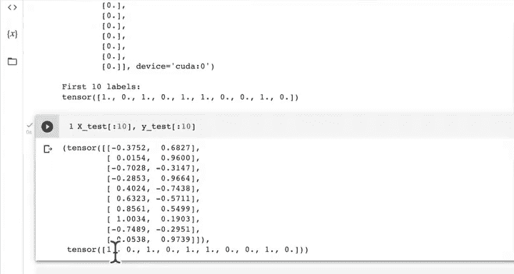
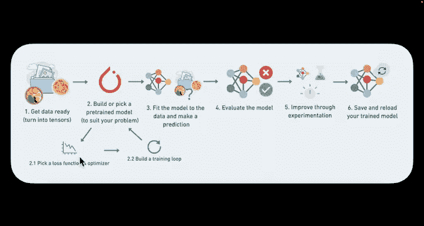

#  50：分类任务的损失函数、优化器和评估函数 📊



在本节课中，我们将学习如何为分类模型选择合适的损失函数和优化器，并创建一个评估模型性能的准确率函数。我们将使用PyTorch来实现这些核心组件。





---

## 模型回顾与本节目标

上一节我们构建了一个简单的线性分类模型来处理我们的数据。该模型有两个输入特征，五个隐藏单元，以及一个输出特征，这与我们的数据形状相匹配。

本节中，我们来看看如何为这个分类模型配置损失函数、优化器以及评估指标。

## 选择损失函数与优化器

我们已经构建了模型。现在需要为其选择一个损失函数和优化器。这是一个关键步骤，因为不同的任务需要不同的工具。

以下是常见的选择指南：

*   **回归任务**（预测数值）：通常使用**平均绝对误差**或**均方误差**。
    *   `torch.nn.L1Loss()` (MAE)
    *   `torch.nn.MSELoss()` (MSE)
*   **分类任务**（预测类别）：通常使用**二元交叉熵**或**交叉熵**。
    *   `torch.nn.BCELoss()` (二元交叉熵)
    *   `torch.nn.CrossEntropyLoss()` (交叉熵，用于多分类)

我们当前处理的是二元分类问题，因此将重点使用二元交叉熵。

## 理解二元交叉熵与Logits

在PyTorch中，你会看到两个相关的损失函数：`BCELoss` 和 `BCEWithLogitsLoss`。这可能会让人困惑。

*   **`BCELoss`**：要求模型的输出**已经通过Sigmoid激活函数**处理过（将输出压缩到0到1之间，代表概率）。
*   **`BCEWithLogitsLoss`**：**将Sigmoid激活函数和BCELoss结合在一个类中**。它接收原始的模型输出（称为 **logits**），并在内部应用Sigmoid和交叉熵计算。

在深度学习中，**logit** 通常指**馈入Sigmoid或Softmax等激活函数之前的原始输出值**。

使用 `BCEWithLogitsLoss` 的优势在于其**数值稳定性更高**，因为它将两个操作合并，利用了数值计算的技巧。因此，对于我们的二元分类模型，我们将选择它。

## 选择优化器

优化器负责根据损失函数的梯度来更新模型的参数。PyTorch提供了多种优化器。

以下是两个最常用且有效的选择：

*   **随机梯度下降**：`torch.optim.SGD`
*   **Adam优化器**：`torch.optim.Adam`

对于初学者，掌握这两个优化器足以应对许多问题。在本例中，我们将使用SGD。

## 代码实现：设置损失函数与优化器

现在，让我们将理论转化为代码。我们将设置损失函数为 `BCEWithLogitsLoss`，优化器为 `SGD`。

```python
# 导入PyTorch
import torch
from torch import nn

# 1. 设置损失函数
# 使用BCEWithLogitsLoss，它内部包含了Sigmoid激活函数
loss_fn = nn.BCEWithLogitsLoss() # 适用于二元分类

# 2. 设置优化器
# 使用随机梯度下降(SGD)，学习率设为0.1
optimizer = torch.optim.SGD(params=model.parameters(), # 要优化的模型参数
                            lr=0.1) # 学习率
```

## 创建评估函数：准确率

对于分类问题，**准确率**是一个直观的评估指标。它衡量模型预测正确的样本占总样本的比例。

准确率的公式可以表示为：
**准确率 = (正确预测的样本数 / 总样本数) × 100%**

让我们用PyTorch实现一个准确率计算函数。

```python
def accuracy_fn(y_true, y_pred):
    """计算预测准确率（百分比）。
    
    参数:
        y_true: 真实标签张量。
        y_pred: 预测标签张量。
        
    返回:
        准确率百分比。
    """
    # 计算预测正确的样本数量
    correct = torch.eq(y_true, y_pred).sum().item()
    # 计算准确率百分比
    acc = (correct / len(y_pred)) * 100
    return acc
```

这个函数的工作原理如下：
1.  `torch.eq(y_true, y_pred)`：逐元素比较真实标签和预测标签是否相等，返回一个布尔值张量。
2.  `.sum().item()`：统计`True`的数量（即预测正确的数量），并将其转换为Python数值。
3.  用正确数量除以总样本数，再乘以100，得到百分比形式的准确率。


## 总结与展望

本节课中我们一起学习了为分类任务配置核心组件：

1.  **损失函数**：我们选择了 `nn.BCEWithLogitsLoss()` 作为二元分类的损失函数，因为它结合了Sigmoid激活并具有更好的数值稳定性。
2.  **优化器**：我们选择了 `torch.optim.SGD` 作为优化器，并设置了学习率为0.1来更新模型参数。
3.  **评估函数**：我们创建了 `accuracy_fn` 函数来计算模型预测的准确率，这是一个分类任务中常用的性能指标。

现在，我们已经准备好了模型、损失函数、优化器和评估指标。在接下来的课程中，我们将把这些部分组合起来，**编写训练循环**，让模型真正开始从数据中学习。