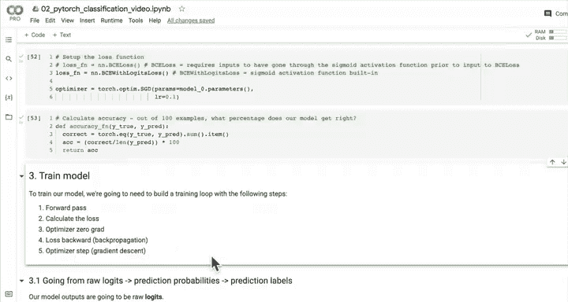

#  51：从模型 Logits 到预测概率再到预测标签 🎯


在本节课中，我们将学习如何将模型的原始输出（logits）转换为预测概率，并最终得到预测标签。这是评估分类模型性能的关键步骤。

## 概述

上一节我们讨论了分类模型的不同损失函数选项。本节中，我们来看看如何构建一个完整的训练循环。为此，我们需要理解模型输出的处理流程：从原始 logits 到预测概率，再到最终的预测标签。

## 从 Logits 到预测概率

模型的原始输出被称为 **logits**。在深度学习中，logits 指的是未经任何激活函数处理的模型输出。

为了将这些 logits 转换为预测概率，我们需要将其传递给一个激活函数。

以下是激活函数的选择：
*   对于**二元分类**，使用 **Sigmoid** 函数。
*   对于**多类分类**，使用 **Softmax** 函数。

我们当前处理的是二元分类问题，因此使用 Sigmoid 函数。Sigmoid 函数将 logits 压缩到 0 到 1 之间，表示模型认为样本属于某个类别的概率。

**代码示例：**
```python
# 模型原始输出（logits）
y_logits = model0(X_test.to(device))

# 通过 Sigmoid 函数转换为预测概率
y_pred_probs = torch.sigmoid(y_logits)
```

## 从预测概率到预测标签

得到预测概率后，我们需要将其转换为具体的类别标签。这通常通过设置一个**决策边界**来完成。

对于二元分类，常见的决策边界是 0.5：
*   如果预测概率 **≥ 0.5**，则预测标签为 **1**。
*   如果预测概率 **< 0.5**，则预测标签为 **0**。

在 PyTorch 中，我们可以使用 `torch.round()` 函数自动实现这个四舍五入的过程。

**代码示例：**
```python
# 将预测概率四舍五入为预测标签
y_pred_labels = torch.round(y_pred_probs)

# 或者，一步完成从 logits 到预测标签的转换
y_pred_labels = torch.round(torch.sigmoid(model0(X_test.to(device))))
```

## 验证流程

为了确保我们的转换步骤是正确的，可以进行一个简单的等式检查。以下代码验证了分步转换与一步转换的结果是否一致。

**代码示例：**
```python
# 分步计算预测标签
y_preds = torch.round(torch.sigmoid(model0(X_test.to(device))))

# 一步计算预测标签（用于验证）
y_pred_labels = torch.round(torch.sigmoid(model0(X_test.to(device))))

# 检查两者是否相等（使用 .squeeze() 去除多余的维度）
print(torch.eq(y_preds.squeeze(), y_pred_labels.squeeze()))
```

## 构建训练与测试循环

理解了从 logits 到预测标签的完整流程后，我们现在具备了构建训练循环的所有要素。

以下是 PyTorch 训练循环的核心步骤：
1.  前向传播：计算模型输出（logits）。
2.  计算损失：使用损失函数（如 `BCEWithLogitsLoss`）比较预测与真实值。
3.  优化器梯度归零：清除上一轮的梯度。
4.  反向传播：计算损失相对于模型参数的梯度。
5.  优化器步进：根据梯度更新模型参数。

在下一节中，我们将一起动手实现这个训练循环。

## 总结



本节课中，我们一起学习了处理分类模型输出的完整流程。我们了解到，模型的原始输出是 logits，通过 Sigmoid 激活函数可以将其转换为预测概率，最后通过设置决策边界（如四舍五入到 0.5）得到预测标签。这个过程是连接模型输出与损失函数计算、以及最终模型评估的关键桥梁。