#  53：探讨模型改进方案 🚀

在本节课中，我们将学习如何改进一个深度学习模型。我们将从模型本身的角度出发，探讨几种提升模型性能的常见方法，并通过实践来理解这些概念。

欢迎回来。在上一个视频中，我们从 `helper_functions.py` 脚本中导入了一系列辅助函数。随着编写越来越多的代码，将常用代码存储在某个地方（例如一个 Python 脚本中），然后在需要时导入使用，这是一种非常标准的做法。这与我们使用 PyTorch 的方式类似，PyTorch 本质上就是一个用于构建神经网络的 Python 脚本集合。

我们当前的目标是训练一个模型来区分蓝色和红色的点。😊

但是，我们当前的模型只能绘制直线。我让大家思考过，我们的线性模型是否能够分离这些数据。也许可以。我提出了一个挑战：看看如果训练 1000 个周期，它是否能有所改善。那么，准确率有提高吗？

说到训练更多周期，我们现在进入第 5 部分：改进模型。这是从模型的角度出发的。现在，让我们讨论一些方法。如果你在训练一个机器学习模型或深度学习模型后，对结果不满意，你该如何改进它们？这将是我们要深入探讨的一个概览。

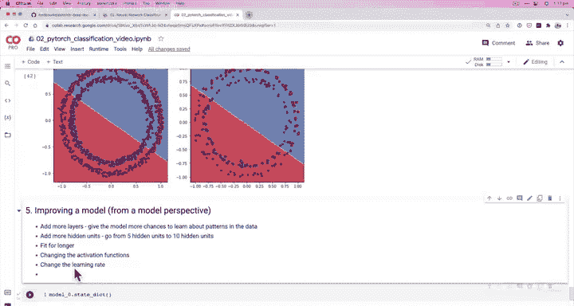

以下是几种改进模型的方法：

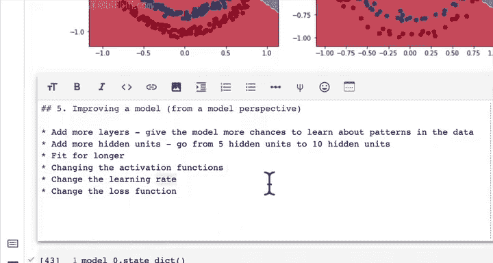

*   **添加更多层**：为模型提供更多学习数据模式的机会。为什么这会有帮助？因为如果我们的模型目前有两层，我们大约有 20 个参数。如果我们有 10 层，我们就有了 10 倍数量的参数来尝试学习和表示数据中的模式。
*   **添加更多隐藏单元**：我们创建的这个模型，每一层有 5 个隐藏单元。我们可以将隐藏单元从 5 个增加到 10 个。与上面相同的原理适用：模型有更多的参数来表示我们的数据，这可能会带来改进。但请注意，对于我们的简单数据集，添加过多的层或隐藏单元可能导致模型过于复杂，试图为我们的数据集调整过多的数字。
*   **训练更长时间**：给模型更多学习的机会，因为每个周期都是对数据的一次遍历。也许 100 次查看这些数据还不够，所以你可以训练 1000 次，这正是之前的挑战。
*   **更改激活函数**：我们目前使用的是 Sigmoid 激活函数，这通常是用于二元分类问题的激活函数。但还有其他激活函数可以放在模型中，我们稍后会讲到。
*   **更改学习率**：学习率是优化器在每个周期调整参数的幅度。如果学习率太小，模型可能因为参数变化太慢而学不到任何东西。另一方面，如果学习率太高，更新可能太大，导致模型“爆炸”。机器学习中确实存在一个称为“梯度爆炸”的问题，即数值变得过大。相反，也存在“梯度消失”问题，即梯度迅速趋近于零。
*   **更改损失函数**：但目前，Sigmoid 和二元交叉熵损失函数已经相当不错和标准了。

我们将重点看看其中一些选项：添加更多层、训练更长时间，也许还会改变学习率。现在，让我们为刚才讨论的内容添加一些具体说明。我们已经将模型拟合到数据并进行了预测。让我逐步回顾一下我们做到了哪一步。

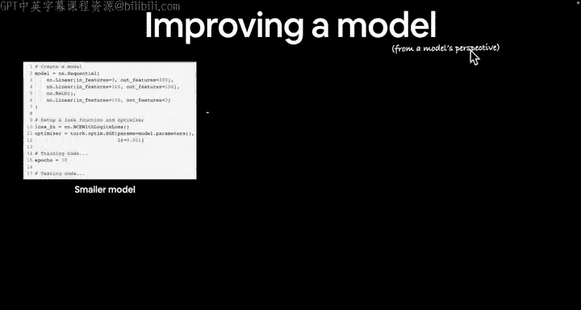

我们完成了数据准备、模型构建、训练循环编写、模型拟合、预测以及模型可视化评估。我们对结果不满意，所以现在进入第 5 步：通过实验进行改进。我们暂时不需要使用 TensorBoard，我们将在较高层次上讨论它。TensorBoard 是 PyTorch 的一个工具，用于帮助监控实验。我们稍后会看到它。然后，在我们得到一个满意的模型之前，我们不会保存模型。😊

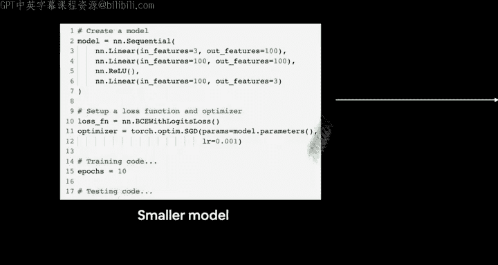

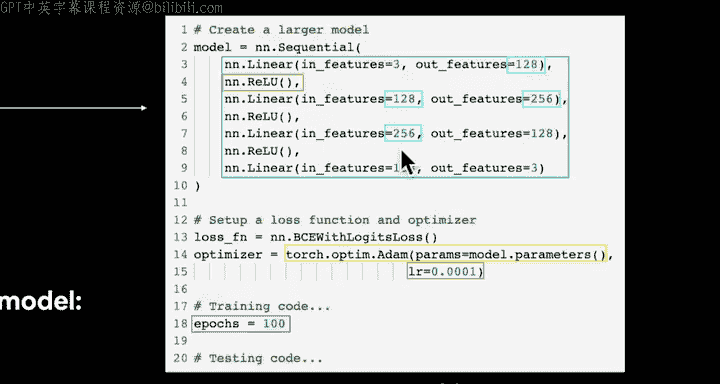

如果我们看看刚才讨论的内容，从模型角度改进模型，这次让我们用一些具体的例子来谈谈我们讨论过的事情。

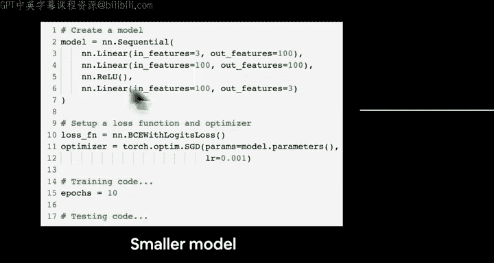

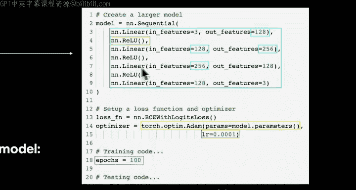

假设我们有一个模型。这不是我们正在使用的确切模型，但结构相似。我们有 1, 2, 3, 4 层。我们有一个损失函数：二元交叉熵损失。我们有一个优化器：随机梯度下降。如果我们编写一些训练代码，这是 100 个周期。测试代码在这里，我把它剪掉了，因为它放不下幻灯片。

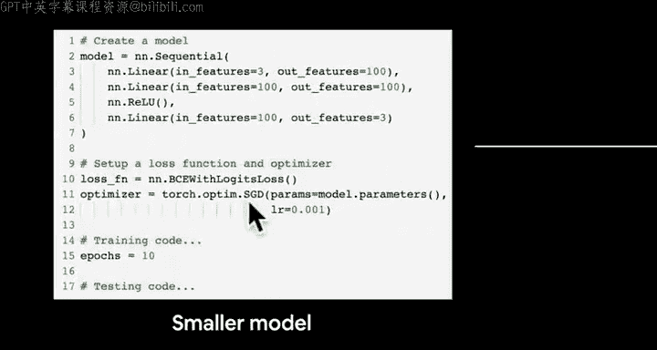

然后，如果我们想转向一个更大的模型，让我们在这里添加一些颜色来突出显示发生了什么：

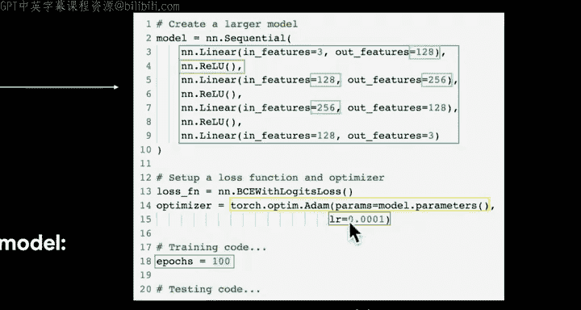

*   **添加层**：这个模型有 1, 2, 3, 4, 5, 6 层。
*   **更改隐藏单元数量**：隐藏单元就是这些特征。我们从 100 到 128 再到 128。请记住，前一层的输出特征必须与下一层的输入特征对齐。然后我们增加到 256。记得我说过在深度学习中，8 的倍数通常是不错的选择吗？这就是这些数字的由来。
*   **更改/添加激活函数**：我们之前没有见过这个：`nn.ReLU()`。如果你想提前了解一下 `nn.ReLU` 是什么，你怎么找到相关信息？嗯，我直接谷歌 `nn.ReLU`。但我们稍后会看看这是什么。😊 我们可以看到，这个模型有一个，但更大的模型在线性层之间散布了一些 ReLU 层。也许这是一个提示。如果我们结合一个线性层和一个 ReLU 层会怎样？什么是 ReLU 层？我不会剧透，我们稍后会了解。
*   **更改优化函数**：我们有 SGD。还记得我说过 Adam 是另一个在许多问题上也表现良好的流行优化器吗？所以 Adam 对我们来说可能是更好的选择。
*   **更改学习率**：也许这个学习率有点太高了。所以我们把它除以 10。
*   **训练更长时间**：所以从 10 个周期增加到 100 个周期。

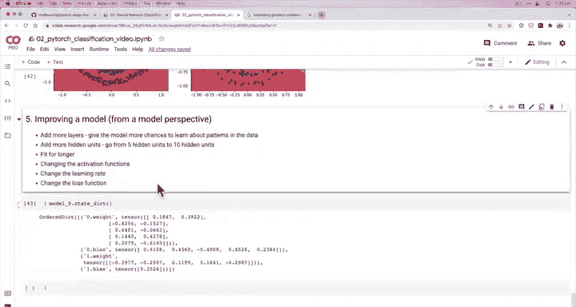

那么，我们如何尝试用我们自己的模型来实现其中的一些步骤，看看是否能改善我们目前的情况呢？坦率地说，这并不令人满意。我们正在尝试构建一个神经网络。神经网络应该是能够学习几乎任何东西的模型。而我们甚至无法区分一些蓝点和红点。

在下一个视频中，我们如何通过编写一些代码来执行这里的某些步骤？事实上，如果你想自己尝试，我强烈鼓励你这样做。所以，我建议从尝试添加更多层、添加更多隐藏单元和训练更长时间开始。你可以暂时保持所有其他设置不变。😊

但我将在下一个视频中见到你。

欢迎回来。在上一个视频中，我们讨论了一些从模型角度改进模型的方法，主要是为了改进模型，使其预测更好，使其学习的模式能更好地表示数据，从而区分蓝点和红点。你可能想知道为什么我们在这里说“从模型角度”。

让我把这些选项写下来。😊 这些选项都来自模型的角度，因为它们直接处理模型，而不是数据。改进模型结果的另一种方式是，如果模型本身已经合理，在机器学习和深度学习中，你可能知道，通常如果你有更多的数据样本，模型会学习得更好或获得更好的结果，因为它有更多的学习机会。所以，从数据角度改进模型还有其他一些方法，但我们将专注于从模型角度改进模型。

因为这些选项都是我们作为机器学习工程师和数据科学家可以改变的数值，所以它们被称为**超参数**。这里有一个重要的区别：**参数**是模型内部的数字，例如权重和偏置，是模型自行更新的值。**超参数**是我们作为机器学习工程师和数据科学家可以改变的值，例如添加更多层、更多隐藏单元、训练更长时间（周期数）、激活函数、学习率、损失函数。这些都是超参数。

所以，让我们改变模型的一些超参数。我们将创建 `CircleModelV1`。我们也将从 `nn.Module` 导入，我们可以使用 `nn.Sequential` 编写这个模型，但为了练习，我们将子类化 `nn.Module`。为什么我们会使用 `nn.Sequential`？因为正如你将看到的，我们的模型并不太复杂。实际上，`nn.Sequential` 也是 `nn.Module` 的一个版本。但我们在这里子类化 `nn.Module` 是为了练习，并且为了以后，如果你想或需要构建更复杂的模型，你会在实际中看到很多 `nn.Module` 的子类。

我们要做的第一个改变是更新隐藏单元的数量。所以输出特征，我可以在我们做之前写下来。让我们尝试通过添加更多隐藏单元来改进我们的模型。所以，这将从 5 增加到 10。并且我们想要增加层数。所以，我们想从 2 层增加到 3 层。我们将添加一个额外的层，然后增加周期数。所以，我们将从 100 增加到 1000。

现在，如果我们一次性进行这三项更改，为什么这可能会有问题？嗯，因为如果有任何改进或退化，我们可能不知道是哪一项带来的。所以请记住这一点，我只是以此为例说明如何更改所有这些。但通常，当你进行机器学习实验时，你希望一次只更改一个值并跟踪结果。这被称为机器学习中的实验跟踪。我们将在课程稍后部分看一下实验跟踪。但请记住这一点。科学家喜欢一次改变一个变量，以便控制正在发生的事情。

但我们将在这里创建下一层，`layer_2`，当然，它需要与前一层的输出特征数量相同的输入特征。这是 2，因为我们的 `X_train` 有……让我们只看前五个样本，有两个特征。所以现在我们将创建 `self.layer_3`，它等于调用 `nn.Linear`。这里的输入特征将是 10，因为上面一层的输出特征等于 10。所以到目前为止，我们在这里所做的改变是：我们在这个模型的 V0 版本中，隐藏单元是 5，现在我们有 10。并且我们有了第三层，而之前是 2 层。所以，这是我们的两个主要改变。输出特征等于 1，因为 y……让我们看看 y。我们的 y 只是一个数字。所以请记住，模型的输入和输出形状是深度学习中最重要的方面之一。我们稍后会看到这些形状的不同值。但因为我们正在处理这个数据集，我们专注于两个输入特征和一个输出特征。

现在我们已经准备好了层，下一步是什么？嗯，我们必须重写 `forward` 方法，因为每个 `nn.Module` 的子类都必须实现一个 `forward` 方法。我们在这里要做什么？嗯，我可以给你看一个选项。我们可以用 `z`（逻辑值实际上用 z 表示，有趣的事实），但你可以在这里放任何变量。所以这可以是 `x1`，或者如果你想，你可以重置 `x`。我只是放一个不同的变量，因为对我来说不那么混淆。然后我们可以通过 `self.layer_2(z)` 来更新 `z`。因为上面的 `z` 是第 1 层的输出，现在它进入这里。然后如果我们再次 `z = self.layer_3(z)`，这将接受上面的 `z`。所以这表示：给我 `x`，让它通过第 1 层，赋值给 `z`，然后用 `self.layer_2` 和 `z` 作为输入创建一个新变量 `z` 或覆盖 `z`。然后我们再次得到 `z`，第 2 层的输出作为第 3 层的输入。然后我们可以返回 `z`。所以这只是将我们的数据通过这些层中的每一层。

但是，一种可以利用 PyTorch 加速的方法是同时调用它们。所以 `layer_3(self.layer_2(self.layer_1(x)))`，这通常是我编写它们的方式，但在幕后，因为它同时执行所有操作，你可以利用任何可能的加速。希望这应该是 `layer_1`。所以这里按顺序进行。发生了什么？嗯，它首先计算括号内的内容。所以 `layer_1(x)` 将通过第 1 层，然后 `x` 进入第 1 层的输出将进入第 2 层。然后对第 3 层重复相同的过程。所以这种方式，这种编写操作的方式，在可能的情况下利用了幕后的加速。

我们已经完成了 `forward` 方法，我们只是将数据通过具有额外隐藏单元和额外总层数的层。所以现在让我们创建 `CircleModelV1` 的一个实例，我们将把它设置为 `model_1`，我们将编写 `CircleModelV1` 并将其发送到目标设备，因为我们喜欢编写设备无关的代码。

然后我们将查看 `model_1`。所以让我们看看那里发生了什么。很好。所以现在我们有一个三层模型，具有更多的隐藏单元。所以我想知道，如果我们训练这个模型更长时间，我们是否会在这里得到改进。

所以我对你的挑战是：我们已经完成了这些步骤。为了完整性，我们将在接下来的几个视频中完成它们。😊 但我们需要：1. 创建一个损失函数。我给你一个提示：它与我们已经使用的那个非常相似。2. 我们需要创建一个优化器。然后，一旦我们完成了这些，我们需要为 `model_1` 编写一个训练和评估循环。

所以尝试一下。否则，我将在下一个视频中见到你，我们将一起完成所有这些。

欢迎回来。在上一个视频中，我们子类化了 `nn.Module` 来创建 `CircleModelV1`，这是对 `CircleModelV0` 的升级，因为我们添加了更多的隐藏单元（从 5 到 10），并且我们添加了整整一个额外的层。我们已经准备好了一个实例。

所以，在工作流程中，我们到了这一步：我们有了数据（我们没有改变数据），我们构建了新模型。现在我们需要选择一个损失函数，我之前暗示过我们将使用与之前相同的损失函数和相同的优化器。你可能已经完成了所有这些步骤，所以你可能已经知道这个模型在我们的数据集上是否有效。但这就是我们在这个视频中要努力找出的。

所以，我们构建了新模型。现在让我们选择一个损失函数和优化器。我们现在几乎可以闭着眼睛做所有这些了：构建训练循环，将模型拟合到数据，进行预测和评估模型。

我们回到这里，设置一个损失函数。😊 顺便说一下，如果你想知道为什么在这里添加更多特征（我们之前已经暗示过这一点）以及为什么一个额外的层会改进我们的模型？嗯，再次回到这样一个事实：如果我们添加更多的神经元，如果我们添加更多的隐藏单元，如果我们添加更多的层，它只是给我们的模型更多的数字来调整。所以看看这里发生了什么，第 1 层，第 2 层。看看我们有多少个。与 `model_0.state_dict()` 相比。我们有所有这些。这是模型 0，我们刚刚升级了它。看看仅仅添加一个额外的层和更多的隐藏单元，我们多了多少。所以现在我们的优化器可以改变这些值，希望创建我们试图拟合的数据的更好表示。所以我们有更多的机会来学习目标数据集中的模式。

这就是其背后的理论。所以让我们去掉这些。让我们创建一个损失函数。😊 我们要用什么？嗯，我们将使用 `nn.BCEWithLogitsLoss()`。我们的优化器将保持与之前相同：`torch.optim.SGD`。但我们必须意识到，因为我们使用了一个新模型，我们必须传入 `model_1` 的参数。这些是我们想要优化的参数，学习率将是 0.1。这是我们之前使用的相同学习率吗？学习率是 0.1。哦，可能我们的学习率太大了。0.1。我们在哪里创建优化器？所以我们在这里写了很多代码。优化器在那里。0.1。这是一个运行。所以我们将保持它为 0.1，以尽可能保持所有事情相同。

所以我们将设置 `torch.manual_seed(42)` 以使训练尽可能可重现，`torch.cuda.manual_seed(42)`。现在，正如我之前所说，如果你的数字与我的不完全相同，不要太担心，方向更重要，无论是好的方向还是坏的方向。

所以现在让我们设置周期数。我们这次也想训练更长时间。所以 1000 个周期。这是我们试图做的三个改进之一：添加更多隐藏单元，增加层数，增加周期数。所以我们将给我们的模型 1000 次查看数据的机会，以尝试改进其模式。

所以将数据放在目标设备上。我们想编写设备无关的代码，是的，我们已经做过了，但我们将再次写出来练习，因为即使我们可以将很多这些功能化，当我们仍处于基础阶段时，练习这里发生的事情是好的，因为我想让你在我们开始功能化之前能够闭着眼睛做这些。所以将训练数据和测试数据放到目标设备上，无论是 CPU 还是 GPU。

然后我们将……嗯，我们的歌是什么？😊 对于任何 PyTorch 范围，让我们循环遍历周期。我们将从训练开始。训练我们做什么？嗯，我们将 `model_1` 设置为训练模式，然后我们的第一步是什么？嗯，我们必须进行前向传播。模型的原始输出是什么？嗯，模型的原始输出是逻辑值。所以 `model_1`，我们将传递训练数据给它，我们将挤压它，以便去掉一个额外的维度。如果你不相信我们想去掉那个维度，尝试运行没有 `.squeeze()` 的代码。然后 `y_pred = torch.round(torch.sigmoid(y_logits))`，我们在逻辑值上调用 sigmoid 以从逻辑值转换为预测概率，再转换为预测标签。

然后我们下一步做什么？嗯，我们计算损失和准确率。记住，准确率是可选的，但损失不是可选的。所以我们将在这里传入。我们的损失函数将接受……我想知道它是否可以直接使用 `y_pred`？我认为不行，因为我们使用的是……我们需要逻辑值在这里。为什么是逻辑值和为什么是 `y_train`？因为 `y`……哦，谷歌拼写纠正了错误的东西。我们有 `y_logits`，因为我们在这里使用带逻辑值的二元交叉熵损失。

所以让我们继续推进。我们现在想要我们的准确率，也就是我们的准确率函数。我们将按相反的顺序传入参数，这有点令人困惑，但我保持了评估函数的顺序与 PyTorch 相同。`y_pred` 等于 `y_pred`。然后我们将优化器的梯度归零：`optimizer.zero_grad()`。你可能注意到我们开始加快了一点速度。这完全没问题。如果我打字太快，你总是可以放慢视频速度，或者你可以只看我们在做什么，然后自己之后编写代码。代码资源将始终可用。

我们将进行反向传播：`loss.backward()`。😊 并执行反向传播。我们加快速度的唯一原因是我们已经涵盖了这些步骤。所以任何我们在这里花时间的东西，我们都在之前的视频中介绍过。然后 `optimizer.step()`，这是对我们模型所有参数进行调整的地方，希望创建数据的更好表示。

然后我们进行测试。测试的第一步是什么？嗯，我们调用 `model_1.eval()` 将其置于评估模式，并且因为我们要进行预测，我们将打开 `torch.inference_mode()`。预测，我称之为预测，其他地方称之为推理。😊 记住，机器学习对同一事物有很多不同的名称。前向传播。所以我们将在这里创建 `test_logits`：`test_logits = model_1(X_test)`。我们将挤压它们，因为我们不想要那个额外的维度。我将在这里添加一些代码单元格，以便我们有更多空间。我在屏幕中间打字。然后我将在这里放入 `test_pred`。我们如何从逻辑值得到预测？嗯，我们使用 `torch.round(torch.sigmoid(test_logits))`。使用 sigmoid 是因为我们处理的是二元分类问题，要将二元分类问题的逻辑值转换为预测概率，我们使用 sigmoid 激活函数。

然后我们将计算损失。所以我们的模型在测试数据上有多错误？所以 `test_loss = loss_fn(test_logits, y_test)`。然后我们还将计算测试准确率：`test_acc = accuracy_fn(y_true=y_test, y_pred=test_pred)`。

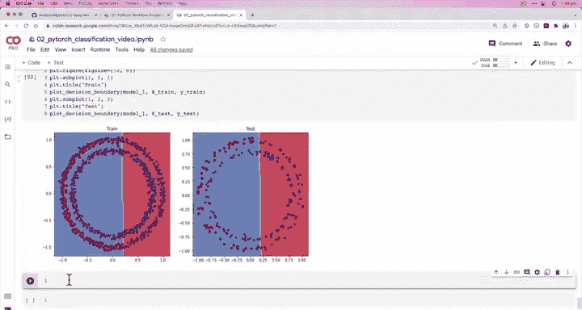

我们的最后一步是打印出正在发生的事情。每个教程都需要一首歌。如果可以，我会用歌曲教一切。😊 歌曲和舞蹈。所以因为我们训练 1000 个周期，我们每 100 个周期打印出一些东西怎么样？所以 `print(f"Epoch: {epoch} | Loss