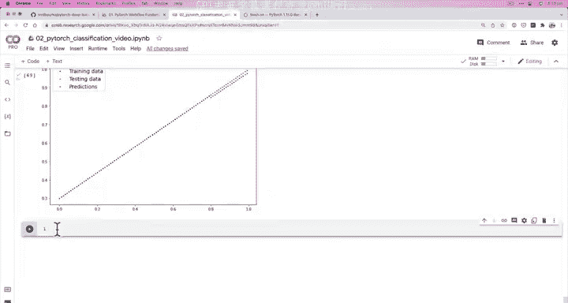

# 55：评估模型预测 📊


在本节课中，我们将学习如何评估我们模型的预测结果。我们将通过可视化预测来确认模型是否真正学到了数据中的规律，并探讨模型在特定数据集上表现不佳的可能原因。

## 概述

上一节我们通过一个简单的回归问题验证了模型架构具备学习能力。本节中，我们来看看如何通过可视化手段评估模型在测试集上的预测表现，并分析模型在复杂数据上可能遇到的挑战。

## 模型预测与可视化

为了确认模型学到了有用的信息，而不仅仅是损失数值在下降，我们需要进行预测并将其可视化。以下是具体步骤：

首先，将模型设置为评估模式：

```python
model2.eval()
```

接着，在推理模式下进行预测：

```python
with torch.inference_mode():
    y_preds = model2(X_test_regression)
```

以下是绘制预测结果的关键步骤：

1.  准备训练数据：`X_train_regression` 和 `y_train_regression`
2.  准备测试数据：`X_test_regression` 和 `y_test_regression`
3.  使用我们之前定义的 `plot_predictions` 函数进行可视化

## 解决设备不匹配问题

在执行可视化时，我们可能会遇到一个常见错误：`cuda device type tensor to numpy`。这是因为我们的绘图函数基于 Matplotlib，而 Matplotlib 底层使用 NumPy 库，NumPy 只能在 CPU 上运行。

解决方法是在将张量传递给绘图函数之前，将其转移到 CPU：

```python
# 对所有张量调用 .cpu() 方法
X_train_cpu = X_train_regression.cpu()
y_train_cpu = y_train_regression.cpu()
X_test_cpu = X_test_regression.cpu()
y_test_cpu = y_test_regression.cpu()
y_preds_cpu = y_preds.cpu()
```

## 结果分析与启示

成功绘图后，我们可以看到预测点（红色）非常接近真实测试数据点。这证实了我们的模型确实具备学习能力，它能够在简单的回归数据集上做出准确的预测。

这个结果引出了一个关键问题：既然模型有能力学习，为什么它在之前的圆形分类数据集上表现不佳？

问题的核心可能在于数据本身或模型结构：

*   **数据特性**：圆形数据并非由简单的直线构成。
*   **模型限制**：我们当前的模型 `model2` 仅由线性函数堆叠而成。线性函数的本质是**直线**，其公式为 `y = wx + b`。

如果数据中存在**非线性**关系，仅用线性函数组成的模型可能无法有效学习。

## 下一步探索

这个发现为我们指明了下一步的方向。在 PyTorch 的 `torch.nn` 模块中，除了线性层，还存在一类称为**非线性激活函数**的组件。我们实际上已经在本课程中接触过其中之一。

我鼓励你提前查看 `torch.nn` 的文档，探索这些非线性激活函数，并思考它们如何能帮助我们的模型学习更复杂的数据模式。

## 总结



本节课中，我们一起学习了如何通过可视化来评估模型的预测结果，确认了模型架构具备基础学习能力。我们遇到了并解决了张量设备不匹配的问题，更重要的是，通过对比模型在不同数据集上的表现，我们发现了纯线性模型在处理非线性数据时的局限性。这为我们引入更强大的模型组件——非线性激活函数——做好了铺垫。