#  56：缺失的一环：非线性 🧩


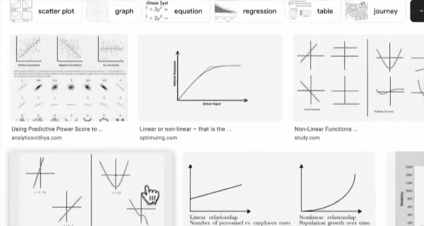

在本节课中，我们将要学习深度学习中的一个核心概念：非线性。我们将探讨为什么线性模型在处理复杂数据（如圆形数据）时能力有限，以及如何通过引入非线性激活函数（如ReLU和Sigmoid）来构建更强大的神经网络模型。我们将从理论理解过渡到代码实践，最终构建并训练一个能够处理非线性数据的模型。

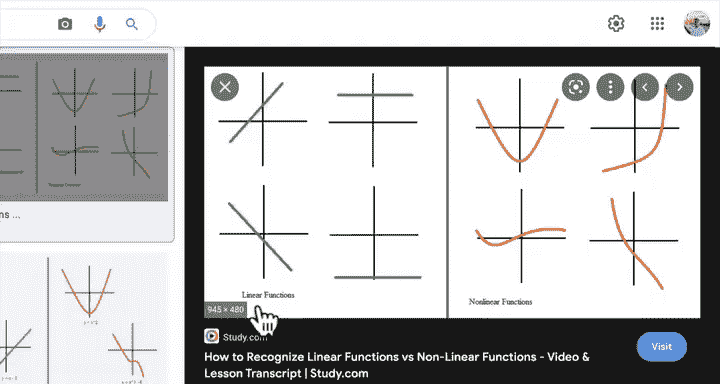

---

## 概述：线性与非线性

上一节我们介绍了线性模型，并看到它在处理直线数据时表现良好。本节中，我们来看看当数据不是直线时会发生什么。

线性函数意味着“直线”。而非线性函数则意味着“非直线”，例如曲线。我们之前构建的模型只具备使用直线的能力，但我们的数据是圆形的。因此，模型无法很好地拟合数据。这就是我们需要非线性的原因。

在机器学习和深度学习中，神经网络本质上就是大量线性函数和非线性函数的组合。这赋予了它们发现数据中复杂模式的能力，无论是识别披萨图片中的曲线，还是区分红蓝圆圈。

---

## 1. 准备非线性数据 🔵🔴

为了实践非线性模型，我们首先需要重新创建并准备我们的红蓝圆圈数据集。

以下是创建和可视化数据集的步骤：

```python
import torch
from sklearn.datasets import make_circles
from sklearn.model_selection import train_test_split
import matplotlib.pyplot as plt

# 1. 创建数据集
n_samples = 1000
X, y = make_circles(n_samples=n_samples, noise=0.03, random_state=42)

# 2. 可视化数据
plt.figure(figsize=(8, 6))
plt.scatter(X[:, 0], X[:, 1], c=y, cmap=plt.cm.RdYlBu)
plt.title("Red and Blue Circles (Non-linear Data)")
plt.show()

# 3. 转换为张量并划分训练/测试集
X = torch.from_numpy(X).type(torch.float)
y = torch.from_numpy(y).type(torch.float)

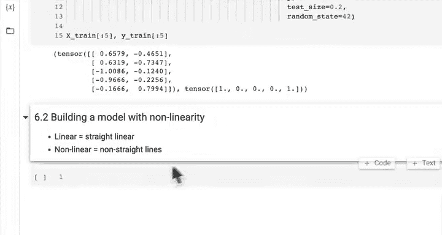


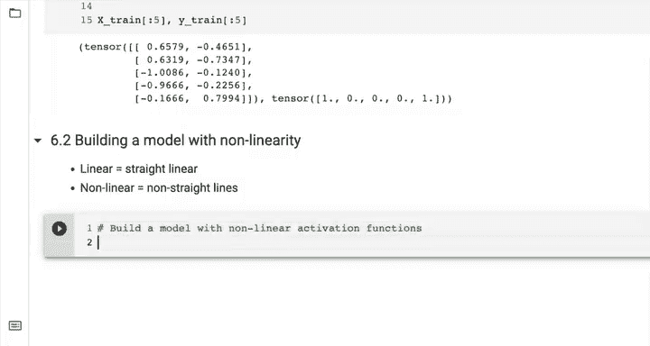

X_train, X_test, y_train, y_test = train_test_split(X, y, test_size=0.2, random_state=42)
```


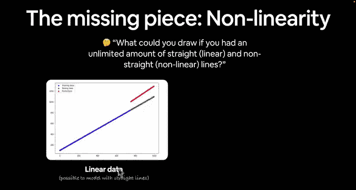

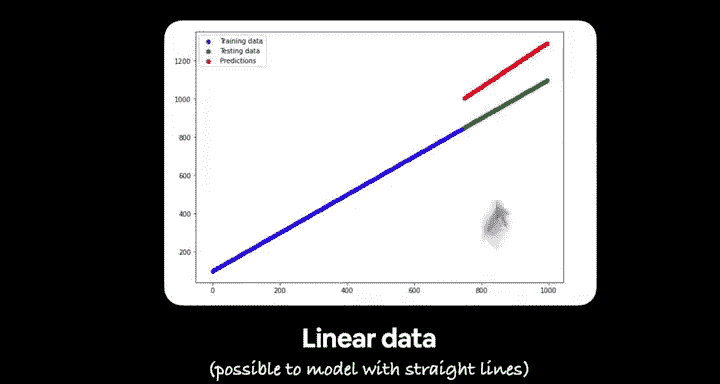

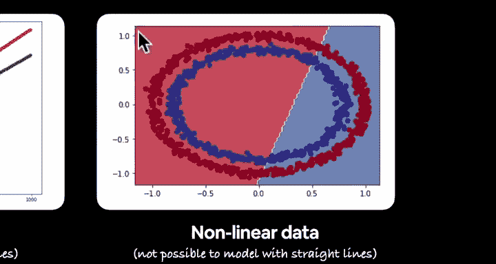

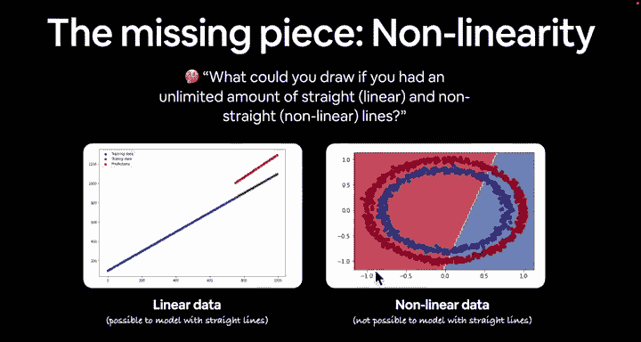

---

## 2. 构建带非线性的模型 🏗️

现在，让我们构建一个包含非线性激活函数的神经网络模型。我们将使用ReLU作为隐藏层之间的激活函数。

以下是模型的定义：

```python
from torch import nn

class CircleModelV2(nn.Module):
    def __init__(self):
        super().__init__()
        self.layer1 = nn.Linear(in_features=2, out_features=10)
        self.layer2 = nn.Linear(in_features=10, out_features=10)
        self.layer3 = nn.Linear(in_features=10, out_features=1)
        self.relu = nn.ReLU() # 非线性激活函数！

    def forward(self, x):
        # 前向传播：线性 -> ReLU -> 线性 -> ReLU -> 线性
        return self.layer3(self.relu(self.layer2(self.relu(self.layer1(x)))))

# 实例化模型并检查结构
model_3 = CircleModelV2()
print(model_3)
```

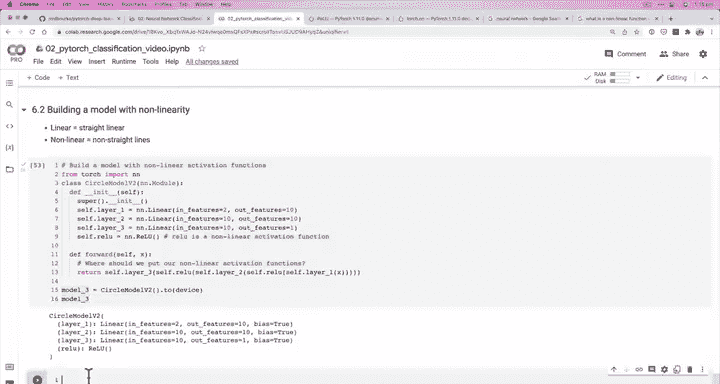


**核心概念解释**：
*   **`nn.Linear`**：执行线性变换 `y = xA^T + b`。
*   **`nn.ReLU`**：执行非线性变换 `ReLU(x) = max(0, x)`。它将所有负输入变为0，保持正输入不变，从而引入“弯曲”。

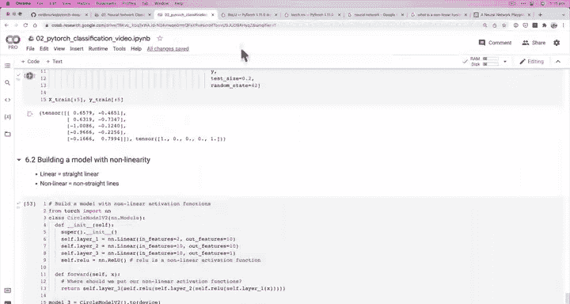

---

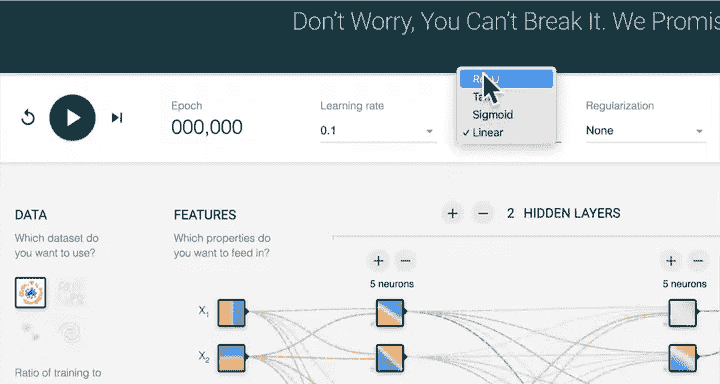

## 3. 设置损失函数和优化器 ⚙️

对于这个二分类问题，我们使用带Logits的二元交叉熵损失和SGD优化器。

以下是设置代码：

```python
# 设置损失函数和优化器
loss_fn = nn.BCEWithLogitsLoss() # 适用于原始输出（logits）的二元交叉熵
optimizer = torch.optim.SGD(params=model_3.parameters(), lr=0.1)
```

---

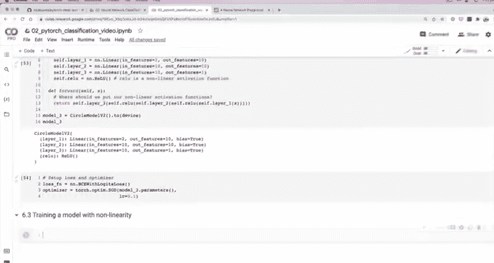

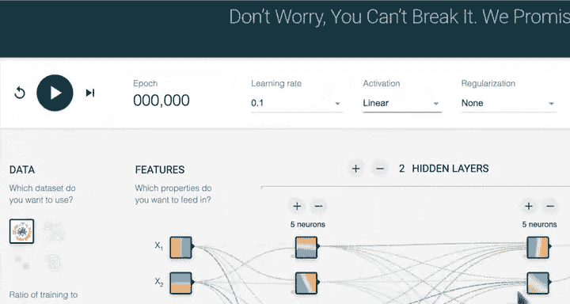

## 4. 训练非线性模型 🚂

接下来，我们将编写训练循环来训练我们的模型。这个过程与我们之前所做的类似，但现在模型内部有了非线性变换。

以下是训练循环的关键步骤：

```python
torch.manual_seed(42)
epochs = 1000

# 将数据移动到正确的设备（例如GPU）
X_train, y_train = X_train.to(device), y_train.to(device)
X_test, y_test = X_test.to(device), y_test.to(device)

for epoch in range(epochs):
    ### 训练
    model_3.train()
    # 1. 前向传播
    y_logits = model_3(X_train).squeeze()
    y_pred = torch.round(torch.sigmoid(y_logits))
    # 2. 计算损失和准确率
    loss = loss_fn(y_logits, y_train)
    acc = accuracy_fn(y_true=y_train, y_pred=y_pred)
    # 3. 优化器清零梯度
    optimizer.zero_grad()
    # 4. 反向传播
    loss.backward()
    # 5. 梯度下降
    optimizer.step()

    ### 测试
    model_3.eval()
    with torch.inference_mode():
        test_logits = model_3(X_test).squeeze()
        test_pred = torch.round(torch.sigmoid(test_logits))
        test_loss = loss_fn(test_logits, y_test)
        test_acc = accuracy_fn(y_true=y_test, y_pred=test_pred)

    # 打印进度
    if epoch % 100 == 0:
        print(f"Epoch: {epoch} | Loss: {loss:.5f}, Acc: {acc:.2f}% | Test Loss: {test_loss:.5f}, Test Acc: {test_acc:.2f}%")
```

运行此代码后，你应该能看到损失下降，准确率上升，证明非线性模型正在学习！

---

## 5. 评估与可视化结果 📊

训练完成后，我们需要评估模型的表现。最好的方式之一就是可视化它的决策边界。

以下是评估和可视化代码：

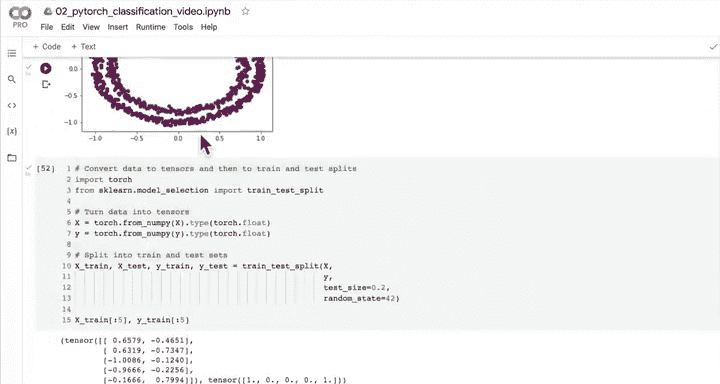

```python
# 1. 进行预测
model_3.eval()
with torch.inference_mode():
    y_preds = torch.round(torch.sigmoid(model_3(X_test))).squeeze()

# 2. 绘制决策边界
plt.figure(figsize=(12, 6))
plt.subplot(1, 2, 1)
plt.title("Train")
plot_decision_boundary(model_3, X_train, y_train)
plt.subplot(1, 2, 2)
plt.title("Test")
plot_decision_boundary(model_3, X_test, y_test)
plt.show()
```

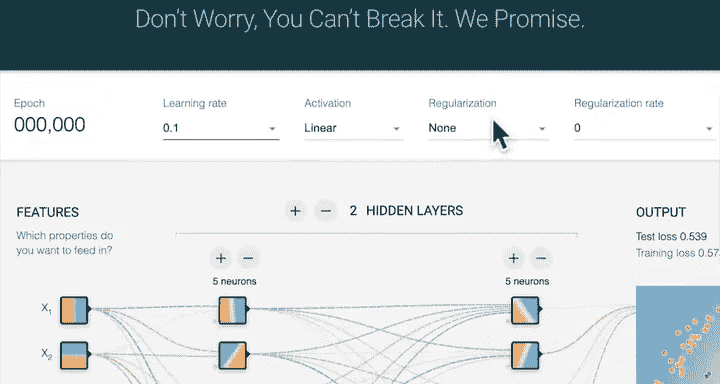

与之前纯线性模型的直线决策边界相比，现在的边界应该是曲线，能够更好地分离红蓝圆圈，尽管可能还不完美。

---

## 6. 亲手复现非线性函数 ✍️

为了更深入地理解，让我们尝试亲手复现ReLU和Sigmoid这两个非线性激活函数。

以下是复现代码：

```python
# 创建一个简单的张量
A = torch.arange(-10, 10, 1, dtype=torch.float32)

# 1. 复现 ReLU 函数：max(0, x)
def custom_relu(x: torch.Tensor) -> torch.Tensor:
    return torch.maximum(torch.tensor(0), x)

# 2. 复现 Sigmoid 函数：1 / (1 + exp(-x))
def custom_sigmoid(x: torch.Tensor) -> torch.Tensor:
    return 1 / (1 + torch.exp(-x))

# 验证我们的实现与PyTorch内置函数一致
print("Custom ReLU output:", custom_relu(A[:5]))
print("Torch ReLU output: ", torch.relu(A[:5]))
print("\nCustom Sigmoid output:", custom_sigmoid(A[:5]))
print("Torch Sigmoid output: ", torch.sigmoid(A[:5]))
```

通过亲手编写这些函数，你能更清楚地看到神经网络层背后执行的数学操作。

---

## 总结 🎯

本节课中我们一起学习了深度学习中至关重要的“非线性”概念。

1.  **问题识别**：我们首先明确了纯线性模型在处理像圆形这样的非线性数据时的局限性。
2.  **引入解决方案**：我们通过在神经网络层之间添加非线性激活函数（如ReLU）来赋予模型绘制“曲线”的能力。
3.  **模型构建与训练**：我们构建了`CircleModelV2`，设置了合适的损失函数和优化器，并成功训练了它。结果证明，带有非线性的模型性能显著优于纯线性模型。
4.  **评估与理解**：我们通过可视化决策边界直观地看到了模型的改进，并通过亲手复现激活函数加深了对底层数学原理的理解。

神经网络的强大之处，正源于这种**线性变换**与**非线性激活**的巧妙堆叠，使得它们能够逼近极其复杂的函数，从而解决图像识别、自然语言处理等难题。

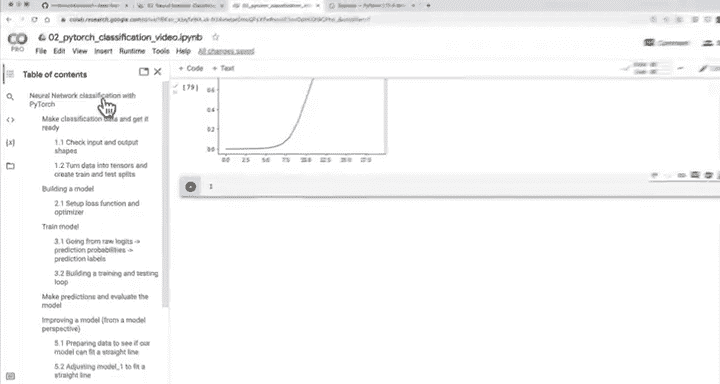

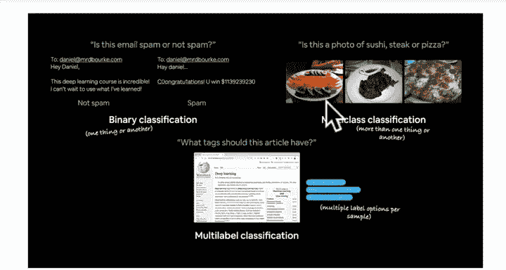

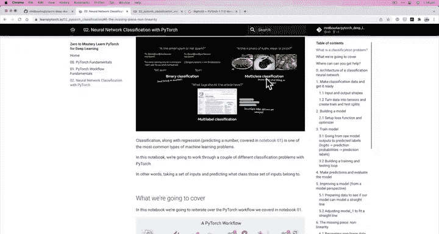


现在，你已经掌握了处理二分类问题的基本工作流程。接下来，我们将挑战更复杂的**多类别分类**问题！