#  57：整合所有知识解决多分类问题 🎯


在本节课中，我们将整合之前学到的所有知识，但这次我们将面对一个多分类问题。我们将学习如何创建多分类数据集、构建模型、定义损失函数和优化器，并最终编写训练和测试循环。通过本课程，你将掌握使用 PyTorch 解决多分类问题的完整流程。

---

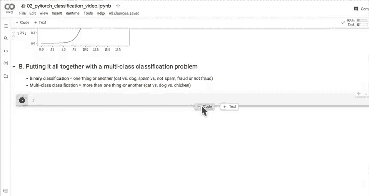


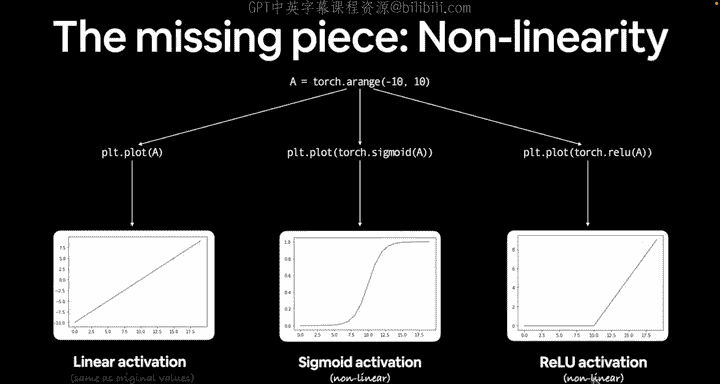

## 8.1 创建多分类数据集 📊

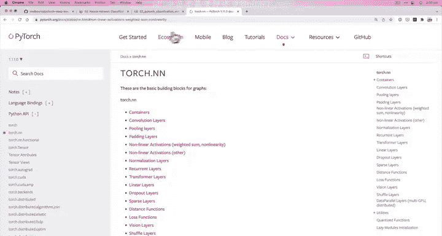

上一节我们介绍了非线性激活函数，本节中我们来看看如何为多分类问题创建数据集。

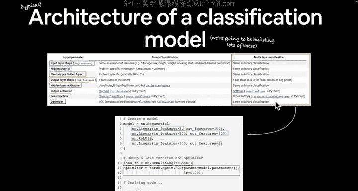

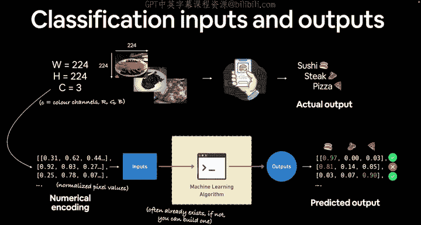


我们将使用 `scikit-learn` 库中的 `make_blobs` 函数来生成一个简单的多分类数据集。

以下是创建数据集的步骤：

1.  导入必要的库。
2.  设置数据生成的超参数。
3.  使用 `make_blobs` 生成数据。
4.  将数据转换为 PyTorch 张量。
5.  将数据分割为训练集和测试集。
6.  可视化生成的数据。

```python
# 导入依赖
import torch
import matplotlib.pyplot as plt
from sklearn.datasets import make_blobs
from sklearn.model_selection import train_test_split

# 设置数据生成的超参数
NUM_CLASSES = 4
NUM_FEATURES = 2
RANDOM_SEED = 42

# 创建多分类数据
X_blob, y_blob = make_blobs(n_samples=1000,
                             n_features=NUM_FEATURES,
                             centers=NUM_CLASSES,
                             cluster_std=1.5,
                             random_state=RANDOM_SEED)

# 将数据转换为张量
X_blob = torch.from_numpy(X_blob).type(torch.float)
y_blob = torch.from_numpy(y_blob).type(torch.LongTensor) # 注意：多分类标签通常为 Long 类型

# 分割为训练集和测试集
X_blob_train, X_blob_test, y_blob_train, y_blob_test = train_test_split(X_blob,
                                                                        y_blob,
                                                                        test_size=0.2,
                                                                        random_state=RANDOM_SEED)

# 可视化数据
plt.figure(figsize=(10, 7))
plt.scatter(X_blob[:, 0], X_blob[:, 1], c=y_blob, cmap=plt.cm.RdYlBu)
plt.show()
```

我们创建了一个包含四个类别、两个特征的数据集。数据点围绕四个中心点分布，并添加了一些随机性以增加分类难度。接下来，我们将基于此数据构建模型。

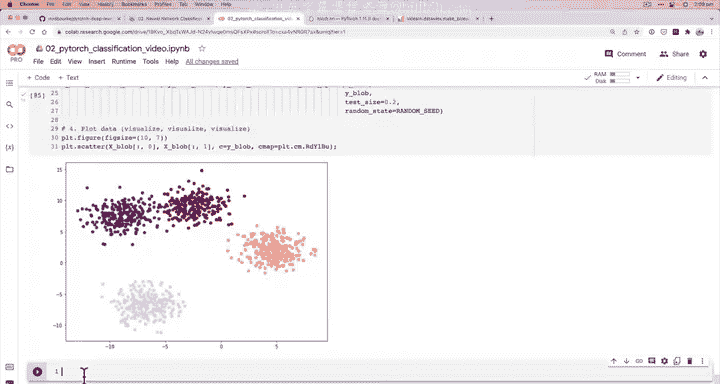


---

## 8.2 构建多分类 PyTorch 模型 🏗️

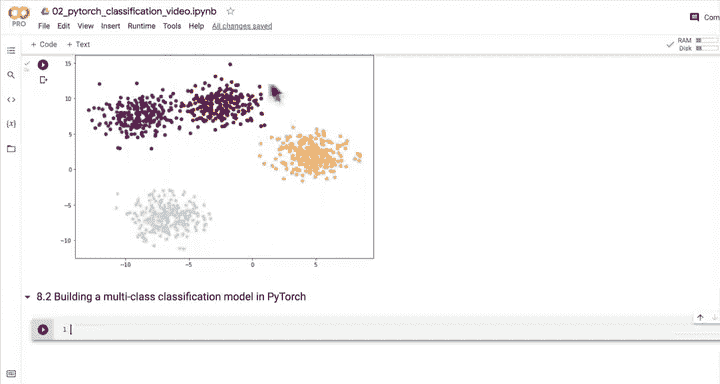

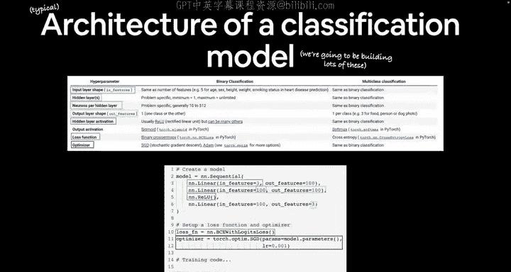

在上一节我们创建了数据集，本节中我们来看看如何构建一个能够处理多分类问题的神经网络模型。

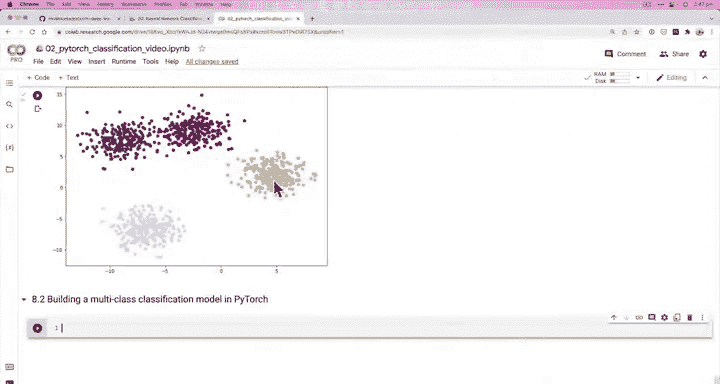

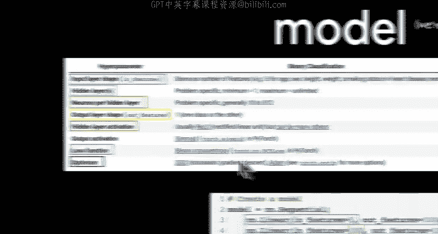

多分类模型与二分类模型的主要区别在于输出层和激活函数：
*   **输出特征数量**：等于类别数量（本例中为4）。
*   **输出激活函数**：使用 `Softmax` 而非 `Sigmoid`。
*   **损失函数**：使用交叉熵损失 `CrossEntropyLoss` 而非二元交叉熵损失。

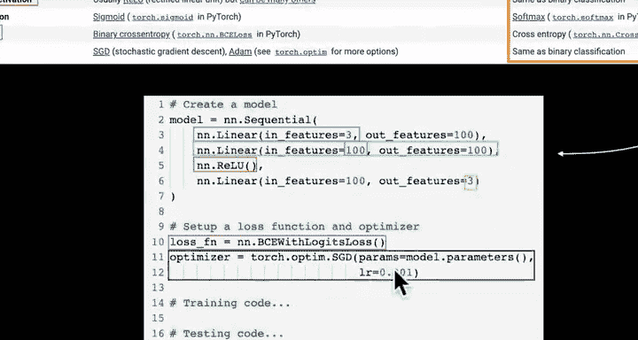

以下是构建模型类的代码：

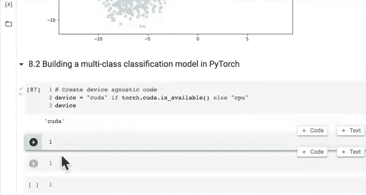


```python
import torch
from torch import nn

class BlobModel(nn.Module):
    """
    初始化一个多分类分类模型。

    参数:
        input_features (int): 输入特征的数量。
        output_features (int): 输出特征的数量（即类别数）。
        hidden_units (int): 隐藏层的神经元数量，默认为8。
    """
    def __init__(self, input_features, output_features, hidden_units=8):
        super().__init__()
        self.linear_layer_stack = nn.Sequential(
            nn.Linear(in_features=input_features, out_features=hidden_units),
            nn.ReLU(), # 添加非线性激活函数
            nn.Linear(in_features=hidden_units, out_features=hidden_units),
            nn.ReLU(),
            nn.Linear(in_features=hidden_units, out_features=output_features)
        )

    def forward(self, x):
        return self.linear_layer_stack(x)

# 创建模型实例并发送到可用设备
device = "cuda" if torch.cuda.is_available() else "cpu"
model_4 = BlobModel(input_features=2, output_features=4, hidden_units=8).to(device)
```

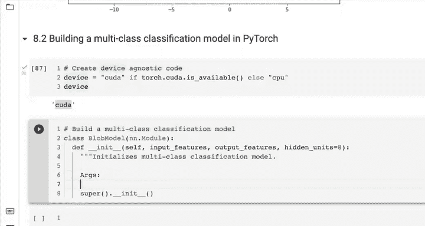


我们构建了一个包含两个隐藏层和 ReLU 激活函数的模型。模型最终输出四个值，对应四个类别的原始预测值（logits）。接下来，我们需要定义损失函数和优化器。

---

## 8.3 创建损失函数与优化器 ⚖️

在上一节我们构建了模型，本节中我们来看看如何为多分类问题选择合适的损失函数和优化器。

对于多分类问题：
*   **损失函数**：使用 `nn.CrossEntropyLoss()`。它内部结合了 `Softmax` 激活函数和负对数似然损失，因此**模型的原始输出（logits）可以直接输入该损失函数**，无需手动应用 `Softmax`。
*   **优化器**：与二分类问题类似，常见的选择是随机梯度下降（SGD）或 Adam。

以下是代码实现：

```python
# 创建损失函数
loss_fn = nn.CrossEntropyLoss()

# 创建优化器
optimizer = torch.optim.SGD(params=model_4.parameters(),
                            lr=0.1) # 学习率是一个可以调整的超参数
```

现在我们已经准备好了模型、损失函数和优化器。在开始训练之前，我们需要理解模型输出的形式。

---

## 8.4 从模型输出到预测标签 🔄

在上一节我们定义了损失函数，本节中我们来看看如何解读和处理多分类模型的输出。

模型的前向传播会直接产生原始输出（logits）。为了得到可解释的预测，我们需要两个步骤：
1.  **Logits -> 预测概率**：使用 `Softmax` 函数将 logits 转换为每个类别的概率（所有类别概率之和为1）。
2.  **预测概率 -> 预测标签**：使用 `argmax` 函数获取概率最高的类别索引，作为最终的预测标签。

以下是实现代码：

```python
# 将模型设置为评估模式并进行前向传播（推理）
model_4.eval()
with torch.inference_mode():
    y_logits = model_4(X_blob_test.to(device))

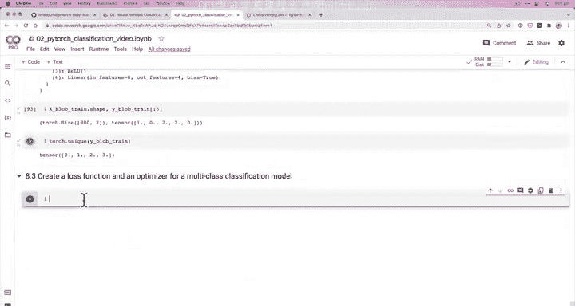

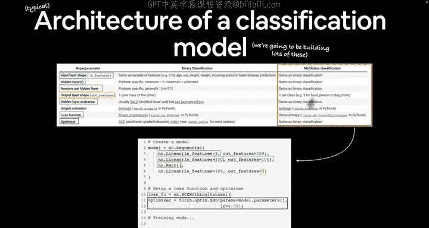

# 1. 使用 Softmax 将 logits 转换为预测概率
y_pred_probs = torch.softmax(y_logits, dim=1)
print(f"前5个样本的预测概率:\n{y_pred_probs[:5]}")

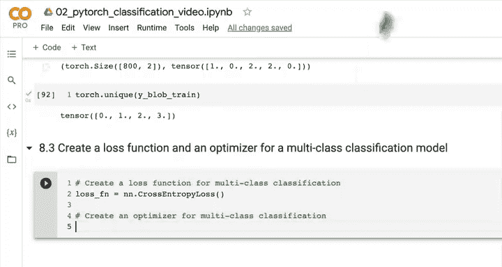

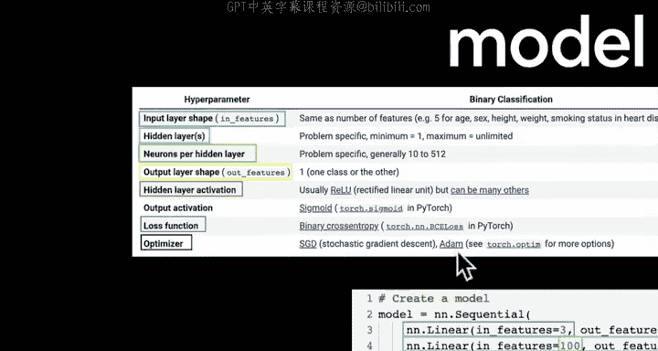

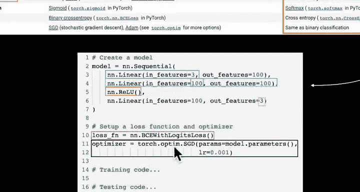

# 2. 使用 argmax 从概率中获取预测标签
y_preds = torch.argmax(y_pred_probs, dim=1)
print(f"前5个样本的预测标签:\n{y_preds[:5]}")
print(f"前5个样本的真实标签:\n{y_blob_test[:5]}")
```

在模型未经训练时，这些预测是随机的。训练的目标就是调整模型参数，使得预测标签尽可能接近真实标签。理解了输出转换后，我们就可以编写训练循环了。

---

## 8.5 创建训练与测试循环 🔁

在上一节我们学会了处理模型输出，本节中我们将整合所有组件，为多分类模型创建训练和测试循环。

训练循环的步骤与二分类问题类似：
1.  前向传播计算预测。
2.  计算损失（损失函数会自动处理 logits）。
3.  清零优化器梯度。
4.  反向传播计算梯度。
5.  优化器更新参数。
测试循环则用于评估模型在未见数据上的性能。

以下是完整的训练和测试循环代码：

```python
# 设置随机种子和训练轮数
torch.manual_seed(42)
epochs = 100

# 将数据移动到设备
X_blob_train, y_blob_train = X_blob_train.to(device), y_blob_train.to(device)
X_blob_test, y_blob_test = X_blob_test.to(device), y_blob_test.to(device)

for epoch in range(epochs):
    ### 训练
    model_4.train()
    y_logits = model_4(X_blob_train)
    y_pred = torch.softmax(y_logits, dim=1).argmax(dim=1)

    loss = loss_fn(y_logits, y_blob_train) # 注意：损失函数接收 logits
    acc = (y_pred == y_blob_train).sum().item() / len(y_blob_train)

    optimizer.zero_grad()
    loss.backward()
    optimizer.step()

    ### 测试
    model_4.eval()
    with torch.inference_mode():
        test_logits = model_4(X_blob_test)
        test_pred = torch.softmax(test_logits, dim=1).argmax(dim=1)

        test_loss = loss_fn(test_logits, y_blob_test)
        test_acc = (test_pred == y_blob_test).sum().item() / len(y_blob_test)

    # 打印进度
    if epoch % 10 == 0:
        print(f"Epoch: {epoch} | Loss: {loss:.4f}, Acc: {acc:.2%} | Test Loss: {test_loss:.4f}, Test Acc: {test_acc:.2%}")
```

运行此循环后，你将看到模型的损失逐渐下降，准确率逐渐上升。你可以尝试调整超参数（如学习率、隐藏单元数、训练轮数）来观察模型性能的变化。

---

## 总结 📝

本节课中我们一起学习了使用 PyTorch 解决多分类问题的完整流程。我们首先使用 `make_blobs` 创建了一个多分类数据集，然后构建了一个包含非线性激活函数的神经网络模型。我们了解到多分类问题需要使用 `CrossEntropyLoss` 损失函数，并且模型的原始输出（logits）可以直接输入该损失函数。最后，我们编写了训练和测试循环，将数据、模型、损失函数和优化器整合在一起，使模型能够学习并做出预测。

关键步骤回顾：
1.  **准备数据**：生成并分割多分类数据集。
2.  **构建模型**：输出层单元数等于类别数。
3.  **设置损失与优化器**：使用 `CrossEntropyLoss` 和 `SGD`/`Adam`。
4.  **理解输出**：Logits -> Softmax -> 预测概率 -> Argmax -> 预测标签。
5.  **训练与评估**：编写循环，让模型学习数据中的模式。

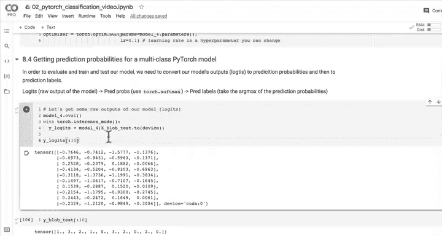

通过本课程，你已经掌握了处理分类问题（包括二分类和多分类）的核心技能。接下来，你可以尝试在更复杂的数据集上应用这些知识。