# 58：多类别模型故障排除 🐛

在本节课中，我们将学习如何为多类别分类模型构建训练和测试循环，并在此过程中解决两个最常见的机器学习问题：**数据类型错误**和**张量形状错误**。我们将从原始模型输出（logits）开始，逐步将其转换为预测概率和预测标签，最终训练并评估我们的第一个多类别分类模型。

---

## 从Logits到预测标签 📊

上一节我们介绍了如何从模型的原始输出（logits）开始处理。本节中我们来看看如何将其转换为最终的预测标签。

模型的原始输出称为logits。对于多类别分类，我们需要两个步骤：
1.  使用 `torch.softmax` 将logits转换为预测概率。
2.  使用 `torch.argmax` 获取概率最大值的索引，该索引即为预测标签。

其核心转换公式如下：
**预测概率 = torch.softmax(logits, dim=1)**
**预测标签 = torch.argmax(预测概率, dim=1)**

即使模型有10个类别，这些步骤的原理也保持不变。

---

## 设置训练循环 ⚙️

现在，让我们为多类别模型设置训练循环。我们将遵循标准的PyTorch工作流程。

首先，设置随机种子以确保结果可复现，并定义训练轮数（epochs）。
```python
torch.manual_seed(42)
epochs = 100
```

接着，确保数据位于目标设备上（CPU或GPU），以实现设备无关的代码。
```python
X_blob_train, y_blob_train = X_blob_train.to(device), y_blob_train.to(device)
X_blob_test, y_blob_test = X_blob_test.to(device), y_blob_test.to(device)
```

以下是训练循环的核心步骤：
1.  将模型设置为训练模式：`model.train()`。
2.  前向传播：计算logits。
3.  计算损失：使用交叉熵损失函数比较logits和真实标签。
4.  计算准确率：作为分类问题的评估指标。
5.  优化器清零梯度、损失反向传播、优化器更新参数。

```python
for epoch in range(epochs):
    model.train()
    # 1. 前向传播
    y_logits = model(X_blob_train)
    # 2. 计算损失和准确率
    loss = loss_fn(y_logits, y_blob_train)
    acc = accuracy_fn(y_blob_train, y_logits.argmax(dim=1))
    # 3. 优化器步骤
    optimizer.zero_grad()
    loss.backward()
    optimizer.step()
```

---

## 常见错误排查 🔍

在构建训练循环时，我们遇到了两个典型错误。理解如何排查这些错误至关重要。

### 错误1：数据类型不匹配

我们遇到了一个错误提示：`RuntimeError: ... not implemented for Float`。这暗示着某个张量的数据类型不正确。

问题根源在于我们创建标签数据时，错误地将其设置为浮点型（`torch.float`）。对于PyTorch的交叉熵损失函数，目标标签应为包含类别索引的长整型张量（`torch.long`）。

**解决方法**：在创建标签张量时，确保指定 `dtype=torch.long`。
```python
# 创建标签时，使用正确的数据类型
y_blob_train = torch.tensor(..., dtype=torch.long)
```

### 错误2：张量形状不匹配

另一个常见错误是形状不匹配，例如：`ValueError: Expected input batch size ... to match target batch size ...`。

这通常发生在将错误的数据（如测试数据）传递到期望训练数据形状的步骤中，或者在计算指标时混淆了变量名。

**解决方法**：仔细检查代码中张量的来源和形状，确保变量名正确，并使用 `.shape` 属性进行调试。
```python
print(y_logits.shape)
print(y_blob_train.shape)
```

通过系统性地打印张量形状和检查数据类型，我们可以定位并修复这些错误。

---

## 模型评估与可视化 📈

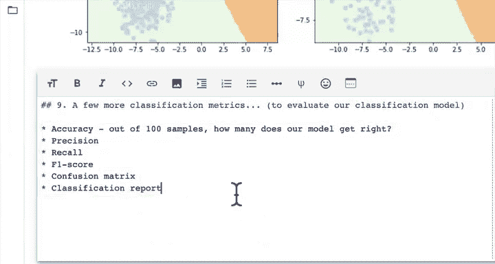

成功训练模型后，下一步是评估其性能。可视化是理解模型决策过程的强大工具。

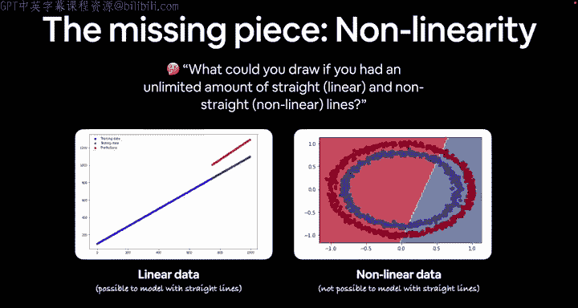

首先，我们将模型设置为评估模式并进行预测。
```python
model.eval()
with torch.inference_mode():
    y_logits = model(X_blob_test)
    y_pred_probs = torch.softmax(y_logits, dim=1)
    y_preds = y_pred_probs.argmax(dim=1)
```

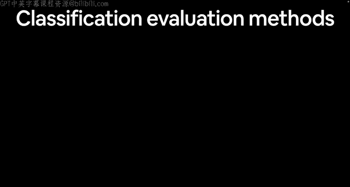

然后，我们可以绘制决策边界来直观地查看模型如何对测试数据进行分类。
```python
plt.figure(figsize=(12, 6))
plt.subplot(1, 2, 1)
plt.title("Train")
plot_decision_boundary(model, X_blob_train, y_blob_train)
plt.subplot(1, 2, 2)
plt.title("Test")
plot_decision_boundary(model, X_blob_test, y_blob_test)
plt.show()
```

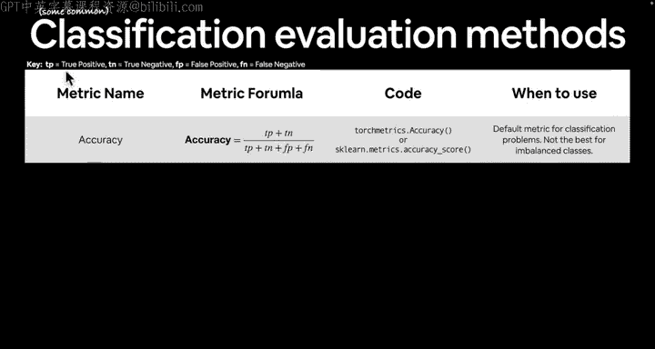

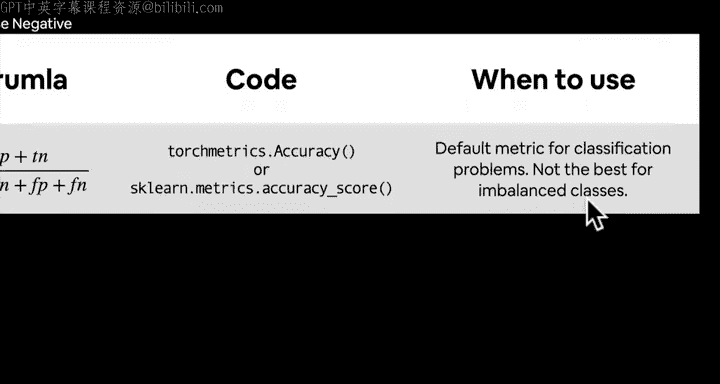

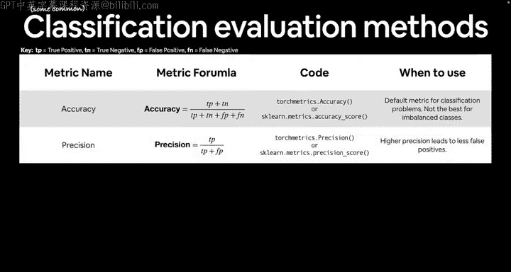

我们的模型成功地在测试集上分离了数据点。有趣的是，即使移除了模型中的非线性激活函数（如ReLU），由于我们的数据是线性可分的，模型仍然表现良好。然而，现实世界的数据通常需要线性和非线性组合，因此保留非线性组件能使模型更通用。

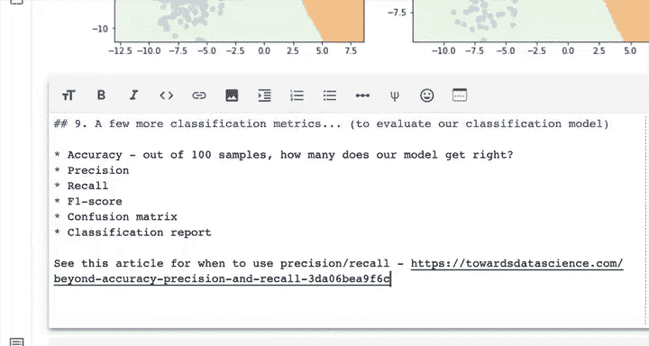

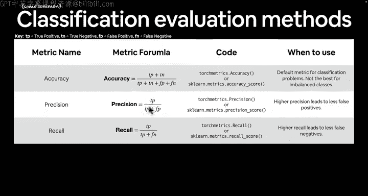

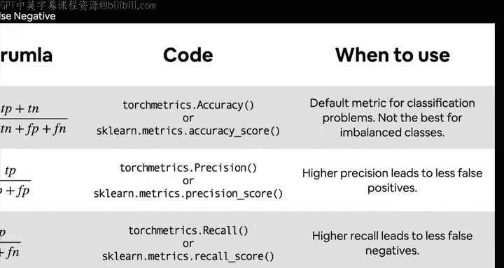

---

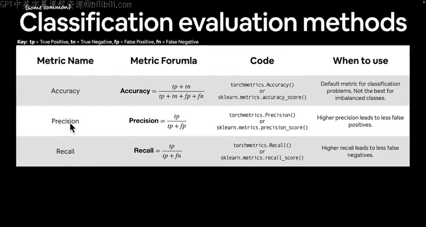

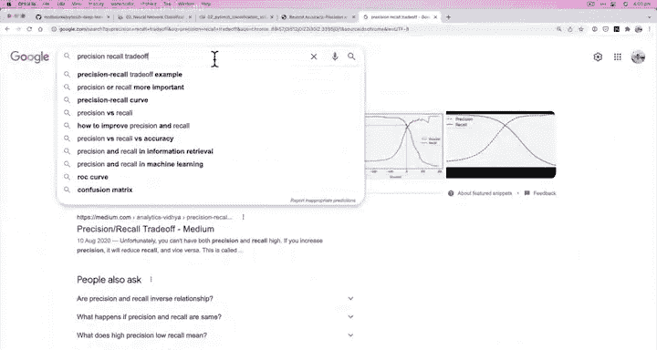

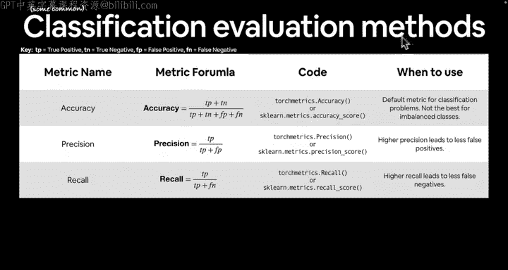

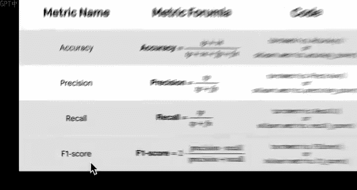

## 更多分类评估指标 🎯

评估模型与训练模型同等重要。除了准确率，还有其他重要的分类评估指标。

以下是几种关键的评估指标：
*   **准确率 (Accuracy)**：正确预测的样本比例。适用于类别平衡的数据集。公式为 **(TP+TN)/(TP+TN+FP+FN)**。
*   **精确率 (Precision)**：在所有被预测为正类的样本中，真正为正类的比例。关注减少假阳性。公式为 **TP/(TP+FP)**。
*   **召回率 (Recall)**：在所有实际为正类的样本中，被正确预测为正类的比例。关注减少假阴性。公式为 **TP/(TP+FN)**。
*   **F1分数 (F1-Score)**：精确率和召回率的调和平均数，是两者的平衡指标。
*   **混淆矩阵 (Confusion Matrix)**：以矩阵形式展示分类结果，可详细分析各类别的预测情况。
*   **分类报告 (Classification Report)**：汇总了精确率、召回率、F1分数等指标。

对于不平衡数据集，准确率可能具有误导性，应更多关注精确率和召回率。可以使用 `torchmetrics` 或 `scikit-learn` 库方便地计算这些指标。

```python
# 使用 torchmetrics 计算准确率示例
from torchmetrics import Accuracy
metric = Accuracy().to(device)
test_acc = metric(y_preds, y_blob_test)
```

---

## 总结 🎉

本节课中我们一起学习了多类别分类模型的完整流程。我们构建了训练和测试循环，并深入排查了**数据类型错误**和**张量形状错误**这两个核心问题。我们还将模型的logits输出转换为可解释的预测概率和标签，并通过可视化决策边界评估了模型性能。最后，我们介绍了除准确率外更多的分类评估指标，如精确率、召回率和F1分数，为全面评估模型打下了基础。

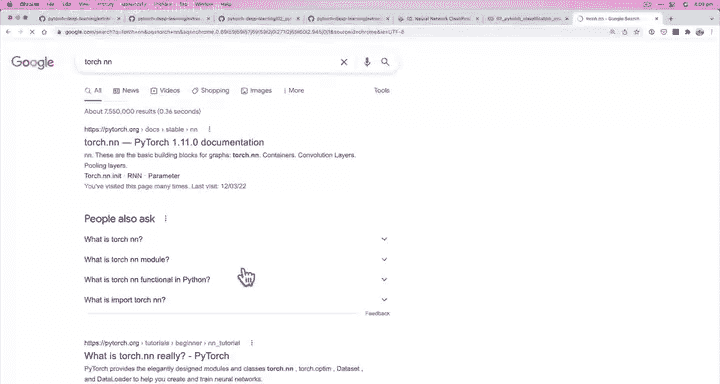


记住，机器学习实践者的座右铭是：实验、实验、再实验。遇到错误时，耐心地检查数据形状和类型，利用打印语句和可视化进行调试，是成长为一名优秀实践者的必经之路。