#  59：计算机视觉入门 🖼️

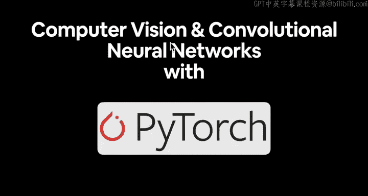

在本节课中，我们将要学习计算机视觉的基础知识，并了解如何使用 PyTorch 处理图像数据。我们将探讨计算机视觉问题的类型、核心概念以及如何获取帮助。

---

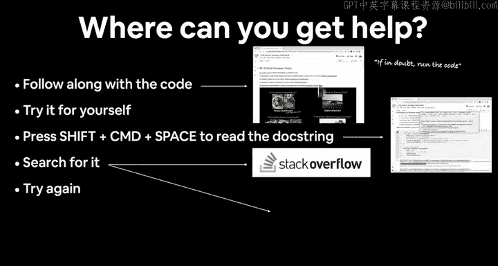

## 概述

计算机视觉是深度学习中最受欢迎的主题之一。它涉及让机器理解和解释视觉世界。在开始具体内容之前，我们先来回答一个非常重要的问题：遇到问题时如何获取帮助？

---

## 如何获取帮助

以下是遇到代码问题时可以遵循的步骤：

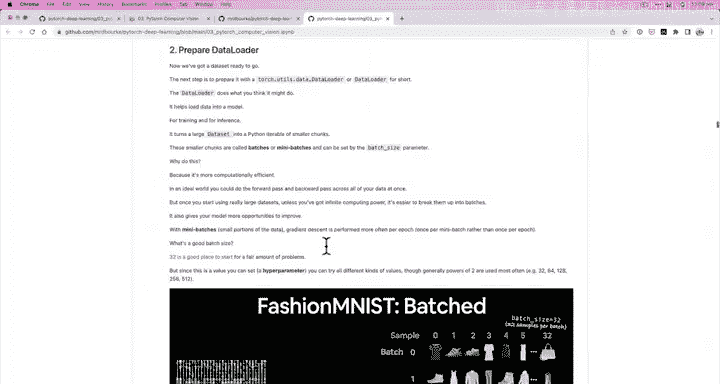

1.  **跟随代码**：尽可能跟随课程编写代码。我们的座右铭是：如有疑问，运行代码。查看代码的输入和输出，亲自尝试。
2.  **查阅文档**：如果需要了解所用函数的功能，可以查阅文档字符串。在 Google Colab 中，可以按 `Shift + Cmd + Space`（Windows 上是 `Ctrl`）来查看。
3.  **搜索问题**：如果仍然卡住，可以搜索正在运行的代码。你可能会找到 Stack Overflow 或 PyTorch 官方文档的相关解答。
4.  **提问**：如果以上步骤都无法解决问题，可以在 PyTorch 深度学习仓库的讨论区提问。提问时，请使用反引号格式化你的代码，以便他人阅读和解答。

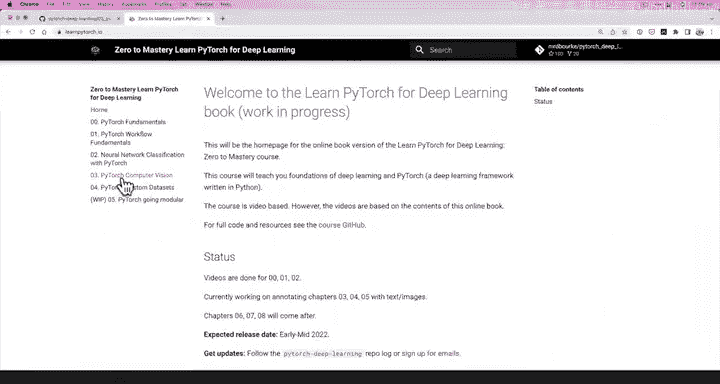

完成以上四个步骤后，如果问题仍未解决，可以再次尝试。记住：如有疑问，运行代码。

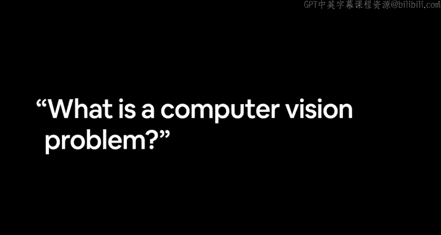

---

## 课程资源

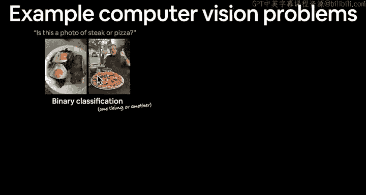

我们拥有丰富的学习资源来辅助本课程的学习：

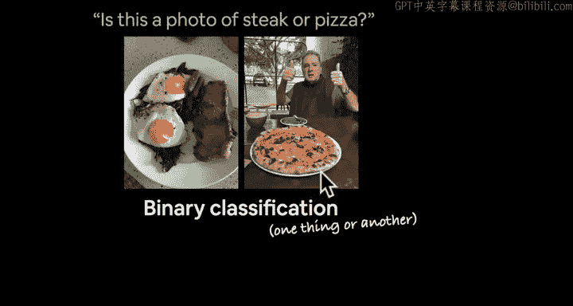

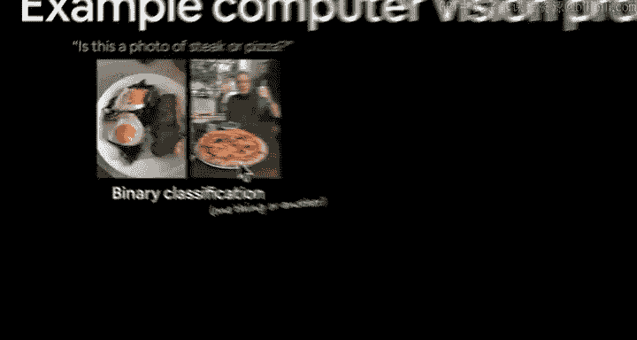

*   **PyTorch 深度学习代码仓库**：本课程所有代码都包含在 `section 3 notebook` 中，名为 “PyTorch Computer Vision”。这个笔记本包含了大量带注释的文本和图像，可以作为参考资料。
*   **课程书籍版本**：访问 `learnpytorch.io` 网站，找到第 03 节 “PyTorch Comp Vi”。这里以书籍格式提供了我们将要涵盖的所有信息、必要链接和额外资源。

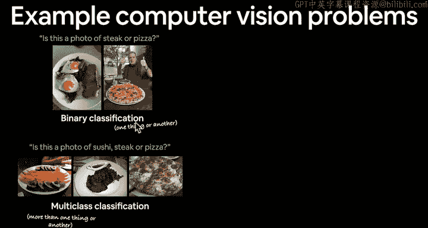

---

## 什么是计算机视觉问题？

计算机视觉的应用范围非常广泛。一个简单的判断标准是：**如果你能看到它，那么它很可能可以表述为某种计算机视觉问题**。

让我们看几个具体的例子：

### 1. 二分类问题

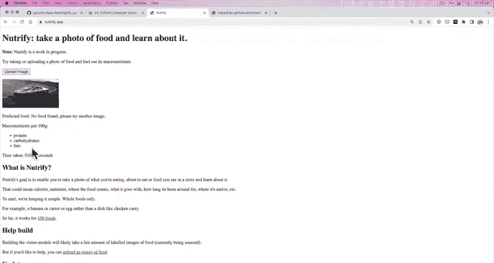

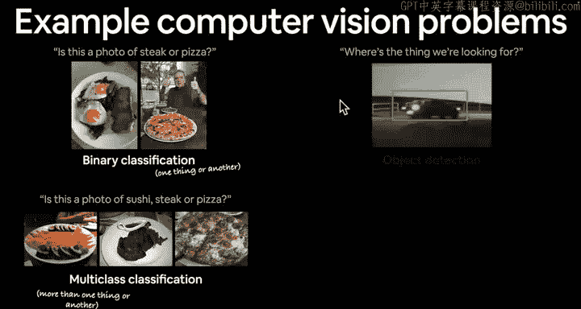

例如，我们想区分两张不同的图片：这张照片是牛排还是披萨？我们可以构建一个模型，让它理解图像中牛排和披萨的视觉模式。模型会从不同的图像示例中自行学习这些模式，我们无需明确告诉它该学什么。

**核心概念**：模型输入图像的像素，输出一个二分类标签。
`模型(图像像素) -> 类别(牛排 或 披萨)`

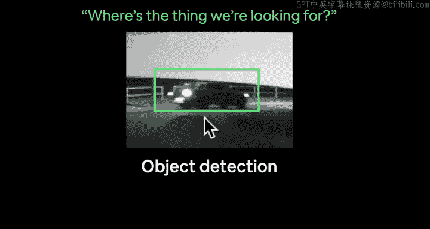

### 2. 多分类问题

我们可以将问题升级为多分类。例如，判断一张照片是寿司、牛排还是披萨？这就有了三个类别。当然，类别数量可以扩展到上百个，例如 `Nutrify` 应用就能对多达 100 种不同的食物进行分类。

**流程**：模型首先判断图像是否为食物，如果是，再进一步分类是哪种食物。
`模型(图像像素) -> 类别(寿司 / 牛排 / 披萨 / ...)`

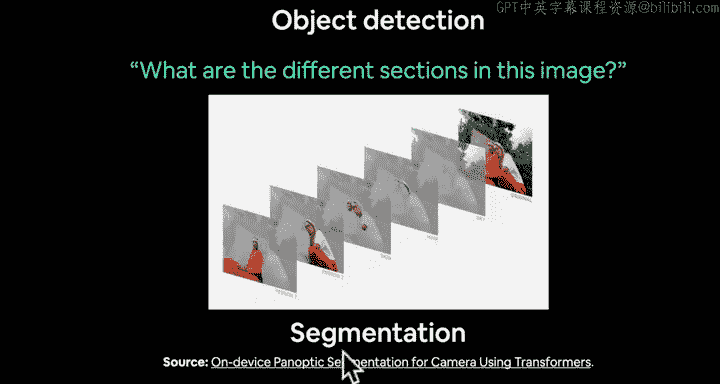

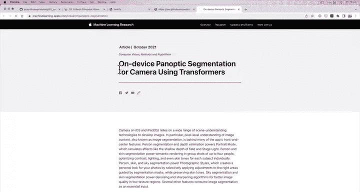

### 3. 目标检测

目标检测旨在回答“我们要找的东西在哪里？”的问题。例如，从监控录像中检测特定型号的车辆。这涉及到在图像中定位和识别特定物体。

### 4. 图像分割

图像分割旨在识别图像中的不同部分。例如，苹果公司在其设备上使用分割技术来区分人像、皮肤、头发、天空等区域，以便进行针对性的图像增强（计算摄影）。这通常发生在设备本地。

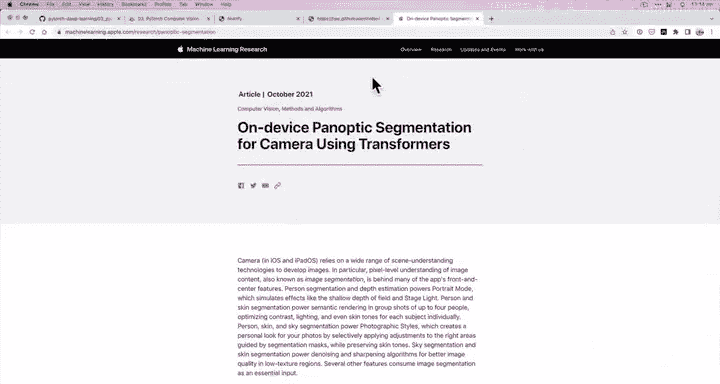

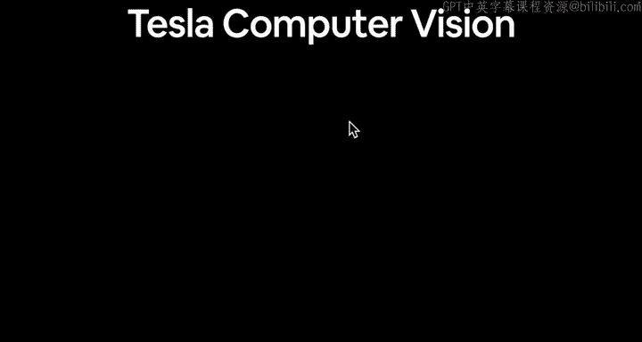

### 5. 现实世界应用：特斯拉的计算机视觉

特斯拉在其自动驾驶汽车上安装了 8 个摄像头。它们使用计算机视觉神经网络处理这些摄像头的画面，将车辆周围环境的表示转换为**三维向量空间**（即一长串数字）。因为计算机理解数字远胜于理解图像。然后，系统利用这些信息来感知环境并规划行驶路径。

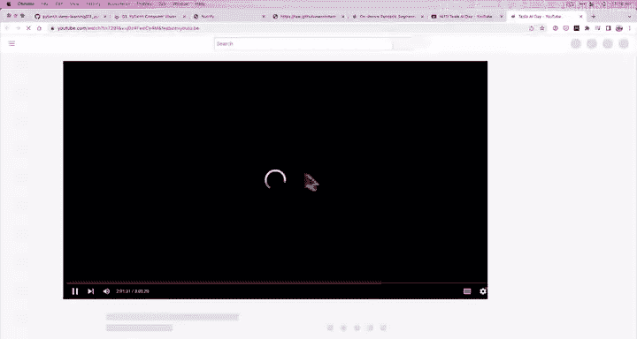

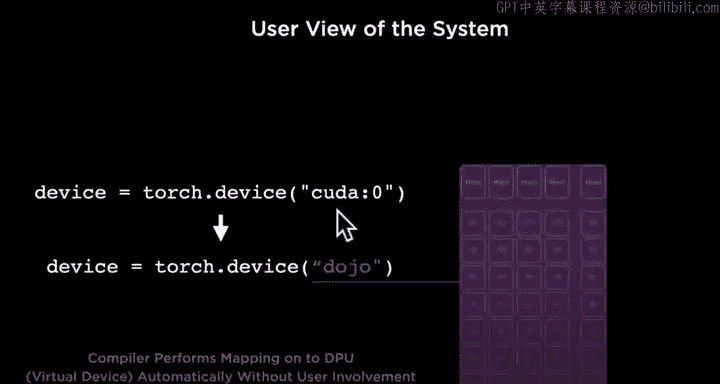

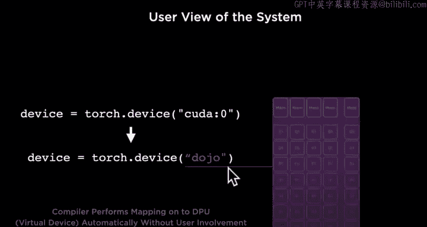

有趣的是，特斯拉也使用 **PyTorch** 来训练其机器学习模型。这意味着我们正在学习的 PyTorch 代码与驱动前沿技术的代码在本质上相似。

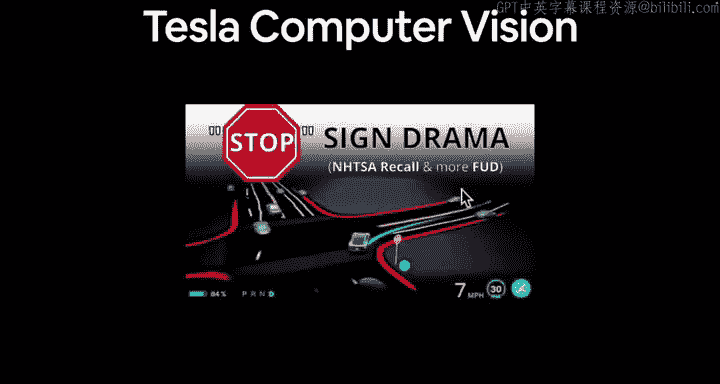

---

## 本课程将涵盖的内容

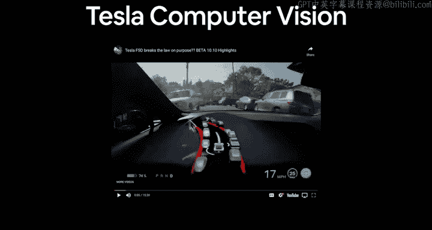

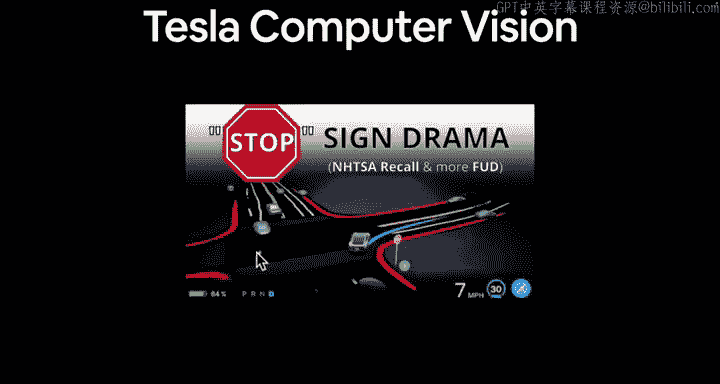

那么，在本课程中，我们将具体用 PyTorch 代码实现什么呢？

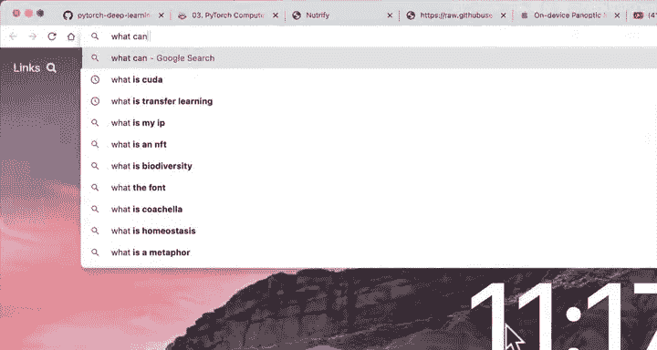

1.  **使用 TorchVision 获取视觉数据集**：PyTorch 的 `torchvision` 库专门用于处理计算机视觉问题，并提供现成的数据集供我们使用。
2.  **理解卷积神经网络架构**：学习 CNN 的结构及其在 PyTorch 中的实现。
3.  **端到端的多分类图像分类问题**：构建一个完整的流程，处理具有多个类别（可能是3个，也可能是100个）的图像分类任务。
4.  **使用 CNN 在 PyTorch 中建模的步骤**：
    *   使用 PyTorch 创建一个卷积神经网络。
    *   为我们的问题选择合适的损失函数和优化器。
    *   训练模型。
    *   评估模型性能。

我们将以“部分艺术，部分科学”的方式，像烹饪节目一样“烹制”出大量代码。

---

## 总结

本节课我们一起学习了计算机视觉的广阔应用场景，从简单的图像分类到复杂的自动驾驶感知系统。我们还了解了学习过程中如何获取帮助，以及本课程将使用的核心资源和要完成的具体目标。

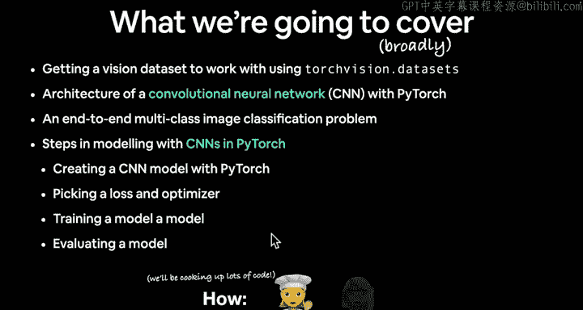

在下一节中，我们将深入探讨计算机视觉问题的输入和输出具体是什么。