# 60：计算机视觉的输入与输出 🖼️➡️🤖

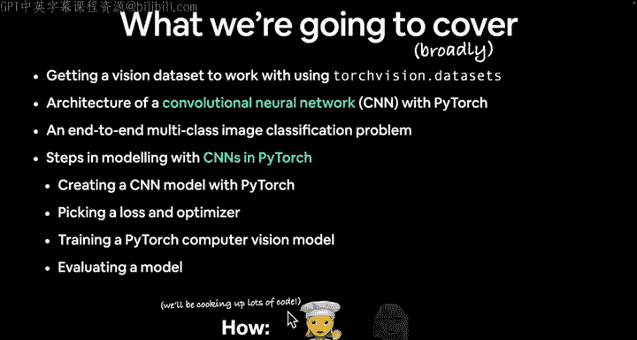

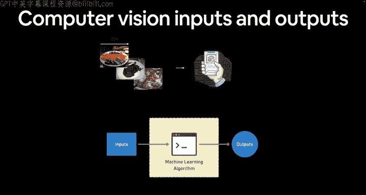

在本节课中，我们将学习计算机视觉问题的核心：输入与输出。我们将探讨如何将图像表示为数字，以及机器学习模型如何处理这些数字以做出预测。


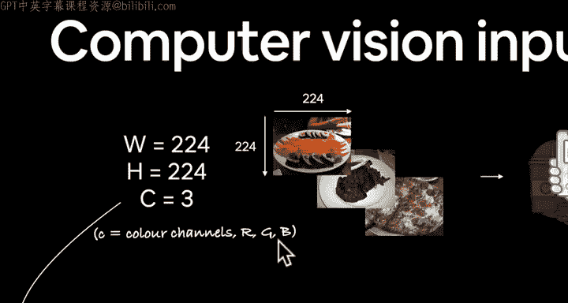

上一节我们介绍了计算机视觉的广泛概念和应用。本节中，我们来看看一个典型计算机视觉问题的输入和输出具体是什么。


## 输入：将图像转换为数字 🔢

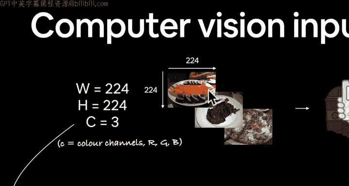

计算机视觉模型需要数字作为输入。因此，我们必须将图像转换为数值表示。

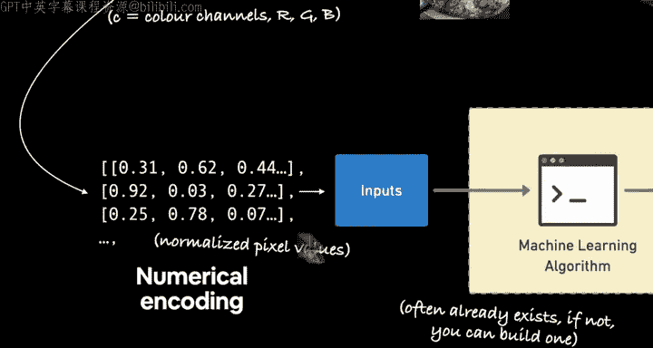

一个常见的例子是多类别图像分类，例如识别不同食物的照片。我们可能有一批食物图像，每张图像具有特定的高度和宽度，例如 **`width = 224`**， **`height = 224`**。此外，图像通常有三个颜色通道（RGB），分别代表红色、绿色和蓝色的强度值。

数字图像中的每个像素都由红、绿、蓝三个数值表示。例如，一个接近橙色的像素可能红色值较高，绿色和蓝色值较低。

我们将图像数值编码为一个**张量**，其维度代表了高度、宽度和颜色通道。这就是我们机器学习算法的输入。

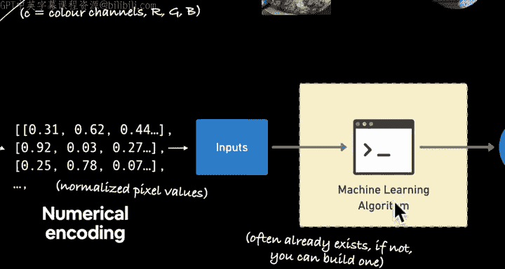

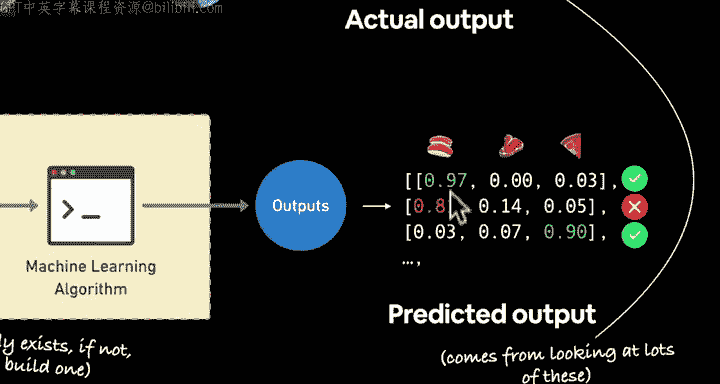

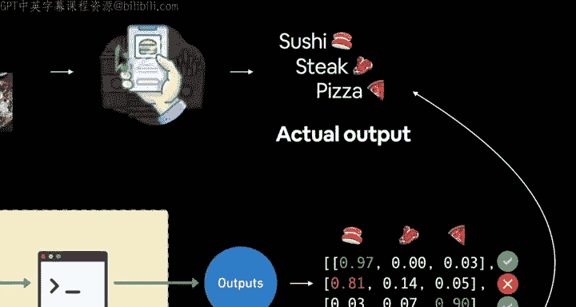

## 输出：模型的预测 🎯

模型处理输入后，会生成输出。对于我们的食物分类例子，我们希望模型为每个类别输出一个预测概率。

例如，模型可能输出三个概率值，分别对应“寿司”、“牛排”和“披萨”。模型的预测结果是概率最高的那个类别。有时模型会出错，例如将一张牛排图片误判为寿司。

以下是输出形状的表示：
```python
# 对于3个类别的分类问题
output_shape = 3
```
你可以根据你的问题调整类别数量，可能是5个、100个甚至1000个。

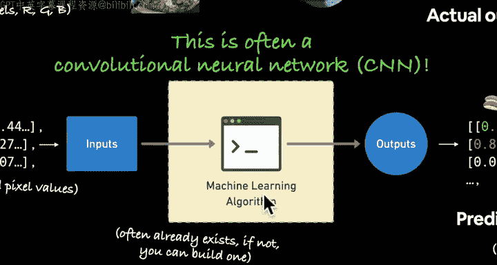

## 改进模型性能 📈

模型并非总是正确，因为机器学习本质上是概率性的。为了提高准确性，我们可以给模型展示更多不同食物的图像，让它建立更好的内部表征，从而对未见过的图像做出更准确的预测。

无论处理何种计算机视觉问题，核心流程是相似的：
1.  将信息数值编码。
2.  使用一个能够拟合数据的机器学习模型（例如用于分类的模型）。
3.  根据问题定制输出格式。

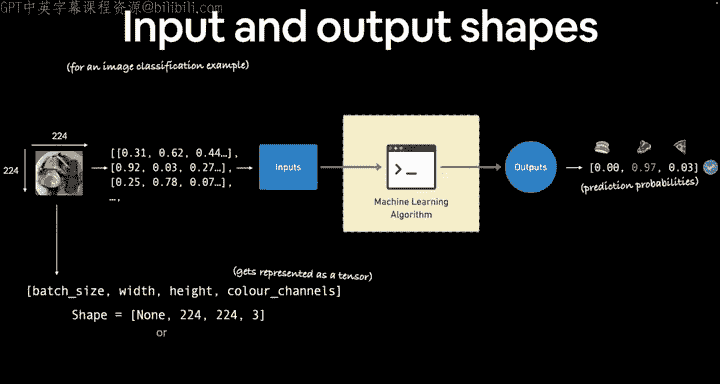

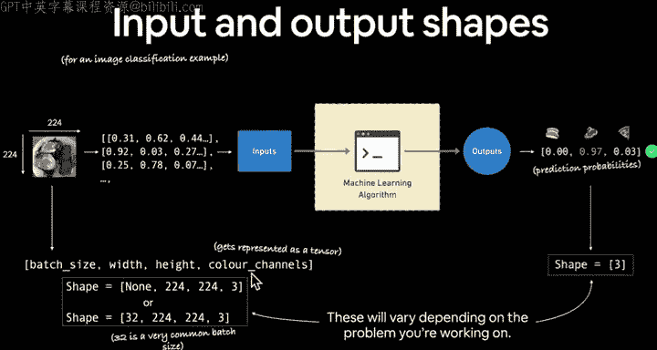

## 卷积神经网络与输入输出形状 🧠

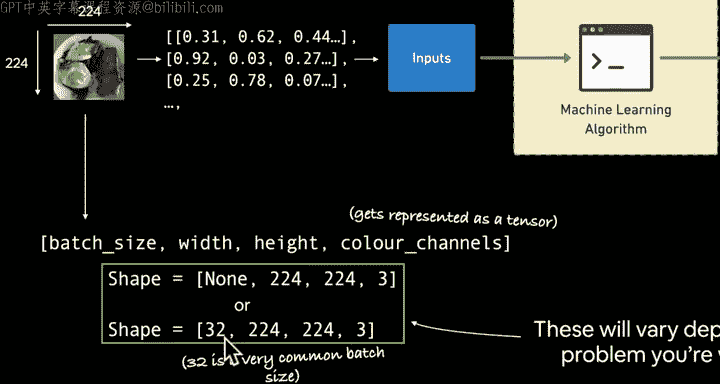

处理图像数据时，**卷积神经网络** 通常是性能最佳的选择，尽管Transformer架构近来也表现出色。确保张量形状匹配是机器学习的一个关键问题。

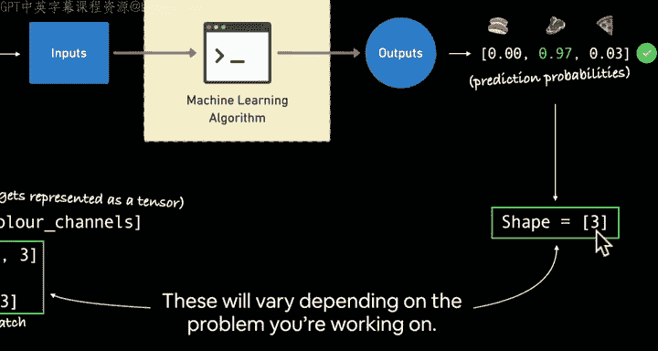

一个图像输入张量的常见形状是 **`(batch_size, height, width, color_channels)`**。在PyTorch中，默认顺序常是 **`(batch_size, color_channels, height, width)`**，即“通道在前”。

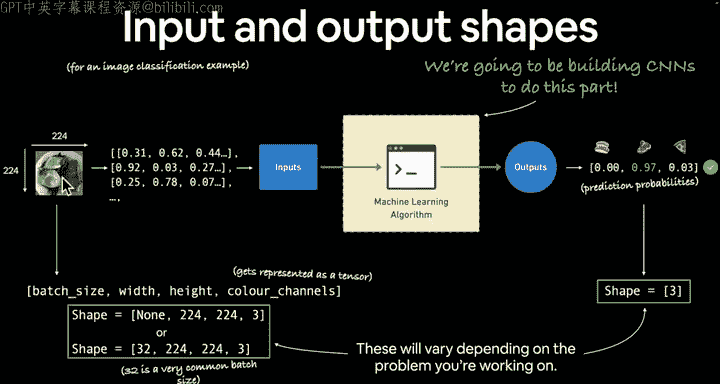

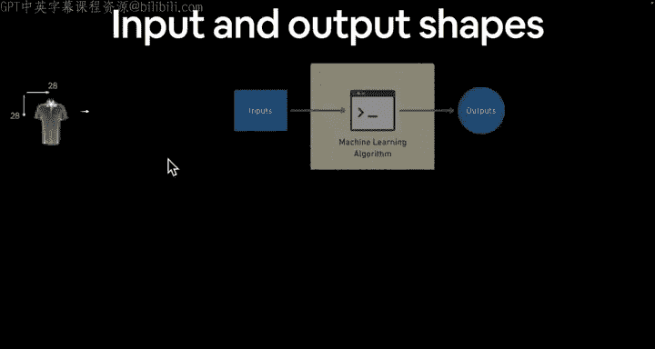

例如，一个批次大小为32、224x224像素的彩色图像，其形状可能是：
```python
# PyTorch默认“通道在前”格式
input_shape = (32, 3, 224, 224)
# 或“通道在后”格式
input_shape = (32, 224, 224, 3)
```
高度、宽度和批次大小都可以根据具体问题和硬件进行调整。

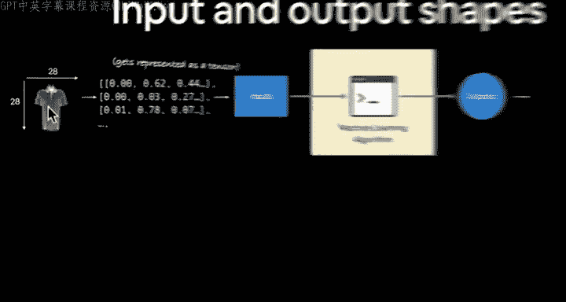

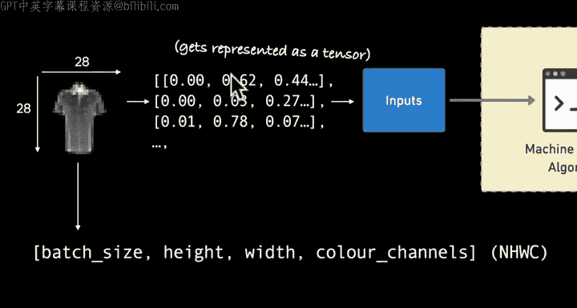

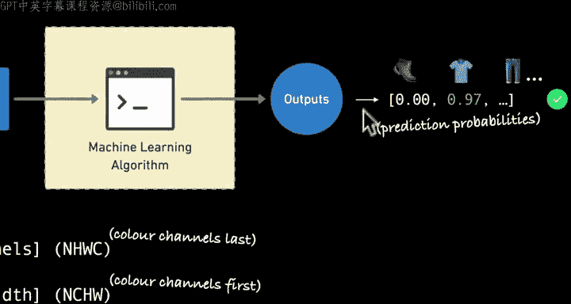

输出形状则取决于类别数量。对于10分类问题，输出形状就是10。

## 另一个例子：时尚物品分类 👕👟

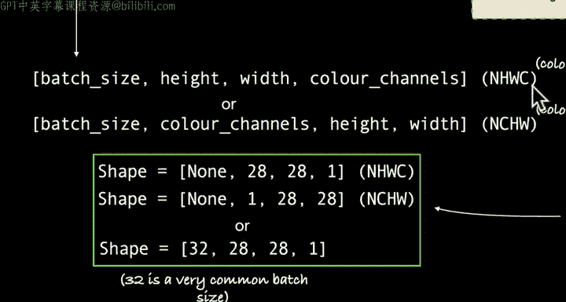

让我们看另一个例子：对28x28像素的灰度时尚物品图像进行分类。

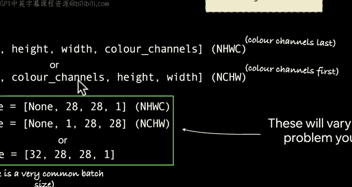

流程完全相同：
1.  将图像数值化表示。
2.  作为机器学习算法的输入。
3.  模型输出对应的服装类别（如T恤、靴子等）。

灰度图像只有一个颜色通道。其输入形状可能是 **`(batch_size, 1, 28, 28)`**（通道在前）或 **`(batch_size, 28, 28, 1)`**（通道在后）。不同库对数据格式的要求可能不同，因此需要注意转换。

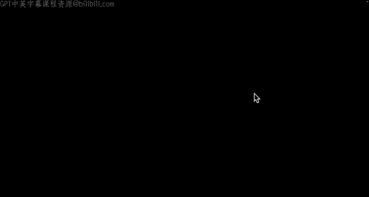

## PyTorch工作流程回顾 ⚙️

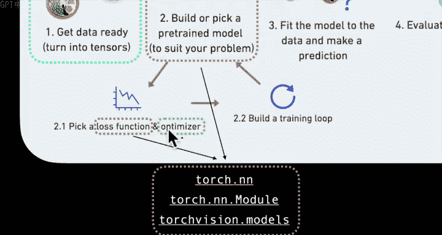

我们将遵循之前学习的PyTorch工作流程来处理计算机视觉问题：

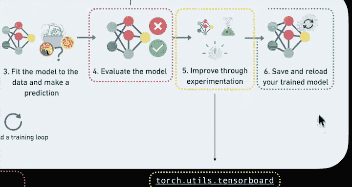

以下是核心步骤：
1.  **准备数据**：使用 `torchvision.transforms` 将数据转换为张量，并利用 `Dataset` 和 `DataLoader`。
2.  **构建模型**：从头构建卷积神经网络，或使用 `torchvision.models` 中的预训练模型。
3.  **训练模型**：定义损失函数和优化器，并循环训练。
4.  **评估与改进**：使用指标评估模型，并通过实验（如调整模型、超参数）进行改进。
5.  **保存与加载**：保存训练好的模型以供后续使用。

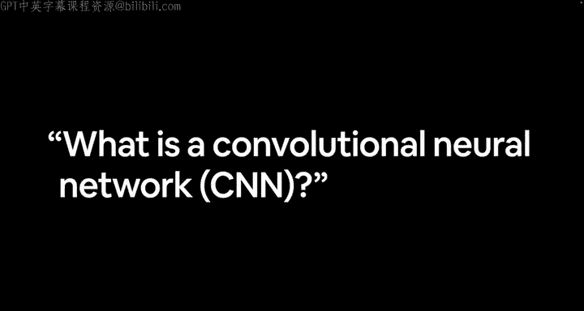

本节课中我们一起学习了计算机视觉模型的输入如何从图像转换为数值张量，以及输出如何表示模型的预测概率。我们还回顾了处理此类问题的通用PyTorch工作流程。在下一节，我们将深入探讨什么是卷积神经网络。