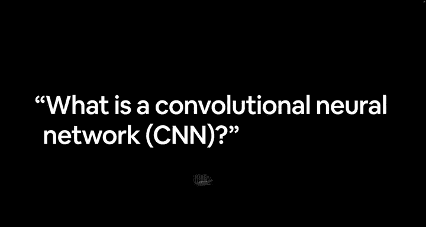
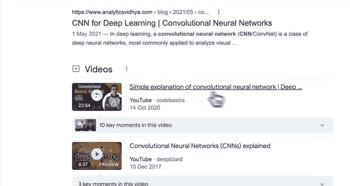
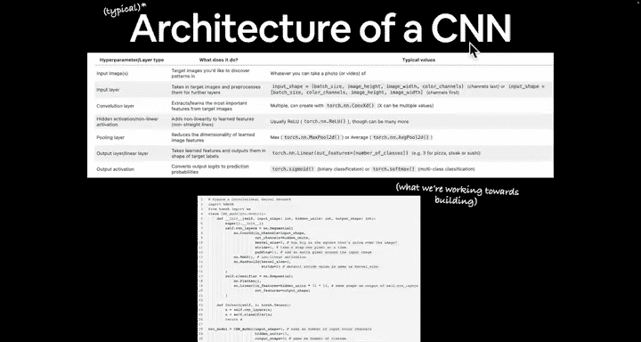
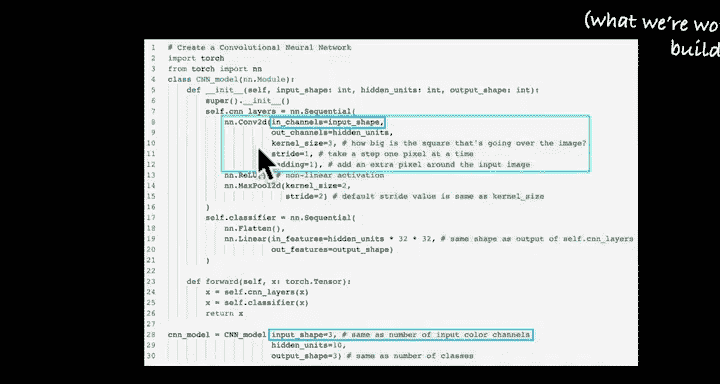
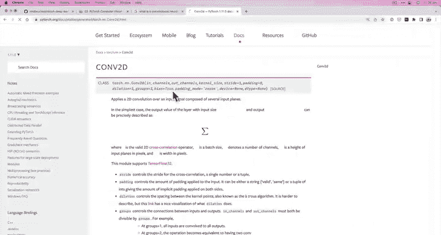
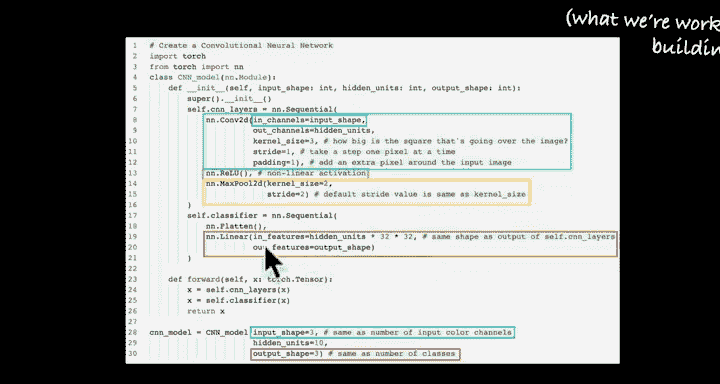

#  61：什么是卷积神经网络？🧠



在本节课中，我们将要学习卷积神经网络（CNN）的基本概念、典型架构以及它在计算机视觉中的作用。我们将通过代码优先的方式来理解这些概念。


---



在上一节中，我们看到了计算机视觉中输入和输出形状的例子，并暗示了卷积神经网络（CNN）是一种非常擅长识别图像中模式的深度学习模型。本节中，我们来看看什么是卷积神经网络，以及如何了解它。

以下是了解卷积神经网络的一种方式。网络上有很多相关资源，例如“卷积神经网络综合指南”。最好的资源是你最能理解的那一个。例如，Code Basics 有一个很棒的视频，提供了卷积神经网络的简单解释。我建议你自己研究这些内容。

如果你喜欢通过图像学习，也有很多图示可供参考。然而，我更喜欢通过编写代码来学习，因为作为一名机器学习工程师，我 99% 的时间都在写代码。这也是本课程的重点。



## 典型 CNN 架构 🏗️



卷积神经网络（CNN）是一种深度学习模型架构。在本课程中，当我提到 CNN 时，我指的是卷积神经网络，而不是新闻网站。

以下是我们将要构建的 PyTorch 代码所代表的典型 CNN 架构：



```python
# 示例：一个简单的 CNN 架构
import torch.nn as nn

class SimpleCNN(nn.Module):
    def __init__(self):
        super().__init__()
        self.conv1 = nn.Conv2d(in_channels=3, out_channels=64, kernel_size=3)
        self.activation = nn.ReLU()
        self.pool = nn.MaxPool2d(kernel_size=2)
        self.fc = nn.Linear(64 * 13 * 13, 10)  # 假设输入图像大小为 28x28

    def forward(self, x):
        x = self.conv1(x)
        x = self.activation(x)
        x = self.pool(x)
        x = x.view(x.size(0), -1)
        x = self.fc(x)
        return x
```

### 架构组件解析

以下是 CNN 的主要组件及其作用：

1.  **输入层**：接收输入通道和输入形状。在机器学习和深度学习中，确保模型输入和输出形状对齐非常重要。
2.  **卷积层**：对图像或张量执行卷积窗口操作，以发现其中的模式。卷积层的数学操作可以表示为：
    **输出 = 偏置 + Σ (权重张量 × 输入)**。
    其中，偏置是一个向量，权重是一个矩阵，它们共同作用于输入数据。
3.  **隐藏激活/非线性激活层**：由于我们的数据通常是非线性的（非直线），我们需要非线性的激活函数来帮助模型捕捉数据中的复杂模式。
4.  **池化层**：用于降低特征图的空间维度，减少计算量并提取主要特征。
5.  **输出层**：将网络的最终输出转换为理想的形状，例如分类任务中的类别数量。

### 数据处理流程

整个处理流程如下：输入图像经过上述所有层的处理（如果我们使用 `nn.Sequential` 组织这些层），最终 `forward` 方法返回一个可用于预测的张量。然后，我们可以将这个输出转换为类别名称，并将其集成到计算机视觉应用中。



需要注意的是，构建卷积神经网络的方式几乎是无限的，上面的架构只是其中一种典型示例。最好的练习方式不是盯着页面看，而是动手编写代码。

---


本节课中，我们一起学习了卷积神经网络的基本概念、典型架构及其核心组件。我们了解到 CNN 通过卷积层、激活层、池化层和输出层的组合，能够有效地识别图像中的模式。记住，实践是掌握这些概念的最佳方式，所以接下来让我们在 Google Colab 中动手编写代码吧！