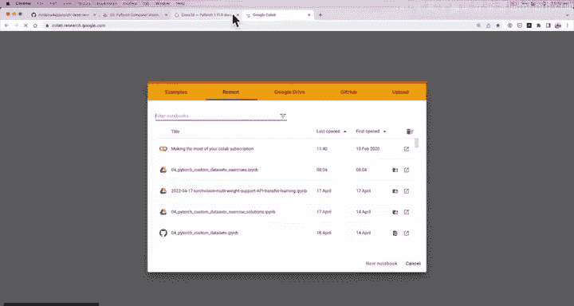
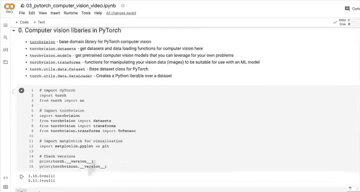

# 62：PyTorch计算机视觉入门 🖼️




在本节课中，我们将学习PyTorch中用于计算机视觉任务的核心库，并开始编写相关代码。我们将从导入必要的库开始，并了解它们的基本功能。

## 计算机视觉库概览

上一节我们讨论了计算机视觉问题和卷积神经网络的基础知识。本节中，我们来看看PyTorch中用于计算机视觉的核心库。

以下是PyTorch中主要的计算机视觉库：

*   **`torchvision`**：PyTorch的计算机视觉基础领域库。
*   **`torchvision.datasets`**：用于获取计算机视觉数据集和数据加载函数。
*   **`torchvision.models`**：包含预训练的计算机视觉模型。这些模型已在现有视觉数据上训练过，你可以利用其训练好的权重来解决自己的问题。
*   **`torchvision.transforms`**：提供用于处理图像数据的函数，使其适合机器学习模型使用。其核心功能是将图像数据转换为张量（数字形式）。
*   **`torch.utils.data.Dataset`**：PyTorch的基础数据集类，可用于创建自定义数据集。
*   **`torch.utils.data.DataLoader`**：围绕数据集创建一个Python可迭代对象，用于高效加载数据。

## 导入必要的库

现在，让我们导入这些库并检查版本，为后续的编码工作做好准备。

```python
import torch
import torch.nn as nn
import torchvision
from torchvision import datasets
from torchvision import transforms
import matplotlib.pyplot as plt

print(torch.__version__)
print(torchvision.__version__)
```

代码执行后，将输出当前安装的PyTorch和Torchvision版本。本课程需要的最低版本约为PyTorch 1.10和Torchvision 0.11。

## 核心概念：`transforms.ToTensor()`

在计算机视觉任务中，一个关键步骤是将图像数据转换为模型可以处理的数值格式。`torchvision.transforms`模块中的`ToTensor()`转换函数负责此项工作。

其功能用公式描述为：
**图像（PIL 或 NumPy 数组） → `ToTensor()` → PyTorch 张量**

这个转换是准备图像数据用于神经网络训练的基础步骤。

## 总结



本节课中我们一起学习了PyTorch计算机视觉的核心库，包括`torchvision`、`torchvision.datasets`、`torchvision.models`和`torchvision.transforms`。我们导入了这些库并了解了`ToTensor()`转换的基本作用。在下一节，我们将开始获取并探索一个具体的数据集。