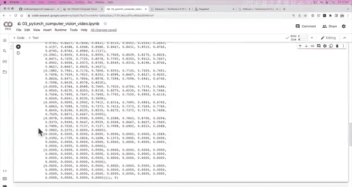
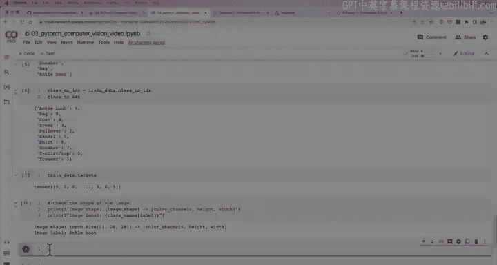
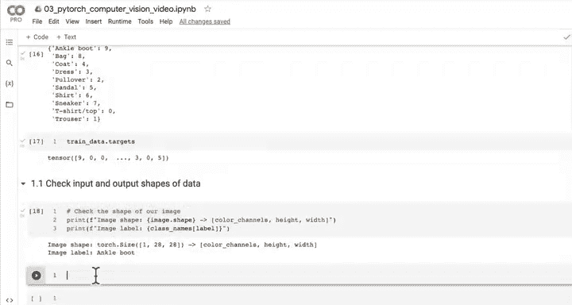
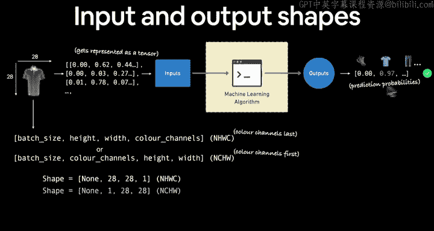
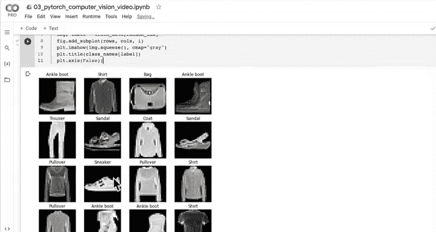
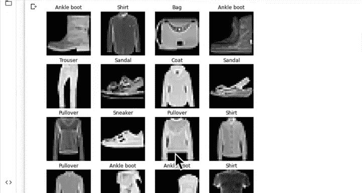
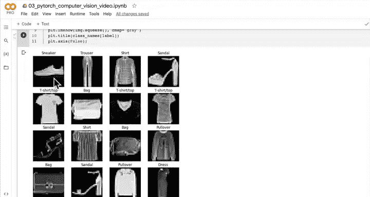
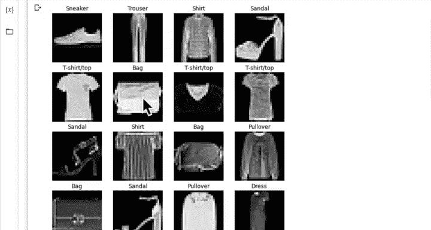
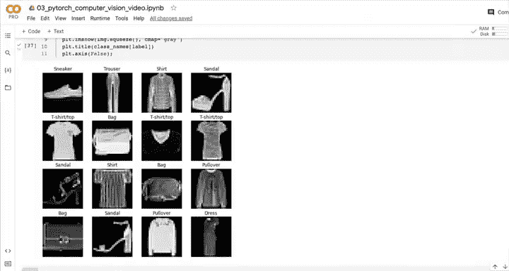

# 63：获取计算机视觉数据集 🖼️


在本节课中，我们将学习如何使用PyTorch的`torchvision`库来获取一个计算机视觉数据集。我们将以FashionMNIST数据集为例，演示如何下载、加载和初步探索数据。

---

## 概述

上一节我们介绍了PyTorch中一些基础的计算机视觉库，主要是`torchvision`及其相关模块。我们还提到了`torch.utils.data.Dataset`和`DataLoader`，它们是PyTorch处理数据的核心类。

本节中，我们将从大多数机器学习项目的起点开始：获取一个数据集。我们将使用FashionMNIST数据集，这是一个包含10类服装灰度图像的数据集，常用于计算机视觉入门。

---

## 1. 获取FashionMNIST数据集

我们将使用`torchvision.datasets`模块来下载FashionMNIST数据集。这个模块提供了许多内置的数据集，方便我们进行练习和研究。

以下是下载数据集的步骤：

```python
from torchvision import datasets
from torchvision.transforms import ToTensor

# 设置训练数据
train_data = datasets.FashionMNIST(
    root="data",          # 数据下载路径
    train=True,           # 获取训练集
    download=True,        # 如果本地没有则下载
    transform=ToTensor(), # 将图像转换为张量
    target_transform=None # 不对标签进行转换
)

# 设置测试数据
test_data = datasets.FashionMNIST(
    root="data",
    train=False,          # 获取测试集
    download=True,
    transform=ToTensor(),
    target_transform=None
)
```

运行上述代码后，数据将下载到指定的`data`文件夹中。训练集包含60,000个样本，测试集包含10,000个样本。

---

## 2. 探索数据集

在开始构建模型之前，我们需要了解数据的基本信息，例如样本数量、图像形状和标签类别。

以下是查看数据集信息的方法：

```python
# 查看样本数量
print(f"训练样本数量: {len(train_data)}")
print(f"测试样本数量: {len(test_data)}")

# 查看第一个训练样本
image, label = train_data[0]
print(f"图像形状: {image.shape}")  # 输出: torch.Size([1, 28, 28])
print(f"标签: {label}")            # 输出: 9

# 查看类别名称
class_names = train_data.classes
print(f"类别名称: {class_names}")
# 输出: ['T-shirt/top', 'Trouser', 'Pullover', 'Dress', 'Coat', 'Sandal', 'Shirt', 'Sneaker', 'Bag', 'Ankle boot']

# 将标签索引转换为类别名称
print(f"标签 {label} 对应的类别: {class_names[label]}")
# 输出: 标签 9 对应的类别: Ankle boot
```

通过以上代码，我们了解到图像是灰度图，形状为`[1, 28, 28]`，表示单通道、28x28像素。标签是一个整数，对应类别列表中的索引。

---





## 3. 可视化数据集

为了更直观地理解数据，我们可以使用Matplotlib库将图像可视化。需要注意的是，PyTorch默认使用“通道优先”格式（C, H, W），而Matplotlib期望“通道最后”格式（H, W, C）或单通道的灰度图（H, W）。



以下是可视化单个图像的方法：



```python
import matplotlib.pyplot as plt

# 获取第一个样本
image, label = train_data[0]

# 可视化图像
plt.figure(figsize=(3, 3))
plt.imshow(image.squeeze(), cmap="gray")  # 使用squeeze()移除单通道维度
plt.title(class_names[label])
plt.axis("off")
plt.show()
```

为了查看更多样本，我们可以随机选择多个图像进行展示：

```python
import torch

# 设置随机种子以确保结果可复现
torch.manual_seed(42)

# 创建子图网格
fig = plt.figure(figsize=(9, 9))
rows, cols = 4, 4

for i in range(1, rows * cols + 1):
    # 随机选择一个索引
    random_idx = torch.randint(0, len(train_data), size=[1]).item()
    img, label = train_data[random_idx]

    # 添加子图
    fig.add_subplot(rows, cols, i)
    plt.imshow(img.squeeze(), cmap="gray")
    plt.title(class_names[label])
    plt.axis("off")

plt.tight_layout()
plt.show()
```

通过可视化，我们可以观察到数据集中不同类别的服装图像，例如T恤、裤子、连衣裙等。这有助于我们理解数据的多样性和潜在挑战。

---





## 总结

在本节课中，我们一起学习了如何使用`torchvision.datasets`模块获取计算机视觉数据集。我们以FashionMNIST为例，演示了数据下载、基本探索和可视化过程。通过本节课，你应该能够：



1. 使用`torchvision.datasets`下载内置数据集。
2. 了解数据集的基本信息，如样本数量和图像形状。
3. 使用Matplotlib可视化图像数据。





在下一节课中，我们将学习如何将数据加载到模型中进行训练。