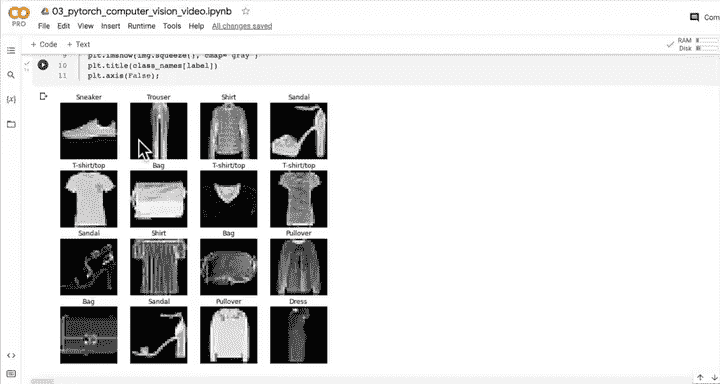
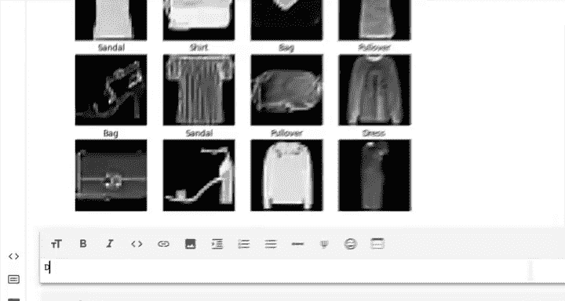
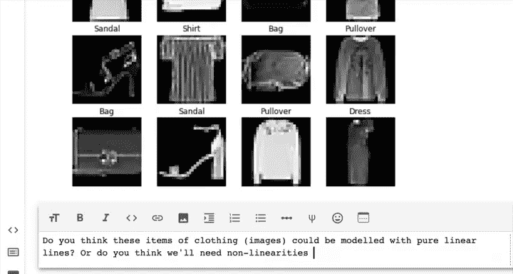
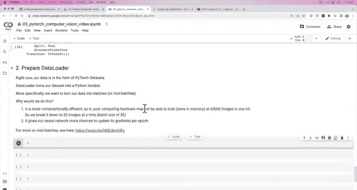
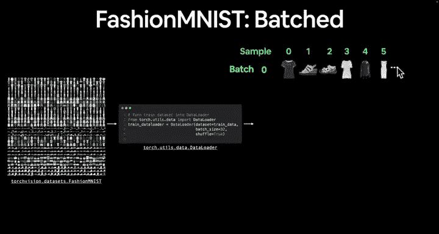

# 64：小批量处理 📚


在本节课中，我们将学习如何将数据集转换为小批量（Mini-batches），这是深度学习训练中的一个核心概念。我们将了解为什么需要小批量，以及如何在PyTorch中实现它。



---



上一节我们介绍了Fashion MNIST数据集的可视化。本节中我们来看看如何为模型训练准备数据。

我们拥有60,000张服装图像，目标是构建一个计算机视觉模型，将其分类为10个不同类别。现在我们已经可视化了一些样本。



你认为我们能否仅用线性直线（即直线）来建模这些图像？还是说我们需要一个具有非线性的模型？

这个问题可以稍后测试。现在，让我们开始进一步准备数据。

---

## 准备数据加载器

目前，我们的数据是PyTorch数据集（`Dataset`）的形式。让我们查看一下：

`train_data` 显示为一个Fashion MNIST数据集。`test_data` 类似，但数据点数量不同，并且每个都应用了相同的转换（转换为张量）。

我们希望将数据集（所有数据的集合）转换为数据加载器（`DataLoader`）。数据加载器将我们的数据集转换为一个Python可迭代对象。

更具体地说，我们希望将数据分成**批次**或**小批量**。

---

## 为什么使用小批量？

以下是使用小批量的两个主要原因：

1.  **计算效率更高**：你的计算硬件（如RAM、GPU内存）可能无法一次性存储和处理60,000张图像。因此，我们将其分解为每次处理32张图像（这被称为批量大小为32）。32是一个常见的初始批量大小，你可以根据问题调整它。

2.  **为神经网络提供更多梯度更新机会**：在每个训练周期（epoch）中，如果我们一次性查看所有60,000张图像，那么每个周期只能对整个数据集进行一次梯度更新。而如果我们每次查看32张图像，神经网络（通过优化器）每处理32张图像就会更新一次其内部权重。当我们编写训练循环时，这一点会更加清晰。

如果你想了解更多关于小批量的理论，强烈建议查阅Andrew Ng关于**小批量梯度下降**的课程。

---

## 小批量可视化

以下是我们将要实现的目标示意图：



我们将使用 `torch.utils.data.DataLoader` 来实现。我们需要传入数据集（`train_data`）、定义批量大小（例如32），并为训练数据设置 `shuffle=True`。


**为什么对训练数据设置 `shuffle=True`？** 这是为了防止数据集中可能存在的顺序性（例如所有裤子图像排在一起）。我们不希望神经网络记住数据的顺序，而只希望它学习不同类别之间的模式。因此，我们将数据打乱混合。

设置 `batch_size=32` 后，每个批次将包含32个样本。我们将拥有 `总样本数 / 批量大小` 个批次，例如约 `60000 / 32 ≈ 1875` 个批次。

---

## 代码实现预览

以下是我们将在下一节视频中编写的主要代码结构：

```python
# 创建训练数据加载器
train_dataloader = DataLoader(dataset=train_data,
                              batch_size=32,
                              shuffle=True)



# 对测试数据做同样处理（通常不需要打乱）
test_dataloader = DataLoader(dataset=test_data,
                             batch_size=32,
                             shuffle=False)
```

在下一个视频中，我们将编写代码，将我们的Fashion MNIST数据集“批量化”。

---

本节课中我们一起学习了小批量处理的概念及其重要性。我们了解到，小批量能提高计算效率，并为模型训练提供更频繁的梯度更新。下一节，我们将动手编写代码，创建数据加载器。