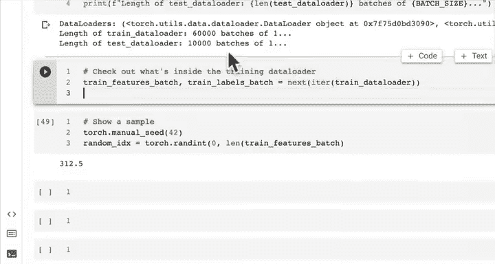
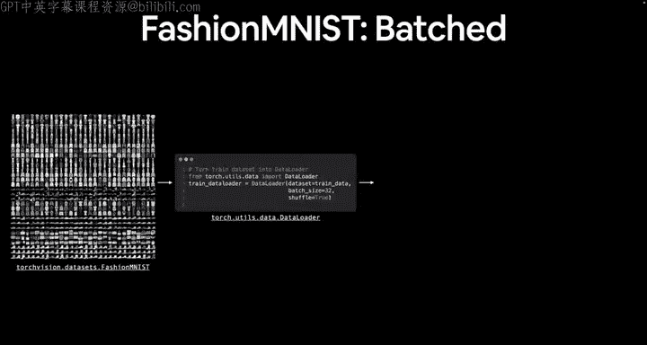
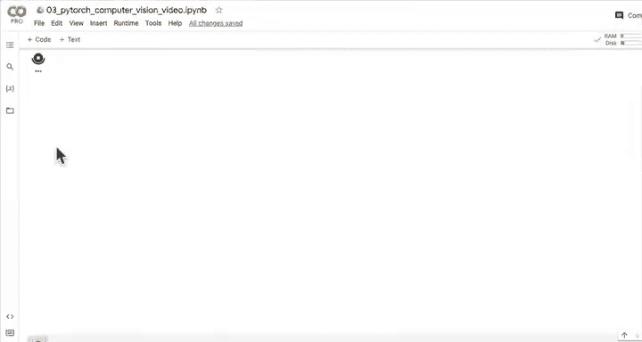
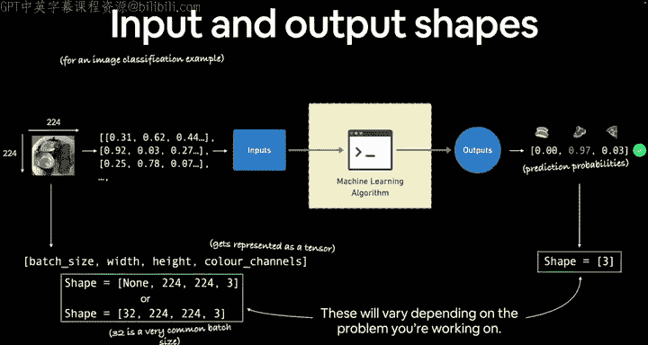
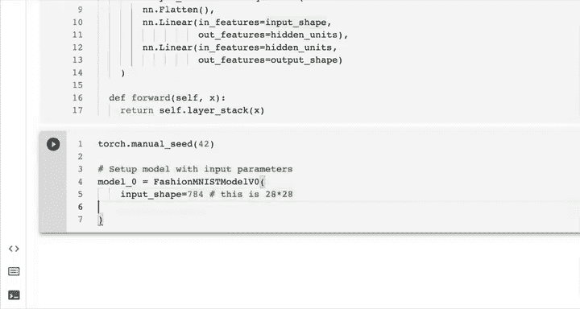
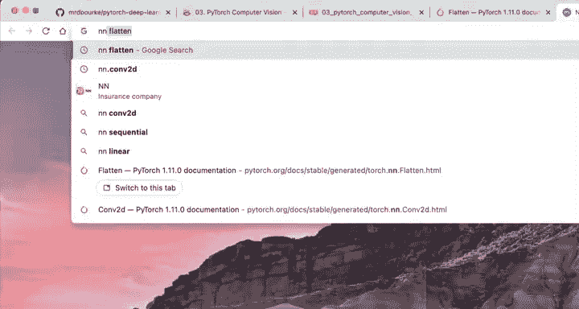
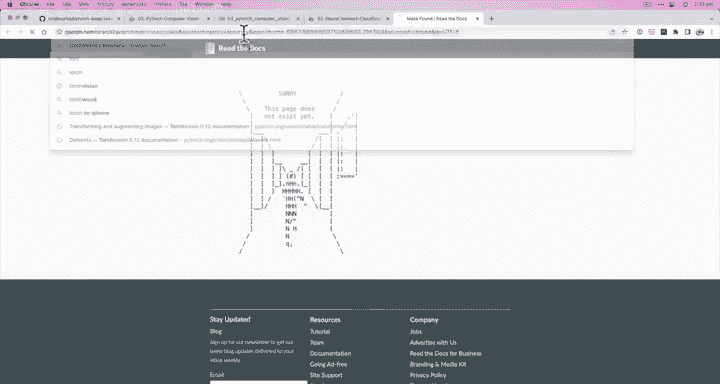
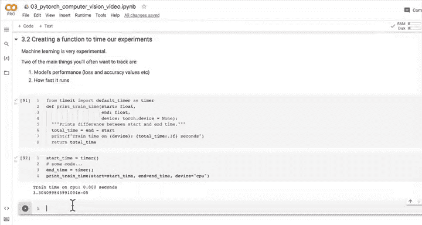

# 65：创建DataLoaders 📊

在本节课中，我们将学习如何为深度学习模型准备数据，具体来说，是创建DataLoaders。DataLoader是PyTorch中一个非常重要的工具，它可以帮助我们高效地管理和加载数据，特别是在处理大规模数据集时。

## 概述

上一节我们介绍了小批量（mini-batch）的概念。本节中，我们来看看如何将数据集转换为DataLoader，以便在训练模型时使用。我们将使用FashionMNIST数据集作为示例，并学习如何设置批量大小、打乱数据以及可视化批次中的样本。





## 创建DataLoader

首先，我们需要从`torch.utils.data`导入`DataLoader`。DataLoader不仅适用于图像数据，也适用于文本、音频等各种类型的数据。在许多深度学习问题中，数据批次的概念都会贯穿始终。

以下是创建DataLoader的步骤：

1.  **设置批量大小超参数**：超参数是你可以自行设置的值。批量大小通常设置为32，这是一个不错的起始值。
    ```python
    batch_size = 32
    ```

2.  **将数据集转换为可迭代对象**：我们将使用`DataLoader`将训练集和测试集转换为批次数据。
    ```python
    from torch.utils.data import DataLoader

    train_dataloader = DataLoader(train_data, batch_size=batch_size, shuffle=True)
    test_dataloader = DataLoader(test_data, batch_size=batch_size, shuffle=False)
    ```

    对于训练数据，我们通常打乱顺序，以防止模型学习到数据的顺序。对于测试数据，我们通常不打乱，以便于评估模型性能。





## 检查DataLoader

创建DataLoader后，我们可以检查其属性，以更好地理解我们创建的数据结构。

以下是检查DataLoader的步骤：





1.  **打印DataLoader**：查看DataLoader的基本信息。
    ```python
    print(train_dataloader)
    print(test_dataloader)
    ```

2.  **查看批次数量**：计算训练和测试DataLoader中的批次数量。
    ```python
    print(f"Length of train dataloader: {len(train_dataloader)} batches of {batch_size}")
    print(f"Length of test dataloader: {len(test_dataloader)} batches of {batch_size}")
    ```

    例如，对于60000个训练样本和批量大小32，我们将有大约1875个批次。

## 可视化批次中的样本


为了更直观地理解DataLoader中的数据，我们可以从批次中随机选择一个样本进行可视化。



以下是可视化批次样本的步骤：

1.  **设置随机种子**：确保每次运行代码时得到相同的结果，便于调试。
    ```python
    torch.manual_seed(42)
    ```

2.  **获取一个批次**：从DataLoader中获取一个批次的数据。
    ```python
    train_features_batch, train_labels_batch = next(iter(train_dataloader))
    ```

3.  **随机选择一个样本**：从批次中随机选择一个样本进行可视化。
    ```python
    random_idx = torch.randint(0, len(train_features_batch), size=[1]).item()
    img, label = train_features_batch[random_idx], train_labels_batch[random_idx]
    plt.imshow(img.squeeze(), cmap="gray")
    plt.title(class_names[label])
    plt.axis(False)
    ```

## 总结



本节课中我们一起学习了如何创建和使用DataLoader。我们首先设置了批量大小超参数，然后将数据集转换为DataLoader，并检查了其属性。最后，我们学习了如何从DataLoader中可视化批次中的样本。DataLoader是PyTorch中管理数据的重要工具，它使得数据加载更加高效和灵活，为后续的模型训练奠定了基础。