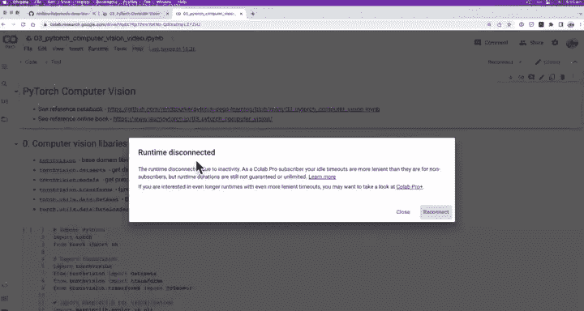
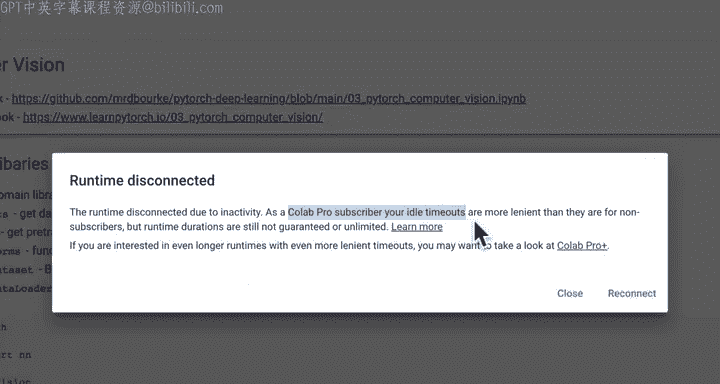
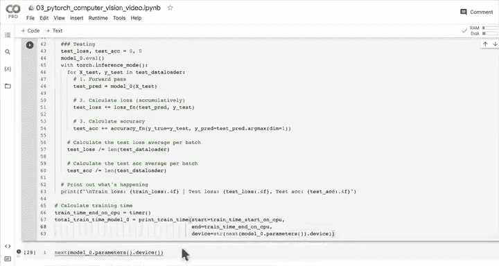
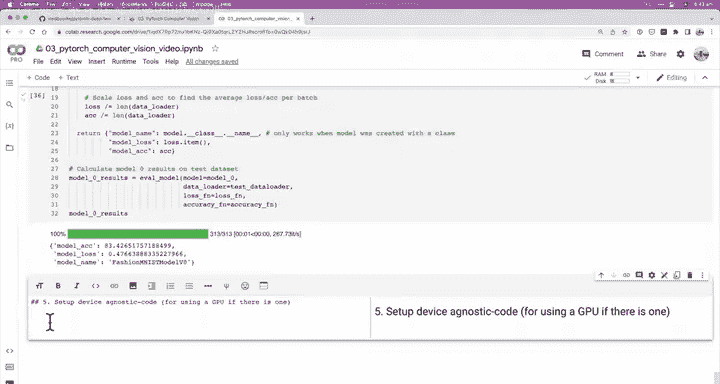

# 66：批数据训练与测试循环 🚀





在本节课中，我们将学习如何为批处理数据创建训练和测试循环。我们将使用PyTorch的`DataLoader`来处理数据批次，并构建一个完整的训练流程，包括前向传播、损失计算、反向传播和参数更新。我们还会引入进度条来跟踪训练过程，并最终评估模型的性能。

---

## 环境准备与数据加载

上一节我们介绍了如何使用`DataLoader`将数据划分为批次。本节中，我们来看看如何构建一个完整的训练循环来处理这些批次数据。

首先，确保我们的环境已准备就绪，数据已加载并划分为训练和测试批次。

```python
# 假设我们已经有了train_dataloader和test_dataloader
train_dataloader = DataLoader(train_data, batch_size=32, shuffle=True)
test_dataloader = DataLoader(test_data, batch_size=32, shuffle=False)
```

---

## 构建训练循环 🔄

以下是构建训练循环的核心步骤：

1.  循环遍历多个训练周期（epochs）。
2.  在每个周期内，循环遍历训练数据的所有批次。
3.  对每个批次执行训练步骤（前向传播、损失计算、反向传播、参数更新）。
4.  计算每个批次的平均训练损失。
5.  循环遍历测试数据的批次以评估模型。
6.  计算每个批次的平均测试损失和准确率。
7.  打印训练过程中的关键指标。
8.  记录总训练时间。

我们使用`tqdm`库来添加进度条，以便直观地观察训练进度。

```python
from tqdm.auto import tqdm
from timeit import default_timer as timer

# 设置随机种子和设备
torch.manual_seed(42)
device = "cuda" if torch.cuda.is_available() else "cpu"

# 开始计时
train_time_start_on_cpu = timer()

# 设置训练周期数（为了快速实验，先设为3）
epochs = 3

# 初始化模型、损失函数和优化器
model_0 = YourModel().to(device)
loss_fn = nn.CrossEntropyLoss()
optimizer = torch.optim.SGD(model_0.parameters(), lr=0.1)
```

---

## 训练与测试循环详解




现在，我们进入核心的循环部分。外层循环遍历周期，内层循环遍历批次。

```python
for epoch in tqdm(range(epochs)):
    print(f"Epoch: {epoch}\n-------")
    
    # 训练阶段
    train_loss = 0
    model_0.train() # 将模型设置为训练模式
    for batch, (X, y) in enumerate(train_dataloader):
        # 1. 前向传播
        y_pred = model_0(X)
        
        # 2. 计算损失
        loss = loss_fn(y_pred, y)
        train_loss += loss.item() # 累积批次损失
        
        # 3. 优化器梯度归零
        optimizer.zero_grad()
        
        # 4. 反向传播
        loss.backward()
        
        # 5. 优化器更新参数（关键：每个批次更新一次）
        optimizer.step()
        
        # 每400个批次打印一次进度
        if batch % 400 == 0:
            print(f"Looked at {batch * len(X)}/{len(train_dataloader.dataset)} samples.")
    
    # 计算平均训练损失（每个周期）
    train_loss /= len(train_dataloader)
    
    # 测试阶段
    test_loss, test_acc = 0, 0
    model_0.eval() # 将模型设置为评估模式
    with torch.inference_mode(): # 关闭梯度计算，加速推理
        for X_test, y_test in test_dataloader:
            # 1. 前向传播
            test_pred = model_0(X_test)
            
            # 2. 计算损失并累积
            test_loss += loss_fn(test_pred, y_test).item()
            
            # 3. 计算准确率并累积
            test_acc += accuracy_fn(y_true=y_test, y_pred=test_pred.argmax(dim=1))
    
    # 计算平均测试损失和准确率
    test_loss /= len(test_dataloader)
    test_acc /= len(test_dataloader)
    
    # 打印结果
    print(f"\nTrain loss: {train_loss:.4f} | Test loss: {test_loss:.4f} | Test acc: {test_acc:.4f}")

# 计算总训练时间
train_time_end_on_cpu = timer()
total_train_time_model_0 = train_time_end_on_cpu - train_time_start_on_cpu
print(f"Total training time: {total_train_time_model_0:.2f} seconds on {device}")
```

**核心概念**：优化器（`optimizer.step()`）在**每个批次**后更新模型参数，而不是每个周期后。这使得模型能更频繁地学习，是使用小批次数据的优势之一。

---

## 创建模型评估函数 📊

为了便于比较不同模型，我们将测试循环封装成一个可重用的函数。

```python
def eval_model(model: torch.nn.Module,
               data_loader: torch.utils.data.DataLoader,
               loss_fn: torch.nn.Module,
               accuracy_fn):
    """评估给定模型在给定数据加载器上的性能。"""
    loss, acc = 0, 0
    model.eval()
    with torch.inference_mode():
        for X, y in data_loader:
            # 前向传播
            y_pred = model(X)
            # 累积损失和准确率
            loss += loss_fn(y_pred, y).item()
            acc += accuracy_fn(y_true=y, y_pred=y_pred.argmax(dim=1))
        
        # 计算平均值
        loss /= len(data_loader)
        acc /= len(data_loader)
    
    return {"model_name": model.__class__.__name__, # 获取模型类名
            "model_loss": loss,
            "model_acc": acc}

# 使用函数评估我们的模型
model_0_results = eval_model(model=model_0,
                             data_loader=test_dataloader,
                             loss_fn=loss_fn,
                             accuracy_fn=accuracy_fn)
print(model_0_results)
```

---

## 总结与下一步 🎯

本节课中我们一起学习了如何为批处理数据构建完整的训练和测试循环。我们实现了：
*   使用`DataLoader`迭代数据批次。
*   构建了包含前向传播、损失计算、反向传播和参数更新的训练循环。
*   理解了优化器在每个批次后更新参数的重要性。
*   创建了评估函数来方便地衡量模型性能。



我们建立了一个在FashionMNIST数据集上准确率约83%的基线模型。在下一节中，我们将尝试改进模型，例如通过使用GPU进行加速训练，并继续探索通过实验来提升模型性能的方法。