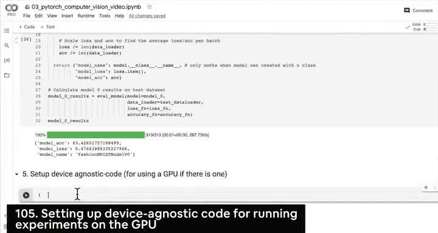
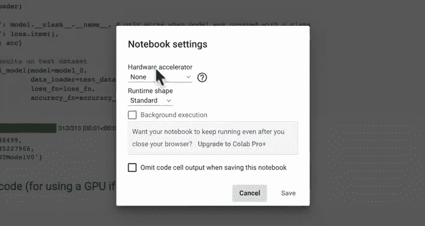
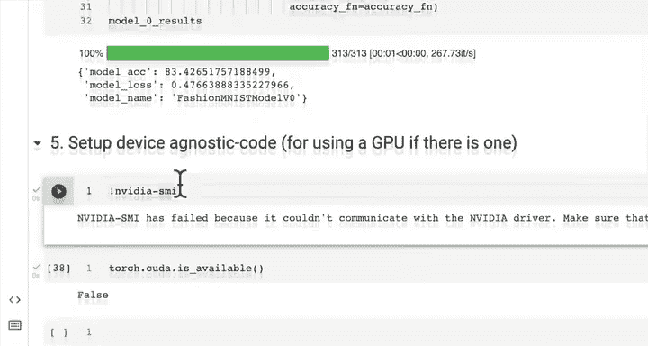
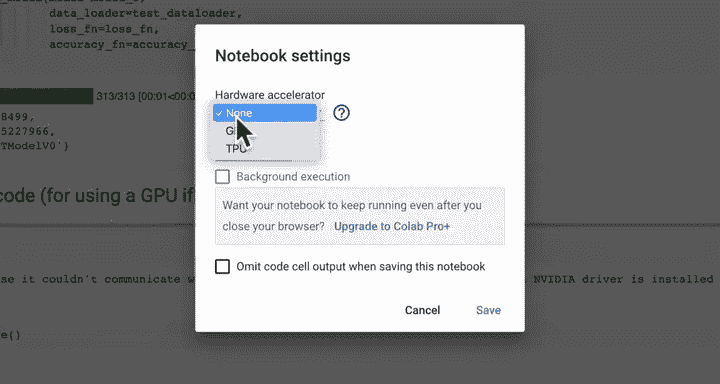
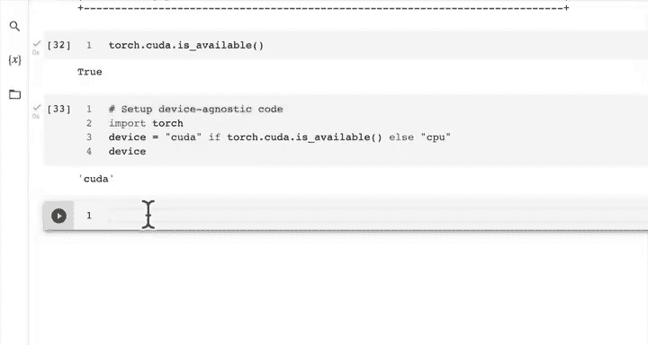

#  67：在 GPU 上运行实验 🚀


在本节课中，我们将学习如何设置与设备无关的代码，以便无论你的系统使用 CPU 还是 GPU，PyTorch 都能利用相应的硬件进行计算。我们还将检查 GPU 的可用性，并准备在 GPU 上运行一个包含非线性激活函数的模型。



---



## 检查 GPU 可用性

上一节我们介绍了如何训练一个基线模型。本节中，我们来看看如何利用 GPU 来加速我们的深度学习实验。

首先，我们需要检查当前环境是否有可用的 GPU。在 Google Colab 中，我们可以通过修改运行时设置来启用 GPU。

以下是检查 GPU 是否可用的方法：

```python
import torch



# 检查 CUDA（GPU）是否可用
torch.cuda.is_available()
```



如果上述代码返回 `True`，则表示有可用的 GPU。否则，我们需要在 Google Colab 的运行时设置中选择 GPU 并重启环境。

---

## 设置与设备无关的代码

为了确保我们的代码能在任何硬件上运行，我们需要设置与设备无关的代码。这意味着代码会自动检测并使用可用的最佳硬件（GPU 优先于 CPU）。

以下是如何设置与设备无关的代码：

```python
# 设置设备无关的代码
device = "cuda" if torch.cuda.is_available() else "cpu"
print(f"Using device: {device}")
```

这段代码会检查 CUDA（GPU）是否可用。如果可用，则将设备设置为 `"cuda"`；否则，设置为 `"cpu"`。这样，无论我们是在 CPU 还是 GPU 上运行，代码都能正常工作。

---

## 在 GPU 上运行模型

现在我们已经设置了设备无关的代码，接下来可以尝试在 GPU 上运行模型。我们之前构建的基线模型在测试集上达到了 83% 的准确率，表现不错。

然而，我们可能想知道：对于像衬衫、包和鞋子这样的数据集，是否需要非线性函数来建模？基线模型没有使用非线性函数，但已经取得了不错的效果。

为了探索这个问题，我们可以构建一个包含非线性激活函数（如 `nn.ReLU`）的模型，并在 GPU 上运行它。这将帮助我们了解非线性函数是否能进一步提升模型性能。

以下是构建包含非线性函数的模型的基本步骤：

1.  定义模型结构，并在其中添加非线性激活层。
2.  将模型和数据移动到 GPU 上。
3.  训练模型并评估其性能。

我们将在下一节中一起完成这个实验。

---

## 总结



本节课中我们一起学习了如何设置与设备无关的代码，以便在 CPU 或 GPU 上运行 PyTorch 模型。我们检查了 GPU 的可用性，并准备了在 GPU 上运行包含非线性函数的模型。在下一节课中，我们将实际构建并运行这个模型，看看非线性函数是否能带来性能提升。