#  68：使用非线性函数创建模型 🧠

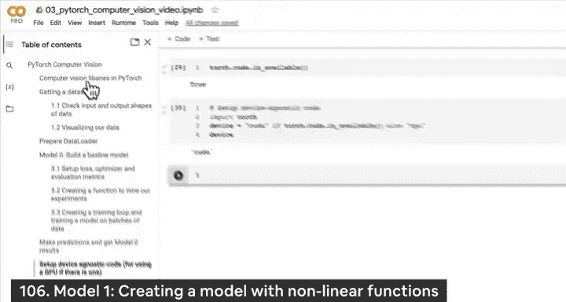

在本节课中，我们将学习如何构建一个包含非线性激活函数的神经网络模型，以探索其是否能比纯线性模型更好地处理数据。

---

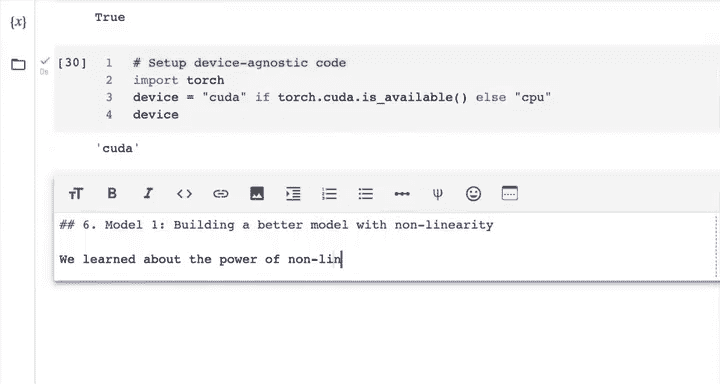

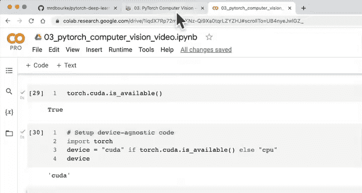

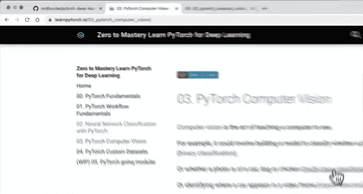

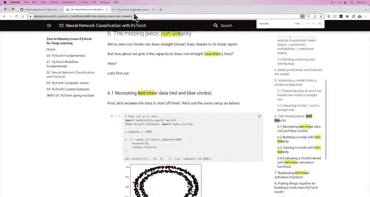

## 概述

上一节我们介绍了设备无关代码的配置。本节中，我们将进入“通过实验进行改进”的阶段，具体方法是构建一个包含非线性层的模型。我们将创建一个名为 `FashionMNISTModelV1` 的新模型，并在其中加入 ReLU 激活函数。

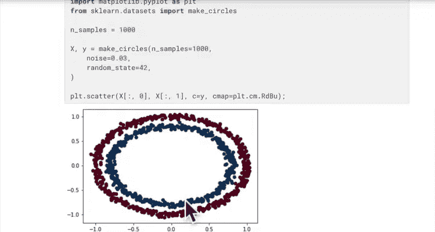

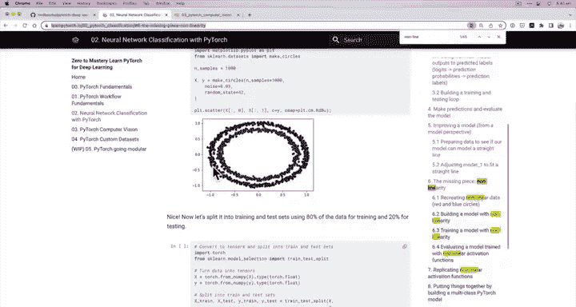

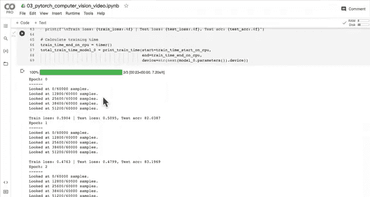

## 非线性函数的作用

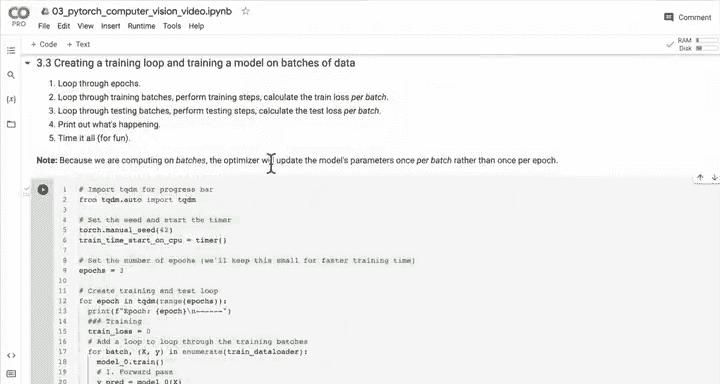

在之前的课程中，我们学习了非线性的力量。线性意味着直线，而非线性则意味着曲线。通过结合线性和非线性函数，神经网络几乎可以模拟任何类型的数据。ReLU 是一个常用的非线性激活函数。

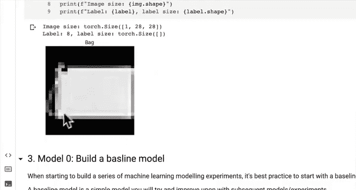

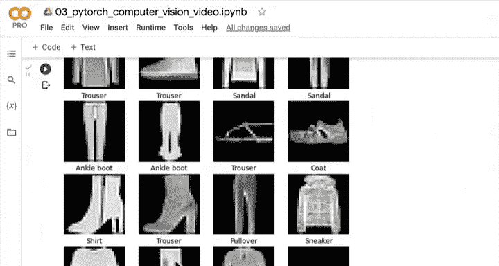

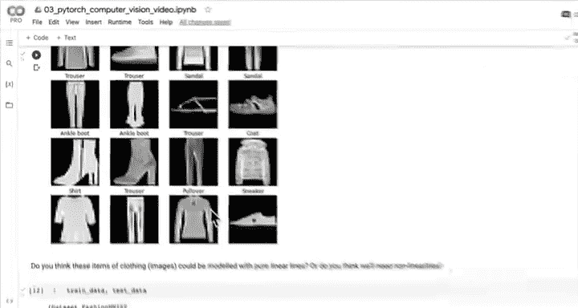

ReLU 函数的公式如下：
```
output = max(0, input)
```
这意味着，如果输入值为负，ReLU 会将其变为零；如果输入值为正，则保持不变。

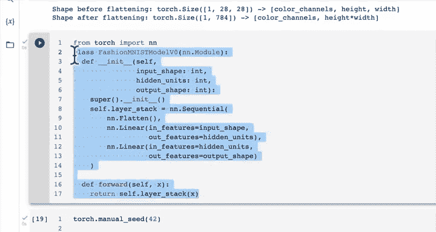

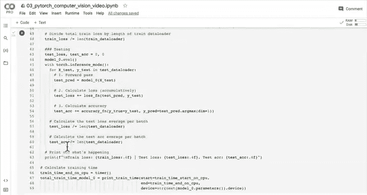

## 构建非线性模型

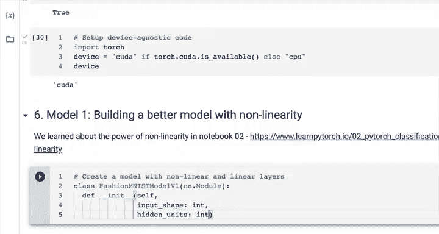

我们的新模型 `FashionMNISTModelV1` 将与之前的 `Model 0` 结构相似，但会在线性层之间插入 ReLU 激活函数。

以下是构建模型的代码：

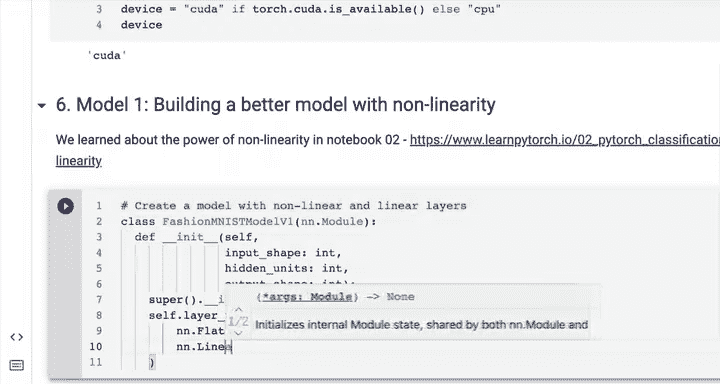

```python
class FashionMNISTModelV1(nn.Module):
    def __init__(self, input_shape: int, hidden_units: int, output_shape: int):
        super().__init__()
        self.layer_stack = nn.Sequential(
            nn.Flatten(), # 将输入展平为单个向量
            nn.Linear(in_features=input_shape, out_features=hidden_units),
            nn.ReLU(), # 添加非线性激活函数
            nn.Linear(in_features=hidden_units, out_features=output_shape),
            nn.ReLU()
        )
    
    def forward(self, x: torch.Tensor):
        return self.layer_stack(x)
```

请注意，ReLU 层不会改变数据的形状，它只应用非线性变换。

## 实例化模型并移至设备

接下来，我们需要实例化这个模型，并利用上一节设置的设备无关代码，将其移至可用的设备（如 GPU）上。

```python
torch.manual_seed(42) # 设置随机种子以保证结果可复现
model_1 = FashionMNISTModelV1(
    input_shape=784, # 28*28 图像展平后的尺寸
    hidden_units=10,
    output_shape=len(class_names)
).to(device) # 移至 GPU（如果可用）
```

现在，我们可以检查模型的参数是否已位于目标设备上。

## 设置损失函数和优化器

模型构建完成后，我们需要为其设置损失函数和优化器。对于多分类任务，我们继续使用交叉熵损失和随机梯度下降优化器。

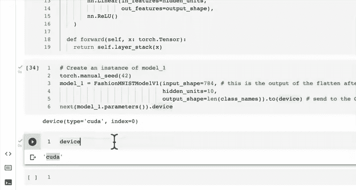

以下是相关代码：

```python
from helper_functions import accuracy_fn

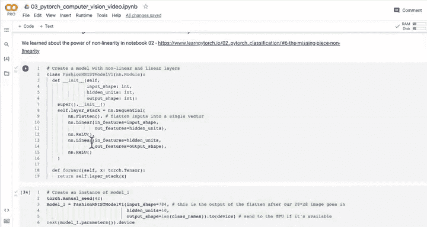

loss_fn = nn.CrossEntropyLoss()
optimizer = torch.optim.SGD(params=model_1.parameters(), lr=0.1)
```

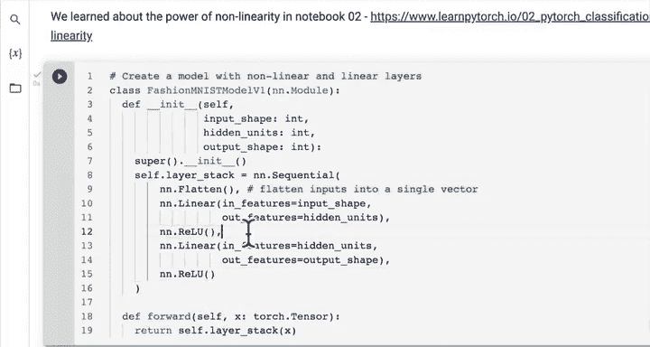

损失函数用于衡量模型的预测错误程度，而优化器则通过调整模型参数来减少损失。

## 下一步：创建训练和测试循环函数

我们已经多次编写训练和测试循环代码。为了提高效率，在下一节中，我们将把这些循环封装成可重用的函数，例如 `train_step()` 和 `test_step()`。这将使我们的实验流程更加清晰和模块化。

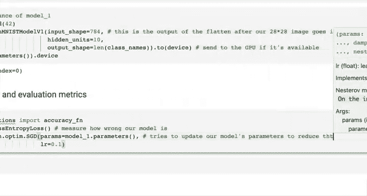

---

## 总结

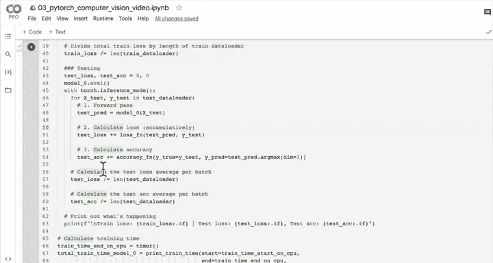

本节课中我们一起学习了如何构建一个包含非线性激活函数的神经网络模型。我们创建了 `FashionMNISTModelV1` 类，在其中加入了 ReLU 函数，并将模型移至 GPU。同时，我们为其配置了损失函数和优化器。接下来，我们将通过封装训练和测试循环来进一步完善我们的建模流程。