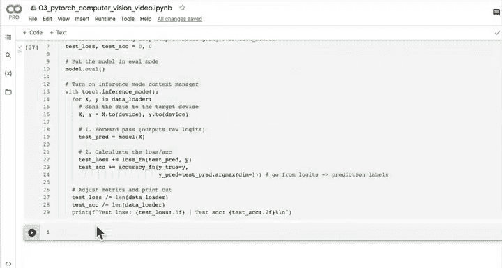
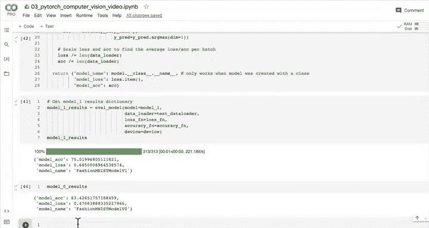

# 69：创建训练-测试循环 🔄

在本节课中，我们将学习如何将训练和测试循环代码封装成可复用的函数。这是PyTorch编程中的一个最佳实践，可以减少代码重复和潜在错误。

---

## 概述

我们已经准备好了损失函数和优化器。下一步是创建训练和评估循环。我们将把之前编写的循环代码封装成函数，以便在后续的模型训练中轻松调用。

---

## 函数化训练循环 🏋️

上一节我们介绍了损失函数和优化器，本节中我们来看看如何将训练循环代码封装成一个函数。

我们将创建一个名为 `train_step` 的函数。这个函数需要接收以下参数：
*   **模型** (`model`): 一个 `torch.nn.Module` 实例。
*   **数据加载器** (`data_loader`): 一个 `torch.utils.data.DataLoader` 实例。
*   **损失函数** (`loss_fn`): 用于计算损失的函数。
*   **优化器** (`optimizer`): 用于更新模型参数的优化器。
*   **准确率函数** (`accuracy_fn`): 用于计算模型准确率的函数。
*   **设备** (`device`): 指定模型和数据运行的设备（如CPU或GPU）。

以下是 `train_step` 函数的实现代码：

```python
def train_step(model: torch.nn.Module,
               data_loader: torch.utils.data.DataLoader,
               loss_fn: torch.nn.Module,
               optimizer: torch.optim.Optimizer,
               accuracy_fn,
               device: torch.device = device):
    """
    对模型执行单次训练步骤，使其在数据加载器上学习。
    """
    train_loss, train_acc = 0, 0

    # 将模型设置为训练模式
    model.train()

    for batch, (X, y) in enumerate(data_loader):
        # 将数据发送到目标设备
        X, y = X.to(device), y.to(device)

        # 1. 前向传播
        y_pred = model(X)

        # 2. 计算损失和准确率
        loss = loss_fn(y_pred, y)
        train_loss += loss
        train_acc += accuracy_fn(y_true=y,
                                 y_pred=y_pred.argmax(dim=1)) # 从logits转换为预测标签

        # 3. 优化器梯度归零
        optimizer.zero_grad()

        # 4. 反向传播
        loss.backward()

        # 5. 优化器步进
        optimizer.step()

    # 计算整个数据加载器的平均损失和准确率
    train_loss /= len(data_loader)
    train_acc /= len(data_loader)
    print(f"Train loss: {train_loss:.5f} | Train accuracy: {train_acc:.2f}%")
```

这个函数遍历数据加载器中的每个批次，执行前向传播、计算损失、反向传播和参数更新。最后，它计算并打印整个训练集上的平均损失和准确率。

---

## 函数化测试循环 🧪

现在，让我们以类似的方式为测试循环创建一个函数。

我们将创建一个名为 `test_step` 的函数。它需要的参数与 `train_step` 类似，但**不需要优化器**，因为在测试阶段我们只评估模型，不更新参数。

以下是 `test_step` 函数的实现代码：

```python
def test_step(model: torch.nn.Module,
              data_loader: torch.utils.data.DataLoader,
              loss_fn: torch.nn.Module,
              accuracy_fn,
              device: torch.device = device):
    """
    对模型执行单次测试步骤，在数据加载器上评估其性能。
    """
    test_loss, test_acc = 0, 0

    # 将模型设置为评估模式
    model.eval()

    # 开启推理模式上下文管理器以加速预测
    with torch.inference_mode():
        for X, y in data_loader:
            # 将数据发送到目标设备
            X, y = X.to(device), y.to(device)

            # 1. 前向传播
            test_pred = model(X)

            # 2. 计算损失和准确率
            test_loss += loss_fn(test_pred, y)
            test_acc += accuracy_fn(y_true=y,
                                    y_pred=test_pred.argmax(dim=1)) # 从logits转换为预测标签

        # 调整指标，计算整个数据加载器的平均值
        test_loss /= len(data_loader)
        test_acc /= len(data_loader)

        # 打印结果
        print(f"Test loss: {test_loss:.5f} | Test accuracy: {test_acc:.2f}%\n")
```

这个函数将模型设置为评估模式，并在 `torch.inference_mode()` 上下文管理器内运行，这可以禁用梯度计算并提高推理速度。它计算整个测试集上的平均损失和准确率。

---

## 使用函数构建训练循环 ⚙️

现在我们已经有了 `train_step` 和 `test_step` 函数，我们可以用它们来简洁地构建整个训练循环。

以下是使用这些函数训练模型（例如 `model_1`）的示例代码：




```python
# 设置随机种子以保证结果可复现
torch.manual_seed(42)

# 导入计时器
from timeit import default_timer as timer
train_time_start_on_gpu = timer()

# 设置训练轮数
epochs = 3

# 创建优化和评估循环
for epoch in tqdm(range(epochs)):
    print(f"Epoch: {epoch}\n---------")
    # 训练步骤
    train_step(model=model_1,
               data_loader=train_dataloader,
               loss_fn=loss_fn,
               optimizer=optimizer,
               accuracy_fn=accuracy_fn,
               device=device)

    # 测试步骤
    test_step(model=model_1,
              data_loader=test_dataloader,
              loss_fn=loss_fn,
              accuracy_fn=accuracy_fn,
              device=device)

# 计算总训练时间
train_time_end_on_gpu = timer()
total_train_time_model_1 = print_train_time(start=train_time_start_on_gpu,
                                            end=train_time_end_on_gpu,
                                            device=device)
```

通过这种方式，我们的训练循环变得非常简洁和可读。这些函数可以保存到单独的帮助文件（如 `helper_functions.py`）中，并在未来的项目中导入重用。

---

## 关于设备与性能的注意事项 💡

在比较不同设备（CPU vs GPU）上的训练时间时，你可能会发现一些有趣的现象。

有时，根据你的数据和硬件，你可能会发现模型在CPU上训练得更快。这主要有两个原因：

1.  **数据复制开销**：将数据和模型在CPU和GPU内存之间来回复制所产生的开销，可能超过了GPU本身的计算优势。
2.  **硬件差异**：你使用的CPU在计算能力上可能比你使用的GPU更强（这种情况较为罕见）。

通常，当模型更大、数据集更复杂、网络层计算更密集时，GPU的并行计算优势才会更加明显，带来显著的加速效果。

> **提示**：如果你想深入了解如何最大化GPU的利用效率，可以查阅PyTorch核心开发者Horace He的文章《Making Deep Learning Go Brrr From First Principles》，其中详细讨论了计算和内存带宽等核心概念。

---

## 修复评估函数中的设备问题 🔧

在将函数整合到工作流中时，我们可能会遇到一个常见的“陷阱”：设备不匹配错误。

例如，当我们尝试用一个在GPU上训练的模型和一个在CPU上的数据加载器调用评估函数时，PyTorch会抛出 `RuntimeError: Expected all tensors to be on the same device` 错误。

深度学习模型常常会“静默地失败”，设备不匹配就是其中之一。另外两个常见错误是**数据形状不匹配**和**数据类型不匹配**。

为了解决这个问题，我们需要确保评估函数（以及任何处理数据和模型的函数）是**设备无关**的。这意味着我们需要在函数内部将数据显式地发送到模型所在的设备。

以下是修复后的 `eval_model` 函数示例：

```python
def eval_model(model: torch.nn.Module,
               data_loader: torch.utils.data.DataLoader,
               loss_fn: torch.nn.Module,
               accuracy_fn,
               device: torch.device = device): # 添加设备参数
    """在给定的数据加载器上评估模型。"""
    loss, acc = 0, 0
    model.eval()
    with torch.inference_mode():
        for X, y in data_loader:
            # 发送数据到目标设备（关键修复！）
            X, y = X.to(device), y.to(device)
            # 前向传播和计算指标...
            # ... (其余代码保持不变)
    return {"model_name": model.__class__.__name__,
            "model_loss": loss.item(),
            "model_acc": acc}
```

通过添加 `X, y = X.to(device), y.to(device)` 这一行，我们确保了数据和模型位于同一设备上，从而避免了运行时错误。

---

## 总结



本节课中我们一起学习了如何将PyTorch的训练和测试循环封装成可复用的函数。我们创建了 `train_step` 和 `test_step` 函数，使代码更加模块化、可读且易于维护。我们还讨论了设备无关编程的重要性，并修复了因设备不匹配导致的常见错误。最后，我们简要探讨了影响CPU与GPU训练性能的因素。掌握这些技能将帮助你更高效地构建和迭代深度学习模型。