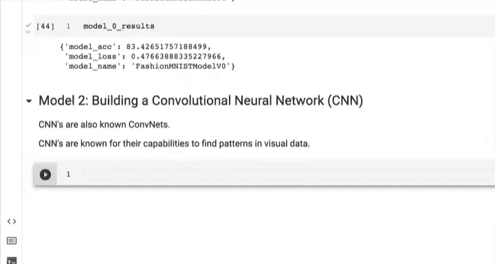
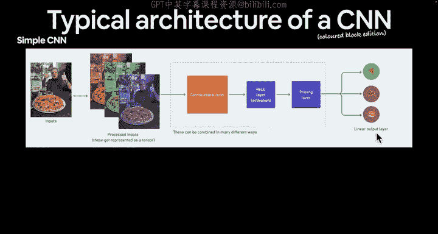
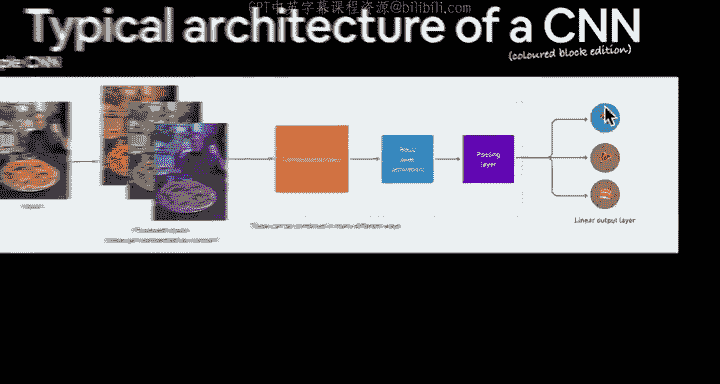
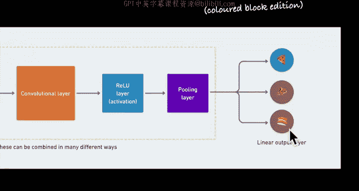
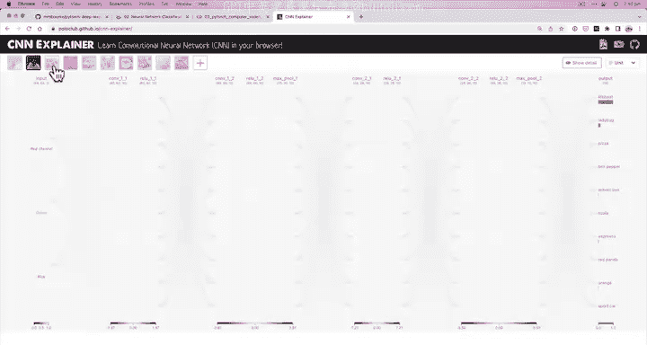
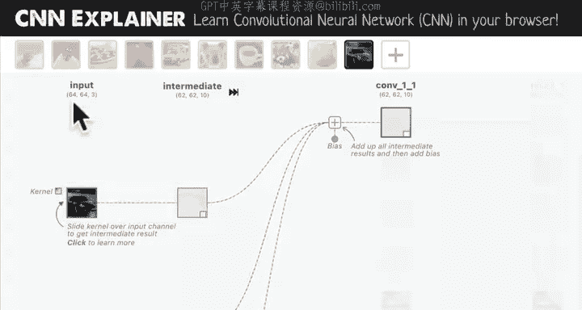
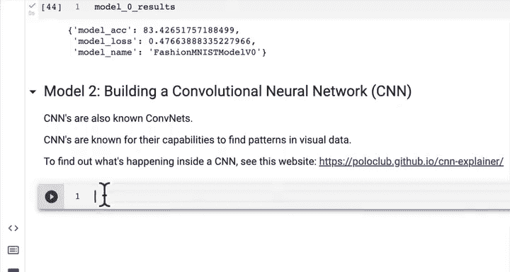

#  70：卷积神经网络概述 🧠

在本节课中，我们将学习卷积神经网络（CNN）的基本概念和架构。我们将了解CNN如何从视觉数据中发现模式，并准备在后续课程中动手构建我们的第一个CNN模型。

---

在上一节中，我们看到我们的第二个建模实验（模型1）未能超越基线。现在，我们将继续进行建模实验，并转向模型2。这是一个令人兴奋的步骤，我们将构建一个卷积神经网络，它也被称为CNN或ConvNets。CNN以其在视觉数据中发现模式的能力而闻名。

## CNN的典型架构 🏗️

让我们回顾一下典型的CNN架构。与任何深度学习模型一样，我们有一个输入层，用于输入某种数据。我们有一系列隐藏层。在卷积神经网络中，这些隐藏层包括卷积层、非线性激活层（如ReLU）以及池化层。最后，我们通常有一个某种形式的输出层，这通常是一个线性层。这些不同层的具体值取决于你正在处理的问题。

我们的目标是构建类似这样的模型。你会注意到，很多代码与我们之前为其他PyTorch模型编写的代码非常相似。唯一的区别在于这里我们将使用不同的层类型。

## CNN的可视化与工作原理 🖼️

如果我们想以彩色块的形式可视化一个CNN，可以想象一个简单的CNN。输入可能是一张图像，例如一张我父亲竖起两个大拇指吃披萨的图片。我们将预处理这个输入，换句话说，将其转换为代表图像红、绿、蓝通道的张量。

然后，我们将通过一系列卷积层、ReLU层和池化层的组合来传递它。关于深度学习模型，需要注意的一点是，不要过于纠结这些层的顺序，因为它们可以以多种不同的方式组合。事实上，几乎每天、每周都有关于如何最佳构建这些层的新研究出现。更重要的总体原则是如何将你的输入转化为理想的输出，这才是乐趣所在。

当然，我们还有线性输出层，在分类任务中，它将输出我们拥有的类别数量的值。

## 构建更深的网络 📊

如果你想使你的CNN更深，这就是“深度学习”中“深度”一词的由来。你可以添加更多的层。这背后的理论或实践是，向你的深度学习模型添加的层越多，它就有越多的机会在数据中发现模式。

那么它是如何发现这些模式的呢？这里的每一层，就像我们之前看到的那样，将对我们输入的任何数据执行不同的数学运算组合，而每一后续层都从前一层接收其输入。

## 探索CNN交互网站 🔍

现在，让我们转向一个极佳的学习资源：CNN Explainer网站。这部分将作为本视频的额外课程，建议你花20分钟点击并浏览整个网站。我们不会一起完成，因为我希望你自己去探索，这是最好的学习方式。

在这个网站上，你会看到一些不同类型的图像作为输入。例如，我们从一张披萨图片开始。然后，图像会经过一个卷积层、一个ReLU层、另一个卷积层、另一个ReLU层、一个最大池化层等等。这个架构就是一个卷积神经网络，并且它在浏览器中实时运行。

我们传递这张图像，你会注意到它被分解为红、绿、蓝通道。然后它经过每一层，发生变化，最终产生一个输出。你会注意到输出这里有10个不同的类别，因为在这个演示中我们有10种不同的图像类别。当然，如果我们有100个类别，我们可以将其改为100，但这里的基本组成部分将保持大致相同。

你会注意到，“披萨”类别在这里具有最高的输出值，因为我们的图像是披萨。如果我们换成“浓缩咖啡”的图片，那么“浓缩咖啡”类别就会有最高的值。所以这是一个性能相当不错的卷积神经网络。

## 卷积层内部发生了什么？🔬

让我们深入了解卷积层内部发生了什么。我们有一个输入图像，其格式为64x64x3（颜色通道在最后）。我们有一个内核（也称为滤波器），它会在我们的图像像素值上滑动。因为图像数据是以张量格式存在的，内核试图在这些数据中发现微小而复杂的模式。

例如，我们从左上角开始，然后慢慢移动。你会看到右侧的输出有另一个小方块。你注意到中间的所有数字都在变化吗？这就是卷积层在我们的输入图像上进行卷积时发生的数学运算。

这非常酷。你可能在输出上看到，例如在车头灯周围有一些轻微的值激活。你注意到右侧有一些红色的图块吗？这可能意味着这一层或这个隐藏单元正在学习数据的某个特定特征。

我想稍微放大一下视角：我们有10个隐藏单元。每一个都将学习数据的不同特征。现在，深度学习的魅力（同时也是其挑战之一）在于，我们实际上并不控制每一个单元学习什么。深度学习的魔力在于它自己找出最佳的学习内容。

我们点击这里的每一个单元，都会在右侧看到不同的表示。这就是图像在逐层通过卷积神经网络时会发生的情况。

## 总结与下一步 📝

本节课我们一起学习了卷积神经网络（CNN）的基本概述。我们了解了CNN的典型架构，包括输入层、卷积层、激活层、池化层和输出层。我们探讨了CNN如何通过逐层的数学运算从视觉数据中提取特征，并介绍了CNN Explainer这个优秀的交互式学习工具来直观理解其内部工作原理。

如果你想了解CNN背后的直觉和数学原理，可以查看该网站上的所有资源，这是本视频的额外课程。

在下一节课程中，我们将开始编写PyTorch代码，来复现这里发生的一切，构建我们的第一个用于计算机视觉的卷积神经网络。这非常令人兴奋，期待在那里与你相见。