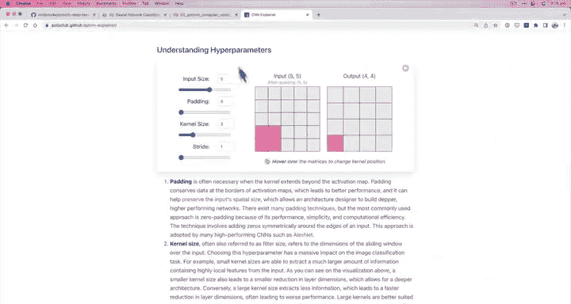

# 71：编写CNN模型 🧠


在本节课中，我们将学习如何编写一个卷积神经网络（CNN）。我们将基于CNN Explainer网站上的Tiny VGG架构，使用PyTorch构建我们的第一个CNN模型。通过本节课，你将了解CNN的基本组成部分，并学会如何将它们组合成一个完整的模型。

## 概述

上一节我们介绍了CNN Explainer网站，这是一个学习卷积神经网络的优秀资源。本节我们将动手编写一个CNN模型。我们将构建一个名为Tiny VGG的CNN架构，并逐步解释每一层的作用。

## 构建卷积神经网络

我们首先创建一个名为`FashionMNISTModelV2`的类，它继承自`nn.Module`。这个模型将复制Tiny VGG的架构。

```python
class FashionMNISTModelV2(nn.Module):
    def __init__(self, input_shape: int, hidden_units: int, output_shape: int):
        super().__init__()
```

在初始化方法中，我们定义模型的输入形状、隐藏单元数量和输出形状。这些参数允许我们在实例化模型时灵活配置。

## 定义卷积块

CNN通常由多个卷积块组成。每个卷积块包含多个层。在Tiny VGG中，有两个主要的卷积块。

以下是第一个卷积块的代码：

```python
self.conv_block_1 = nn.Sequential(
    nn.Conv2d(in_channels=input_shape,
              out_channels=hidden_units,
              kernel_size=3,
              stride=1,
              padding=1),
    nn.ReLU(),
    nn.Conv2d(in_channels=hidden_units,
              out_channels=hidden_units,
              kernel_size=3,
              stride=1,
              padding=1),
    nn.ReLU(),
    nn.MaxPool2d(kernel_size=2)
)
```

我们使用`nn.Sequential`将多个层组合在一起。第一个卷积块包含两个卷积层、两个ReLU激活层和一个最大池化层。

## 第二个卷积块

第二个卷积块的结构与第一个相同，只是输入通道数变为隐藏单元数。

以下是第二个卷积块的代码：

```python
self.conv_block_2 = nn.Sequential(
    nn.Conv2d(in_channels=hidden_units,
              out_channels=hidden_units,
              kernel_size=3,
              stride=1,
              padding=1),
    nn.ReLU(),
    nn.Conv2d(in_channels=hidden_units,
              out_channels=hidden_units,
              kernel_size=3,
              stride=1,
              padding=1),
    nn.ReLU(),
    nn.MaxPool2d(kernel_size=2)
)
```

## 分类器层

卷积块之后，我们需要一个分类器层。这个层将卷积块提取的特征转换为最终的分类结果。

以下是分类器层的代码：

```python
self.classifier = nn.Sequential(
    nn.Flatten(),
    nn.Linear(in_features=hidden_units * 7 * 7,  # 临时占位值
              out_features=output_shape)
)
```

我们使用`nn.Flatten`将多维张量展平为一维向量，然后通过一个线性层输出分类结果。

## 前向传播

在前向传播方法中，我们定义数据如何通过模型的各个部分。

以下是前向传播的代码：

```python
def forward(self, x):
    x = self.conv_block_1(x)
    print(x.shape)  # 打印形状以跟踪数据变化
    x = self.conv_block_2(x)
    print(x.shape)  # 打印形状以跟踪数据变化
    x = self.classifier(x)
    return x
```

我们通过卷积块和分类器层传递输入数据，并在每一步打印张量的形状，以便跟踪数据的变化。

## 实例化模型

现在我们可以实例化我们的CNN模型。对于FashionMNIST数据集，输入形状为1（因为图像是黑白的），隐藏单元数为10，输出形状为类别数量。

以下是实例化模型的代码：

```python
torch.manual_seed(42)
model_2 = FashionMNISTModelV2(input_shape=1,
                              hidden_units=10,
                              output_shape=len(class_names)).to(device)
```

## 总结

在本节课中，我们一起学习了如何编写一个卷积神经网络。我们基于Tiny VGG架构构建了一个CNN模型，并逐步解释了每一层的作用。通过本节课，你应该对CNN的基本结构有了更深入的理解，并能够使用PyTorch构建自己的CNN模型。



在接下来的课程中，我们将进一步探讨CNN中的超参数，如卷积核大小、步长和填充，并学习如何计算分类器层的输入特征数。