# 72：114. 详解 nn.Conv2d 与 nn.MaxPool2d 🧠


在本节课中，我们将深入学习PyTorch中两个关键的卷积神经网络层：`nn.Conv2d` 和 `nn.MaxPool2d`。我们将通过代码实践，一步步理解它们的工作原理、参数设置以及如何影响数据的形状。我们将复现CNN Explainer网站上的Tiny VGG架构，并使用虚拟数据来验证我们的理解。

## 7.1 逐步解析 nn.Conv2d 🔍

上一节我们成功用PyTorch编写了第一个卷积神经网络。现在，我们来深入看看其中两个新出现的层：`nn.Conv2d` 和 `nn.MaxPool2d`。它们的核心目标与我们之前的工作一致：学习最能代表数据特征的最佳方式。本节中，我们重点分析 `nn.Conv2d`。

首先，我们可以查阅官方文档来了解其数学运算。本质上，输出等于偏置项加上权重张量与输入的乘积之和。公式可以表示为：
`输出 = 偏置 + 求和(权重 * 输入)`
权重张量和偏置值以某种方式操纵我们的输入以得到输出。

不过，我们不过多纠结于数学公式，而是通过代码来实践。我们将复现CNN Explainer网站上的第一个卷积层，并使用虚拟输入进行测试。

以下是创建虚拟数据并初始化一个 `nn.Conv2d` 层的步骤：

```python
import torch
import torch.nn as nn

# 设置随机种子以保证结果可复现
torch.manual_seed(42)

# 创建一个批量的图像数据，形状为 (batch_size, channels, height, width)
# 这里模拟一个批次大小为32，3个颜色通道，64x64像素的图像
image_batch = torch.randn(size=(32, 3, 64, 64))
# 取批次中的第一张图像作为测试
single_image = image_batch[0]

print(f"图像批次形状: {image_batch.shape}")
print(f"单张图像形状: {single_image.shape}")
print(f"测试图像数据（随机数）:\n{single_image}")
```

接下来，我们创建一个 `nn.Conv2d` 层。我们需要设置几个关键参数：
*   `in_channels`: 输入图像的通道数（例如，RGB图像为3）。
*   `out_channels`: 输出通道数，相当于该层的隐藏单元数量。
*   `kernel_size`: 卷积核的大小（例如，3表示3x3的卷积核）。
*   `stride`: 卷积核移动的步长。
*   `padding`: 在图像边缘添加的填充像素数。

```python
# 创建一个卷积层
conv_layer = nn.Conv2d(in_channels=3,  # 输入通道数，匹配我们的图像
                       out_channels=10, # 输出通道数/隐藏单元数
                       kernel_size=3,   # 3x3的卷积核
                       stride=1,        # 步长为1
                       padding=0)       # 无填充

print(conv_layer)
```

为了理解这些参数，我们可以参考CNN Explainer网站。卷积核（或过滤器）是一个小方块（例如3x3），它包含可学习的权重。这个方块会逐像素滑过输入图像，在每个位置执行点积运算，从而生成输出特征图。`stride` 控制滑动时跳过的像素数，`padding` 则在图像边缘添加像素，以便卷积核能更好地处理边界信息。

现在，让我们尝试将数据通过这个卷积层：

```python
# 尝试将单张图像通过卷积层
# 注意：nn.Conv2d 期望一个4维输入 (batch_size, channels, height, width)
# 我们的 single_image 是3维的，需要添加一个批次维度
try:
    conv_output = conv_layer(single_image)
except RuntimeError as e:
    print(f"错误: {e}")
    print("需要添加批次维度。")

# 使用 unsqueeze(0) 在维度0（最前面）添加批次维度
single_image_with_batch = single_image.unsqueeze(dim=0)
print(f"添加批次维度后的形状: {single_image_with_batch.shape}")

# 现在再次通过卷积层
conv_output = conv_layer(single_image_with_batch)
print(f"卷积层输出形状: {conv_output.shape}")
print(f"卷积层输出数据（随机数）:\n{conv_output}")
```

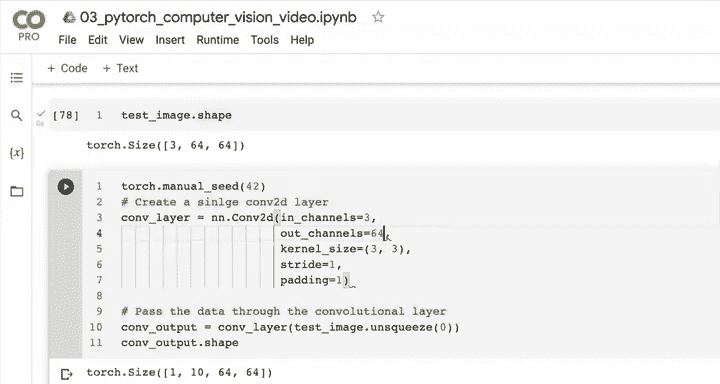


我们的输入图像有3个通道，经过卷积层后，由于设置了 `out_channels=10`，我们得到了10个通道的输出。高度和宽度从64x64变成了62x62，这是因为使用了3x3卷积核且无填充（`padding=0`）。你可以尝试改变 `kernel_size`、`stride` 和 `padding` 的值，观察输出形状如何变化。例如，将 `padding` 设为1，输出形状可能会变回64x64。

## 7.2 逐步解析 nn.MaxPool2d 📉

理解了 `nn.Conv2d` 之后，本节我们来看看 `nn.MaxPool2d` 层。与卷积层不同，最大池化层没有可学习的参数，它的操作是确定性的：在输入张量的局部区域中取最大值。

我们首先查阅文档。最大池化层通过一个指定大小的窗口（`kernel_size`）滑过输入，并输出该窗口内的最大值。这可以描述为：
`输出[n, c, h, w] = 输入[n, c, stride[0]*h, stride[1]*w] 窗口内的最大值`

让我们用代码来实践。我们将使用之前创建的测试图像，先通过一个卷积层，再通过一个最大池化层。

```python
# 创建一个最大池化层，核大小为2x2
maxpool_layer = nn.MaxPool2d(kernel_size=2)

print(f"测试图像原始形状: {single_image.shape}")
print(f"测试图像添加批次维度后形状: {single_image_with_batch.shape}")

# 先通过卷积层
test_image_through_conv = conv_layer(single_image_with_batch)
print(f"通过卷积层后形状: {test_image_through_conv.shape}")

# 再通过最大池化层
test_image_through_conv_and_pool = maxpool_layer(test_image_through_conv)
print(f"通过卷积层和最大池化层后形状: {test_image_through_conv_and_pool.shape}")
```

你会发现，经过2x2的最大池化后，特征图的高度和宽度大约减半（例如从62x62变为31x31）。这是因为池化窗口在2x2区域内取最大值，从而压缩了空间信息。

为了更直观地理解，我们用一个更小的张量来演示：

```python
# 创建一个小的随机张量模拟2x2区域
torch.manual_seed(42)
random_tensor = torch.randn(size=(1, 1, 2, 2))  # 形状: [batch, channel, height, width]
print(f"随机张量:\n{random_tensor}")
print(f"随机张量形状: {random_tensor.shape}")

# 通过最大池化层
maxpool_tensor = maxpool_layer(random_tensor)
print(f"最大池化后张量:\n{maxpool_tensor}")
print(f"最大池化后张量形状: {maxpool_tensor.shape}")
```

最大池化层从2x2的四个数字中取最大值，输出形状变为1x1。在完整的CNN中，卷积层学习特征，ReLU激活函数引入非线性，而最大池化层则进一步压缩这些特征，保留最显著的信息，同时减少计算量和防止过拟合。整个网络的思路是从输入数据中学习一个压缩的表示，用于后续的预测。

## 7.3 整合与测试：让 Tiny VGG 运行起来 🚀

在过去的几节中，我们复现了CNN Explainer网站上的Tiny VGG架构。现在，让我们测试将一些数据通过整个模型，并解决一个常见的难题：计算全连接层的输入特征数。

首先，我们创建一个与FashionMNIST数据集图像形状（1, 28, 28）相同的虚拟张量，并尝试让其通过我们的 `model_2`。

```python
# 创建一个与FashionMNIST图像形状相同的随机张量
random_image_tensor = torch.randn(size=(1, 1, 28, 28)).to(device)  # 假设device已定义
print(f"随机图像张量形状: {random_image_tensor.shape}")

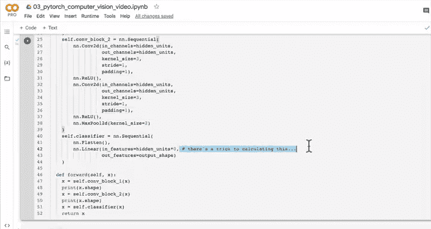

# 尝试通过模型
try:
    output = model_2(random_image_tensor)
except RuntimeError as e:
    print(f"运行错误: {e}")
```


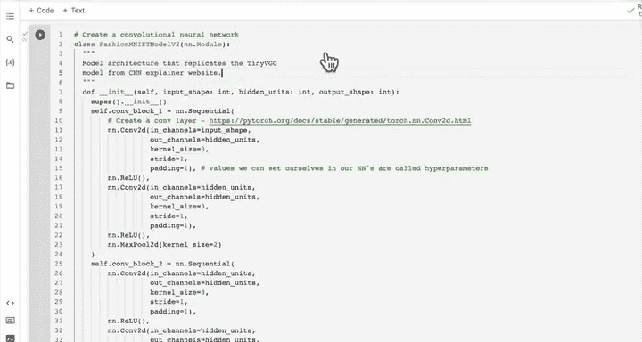

你很可能会遇到形状不匹配的错误，特别是在全连接层。这是因为卷积块输出的多维张量在进入全连接层前需要被展平，而展平后的向量长度需要与全连接层 `in_features` 参数匹配。

我的技巧是：通过打印每一层输出的形状来动态计算这个值。我们在模型的 `forward` 方法中添加一些打印语句（或在测试时单独计算）：

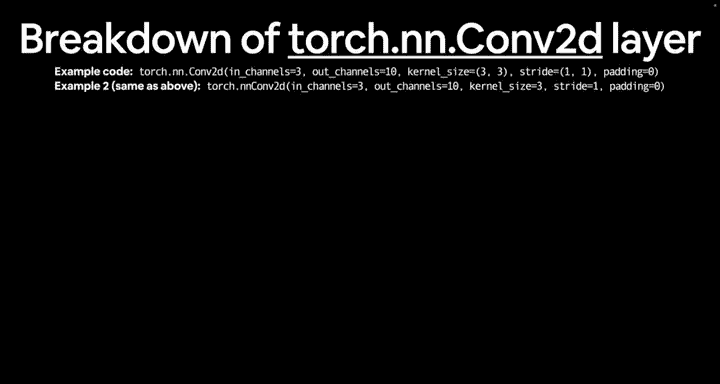

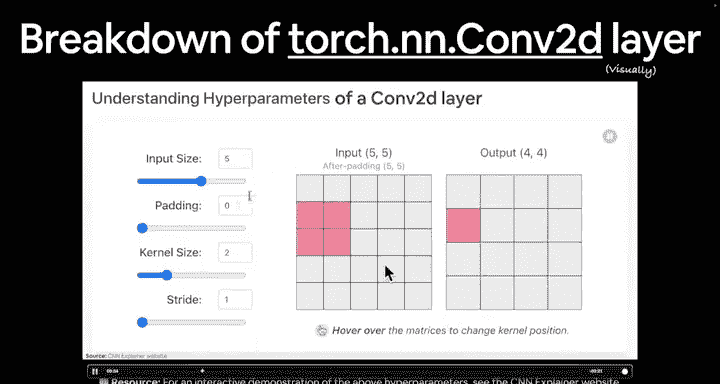

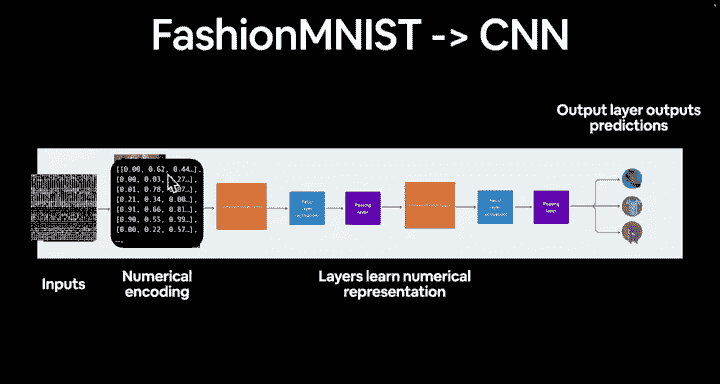

```python
# 假设我们有一个修改了forward方法的模型，或者我们手动模拟前向传播
# 手动模拟流程：
with torch.inference_mode():
    # 通过第一个卷积块
    x = model_2.conv_block_1(random_image_tensor)
    print(f"卷积块1输出形状: {x.shape}")
    # 通过第二个卷积块
    x = model_2.conv_block_2(x)
    print(f"卷积块2输出形状: {x.shape}")
    # 展平
    x = torch.flatten(x, start_dim=1) # 从第1维（通道维之后）开始展平
    print(f"展平后形状: {x.shape}")
    # 这个 x.shape[1] 的值就是全连接层需要的 in_features
```

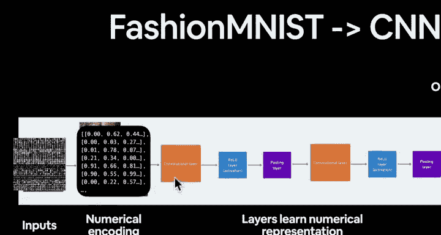

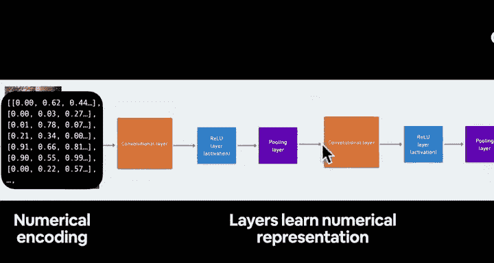

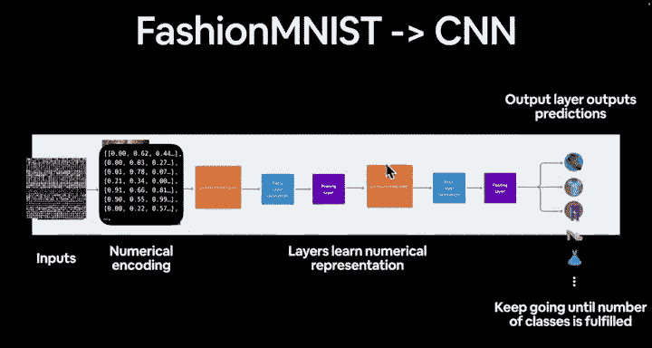

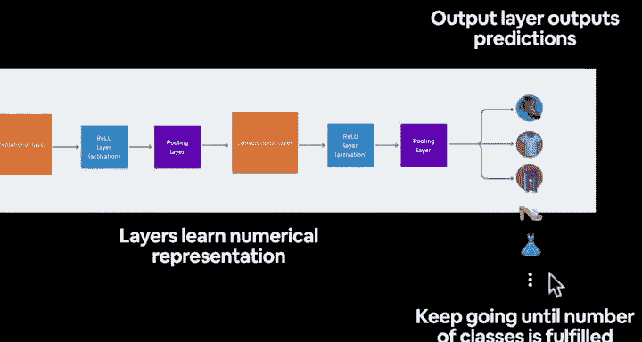

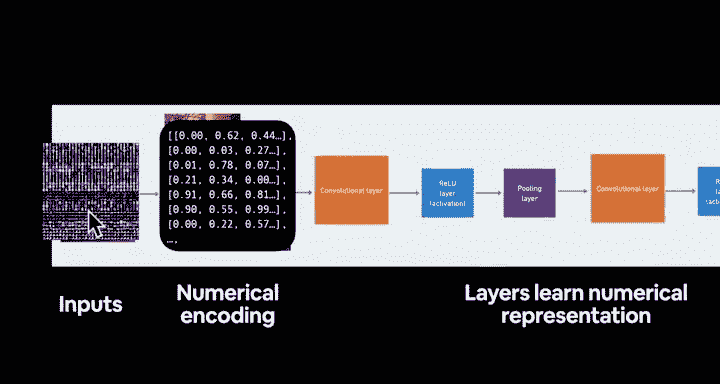

假设 `conv_block_2` 的输出形状是 `[1, 10, 7, 7]`。展平后（保留批次维度），形状变为 `[1, 10*7*7] = [1, 490]`。因此，全连接层的 `in_features` 应设置为490。

```python
# 因此，在定义分类器时：
classifier = nn.Sequential(
    nn.Flatten(),
    nn.Linear(in_features=10*7*7, out_features=10) # 假设输出10个类别
)
```

修复了 `in_features` 后，再次尝试让虚拟数据通过整个模型：

```python
# 使用修复了in_features的模型
fixed_model_2 = TinyVGG(input_shape=1, hidden_units=10, output_shape=10)
fixed_model_2.to(device)

output = fixed_model_2(random_image_tensor)
print(f"模型最终输出形状: {output.shape}")  # 应为 [1, 10]
```

成功！我们得到了一个形状为 `[1, 10]` 的输出，对应10个服装类别的预测逻辑值。这表明我们的模型架构在数据流上是正确的。

## 7.4 训练我们的第一个CNN 🏋️‍♂️

模型构建并测试通过后，下一步就是训练它。我们将遵循标准的PyTorch工作流程。

首先，为我们的模型（`model_2`）设置损失函数和优化器。对于多分类问题，我们使用交叉熵损失；优化器可以选择SGD。

```python
# 导入辅助函数中的准确率计算函数（如果已定义）
# from helper_functions import accuracy_fn

# 设置损失函数和优化器
loss_fn = nn.CrossEntropyLoss()
optimizer = torch.optim.SGD(params=model_2.parameters(), lr=0.1)
```

接下来，利用之前课程中编写好的 `train_step()` 和 `test_step()` 函数来构建训练循环。这些函数封装了单轮训练和测试的逻辑。

```python
# 假设我们已经有了 train_step 和 test_step 函数
# 设置训练轮数
epochs = 5

for epoch in range(epochs):
    print(f"Epoch: {epoch}\n---------")
    # 训练步骤
    train_loss, train_acc = train_step(model=model_2,
                                        data_loader=train_dataloader,
                                        loss_fn=loss_fn,
                                        optimizer=optimizer,
                                        accuracy_fn=accuracy_fn, # 需要定义或导入
                                        device=device)
    # 测试步骤
    test_loss, test_acc = test_step(model=model_2,
                                     data_loader=test_dataloader,
                                     loss_fn=loss_fn,
                                     accuracy_fn=accuracy_fn,
                                     device=device)
    print(f"Train Loss: {train_loss:.4f} | Train Acc: {train_acc:.2f}% | Test Loss: {test_loss:.4f} | Test Acc: {test_acc:.2f}%")
```

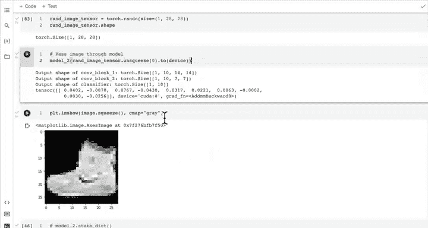


运行这个训练循环，观察你的第一个卷积神经网络在FashionMNIST数据集上的学习过程吧！

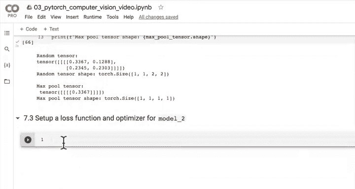

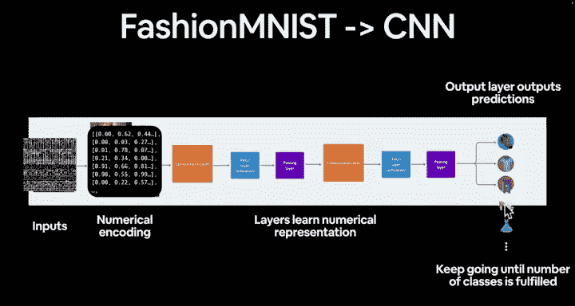

## 总结 📚

本节课中，我们一起深入学习了PyTorch中构建CNN的两个核心层：
1.  **`nn.Conv2d`**：通过可学习的卷积核提取图像的空间特征。我们理解了其参数（`in_channels`, `out_channels`, `kernel_size`, `stride`, `padding`）的含义，并通过代码观察了输入输出形状的变化。
2.  **`nn.MaxPool2d`**：通过取局部区域最大值的方式，对特征图进行下采样，压缩数据并增强特征的不变性。它没有可学习参数。
3.  **整合与调试**：我们成功复现了Tiny VGG模型，并学会了通过前向传播打印中间层形状的技巧，来解决全连接层输入特征数匹配的关键问题。
4.  **训练准备**：我们为模型配置了损失函数和优化器，并准备好使用训练和测试循环函数来启动模型的训练。

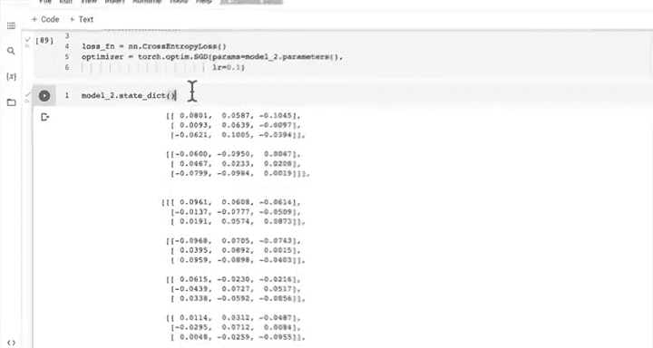


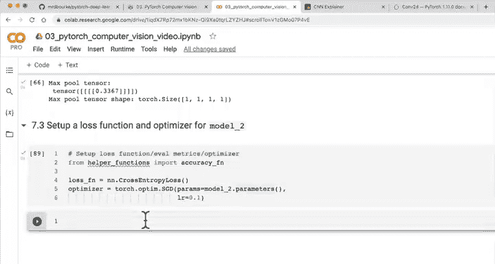


你现在已经掌握了构建和运行一个基本卷积神经网络的全部要素。下一步就是启动训练，并观察模型在实际数据上的表现。恭喜你！