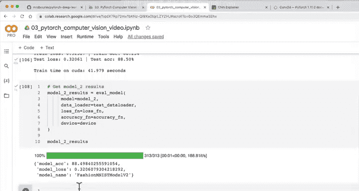
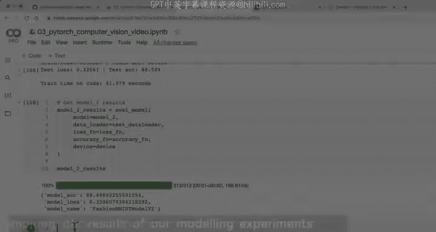
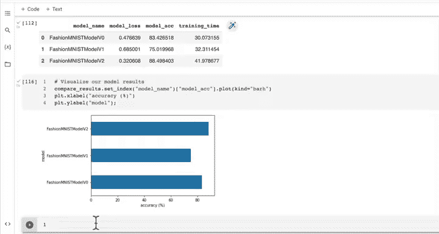

#  73：训练我们的第一个 CNN 🚀

在本节课中，我们将学习如何训练我们的第一个卷积神经网络模型。我们将使用之前创建的训练和测试函数，设置随机种子以确保实验可复现，并测量训练时间。最后，我们将比较不同模型的性能，并可视化结果。

---

## 训练和测试模型

上一节我们介绍了模型架构，本节中我们来看看如何训练和测试我们的第二个模型。

我们使用之前创建的训练和测试函数，以避免重写训练循环和测试循环中的所有步骤。

以下是设置训练过程的步骤：

1.  设置随机种子以确保实验可复现。
2.  测量训练时间，以便比较模型的性能和训练效率。
3.  使用 `tqdm` 跟踪训练进度。
4.  调用 `train_step` 和 `test_step` 函数进行训练和评估。

以下是核心训练循环的代码：

```python
import torch
from timeit import default_timer as timer

# 设置随机种子
torch.manual_seed(42)
torch.cuda.manual_seed(42)

# 开始计时
train_time_start_model_2 = timer()

epochs = 3
for epoch in tqdm(range(epochs)):
    print(f"Epoch: {epoch}\n---------")
    # 训练步骤
    train_step(model=model_2,
               data_loader=train_dataloader,
               loss_fn=loss_fn,
               optimizer=optimizer,
               accuracy_fn=accuracy_fn,
               device=device)
    # 测试步骤
    test_step(model=model_2,
              data_loader=test_dataloader,
              loss_fn=loss_fn,
              accuracy_fn=accuracy_fn,
              device=device)

# 结束计时
train_time_end_model_2 = timer()
total_train_time_model_2 = print_train_time(start=train_time_start_model_2,
                                            end=train_time_end_model_2,
                                            device=device)
```

运行代码后，我们的第一个 CNN 开始训练。训练完成后，我们计算模型在测试集上的结果。

```python
# 获取模型2的预测结果
model_2_results = eval_model(model=model_2,
                             data_loader=test_dataloader,
                             loss_fn=loss_fn,
                             accuracy_fn=accuracy_fn,
                             device=device)
model_2_results
```

我们的 CNN 模型取得了约 **88.5%** 的测试准确率，超过了之前的基线模型。

---

## 比较模型结果

现在我们已经训练了多个模型，接下来比较它们的结果。这是机器学习实验中的重要环节，我们需要综合考虑准确率和训练时间。





以下是创建比较表格的步骤：

1.  导入 `pandas` 库。
2.  将各个模型的结果字典放入一个列表中。
3.  创建一个 `DataFrame` 来对比这些结果。
4.  添加训练时间列，以评估性能与速度的权衡。

以下是创建比较表格的代码：

```python
import pandas as pd

# 将模型结果字典组合成列表
compare_results = pd.DataFrame([model_0_results, model_1_results, model_2_results])

# 添加训练时间列
compare_results["training_time"] = [total_train_time_model_0,
                                    total_train_time_model_1,
                                    total_train_time_model_2]

# 查看比较结果
compare_results
```

通过比较，我们发现：
*   **模型 0（基线）**：使用两个线性层，准确率约 83.4%。
*   **模型 1（GPU + 非线性）**：准确率反而下降。
*   **模型 2（Tiny VGG CNN）**：取得了最佳准确率约 88.5%，但训练时间也最长。

这体现了 **性能与速度的权衡**。一个模型可能准确率只高出 5%，但训练和推理速度却慢 10 倍。在实际应用中，需要根据具体问题决定是否值得。

---

## 可视化模型结果

为了更直观地展示比较结果，我们可以将数据可视化。以下是创建水平条形图的步骤：

1.  将模型名称设置为 `DataFrame` 的索引。
2.  绘制模型准确率的水平条形图。
3.  添加适当的标签和标题。

以下是可视化代码：

```python
# 将模型名称设置为索引并绘制准确率对比图
compare_results.set_index("model_name")["model_acc"].plot(kind="barh")
plt.xlabel("Accuracy (%)")
plt.ylabel("Model")
plt.title("Model Accuracy Comparison on FashionMNIST")
plt.show()
```

这张图清晰地展示了哪个模型性能最好，可以作为实验报告的一部分进行分享。

---

## 总结与下一步

本节课中我们一起学习了如何训练第一个卷积神经网络，并系统地比较了不同模型的性能和训练时间。

我们了解到：
1.  CNN 模型（Tiny VGG）在本任务上超越了简单的线性基线模型。
2.  评估模型时，需要同时考虑**准确率**和**训练/推理时间**。
3.  使用 `pandas` 和 `matplotlib` 可以有效地组织和可视化实验结果。



在下一节课中，我们将使用性能最佳的模型（FashionMNIST Model V2）对测试集中的随机样本进行预测，并将预测结果可视化。你可以尝试自己先做一下，或者跟我们一起在下一节完成。