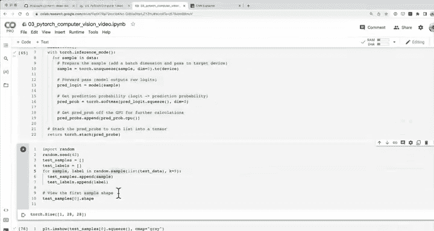

#  74：在随机测试样本上进行预测 🎯


在本节课中，我们将学习如何使用训练好的模型对随机测试样本进行预测，并准备可视化这些预测结果。我们将编写一个预测函数，从测试集中随机抽取样本，让模型进行预测，并将预测概率转换为预测标签，为下一步的可视化对比做好准备。

---

## 模型性能回顾与硬件影响

上一节我们比较了不同模型的性能。我们尝试了三个实验：一个基础线性模型、一个带非线性激活函数的线性模型，以及 FashionMNIST 模型 V2（一个卷积神经网络）。从准确率角度看，我们的卷积神经网络表现最佳。然而，它的训练时间也最长。

需要强调的是，训练时间会根据您运行代码的硬件而变化。我们在上一节讨论过这一点。在完成上一节后，我中断了工作，重新运行了之前编写的所有代码单元。如果您对比这里的训练时间与上一节，会发现一些不同的数值。虽然我不完全清楚 Google Colab 后台使用的具体硬件，但这提醒我们需要注意这一点。至少从现在开始，我们知道如何跟踪不同的变量，例如模型的训练时长及其性能指标。

---

## 可视化预测：数据探索者的信条

现在是时候进行可视化了。让我们创建一个新的标题：“进行预测与评估”。这是训练完机器学习模型后我最喜欢的步骤之一。

我们将遵循数据探索者的信条：可视化、可视化、再可视化。让我们创建一个名为 `make_predictions` 的函数。

该函数将接收一个模型（`torch.nn.Module` 类型）、一些数据（可以是列表形式）以及一个设备类型（默认为我们已设置的默认设备）。

我们将创建一个空列表来存储预测概率。我们的目标是：从测试数据集中随机抽取样本，使用模型进行预测，然后绘制这些预测结果。

在函数内部，我们将模型设置为评估模式，因为进行预测时应使用评估模式。同时，我们启用推理模式上下文管理器，因为预测是推理的另一种说法。

接下来，我们将遍历数据中的每个样本。对于每个样本（单张图像），我们需要为其添加一个批次维度（使用 `unsqueeze(dim=0)`），然后将其移至目标设备。这样，数据和模型就在同一设备上了。

然后，我们进行前向传播，获取原始 logits。对于多分类问题，我们使用 softmax 激活函数处理 logits，并使用 `squeeze(dim=0)` 去除多余的维度，从而得到该样本的预测概率。

由于 Matplotlib 无法在 GPU 上工作，我们需要确保预测概率在 CPU 上。因此，我们将计算出的预测概率移至 CPU，并添加到列表中。

最后，我们使用 `torch.stack` 将列表中的所有预测概率连接成一个张量。

以下是该函数的代码实现：

```python
def make_predictions(model: torch.nn.Module,
                     data: list,
                     device: torch.device = device):
    pred_probs = []
    model.eval()
    with torch.inference_mode():
        for sample in data:
            # 准备样本
            sample = torch.unsqueeze(sample, dim=0).to(device)

            # 前向传播
            pred_logit = model(sample)

            # 获取预测概率
            pred_prob = torch.softmax(pred_logit.squeeze(dim=0), dim=0)

            # 将预测概率移至 CPU 并存储
            pred_probs.append(pred_prob.cpu())

    # 将列表堆叠为张量
    return torch.stack(pred_probs)
```

---

## 准备随机测试样本

现在，让我们尝试使用这个函数。首先，导入 `random` 模块并设置随机种子为 42，以确保结果可复现。

我们将创建两个空列表：`test_samples` 用于存储测试样本，`test_labels` 用于存储对应的真实标签。这样，在评估预测时，我们可以将预测结果与真实标签进行比较。

我们将从测试数据集中随机抽取 9 个样本（选择 9 是因为稍后我们将创建一个 3x3 的绘图）。以下是准备随机样本的代码：

```python
import random
random.seed(42)

test_samples = []
test_labels = []

for sample, label in random.sample(list(test_data), k=9):
    test_samples.append(sample)
    test_labels.append(label)

# 查看第一个样本的形状和图像
print(f"第一个样本形状: {test_samples[0].shape}")
plt.imshow(test_samples[0].squeeze(), cmap="gray")
plt.title(f"真实标签: {class_names[test_labels[0]]}")
plt.show()
```

运行上述代码后，您将看到一张随机抽取的测试图像及其对应的真实标签（例如，“凉鞋”）。

---

## 进行预测并转换结果

现在，使用我们之前训练的最佳模型（例如 `model_2`）对随机样本进行预测。调用 `make_predictions` 函数，传入模型和测试样本列表。

```python
pred_probs = make_predictions(model=model_2,
                              data=test_samples)

# 查看前两个预测概率
print(f"前两个预测概率:\n{pred_probs[:2]}")
```

预测概率是模型对每个类别的置信度。为了与真实标签进行比较，我们需要将预测概率转换为预测标签。这可以通过对每个样本的预测概率应用 `argmax` 函数来实现，即选择概率最高的类别索引。

以下是转换代码：

```python
pred_classes = pred_probs.argmax(dim=1)
print(f"预测类别:\n{pred_classes}")
print(f"真实标签:\n{test_labels}")
```

现在，预测类别和真实标签的格式相同，我们可以直观地进行比较。

---

## 总结与下节预告

本节课中，我们一起学习了如何对随机测试样本进行预测。我们编写了一个通用的预测函数，准备了随机测试数据，并使用训练好的模型获得了预测概率。最后，我们将预测概率转换为预测标签，为下一步的可视化对比做好了准备。



在下一节中，我们将编写一个绘图函数，将这九个随机样本、它们的真实标签以及模型的预测标签一起可视化在一个 3x3 的网格中。这将帮助我们直观地评估模型的性能，并发现任何可能的错误模式。请尝试运行本节的代码，确保您已准备好进行下一步的可视化工作。