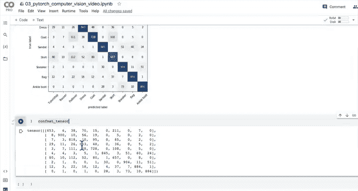
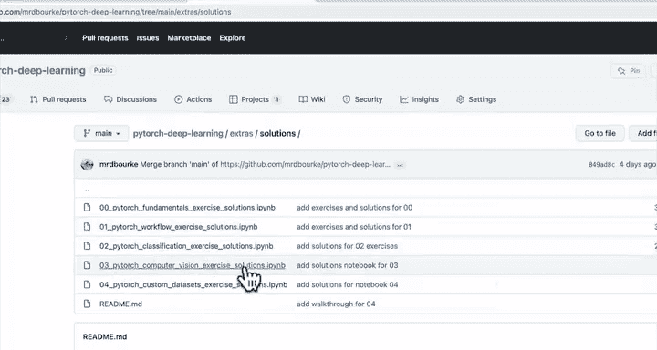

#  76：使用混淆矩阵评估模型预测 🧮


在本节课中，我们将学习如何使用混淆矩阵来评估分类模型的预测性能。混淆矩阵是一种强大的可视化工具，可以帮助我们直观地了解模型在哪些类别上表现良好，在哪些类别上容易混淆。

---

上一节我们介绍了如何在整个测试数据集上进行预测。本节中，我们来看看如何通过混淆矩阵来评估这些预测结果。

## 1. 准备工作

在上一节中，我们编写了代码来导入绘制混淆矩阵所需的额外库。Google Colab 预装了许多库，但在后续学习中，掌握如何安装新库是必要的经验。

我们还对整个测试数据集进行了预测，得到了一个包含 10,000 个预测结果的张量。混淆矩阵的作用，就是将模型的这些预测与测试数据集中的真实标签进行比较。

我们已经完成了第一步。通过安装 `torchmetrics` 和 `mlxtend`（或其更新版本），我们为第二和第三步做好了准备。

## 2. 创建混淆矩阵

现在，让我们开始第二步（创建混淆矩阵）和第三步（绘制混淆矩阵）。混淆矩阵的视觉效果非常出色。

由于我们已经安装了 `torchmetrics`，现在可以导入 `ConfusionMatrix` 类。同时，从 `mlxtend` 的绘图模块中导入 `plot_confusion_matrix` 函数。

以下是这两个库的文档链接：
*   `torchmetrics` 文档
*   `mlxtend` 文档




接下来，我们设置混淆矩阵实例，并将预测结果与目标标签进行比较。模型评估的本质就是比较模型的预测与真实目标。

首先，我创建一个名为 `confmat` 的变量来存储混淆矩阵实例。调用 `torchmetrics` 中的 `ConfusionMatrix` 类来创建实例时，需要传入我们数据集的类别数量。

我们的数据集有 10 个类别，它们都包含在 `class_names` 列表中。因此，我将类别数量设置为 `len(class_names)`。

然后，我可以使用这个混淆矩阵实例 `confmat` 来创建一个混淆矩阵张量。就像使用损失函数一样，我将预测张量 `y_pred_tensor`（即之前对整个测试数据集计算出的预测结果）传递给 `confmat`，目标标签则是 `test_data.target`（即测试数据集的真实标签）。

这样，我们就创建了混淆矩阵张量。

## 3. 绘制混淆矩阵

现在进入第三步，将这个张量转化为美观的可视化图表。我们将使用 `mlxtend` 的强大功能来绘制混淆矩阵。

我创建一个图形和坐标轴，调用刚才导入的 `plot_confusion_matrix` 函数。需要传入以下参数：
*   `conf_mat`：我们的混淆矩阵张量。由于 Matplotlib 偏好使用 NumPy 数组，这里需要将其转换为 NumPy 格式。
*   `class_names`：类别名称列表，用于为行和列添加标签。
*   `figsize`：图形尺寸，我设置为 `(10, 7)`，这个尺寸在 Google Colab 上显示效果很好。

观察生成的混淆矩阵。一个理想的混淆矩阵，其对角线上的值应该最深，而非对角线区域应该没有或很少有值，因为这意味着预测标签与真实标签完全一致。

在我们的矩阵中，对角线确实非常深。但让我们深入查看一些数值较高的非对角线单元格：
*   模型经常将真实标签为 **T-shirt/top** 的样本预测为 **Shirt**。这反映了我们之前观察到的现象。
*   模型有时将 **Coat** 预测为 **Shirt**。
*   模型还会将 **Coat** 或 **Shirt** 预测为 **Pullover**。
*   另一个明显的错误是将 **Ankle boot** 预测为 **Sneaker**，混淆了两种鞋类。

通过视觉检查数据，你可以判断模型的错误是否在视觉上有合理性。例如，许多服装在数据上可能看起来确实很相似。

混淆矩阵是可视化分类模型预测最强大的方法之一。使用 `torchmetrics` 的 `ConfusionMatrix` 和 `mlxtend` 的 `plot_confusion_matrix` 是创建它的一个非常有效的方法。

如果你想获取更多分类评估指标，可以查阅 `torchmetrics` 的文档。

---

我们已经完成了相当多的评估工作。根据我们的工作流程，现在是时候保存并加载我们训练出的最佳模型了。

## 4. 保存和加载最佳模型 🗃️

在上一节中，我们利用 `torchmetrics` 和 `mlxtend` 创建了漂亮的混淆矩阵。现在，是时候保存并加载我们的最佳模型了。如果我们评估后认为这个卷积神经网络模型表现不错，就可以将其导出到文件中，以便在其他地方使用。

我们正处于工作流程的第 11 步：保存和加载性能最佳的模型。如果你之前学习过本课程的其他部分，可能已经做过这个练习。

让我们开始编码。首先，从 `pathlib` 导入 `Path`，因为我喜欢创建一个模型目录路径。

以下是具体步骤：

1.  **创建模型目录**：
    ```python
    from pathlib import Path

    # 创建模型保存路径
    model_path = Path("models")
    model_path.mkdir(parents=True, exist_ok=True)
    ```

2.  **创建模型保存文件名**：
    ```python
    # 设置模型文件名
    model_name = "03_pytorch_computer_vision_model_2.pth"
    model_save_path = model_path / model_name
    ```

3.  **保存模型状态字典**：
    我们保存模型的 `state_dict()`，它包含了模型在数据集上学到的所有参数（权重和偏置等）。
    ```python
    # 保存模型
    print(f"正在保存模型到: {model_save_path}")
    torch.save(obj=model_2.state_dict(), f=model_save_path)
    ```

4.  **加载已保存的模型**：
    由于我们只保存了 `model_2` 的状态字典，因此需要先创建一个新的 `FashionMNISTModelV2` 实例（即我们的 CNN 类）。
    ```python
    # 设置随机种子以确保可复现性
    torch.manual_seed(42)

    # 创建模型的新实例（必须使用与原始模型相同的参数）
    loaded_model_2 = FashionMNISTModelV2(input_shape=1, hidden_units=10, output_shape=len(class_names))

    # 加载保存的状态字典
    loaded_model_2.load_state_dict(torch.load(f=model_save_path))

    # 将模型送到目标设备（如GPU）
    loaded_model_2.to(device)
    ```

5.  **评估加载的模型**：
    评估加载的模型，其结果应该与原始的 `model_2` 结果非常接近。
    ```python
    # 评估加载的模型
    loaded_model_2_results = eval_model(
        model=loaded_model_2,
        data_loader=test_dataloader,
        loss_fn=loss_fn,
        accuracy_fn=accuracy_fn
    )

    # 比较结果
    print(f"原始模型结果: {model_2_results}")
    print(f"加载模型结果: {loaded_model_2_results}")

    # 使用 torch.isclose 进行程序化比较（可调整容差）
    torch.isclose(torch.tensor(model_2_results["model_loss"]),
                  torch.tensor(loaded_model_2_results["model_loss"]),
                  atol=1e-08) # 绝对容差
    ```
    如果结果在少数几位小数内基本一致，通常可以接受。如果差异较大，则需要检查代码、随机种子设置或保存过程是否正确。

---

## 总结 📝

本节课中我们一起学习了以下内容：

1.  **混淆矩阵的创建与绘制**：我们使用 `torchmetrics.ConfusionMatrix` 计算混淆矩阵，并用 `mlxtend.plot_confusion_matrix` 将其可视化。通过分析矩阵，我们能够直观地识别模型在哪些类别间容易混淆。
2.  **模型保存与加载**：我们学习了如何将训练好的模型状态字典（`state_dict`）保存到 `.pth` 文件中，以及如何重新加载它到一个新的模型实例中。这是模型部署前验证其持久化正确性的关键步骤。
3.  **结果验证**：我们通过比较原始模型与加载模型在测试集上的评估指标（如损失和准确率），确保模型被正确保存和加载。可以使用 `torch.isclose()` 函数进行程序化的精度比较。

恭喜你完成了 PyTorch 计算机视觉部分的学习！我们走完了一个完整的计算机视觉问题工作流程：从获取数据、构建基线模型、进行实验改进（包括引入非线性和卷积神经网络），到评估模型（包括可视化预测和使用混淆矩阵），最后保存和加载最佳模型。

为了巩固知识，请务必尝试课程提供的练习，并参考额外的学习资源，如 MIT 的深度学习计算机视觉讲座或探索 `torchvision.models` 库中的预训练模型。




下一节，我们将进入 **PyTorch 自定义数据集** 的学习。敬请期待！