# 77：PyTorch自定义数据集入门 🍕🥩🍣

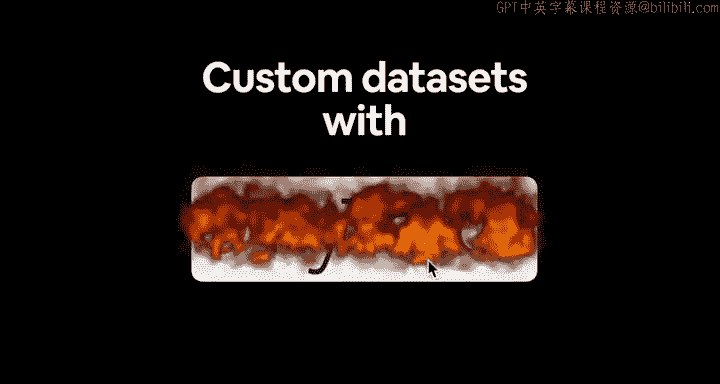

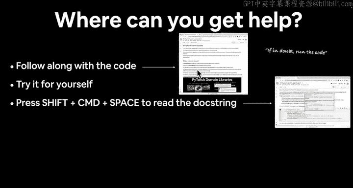

在本节课中，我们将学习如何将你自己的数据加载到PyTorch中，以便构建深度学习模型。我们将专注于一个具体的计算机视觉问题：创建一个名为“Food Vision Mini”的模型，用于对披萨、牛排和寿司的图像进行分类。

---

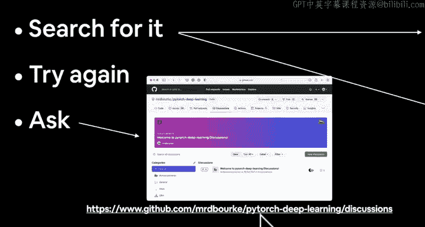

## 概述与获取帮助

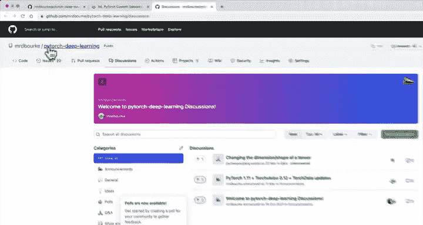

上一节我们介绍了课程的整体结构，本节中我们来看看如何在实际编码中获取帮助。

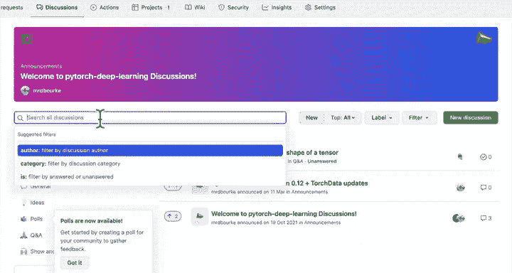

在深入学习之前，我们先回答一个重要问题：遇到问题时如何寻求帮助？

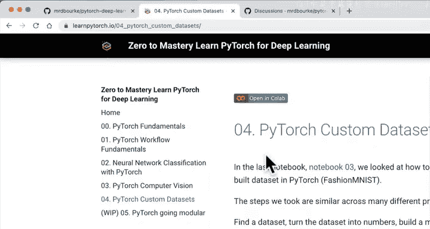

以下是获取帮助的步骤：

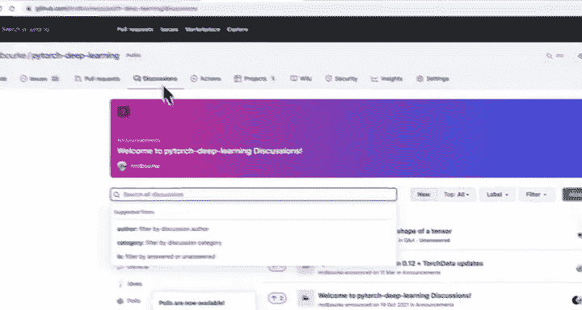

1.  尽可能跟随代码一起操作。我们将编写大量PyTorch代码。
2.  记住格言：如有疑问，运行代码。这与“亲自尝试”的理念一致。
3.  如果你想阅读文档字符串，在Google Colab中可按 `Shift` + `Command` + `Space`（在Windows上，`Command`键可能是`Control`）。
4.  如果仍然卡住，可以搜索相关问题。你可能会用到Stack Overflow或优秀的PyTorch官方文档。
5.  当然，再次尝试。回顾你的代码。如有疑问，就把它写出来或运行它。
6.  最后，如果仍然无法解决，可以在PyTorch深度学习Discord或GitHub页面提问。

本课程的所有资源都位于 `learnpytorch.io`。我们目前处于第4节。这是一个包含了本节所有材料的在线书籍版本。此外，GitHub仓库中也有相同的笔记本 `pytorch_custom_data_sets.ipynb`，这是“标准答案”笔记本。如果你遇到困难，可以查阅它。

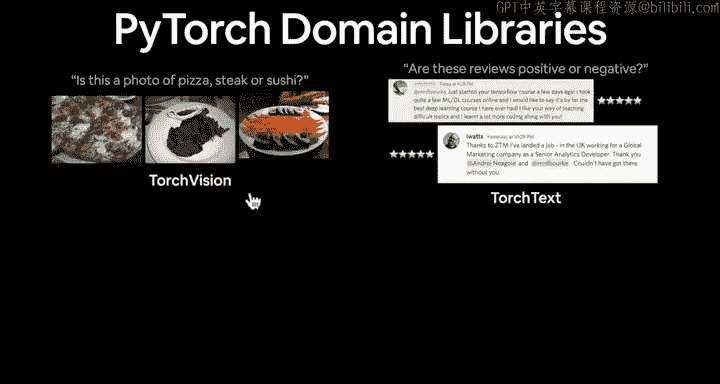

---

## 什么是自定义数据集？🧐

到目前为止，我们已经基于Fashion MNIST等各种数据集构建了不少PyTorch深度学习神经网络。但你可能想知道：我拥有自己的数据集，或者我正在处理自己的问题，我能否用PyTorch构建一个模型来预测该数据集？答案是肯定的。然而，你需要经过一些预处理步骤，以使该数据集与PyTorch兼容，这正是我们将在本节中要涵盖的内容。

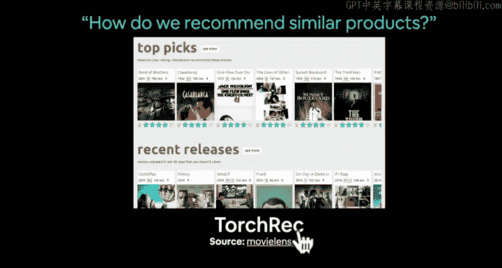

我想在此强调PyTorch的领域库。我们之前已经对`torchvision`有了一些经验，例如当我们想对一张照片是披萨、牛排还是寿司进行分类时（一个计算机视觉图像分类问题）。同样，对于文本（例如判断评论是正面还是负面），你可以使用`torchtext`。

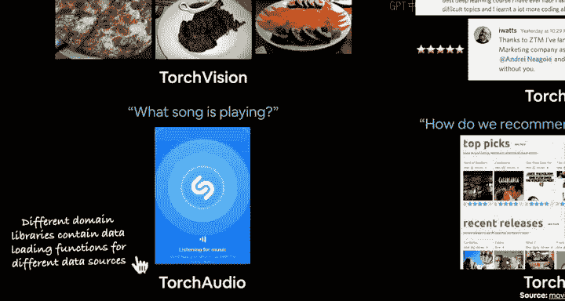

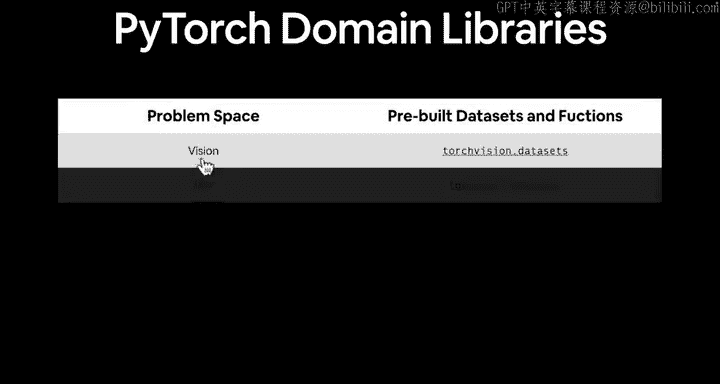

但请理解，这些只是视觉空间或文本空间内的一类问题。我想让你明白的是：
*   如果你有任何类型的视觉数据，你可能需要研究`torchvision`。
*   如果你有任何类型的文本数据，你可能需要研究`torchtext`。
*   如果你有音频数据（例如想分类正在播放的歌曲），可以研究`torchaudio`。
*   如果你想进行推荐（例如拥有在线商店或类似Netflix的服务，并希望有一个根据推荐更新的主页），可以研究`torchrec`（代表推荐系统）。

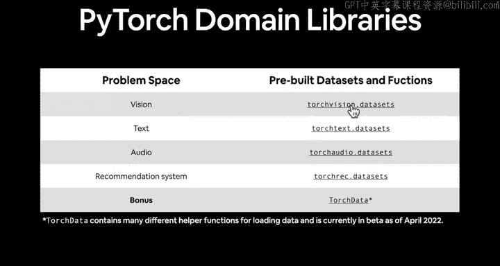

请记住这一点，因为每个领域库都有一个`datasets`模块，帮助你处理来自不同领域的数据集。不同的领域库包含用于不同数据源的数据加载函数。

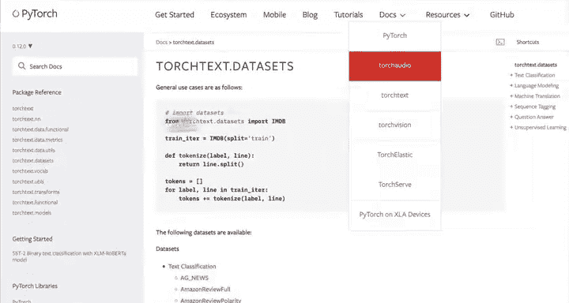

例如，对于视觉问题空间，`torchvision.datasets`提供了预构建数据集（如我们见过的Fashion MNIST）以及加载你自己视觉数据集的函数。`torchtext`和`torchaudio`也有各自的`datasets`模块。此外，`torchdata`（截至2022年4月录制时处于测试版）包含许多用于加载数据的辅助函数，并会随时间更新以添加更多加载不同数据资源的方式。

目前，我们将主要熟悉`torchvision.datasets`。

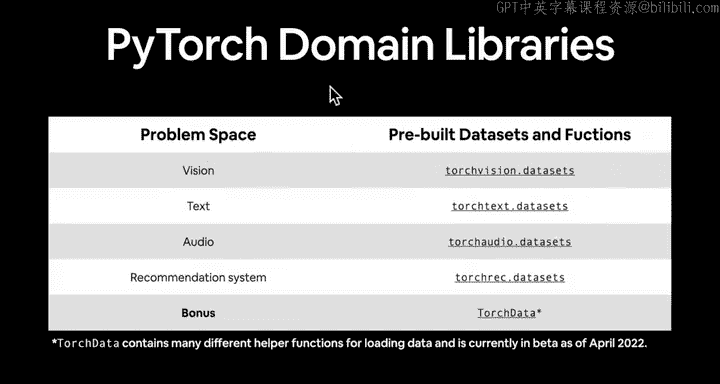

---

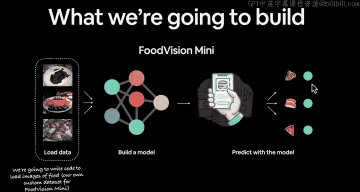

## 本节目标：Food Vision Mini 🎯

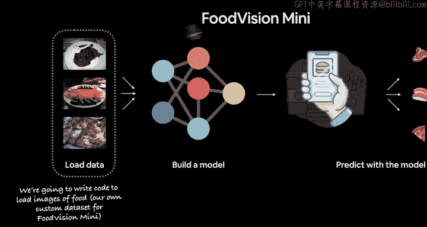

接下来，我们将致力于构建一个名为“Food Vision Mini”的模型。我们将从Food 101数据集中加载一些披萨、寿司和牛排的图像，构建一个图像分类模型（类似于为食物视觉识别应用提供动力的模型），然后看看我们能否将披萨图像分类为披萨，寿司图像分类为寿司，牛排图像分类为牛排。

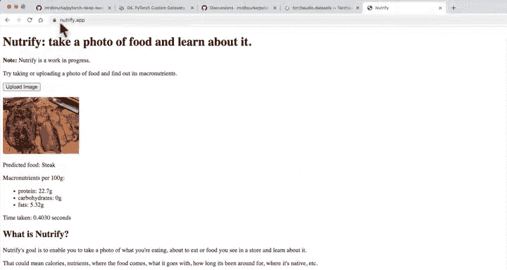

我们的目标是：假设我们已经拥有披萨、寿司和牛排的图像，我们想编写一些代码来加载这些食物图像（即我们用于构建Food Vision Mini模型的自定义数据集）。这与一个实际项目（例如`nurified.app`上的食物图像识别模型）非常相似。

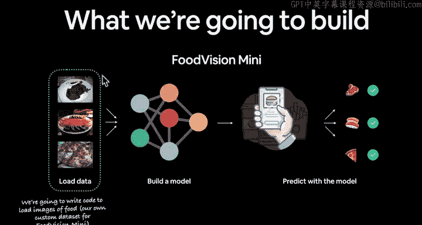

我们将遵循已经使用过多次的PyTorch工作流程：
1.  学习如何使用我们自己的自定义数据（而非PyTorch中的现有数据集）加载数据。
2.  了解如何构建一个模型来拟合我们自己的自定义数据集。
3.  完成训练模型所涉及的所有步骤，例如选择损失函数和优化器。
4.  构建训练循环。
5.  评估我们的模型。
6.  通过实验进行改进。
7.  保存和重新加载我们的模型。
8.  练习对我们自己的自定义数据进行预测（这是训练自己模型时非常重要的一步）。

---

## 本节内容概览 📋

我们将广泛涵盖以下内容：
1.  使用PyTorch获取自定义数据集。
2.  与数据融为一体：准备和可视化数据。
3.  学习如何为模型使用而转换数据（非常重要的一步）。
4.  了解如何使用预构建函数和我们自己的自定义函数加载自定义数据。
5.  构建一个计算机视觉模型（即Food Vision Mini）来对披萨、牛排和寿司图像进行分类（一个多类分类模型）。
6.  比较使用和不使用数据增强的模型（我们尚未涉及，但稍后会介绍）。
7.  了解如何对自定义数据（即不在我们训练集或测试集中的数据）进行预测。

我们将通过编写大量代码来实现这些目标。现在，让我们进入Google Colab开始编码。

---

## 开始编码：设置环境 💻

欢迎回到PyTorch烹饪秀。现在让我们学习如何“烹饪”一些自定义数据集。我将跳转到Google Colab并创建一个新笔记本。

我将把这个笔记本重命名为`04_pytorch_custom_data_sets_video`，因为这将是一个视频笔记本，包含我在视频中编写的所有代码。我会在笔记本开头添加一个标题和资源链接。

本自定义数据集部分的整个概要如下：我们之前使用过PyTorch的一些数据集，但如何将你自己的数据导入PyTorch？因为你想开始处理自己的问题，接触从未处理过的任何类型的数据，并弄清楚如何将其导入PyTorch。实现这一目标的方法之一就是通过自定义数据集。

我想在这里强调一下：根据你正在处理的问题领域（无论是视觉、文本、音频还是推荐等），你需要查看相应的PyTorch领域库，以获取现有的数据加载器、数据加载函数或可自定义的数据加载函数。

现在，让我们导入所需的库。我们将导入`torch`和`nn`模块。我们还需要检查PyTorch版本。本课程需要PyTorch 1.10.0或更高版本。我们还将从一开始就设置设备无关代码，这是PyTorch的最佳实践。这样，如果我们有可用的CUDA设备，我们的模型将使用该CUDA设备，我们的数据也将位于该CUDA设备上。

在Google Colab中，默认可能使用CPU。我们可以通过菜单 `Runtime` -> `Change runtime type` -> `Hardware accelerator` 选择 `GPU` 来启用GPU加速。启用后，我们可以使用 `!nvidia-smi` 命令查看分配的GPU信息（例如Tesla P100）。

这足以覆盖第一个编码视频的内容。在下一节中，我们将真正开始处理自定义数据集。下一视频，让我们获取一些数据吧！

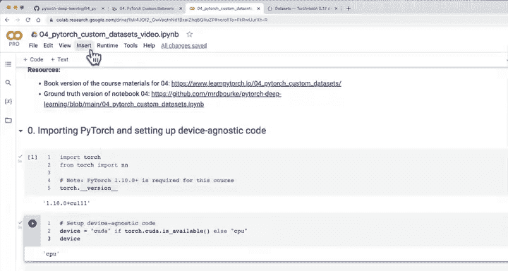

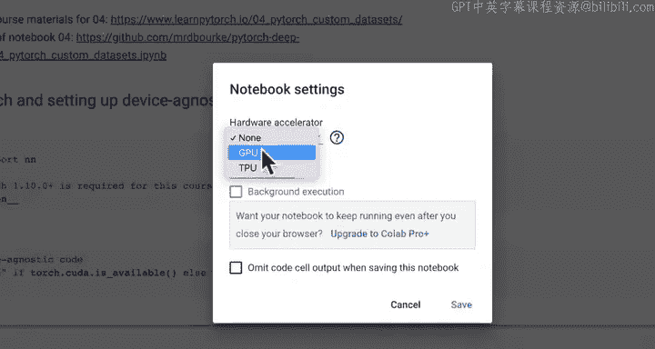

---

## 总结

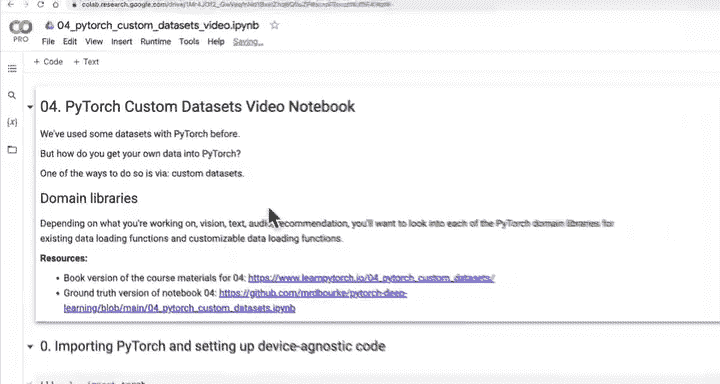

本节课中我们一起学习了PyTorch自定义数据集的基本概念和设置。我们明确了当拥有自己的数据时，可以通过PyTorch的领域库（如`torchvision`、`torchtext`）来加载和处理数据。我们确立了本节的目标是构建一个“Food Vision Mini”图像分类模型，并概述了从数据准备、模型构建、训练评估到预测的完整工作流程。最后，我们在Google Colab中设置了编码环境，为接下来的实战做好了准备。下一节，我们将开始获取并探索我们的食物图像数据。